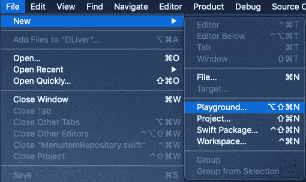
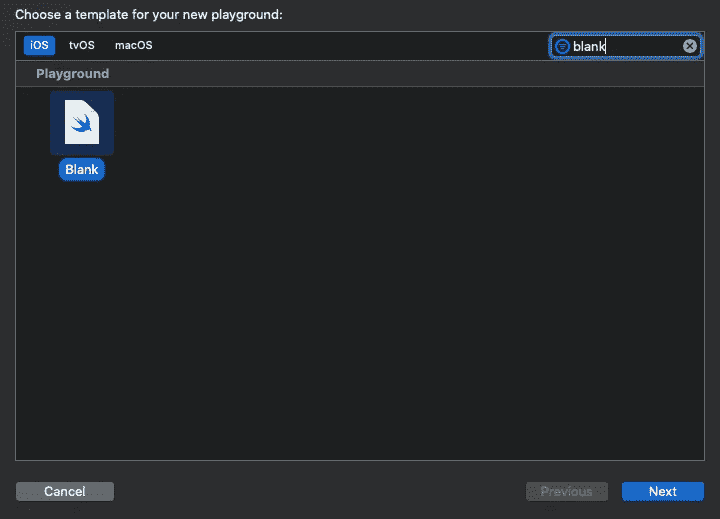
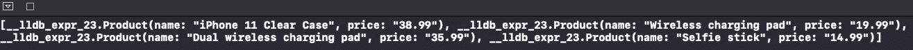
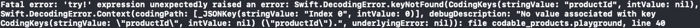
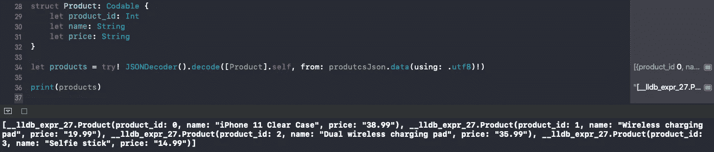
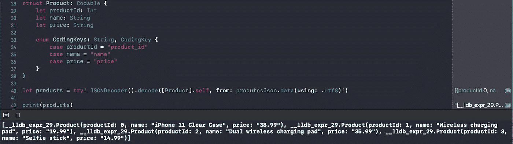
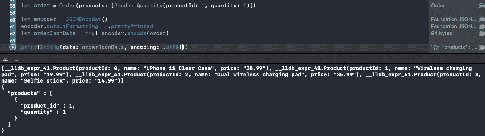

# 如何使用 Swift 的可编码协议与 JSON 相互转换

> 原文：<https://betterprogramming.pub/how-to-convert-to-and-from-json-using-swift-codable-e78bf353fff5>

## 轻松地将 JSON 对象转换成 Swift，反之亦然

*对于本文，我使用了 Xcode 11.4.1 和 Swift 5.2。我假设您熟悉 Swift 的基础知识。*


丹尼尔·安德雷蒂在 [Unsplash](https://unsplash.com/?utm_source=unsplash&utm_medium=referral&utm_content=creditCopyText) 上的照片

为了使 iOS Swift 应用程序能够与服务器通信，我们必须将 Swift 转换为 JSON。在本文中，我们将研究如何将 Swift 对象转换成 JSON 格式，或者反过来。为了支持与 JSON 的相互转换，我们将使用`Codable`。

`Codable`是 Swift 对象可以遵循的类型，允许转换器将对象转换成另一种格式，或者从另一种格式转换成 Swift 对象。格式可以是任何想要的。苹果已经为可编码类型提供了现成的 JSON 转换器。

在本文中，我们将学习如何通过模仿一个苹果配件销售应用程序将 JSON 对象转换成 Swift(以及反向转换)。我们将转换代表商家销售的产品的 JSON 对象。我们还将把订单转换成 JSON 格式。

在本教程中，我们将利用 Xcode 操场。Playgrounds 为我们提供了一种简单的方法来创建和测试我们的代码，而不需要运行应用程序的开销。

# 如何使用 Swift Codable 将 JSON 转换成 Swift(反之亦然)

我们将采取的步骤:

1.  创建新的游乐场项目
2.  得到了`products` JSON 的回应
3.  使用[可解码的](https://developer.apple.com/documentation/swift/decodable)将`products` JSON 转换为 Swift
4.  创建`Order`对象，并使用 Encodable 将其转换为 JSON

让我们开始吧！

## 1.创建新的游乐场项目

首先让我们打开 Xcode。从菜单中选择文件>新建>游乐场…



当提示“为您的新游乐场选择一个模板”时，选择 iOS 选项卡下的空白选项。然后单击下一步。



将文件命名为`codable_json`，然后单击创建。

## 2.获得“产品”JSON 响应

对于本文，我们将复制并粘贴商家 GET `products` API 端点的 JSON 响应。我们不会发出任何网络请求，因为这超出了本文的范围。相反，我们将直接处理服务器返回的响应体。

将以下内容复制并粘贴到`codable_json`:

上面的代码将 JSON 响应字符串分配给一个名为`productsJson`的常量。

JSON 响应包含一系列产品。每个产品都有三个属性:`product_id`、`name`、`price`。`product_id`是整数，`name`和`price`是字符串。

## 3.使用 Decodable 将产品 JSON 转换为 Swift

接下来，让我们将产品 JSON 转换成一个 Swift 对象。我们将首先从创建来自 JSON 产品阵列的单个产品的 Swift 表示开始。下面是 JSON 中的一个产品:

```
{
    "product_id": 0,
    "name": "iPhone 11 Clear Case",
    "price": "38.99"
}
```

将以下几行添加到操场:

```
struct Product {
}
```

`Product`结构将代表 JSON 字符串中的单个产品。

接下来让我们添加它的属性。先从`name`和`price`说起吧。暂时不要担心——我们会回来的。`name`和`price`都是字符串。在产品结构中，添加以下两行:

```
let name: String
let price: String
```

现在我们在 Swift 中有了一个`Product` JSON 表示。接下来，让我们将产品的 JSON 表示转换为 Swift。苹果提供的 JSON 到 Swift 的转换器叫做`[JSONDecoder](https://developer.apple.com/documentation/foundation/jsondecoder)`。之所以叫解码器，是因为从 Swift 的角度来看，它解码的是 JSON。为了让解码器将 JSON 解码成它的 Swift 表示，`Product`结构必须符合`Decodable`。

接下来将`: Decodable`添加到`Product`结构声明中。我们的`Product`结构应该如下所示:

```
struct Product: Decodable {
    let name: String
    let price: String
}
```

现在让我们通过添加下面一行代码将 JSON 转换成`Product`:

```
let products = try! JSONDecoder().decode([Product].self, from: productsJson.data(using: .utf8)!)
```

让我们将 Swift 产品打印到控制台上。添加以下一行:

```
print(products)
```

最后，单击 print 语句旁边的蓝色 play 按钮运行代码。


点击蓝色的播放按钮

控制台应显示如下内容:



太好了！`[JSONDecoder](https://developer.apple.com/documentation/foundation/jsondecoder)`已经成功地将 JSON 系列产品转换为 Swift 系列产品。那很容易！

现在让我们将`productId`属性添加到 Swift `Product`中。在`Product`结构中添加以下内容:

```
let productId: Int
```

接下来，点击`print`语句旁边的播放按钮。



您应该会看到与上面截图中相同的错误。发生了什么事？虽然`name`和`price`属性转换没有问题，但`productId`会引发一个问题。

这里的问题是 Swift 中的属性名命名为`productId`，而 JSON 的属性名是`product_id`。解码器足够智能，可以匹配相等的属性名。然而，JSON 属性命名通常遵循 [snake_case 样式](https://en.wikipedia.org/wiki/Snake_case) ( `product_id`)，而 Swift 遵循 [camelCase 样式](https://en.wikipedia.org/wiki/Camel_case) ( `productId`)。

要解决这个问题，我们可以:

*   将 Swift 中的属性名与 JSON 对象上的名称相匹配
*   在 Swift 对象上创建自定义属性名称映射

第一个变化很容易:`productId`在 Swift `Product`结构中变成了`product_id`。再次点击播放按钮。



然而，我更喜欢保持 camelCase 的样式，以保持代码在整个代码库中的一致性。在这种情况下，我们必须告诉 JSON 解码器如何映射属性。在`Product`结构中添加以下几行:

```
enum CodingKeys: String, CodingKey {
    case productId = "product_id"
    case name = "name"
    case price = "price"
}
```

上面告诉解码器属性名，或者 Swift 中的*键*，在 JSON 中是等价的。不幸的是，我们不能自定义映射单个属性。因此，当选择自定义名称映射时，我们必须在 JSON 中声明所有 Swift 属性及其等价物。

再次点击播放按钮，看看它的工作！



## 4.创建一个“Order”对象，并使用 Encodable 将其转换为 JSON

在最后一节中，我们将看看如何将 Swift 对象转换成 JSON。我们将在苹果配件销售商的应用中模仿一个`Order`创造。卖方 POST `Order`端点期望下面创建一个订单:

```
{
    products: [ProductQuantity]
}
```

卖方 API 的`ProductQuantity`对象如下所示:

```
{
    "product_id": 999,
    "quantity": 1
}
```

下面是一个订单示例，客户希望购买无线充电板(产品 ID 1):

```
{
    "products": [
        {
            "product_id": 1,
            "quantity": 1
        }
    ]
}
```

让我们在 Swift 游乐场重现这一秩序。首先，让我们创建`ProductQuantity` Swift 表示。添加以下几行:

```
struct ProductQuantity {
    let productId: Int
    let quantity: Int
}
```

接下来，为了允许 Swift 将 `ProductQuantity`转换或*编码为 JSON，struct 必须符合`Encodable`。将`ProductQuantity`声明改为:*

```
struct ProductQuantity: Encodable {
```

在我们将`ProductQuantity`转换成 JSON 之前，我们必须确保属性名(或*键* s)与服务器期望的相匹配。

正如我们之前在将`product` JSON 转换为 Swift 时看到的那样，`productId`属性名与服务器期望的属性名(即`product_id`)不匹配。我们必须再次告诉转换器如何映射属性名。在`ProductQuantity`中添加以下内容:

```
enum CodingKeys: String, CodingKey {
    case productId = "product_id"
    case quantity = "quantity"
}
```

接下来，让我们创建一个结构来表示一个`Order`。在 Playground 文件的末尾添加以下行:

```
struct Order: Encodable {
    let products: [ProductQuantity]
}
```

让我们为产品 ID 为 1 的无线充电板创建一个订单。添加以下代码行:

```
let order = Order(products: [ProductQuantity(productId: 1, quantity: 1)])
```

最后，我们把我们的`order`转换成 JSON，打印到控制台。添加以下几行:

```
let encoder = JSONEncoder()
encoder.outputFormatting = .prettyPrinted
let orderJsonData = try! encoder.encode(order)print(String(data: orderJsonData, encoding: .utf8)!)
```

上面，我们已经创建了一个`[JSONEncoder](https://developer.apple.com/documentation/foundation/jsonencoder)`的实例，并将其格式配置为 JSON 格式，格式清晰易读，而不是只有一行。然后，我们对订单进行了编码。编码器吐出`Data`。因此，我们必须将其转换为`String`以便将其打印到控制台。点击新打印声明旁边的播放。

结果是:



```
**{
    "products" : [
        {
            "product_id" : 1,
            "quantity" : 1
        }
    ]
}**
```

我们已经将 Swift 订单转换为 JSON，并准备发送到服务器！

# 摘要

在此，我们了解到:

*   什么是可编码的
*   如何使用[可解码](https://developer.apple.com/documentation/swift/decodable)和 [JSONDecoder](https://developer.apple.com/documentation/foundation/jsondecoder) 将 JSON 转换成 Swift
*   如何使用 [Encodable](https://developer.apple.com/documentation/swift/encodable) 和 [JSONEncoder](https://developer.apple.com/documentation/foundation/jsonencoder) 将 Swift 转换成 JSON
*   当不使用匹配的属性或键名时，如何定制编码和解码 JSON

# 最终注释

你可以在下面找到完整的操场:

[](https://github.com/anuragajwani/codable_json) [## anuragajwani/cotable _ JSON

### 展示如何在 Swift 中使用 Codable 的代码。通过创建一个……

github.com](https://github.com/anuragajwani/codable_json) 

在本文中，我们介绍了如何从 JSON 转换为对象，或者如何将对象转换为 JSON。通过遵循[可编码的](https://developer.apple.com/documentation/swift/codable)而不是[可编码的](https://developer.apple.com/documentation/swift/encodable)或[可解码的](https://developer.apple.com/documentation/swift/decodable)，可以在 JSON 和对象之间进行双向转换。

此外，本文只讨论了 Codable 的基本用例。然而，事情可能会变得更复杂——例如，在将日期字符串映射到一个`[Date](https://developer.apple.com/documentation/foundation/date)`对象和从一个`[Date](https://developer.apple.com/documentation/foundation/date)`对象映射时。这将是一个有趣的话题。