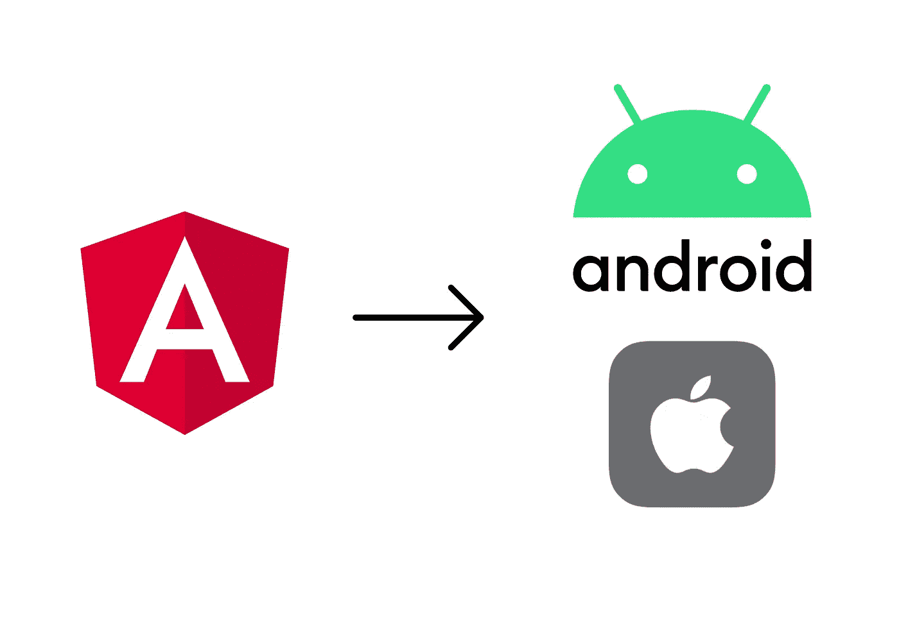
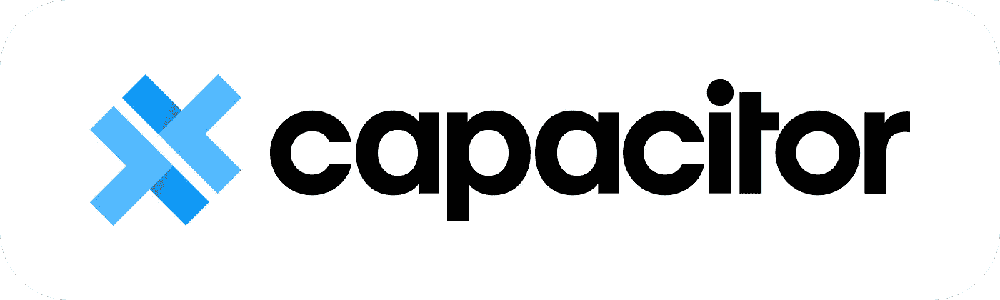
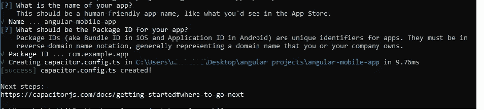
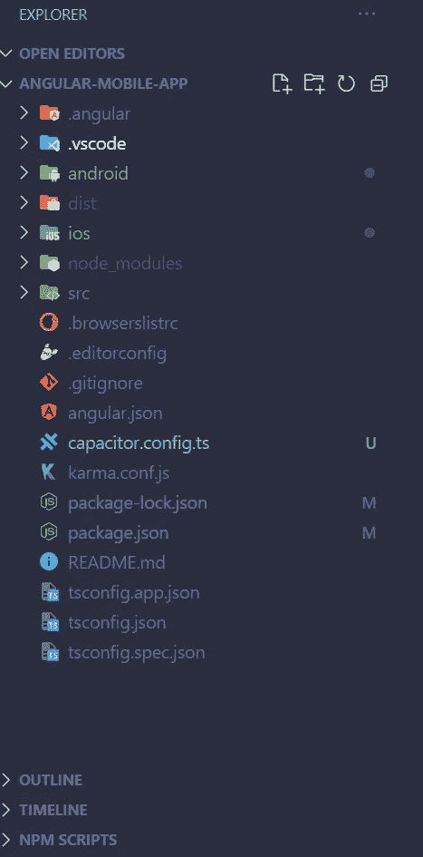
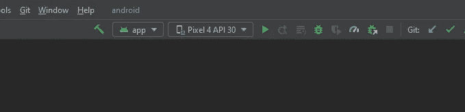
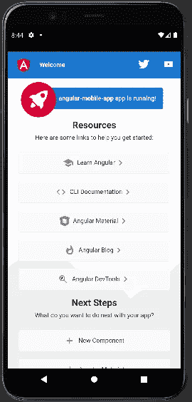

# 如何将您的 Angular 应用程序转换为原生移动应用程序(Android 和 iOS)

> 原文：<https://betterprogramming.pub/how-to-convert-your-angular-application-to-a-native-mobile-app-android-and-ios-c212b38976df>

## 使用电容器



正在寻找一种方法将您现有的 Angular 应用程序转换为移动应用程序，而不必从头开始重写一切？你来对地方了。在本文中，我们将使用[电容](https://capacitorjs.com/)来实现这一点。

# 先决条件

在我们开始之前，请确保通过安装以下依赖项来设置您的环境:

*   https://nodejs.org/en/
*   角度 CLI:[https://angular.io/cli](https://angular.io/cli)
*   移动开发设置:[https://capacitor js . com/docs/getting-started/environment-setup](https://capacitorjs.com/docs/getting-started/environment-setup)

# 什么是电容？



Capacitor 是一个跨平台的本地运行时，用于构建可以在 iOS 或 Android 上轻松运行的现代 web 应用程序。它提供了一些很酷的特性，比如 PWA 支持、电容 CLI 和很棒的插件。

[查看文档，了解更多信息](https://capacitorjs.com/docs)。

# 1-生成新的角度应用

为了简单起见，我们将只从 CLI 转换生成的角度投影。

```
ng new angular-mobile-app
```

上述 CLI 命令将创建并初始化一个新的现成的角度应用程序。

当生成完成时，导航到项目目录并键入以下命令来启动 dev 服务器:

```
cd angular-mobile-app
ng serve
```

现在，在你的浏览器上输入 [http://localhost:4200](http://localhost:4200) ，如果一切顺利的话，你应该会看到下面的页面。


在本地主机上运行的 Angular 应用程序:4200

# 2 —向您的项目添加电容器

既然我们已经启动并运行了一个 web 应用程序，下一步就是通过运行以下 npm 命令来安装`@capacitor/core`和`@capacitor/cli`依赖项:

```
cd angular-mobile-app
npm install @capacitor/core
npm install @capacitor/cli
```

# 3 —设置电容器配置文件

安装完电容器依赖项后，运行以下命令生成`capacitor.config.ts`文件:

```
npx cap init
```

CLI 将询问您一些关于该应用程序的一般性问题。现在一切都保持默认。



生成的文件如下所示:

电容器.配置. ts

*   `appId`:您打包的应用程序的唯一标识符。
*   `appName`:你的应用程序的名称。
*   `webDir`:您已编译的 web 资产的目录。
*   `bundledWebRuntime` : 是否复制电容器运行时捆绑。

注意:确保将`webDir`的值改为`dist/(your app name)`，因为这是 Angular 应用程序的常用构建路径。现在，电容器将能够找到网络资产。

# **4 —添加原生 iOS 和 Android 包**

下一步是根据 iOS 和 Android 的包安装，然后通过运行以下命令添加本地项目:

```
npm install @capacitor/ios @capacitor/androidnpx cap add iosnpx cap add android
```

运行上述 CLI 命令后，您应该会看到为 Android 和 iOS 创建了两个新文件夹。



# 5 —构建您的应用程序

现在，让我们构建 Angular 应用程序，并通过运行以下命令将更改同步到原生 Android/iOS 项目:

```
ng build --prodnpx cap sync
```

`npx cap sync`将复制 iOS/Android 项目中的构建文件夹。

# **6 —打开 Android studio 或 Xcode**

您可以在 Android Studio 或 Xcode 上使用项目中的以下命令直接打开移动项目:

```
npx cap open ios
npx cap open android
```

**注意:**确保在执行上面的命令之前，首先[设置好您的环境](https://capacitorjs.com/docs/v3/getting-started/environment-setup)。

现在，下一步是使用 Android Studio 或 Xcode 将您的应用程序直接部署到连接的设备或虚拟设备上。

就我而言，我使用的是 Android Studio。正如你在下图中看到的，我正在选择一个 Pixel 4 模拟器。



安卓工作室

最后，单击运行或调试按钮运行您的应用程序。

# 7 —运行应用程序！



在虚拟 android 设备上运行的应用程序

# 包扎

如您所见，在将现有的 angular 应用程序转换为原生移动应用程序方面，Capacitor 非常强大。

拥有一个适用于多个平台的代码库是如今我们所拥有的终极技能，这样我们不仅可以节省时间和金钱，还可以提高生产率。尽情享受吧！

感谢阅读，下期再见！