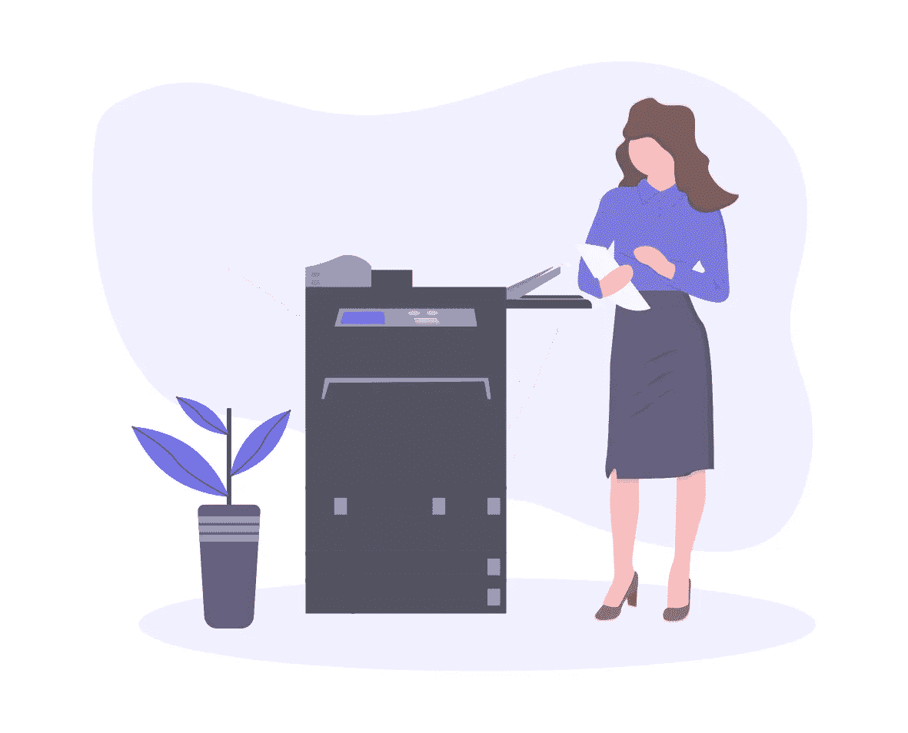

# 如何在 JavaScript 中将文本和图像复制到剪贴板

> 原文：<https://betterprogramming.pub/how-to-copy-text-and-images-to-the-clipboard-in-javascript-9a5f5ddf2cdc>

## 使用异步剪贴板 API 轻松地将内容复制到剪贴板



插图由 [unDraw](https://undraw.co/illustrations) 绘制

在本文中，我们将通过使用相对较新的[异步剪贴板 API](https://developer.mozilla.org/en-US/docs/Web/API/Clipboard_API) 来查看一种简单的复制剪贴板中的文本的方法和一种不太一致的复制图像到用户剪贴板的方法。

注意:`[document.execCommand](https://developer.mozilla.org/en-US/docs/Web/API/Document/execCommand)`过去被广泛用于将文本复制到用户的剪贴板上，但是不鼓励使用它*，它可能随时停止工作！*

# *许可*

*如果你只是写一个用户的剪贴板，你不需要担心浏览器的权限。*

*然而，有两件事你需要记住:*

1.  *你的网站应该在 HTTPS 提供服务*
2.  *仅当页面是活动的浏览器选项卡时，才授予剪贴板访问权限*

*从剪贴板中读取总是需要许可的，但是我们将在另一篇文章中对此进行更深入的探讨。*

# *将文本复制到剪贴板*

*将文本复制到剪贴板相当快速简单:*

```
*await navigator.clipboard.writeText("text to copy!");*
```

*就是这样！真的！*

*为了 web 和浏览器支持，您可以捕捉旧浏览器中可能出现的任何错误，并调用`document.execCommand`作为后备。请注意`document.execCommand`不被鼓励，可能随时停止工作！*

*注意，如果您在 Gatsby 中将它用作事件监听器，您可能需要在该函数的开头添加一个`window` check 语句:*

```
*if (typeof window === 'undefined') return false*
```

# *将图像复制到剪贴板*

*将图像复制到剪贴板，看起来与上面的复制文本有点不同，因为在将图像写入剪贴板之前，我们需要将图像转换成一个`[Blob](https://developer.mozilla.org/en-US/docs/Web/API/Blob)`对象。*

*本质上，我们需要创建一个`Blob`对象，首先从网络中获取它:*

*警告:不建议从`<canvas>`元素创建`Blob`对象！如果你仍然感兴趣，尽管看看[这个堆栈溢出回答](https://stackoverflow.com/a/40903325/7380613)，并确保你理解它如何工作以及使用它时会有什么问题。*

# *将图像斑点复制到剪贴板(Chrome)*

*使用上述任何方法生成图像斑点后，我们可以将斑点复制到剪贴板，如下所示:*

*如果你问我的话，上面的实现有几个问题，这让我们想到了剪贴板 API 的局限性。*

# *限制*

## *Chrome 与 Safari*

*第一个问题是，Safari 需要不同的逻辑，因为当你创建一个新的`ClipboardItem`如`{'<IMAGE MIME TYPE>': Blob}`时，Chromium 浏览器需要一个`Blob`类型，另一方面，Safari 需要一个未解析的`Promise`返回一个`Blob`对象，如`{'<IMAGE MIME TYPE>': Promise<Blob>}`。否则，您会得到如下所示的错误:*

```
*NotAllowedError — “The request is not allowed by the user agent or the platform in the current context, possibly because the user denied permission.”*
```

*由于上述原因，如果不首先创建它的`Blob`，就无法知道图像是什么 mime 类型。因此，对于 Safari 实现，我们可以从它的 URL 获取图像扩展，并使用它来创建它的 mime 类型，如下所示:*

*提示:查看[这个要点](https://gist.github.com/charisTheo/4981233128637fabec0121e90778aef8)是关于用 JavaScript 检测 Safari 浏览器的实用函数。*

*带有未解决的`Promise`的最终实现将如下所示:*

*然而，对所有浏览器来说，你不必支持一长串的 mime 类型，因为正如我们马上会看到的，只支持几个类型*

# *支持的 Mime 类型*

*目前只有`'text/plain'`和`'image/png'`在 Chrome 和 Safari 中都实现。我希望这个名单会越来越长，但目前只有这两个从它看起来的样子。*

*幸运的是，SVG 有一个变通方法，因为它们可以作为`'text/plain'`而不是`'image/svg+xml'`被复制。所以 Chrome 的实现应该是这样的:*

> *关于多 mime 类型复制的更多信息，请看 Thomas Steiner 的这篇文章。*

# *浏览器支持*

*最后，尽管上面列出的选项有限，浏览器支持看起来还不错:*

*   *用于复制文本的`writeText`在所有主流浏览器上都支持*
*   *用于复制图像的`write`是所有主流浏览器都支持的，除了需要一些自定义逻辑的 Firefox*

# *现场演示和代码*

*如需现场演示，请访问[网站](https://uncovered-bubble-lens.glitch.me)并找到 Glitch 上的[代码。](https://glitch.com/edit/#!/uncovered-bubble-lens)*

# *进一步阅读*

*   *[异步剪贴板 API](https://www.w3.org/TR/clipboard-apis/#async-clipboard-api) — W3C 工作草案*
*   *[异步剪贴板 API](https://developer.mozilla.org/en-US/docs/Web/API/Clipboard_API) — MDN 文档*
*   *[解除阻止剪贴板访问](https://web.dev/async-clipboard/) — web.dev*
*   *[弃用](https://developer.mozilla.org/en-US/docs/Web/API/Document/execCommand) `[document.execCommand](https://developer.mozilla.org/en-US/docs/Web/API/Document/execCommand)` [方法](https://developer.mozilla.org/en-US/docs/Web/API/Document/execCommand)*
*   *`[navigator.clipboard.writeText](https://developer.mozilla.org/en-US/docs/Web/API/Clipboard/writeText)` - [浏览器支持](https://caniuse.com/mdn-api_clipboard_writetext)*
*   *`[navigator.clipboard.write](https://developer.mozilla.org/en-US/docs/Web/API/Clipboard/write)` - [浏览器支持](https://caniuse.com/mdn-api_clipboard_write)*