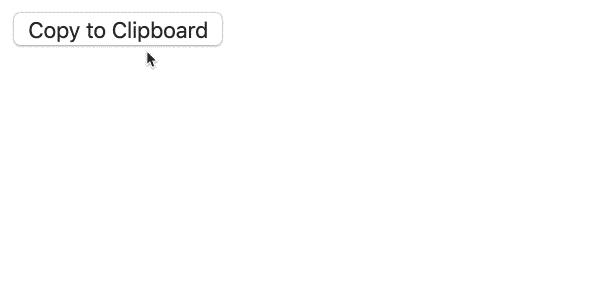

# 如何将文本复制到剪贴板

> 原文：<https://betterprogramming.pub/how-to-copy-text-to-clipboard-c9935c8fba18>

## 简单的 JavaScript 解决方案


[南大绿](https://unsplash.com/@nandagreen?utm_source=medium&utm_medium=referral)在 [Unsplash](https://unsplash.com?utm_source=medium&utm_medium=referral) 上拍照

嘿，极客们！

虽然将一些文本复制到剪贴板看起来很常见，但是 JavaScript 中没有内置函数允许这样做。

这就是为什么我们需要使用这四个简单的步骤来制定一个解决方案:

1.创建一个临时的`<textarea>`元素并将其附加到主体中。

```
const textarea = document.createElement(‘textarea’);
document.body.appendChild(textarea);
```

2.将指定文本输入此`<textarea>`并选择它。

```
textarea.value = text;
textarea.select()
```

请注意，有些浏览器可能不支持`select`方法(尤其是移动浏览器)。这就是为什么，为了确保更好的浏览器兼容性，最好也使用`setSelectionRange`方法。

```
textarea.setSelectionRange(0, 99999);
```

3.将所选文本复制到剪贴板。

```
document.execCommand('copy');
```

`execCommand`是一个执行指定命令(复制、剪切等)的内置方法。)用于选定的文本。[阅读更多](https://www.w3schools.com/jsref/met_document_execcommand.asp)。

4.自己清理干净，拆下临时`<textarea>`元件。

```
document.body.removeChild(textarea);
```

当然，在实时情况下，这一功能仍然不为人所知。但是如果我们在调试器中暂停它，我们会看到函数执行是这样的。



检查下面我们函数的全部代码。