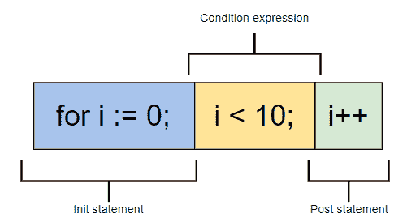

# 如何破解 25 大 Golang 面试问题

> 原文：<https://betterprogramming.pub/how-to-crack-the-top-25-golang-interview-questions-a94396d6c808>

## 通过掌握这些问题赢得下一次编码面试


图片来源:作者

[Go](https://golang.org/) 编程语言，或 Golang，是一种开源编程语言，类似于 C，但针对快速编译、无缝并发和开发人员易用性进行了优化。

这种语言是由谷歌创造和采用的，但近年来随着对并发、网络化程序需求的增加，这种语言在其他公司也越来越流行。

无论你是在准备谷歌的工作面试，还是只想继续做一名前沿开发者，Go 都是你的正确选择。今天，我们将通过 25 个最重要的围棋问答来帮助你练习你的围棋技巧。

**这是我们今天要讲的内容:**

*   关于 Golang 基础知识的问题
*   中级 Golang 问题
*   Golang 中的编码挑战
*   Golang 并发问题
*   你学习的下一步

# 关于 Golang 基础知识的问题

## 1.与其他语言相比，使用 Go 有什么好处？

*   与其他以学术实验开始的语言不同，Go 代码是务实设计的。每一个特性和语法决策都是为了让程序员的生活更轻松。
*   Golang 针对并发性进行了优化，并且在大规模下运行良好。
*   由于单一的标准代码格式，Golang 通常被认为比其他语言更具可读性。
*   自动垃圾收集明显比在 Java 或 Python 中更有效，因为它与程序并行执行。

## 2.什么是字符串文字？

一个*字符串文字*是通过连接字符形成的字符串常量。字符串文字的两种形式是原始字符串文字和解释字符串文字。

原始字符串文字写在反斜杠(`foo`)内，并用未解释的 UTF-8 字符填充。解释的字符串文字就是我们通常认为的字符串，写在双引号内，包含除换行符和未结束的双引号之外的任何字符。

## 3.Golang 使用什么数据类型？

Golang 使用以下类型:

*   方法
*   布尔代数学体系的
*   数字的
*   线
*   排列
*   薄片
*   结构体
*   指针
*   功能
*   连接
*   地图
*   频道

## 4.Go 程序中的包是什么？

*包* ( `pkg`)是包含 Go 源文件或其他包的 Go 工作区中的目录。源文件中的每个函数、变量和类型都存储在链接包中。每个 Go 源文件都属于一个包，该包在文件的顶部使用:

```
package <packagename>
```

您可以使用以下方法导入和导出包以重用导出的函数或类型:

```
import <packagename>
```

Golang 的标准包是`fmt`，其中包含类似`Println()`的格式化和打印功能。

## 5.Go 支持什么形式的类型转换？将整数转换为浮点数

Go 支持显式类型转换，以满足其严格的类型要求。

```
i := 55      //intj := 67.8    //float64sum := i + int(j) //j is converted to int
```

## 6.什么是 goroutine？你怎么阻止它？

一个 *goroutine* 是一个函数或方法，它使用一个特殊的 goroutine 线程与任何其他 goroutine 并行执行。Goroutine 线程比标准线程更轻量级，大多数 Golang 程序同时使用数千个 go routine。

要创建一个 goroutine，在函数声明之前添加关键字`go`。

```
go f(x, y, z)
```

您可以通过向 goroutine 发送信号通道来停止它。Goroutines 只有在被告知检查时才能响应信号，所以你需要在逻辑位置包括检查，比如在你的`for`循环的顶部。

## 7.如何在运行时检查变量类型？

类型开关是在运行时检查变量类型的最佳方式。类型开关通过类型而不是值来计算变量。每个开关至少包含一个作为条件语句的`case`和一个`default`案例，如果没有一个案例为真，则执行该案例。

例如，您可以创建一个类型开关来检查接口值`i`是否包含类型`int`或`string`:

## 8.你如何连接字符串？

连接字符串最简单的方法是使用连接操作符(`+`)，它允许您像添加数值一样添加字符串。

# 中级 Golang 问题

## 9.解释用 Golang 测试的步骤

Golang 支持使用定制测试套件对包进行自动化测试。

要创建一个新的套件，创建一个以`_test.go`结尾并包含一个`TestXxx`函数的文件，其中`Xxx`被替换为您正在测试的特性的名称。例如，测试登录能力的函数将被称为`TestLogin`。

然后，将测试套件文件放在与您想要测试的文件相同的包中。测试文件在常规执行时会被跳过，但当您输入`go test`命令时会运行。

## 10.什么是函数闭包？

*函数闭包*是从函数体外部引用变量的函数值。该函数可以访问引用的变量并为其赋值。

例如:`adder()`返回一个闭包，这个闭包绑定到它自己引用的`sum`变量。

## 11.我们如何用 Golang 执行继承？

这是一个有点技巧的问题:Golang 中没有继承，因为它不支持类。

但是，您可以使用 composition 模仿继承行为，使用现有的 struct 对象定义新对象的开始行为。一旦创建了新对象，功能就可以扩展到原始结构之外。

`Animal`结构包含`Eat()`、`Sleep()`和`Run()`函数。通过简单地在`Dog`的实现顶部列出结构，这些函数被嵌入到子结构`Dog`中。

## 12.解释 Go 接口。它们是什么，它们是如何工作的？

接口是 Go 中的一种特殊类型，它定义了一组方法签名，但不提供实现。类型`interface`的值可以保存实现这些方法的任何值。

接口本质上充当方法的占位符，这些方法基于使用它们的对象而具有多个实现。

例如，您可以实现一个`geometry`接口，该接口定义所有使用该接口的形状必须有一个`area()`和`perim()`的实现。

```
type geometry interface {
    area() float64
    perim() float64
}
```

## 13.Golang 中的左值和右值是什么？

左值

*   指的是一个内存位置
*   表示变量标识符
*   易变的
*   可能出现在`=`操作器的左侧或右侧

例如，在语句`x =20`中，`x`是左值，`20`是右值。

**右值**

*   表示存储在内存中的数据值
*   表示一个常数值
*   总是出现在`=`操作员的右侧。

例如，语句`10 = 20`无效，因为`=`运算符左侧有一个右值(`10`)。

## 14.Go 中的循环构造是什么？

Go 只有一个循环结构:`for`循环。`for`循环由分号分隔的三个部分组成:

*   在循环开始前执行的`Init`语句。它通常是一个只在`for`循环范围内可见的变量声明。
*   条件表达式，在每次迭代之前作为布尔值进行计算，以确定循环是否应该继续。
*   在每次迭代结束时执行的`post`语句。



图片来源:作者

## 15.你能从一个函数中返回多个值吗？

是的。Go 函数可以返回多个值，每个值在`return`语句中用逗号分隔。

# Golang 的编码挑战

## 16.实现堆栈(LIFO)

实现具有弹出、附加和打印顶部功能的堆栈结构。

**解决方案**

您可以使用 slice 对象实现堆栈。

首先，我们使用内置的`append()`函数来实现追加行为。然后我们用`len(stack)-1`选择栈顶并打印。

对于 pop，我们将堆栈的新长度设置为打印的上限值的位置，`len(stack)-1`。

## 17.打印切片字符或字符串的所有排列

实现`perm()`函数，该函数接受一个切片或字符串，并打印所有可能的字符组合。

**解决方案**

我们使用`rune`类型来处理切片和字符串。符文是 Unicode 码点，因此可以同等地解析字符串和切片。

## 18.交换两个变量的值，不使用临时变量

实现`swap()`，它交换两个变量的值，而不使用第三个变量。

**解决方案**

虽然这在其他语言中可能很复杂，但 Go 让它变得很容易。

我们可以简单地包含语句`b, a = a, b`，变量引用什么数据，而不涉及任何一个值。

## 19.实现最小和最大行为

实现`Min(x, y int)`和`Max(x, y int)`函数，它们接受两个整数并分别返回较小或较大的值。

**解决方案**

默认情况下，Go 只支持使用`math.min`和`math.max`的浮点数的最小值和最大值。您必须创建自己的实现来使它适用于整数。

## 20.反转切片的顺序

实现函数`reverse`,该函数获取一个整数切片并在不使用临时切片的情况下就地反转该切片。

**解决方案**

我们的`for`循环交换切片中每个元素的值。值将从左向右滑动。最终，所有元素都会被反转。

## 21.检查切片是否为空的最简单方法是什么？

创建一个检查切片是否为空的程序。找到最简单的解决方案。

**解决方案**

检查切片是否为空的最简单方法是使用内置的`len()`函数，该函数返回切片的长度。如果`len(slice) == 0`，那么你知道切片是空的。

例如:

## 22.格式化字符串，但不打印

找到用变量格式化字符串而不打印值的最简单的方法。

**解决方案**

最简单的不打印格式化的方法是使用`fmt.Sprintf()`，它返回一个字符串而不打印它。

例如:

```
package mainimport "fmt"func main() {
  s := fmt.Sprintf("Size: %d MB.", 85)
  fmt.Println(s)
}
```

# Golang 并发问题

## 23.解释 Golang 中并发和并行的区别

*并发*是指你的程序可以同时处理多个任务，而*并行*是指你的程序可以使用多个处理器同时执行多个任务。

换句话说，并发性是程序的一个属性，它允许您同时进行多个任务，但不一定同时执行。并行性是同时执行两个或更多任务的运行时属性。

因此，并行性可以成为实现并发性的一种手段，但它只是众多可用手段中的一种。

Golang 中并发的关键工具是 *goroutines* 和*通道*。go routine 是并发的轻量级线程，而通道允许 go routine 在执行过程中相互通信。

## 24.合并排序

使用 goroutines 和 channels 实现并发合并排序解决方案。

您可以使用这种顺序合并排序实现作为起点:

**解决方案**

首先，在归并排序中，我们不断递归地将数组划分为`right`侧和`left`侧，并在从**行 30** 到**行 34** 的两侧调用`MergeSort`函数。

现在，我们必须确保在从两个递归调用中获得返回值后执行`Merge(left,right)`，也就是说，在`Merge(left,right)`可执行之前，必须更新`left`和`right`。因此，我们在**行 26** 上引入一个`bool`类型的通道，并在`left = MergeSort(data[:mid])`执行后立即发送`true`(**行 32** )。

`<-done`操作在语句`Merge(left,right)`之前阻塞**行 35** 上的代码，以便在我们的 goroutine 完成之前不会继续。在 goroutine 完成并且我们在`done`通道上接收到`true`之后，代码前进到**行 36** 上的`Merge(left,right)`语句。

## 25.平方和

实现`SumOfSquares`函数，该函数接受一个整数`c`，并返回 1 和`c`之间的所有平方和。您需要使用`select`语句、goroutines 和通道。

例如，输入`5`将返回`55`，因为$1^2 + 2^2 + 3^2 + 4^2 + 5^2 = 55 美元

您可以使用以下代码作为起点:

**解决方案**

看看我们的`SumOfSquares`函数。首先，在**第 4 行**上，我们声明一个变量`y`，然后跳转到`For-Select`循环。在我们的 select 语句中有两种情况:

*   `case c <- (y*y)`:这是通过通道`c`发送`y`的平方，在主例程创建的 goroutine 中接收。
*   `case <-quit`:这是为了接收从函数返回的主例程的消息。

# 你学习的下一步

练习题做得很好！围棋是一门新兴的语言，像这样的动手练习是快速学会的关键。为了更好地准备面试，你需要:

*   制定详细的学习计划
*   在白板上练习围棋问题
*   学习如何大声表达你的思维过程
*   准备行为面试

*快乐学习！*