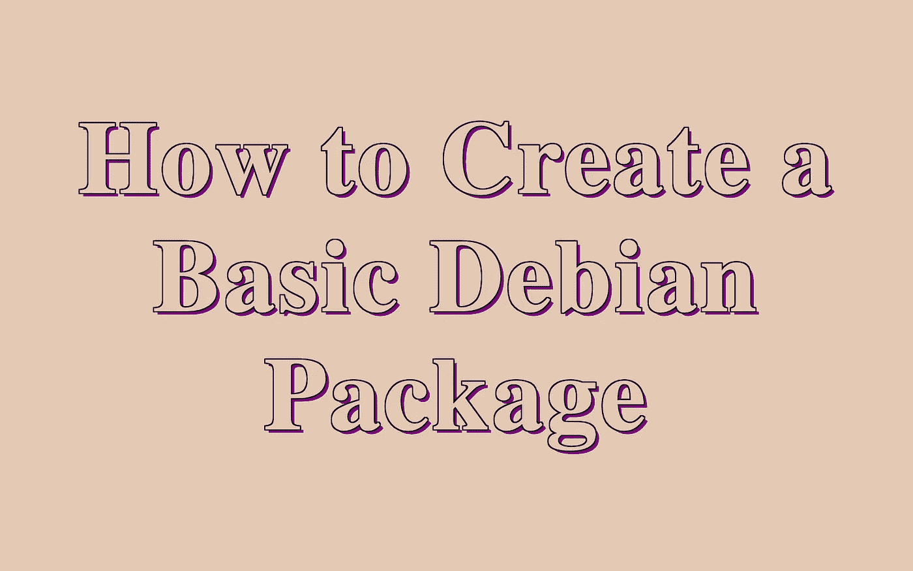
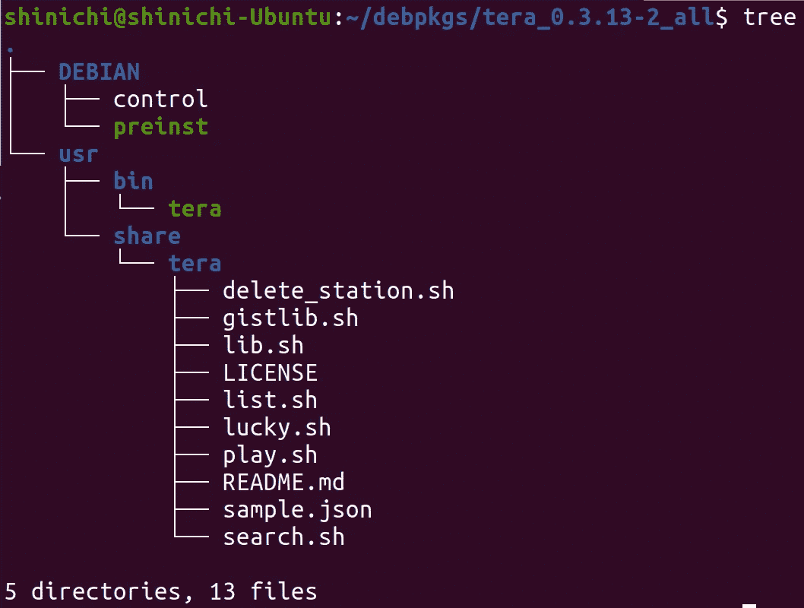
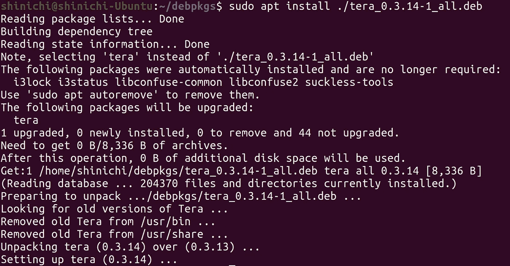
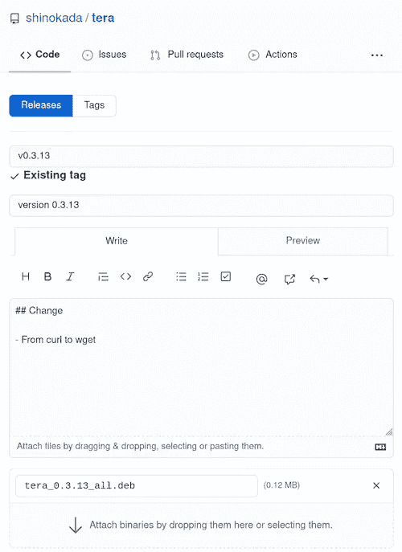
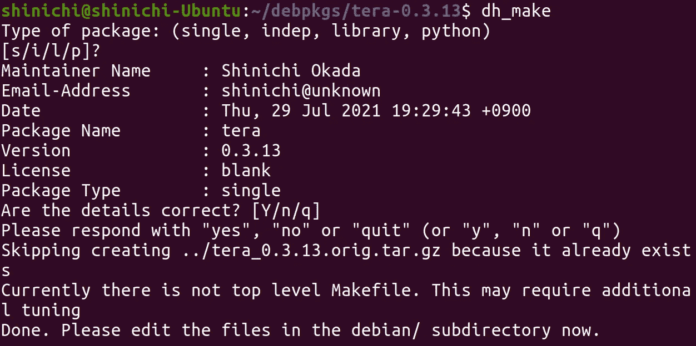
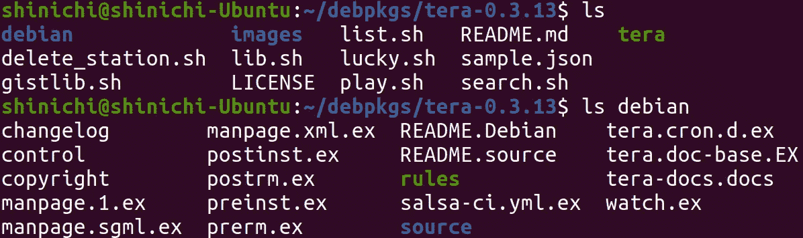

# 如何创建一个基本的 Debian 包

> 原文：<https://betterprogramming.pub/how-to-create-a-basic-debian-package-927be001ad80>

## 带实例的初学者分步指南



图片由作者使用[特效](https://medium.com/mkdir-awesome/5-more-unique-text-effects-from-command-line-994e92b26386#95ea)制作。

# 介绍

“deb”包格式适用于 Debian Linux 发行版[。Ubuntu 操作系统包括数以千计的 deb 包，用于广泛的开源应用程序。](https://www.debian.org/)

Debian.org 提供了一份发行手册，但是阅读 Debian 的发行手册可能会让人望而生畏。该手册适用于 Debian 官方发行版。但是创建一个用于个人分发的 Debian 包是非常容易实现的。我刚刚为终端无线电 [Tera](https://levelup.gitconnected.com/discover-rejuvenate-your-music-library-with-command-line-f3268db67bba) 创建了我的第一个 Debian 包。

在本文中，我将解释如何使用我的 Tera 文件创建一个基本的 Debian 包。

```
**Table of Contents**
· [Introduction](#e9f1)
· [Naming](#fdf6)
  ∘ [Architecture](#3bb8)
· [Package Structure](#e9b1)
· [Control file](#c165)
· [Preinst file](#254a)
· [Permissions](#4989)
· [Generate a package](#b058)
· [How to install a Debian package](#7a0f)
· [How to distribute the Debian package](#309c)
· [What’s next?](#dfc0)
  ∘ [dh-make](#0641) 
  ∘ [Launchpad](#f0cb)
· [Conclusion](#2248)
· [References](#a21c)
```

# 命名

使用`package**-**name**_**VersionNumber**-**RevisionNumber**_**DebianArchitecture`格式创建一个目录。(请注意下划线和破折号。)

在这种情况下，Tera 版本是 0.3.13，修订号是 2。如果我需要更新，但想保持相同的版本，我可以增加修订号。

我会把我所有的 Debian 包放在`debpkgs`目录下。

```
mkdir ~/debpkgs
cd ~/debpkgs
mkdir ./tera_0.3.13–2_all
```

## 体系结构

我用`all`做建筑。有[各种平台](https://wiki.debian.org/SupportedArchitectures) : amd64，arm64 等。 [X64、amd64 和 x86–64](http://en.wikipedia.org/wiki/X86-64)是同一种处理器类型的名称。

# 程序包结构

创建`DEBIAN`、`usr/bin`、`usr/share/tera`目录。我从 [GitHub 发布页面](https://github.com/shinokada/tera/releases)下载了一个源代码(tar.gz ),并解压文件以分配文件，如下图所示。



一个基本的 Debian 包结构。图片由作者提供。

当用户安装这个 Debian 包时，`usr/bin/tera`文件会被安装在用户的`/usr/bin`目录中。不要像`usr/bin/tera.sh`那样加上`.sh`这个扩展名。

如果你的脚本只包含一个文件，那么使用`usr/bin`目录。

我的 app 还有其他文件，它们会被安装在用户的`/usr/share/tera`目录下。这些文件将被导入到主文件`/usr/bin/tera`中。将扩展名`.sh`添加到`usr/share/tera`目录中的所有脚本文件。

由于结构不同于家酿包，我需要更新`tera`文件作为`/usr/share/tera`文件的导入路径。

```
share_tera_dir="/usr/share/tera"# shellcheck disable=SC1091{
. "${share_tera_dir}/lib.sh"
. "${share_tera_dir}/search.sh"
. "${share_tera_dir}/list.sh"
# more files
}
```

如果要添加其他文件，例如 man 文件、配置文件，可以使用以下目录。

```
# man page
~/debpkgs/tera_0.3.13–2_all/usr/share/man# config file
~/debpkgs/tera_0.3.13–2_all/etc# libraries
~/debpkgstera_0.3.13–2_all/usr/local/bin
```

# 控制文件

控制文件包含程序包管理工具用来管理程序包的各种值。包括`Package`、`Version`、`Architecture`等字段。

以下是我的`DEBIAN/control`文件:

```
Package: tera
Version: 0.3.13
Architecture: all
Maintainer: John Doe<your-email@gmail.com>
Depends: mpv, jq, fzf, wget
Homepage: [https://github.com/shinokada/tera](https://github.com/shinokada/tera)
Description: Tera is an interactive music radio player. Play your favorite radio station, CRUD your favorite lists, and explore new radio stations from your terminal.
```

可以添加[更多字段，](https://www.debian.org/doc/debian-policy/ch-controlfields.html#binary-package-control-files-debian-control)如`Installed-Size`、`Conflicts`、`Breaks`、`Section`等。，根据你的需要。

# 预安装文件

您可以在 DEBIAN 目录中添加 [**preinst** 、 **postinst** 、 **prerm** 和 **postrm**](https://www.hivelocity.net/kb/what-are-preinst-postinst-prerm-and-postrm-script-2/) 文件。都是 Debian 在包安装前后自动运行的可执行脚本。

我添加了下面的`preinst`脚本。该脚本在新安装之前删除旧文件和目录**。**

我们将这些文件的权限设置为 755。

# 许可

我们需要更改所有文件的`owner:group`以及主文件和`preinst`文件的权限:

```
sudo chown root:root -R ~/debpkgs/tera_0.3.13-2_all
sudo chmod 755 ~/debpkgs/tera_0.3.13-2_all/usr/bin/tera
sudo chmod 755 ~/debpkgs/tera_0.3.13-2_all/DEBIAN/preinst
```

# 生成包

运行以下命令将文件归档为`.deb`格式。它创建了一个`tera_0.3.13-2_all.deb`包。

```
dpkg-deb --build ~/debpkgs/tera_0.3.13-2_all
```

# 如何安装 Debian 软件包

让我们使用`apt`命令在您的系统上安装这个包:

```
cd ~/debpkgs/
sudo apt install ./tera_0.3.13-2_all.deb
```



安装更新。最后四行是 preinst 文件的结果。图片由作者提供。

您可以使用以下命令卸载它:

```
sudo apt remove tera
```

# 如何分发 Debian 软件包

你可以把它添加到你的 Github 发布页面。点击“编辑”按钮，上传您的文件。



将 Debian 包附加到 Github 发布页面。图片由作者提供。

# 下一步是什么？

## dh-make

`dh-make`是一个简化创建 Debian 软件包的工具。

使用以下命令安装它:

```
sudo apt install dh-make
```

跑`dh_make`:



运行 dh_make 命令的输出。图片由作者提供。

创建一个新目录`debian`和其他文件。



dh_make 命令创建的文件。图片由作者提供。

## [发射台](https://help.launchpad.net/Packaging)

如果你想把你的软件包分发给更多的用户，那么你需要通过 [Debian](https://wiki.debian.org/DebianMentorsFaq) 、 [Ubuntu](https://wiki.ubuntu.com/PackagingGuide/Basic) 或 [Launchpad](https://help.launchpad.net/Packaging/SourceBuilds/GettingStarted) 。

您可以通过 Launchpad 为使用 Debian 风格打包的操作系统构建和分发包。您可以将您的源代码放在一个 [Launchpad](https://help.launchpad.net/Packaging/SourceBuilds/GettingStarted) 存储库中。

# 结论

我希望你能用这个方法创建你的第一个 Debian 包。对我来说，下一步是注册到 Launchpad 存储库，面向更多的受众。一旦我弄明白了，我会让你知道的。

快乐编码。

**通过** [**成为**](https://blog.codewithshin.com/membership) **会员，获得媒体上所有故事的访问权限。**


[https://blog.codewithshin.com/subscribe](https://blog.codewithshin.com/subscribe)

# 参考

*   [https://askubuntu . com/questions/1345/what-is-the-simple-debian-packaging-guide](https://askubuntu.com/questions/1345/what-is-the-simplest-debian-packaging-guide)
*   [https://github . com/RSM-GH/build-deb/blob/master/DEBIAN _ basics . MD](https://github.com/rsm-gh/build-deb/blob/master/DEBIAN_BASICS.md)
*   【https://www.debian.org/doc/debian-policy/index.html 号
*   [https://www . debian . org/doc/manuals/debian-FAQ/pkg-basics . en . html](https://www.debian.org/doc/manuals/debian-faq/pkg-basics.en.html)
*   [https://www.youtube.com/watch?v=ep88vVfzDAo](https://www.youtube.com/watch?v=ep88vVfzDAo)
*   [https://www . dev dungeon . com/content/debian-package-tutorial-dpkgdeb](https://www.devdungeon.com/content/debian-package-tutorial-dpkgdeb)
*   [https://UNIX . stack exchange . com/questions/159094/how-to-install-a-deb-file-by-dpkg-I-or-by-apt](https://unix.stackexchange.com/questions/159094/how-to-install-a-deb-file-by-dpkg-i-or-by-apt)