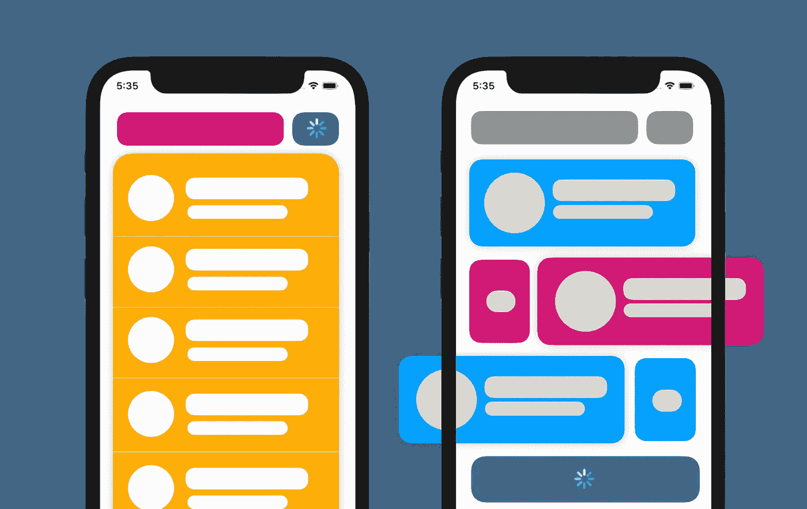
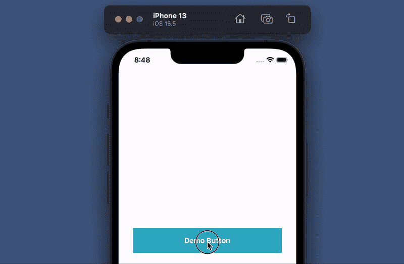
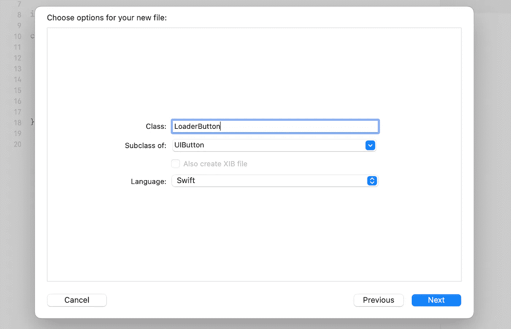
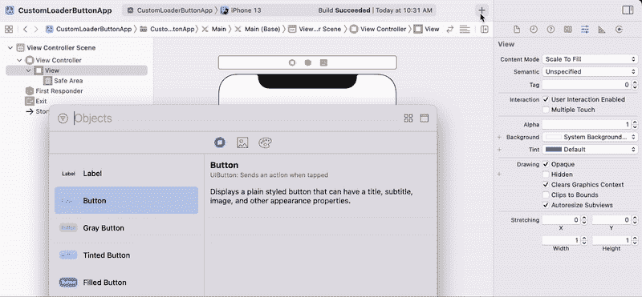
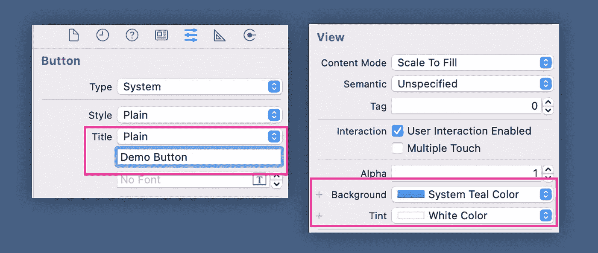
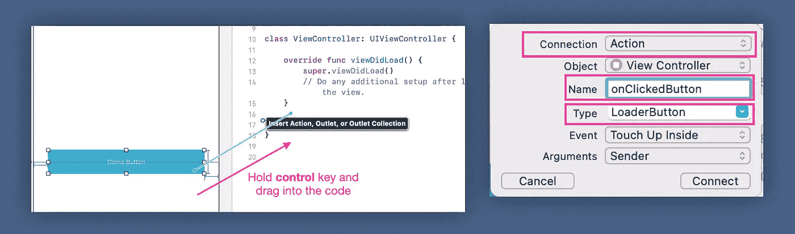

# 如何在 iOS 中创建一个带加载指示器的按钮

> 原文：<https://betterprogramming.pub/how-to-create-a-button-with-loading-indicator-in-ios-b579e063b91c>

## 了解如何创建带有内置微调器的按钮

带有加载指示器按钮的移动应用程序用户界面。图片作者。

移动开发中最重要的 UI 组件之一是按钮。在移动应用程序设计中，我们基本上需要一个加载指示，通过确保用户知道状态已经改变或请求正在被处理来改善用户体验。

# 入门指南

在本文中，我们将学习如何:

1.  使用[UIActivityIndicatorView](https://developer.apple.com/documentation/uikit/uiactivityindicatorview)创建一个带有内置加载指示器的自定义 [UIButton](https://developer.apple.com/documentation/uikit/uibutton) 类
2.  在视图控制器中使用自定义按钮。在这个例子中，我们将使用故事板。

请注意，这个项目是在 Swift 5 中用 iOS13+和 Xcode 13.4 开发的。

下面是应用程序的最终输出，我们将从本教程中实现。

本教程的最终输出。图片作者。

# 1.创建新的 UIKit 项目

创建新的 UIKit 项目

# 2.创建自定义按钮

从“Cocoa Touch Class”模板创建一个新文件，然后选择子类为“UIButton”并将其命名为“LoaderButton”

创建新的按钮子类

单击“下一步”，并将以下代码添加到文件中:

以下是添加到该文件中的每个要点的解释:

1.  通过子类化`UIButton`创建一个自定义按钮。
2.  添加一个`UIActivityIndicatorView`作为装载指示器，即“spinner”
3.  添加一个`isLoading`变量来保持按钮的状态。每次这个变量被更新，它会立即调用`updateView()`函数。
4.  按钮初始化后，调用`setupView()`。
5.  当装载指示器停止动画时，它将总是隐藏。
6.  添加加载指示器作为按钮子视图，并将约束设置为`view`的中间。
7.  `updateView()`将保持按钮状态。如果它处于加载状态，标题和图像将被隐藏(透明)并显示加载指示器，反之亦然。

太好了。现在，主要部分完成了。让我们尝试将它添加到视图控制器中。

# 3.在视图控制器中实现

在本节中，我们将向故事板添加自定义按钮，并简单地设置约束。

1.  单击右上角的+按钮，从对象库中选择可用的控件。
2.  找到按钮并将其拖动到视图控制器中。
3.  选择右上角的 Identity Inspector 选项卡，并将类更改为我们刚刚创建的`LoaderButton`。

使用故事板将 UIButton 添加到视图控制器中

4.将约束设置为垂直居中，水平填充为 32，高度等于 54。

设置按钮的约束

5.现在，我们需要定制按钮的外观。将按钮标题设置为“演示按钮”，将背景颜色更改为蓝绿色，文本颜色更改为白色，如下图所示:

自定义按钮外观

# 4.将按钮连接到视图控制器

1.  选择故事板，并打开助理编辑器。
2.  通过按住 control 键并将按钮拖到编辑器，将按钮作为`IBAction`连接到代码编辑器。
3.  选择连接作为动作，然后将类型更改为`LoaderButton`，并将名称字段输入为`onClickedButton`。

连接按钮以动作形式查看控制器

# 5.更新按钮处理程序

在`onClickedButton`中，添加下面的代码来模拟一个请求。代码将激活微调器，并等待两秒钟完成。一旦完成，微调将消失，按钮状态将恢复正常。

# 项目已完成

恭喜你。现在，我们已经完成了这个项目，并准备运行。

完整的源代码可以从我的 GitHub [库](https://github.com/xmhafiz/medium-custom-loader-button-app)下载。

尝试将它实现到您的项目中，并通过添加更多功能来改进代码。

感谢您的阅读，祝您编码愉快！

# 参考

[ui 按钮](https://developer.apple.com/documentation/uikit/uibutton)文档

[UIActivityIndicatorView](https://developer.apple.com/documentation/uikit/uiactivityindicatorview) 文档

[演示项目 GitHub 资源库](https://github.com/xmhafiz/medium-custom-loader-button-app)