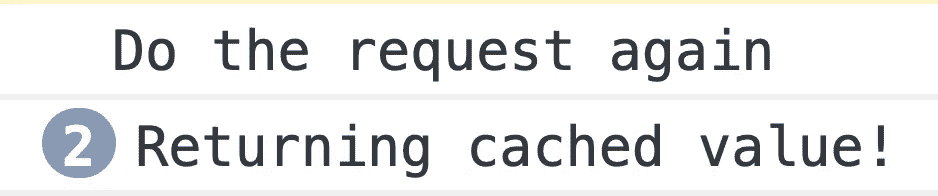

# 如何为 Angular 创建缓存服务

> 原文：<https://betterprogramming.pub/how-to-create-a-caching-service-for-angular-bfad6cbe82b0>

## 解释使用 Angular 和 RxJS 缓存 HTTP 调用的正确方法

谢尔盖·佐尔金在 [Unsplash](https://unsplash.com/s/photos/laptop?utm_source=unsplash&utm_medium=referral&utm_content=creditCopyText) 上拍摄的照片

TL；DR:你需要缓存从`HttpClient`返回的可观测值，并与`shareReplay`和`catchError`结合。

在很多情况下，我们需要一遍又一遍地问服务器同样的问题。典型的例子是要求对术语进行翻译，或者使用位于服务器上的词汇表解析一些代码。

我们不想太麻烦服务器，所以我们使用缓存。在本文中，我将尝试解释使用 Angular 和 [RxJS](https://rxjs-dev.firebaseapp.com/) 缓存 HTTP 调用的正确方法。

# 不缓存

因此，假设我们有一个服务器可以返回某些产品的营养信息。让我们使用[开放食品事实 API](https://world.openfoodfacts.org/api/v0/product/7613034626844.json) 来实现这一点。

我给它产品的代码(例如`"7613034626844"`)，它返回给我一个包含所有必要信息的对象(例如`{name: "Ovomaltine milk powder"}`)。让我们为此绘制一个角度服务(参见 [StackBlitz](https://stackblitz.com/edit/angular-non-caching-service?file=src%2Fapp%2Fproduct.service.ts) ):

该服务获取代码，并将其作为参数传递给 API。我们将创建一个超级简单的`ProductComponent`并在构造函数中调用它。

现在，让我们像在`AppComponent`中那样使用`ProductComponent`:

果然，我们将看到该请求被执行了三次，尽管我们总是询问相同的信息。现在，让我们使用缓存来提高速度。

# 值的简单缓存

缓存的第一个想法是实际缓存返回的术语，就像我在这里做的那样(参见 [StackBlitz](https://stackblitz.com/edit/angular-non-caching-service-naive?file=src/app/app.component.ts) ):

理论上，我们的服务检查给定的术语是否存在于缓存中，如果存在，则返回它。如果产品代码是新的，它会要求 HTTP 服务调用它。当服务器向我们发送响应时，我们使用`tap`操作符将其放入缓存。

例如，用户点击一个按钮来查看关于代码`"7613034626844"`的信息，我们的服务将执行对服务器的调用。

当用户下次单击按钮来解析相同的术语时，我们的服务将不会启动 HTTP 调用，而是使用缓存的值。乍一看，一切正常。

## 天真方法的问题

但是，有一个警告:我们将值异步放入缓存，所有异步代码都将在同步代码之后执行。

如果我们在一个`for`循环中或者在`*ngFor`中调用`resolve`函数，或者只是让几个组件在同一个模板中使用它，会怎么样？结果是我们的缓存没有完成它的工作:

突然，在网络选项卡中，我们看到许多相同的 HTTP 请求，所以很明显，缓存跟不上。

问题是对 HTTP 调用的反应只有在所有这些 HTTP 调用被执行之后才会发生，因为每个异步代码都发生在事件循环中。

# 不那么天真的版本——缓存可观察对象本身

我们可以很容易地解决这个问题。我们可以缓存 Angular `HttpClient`服务返回的可观察值，而不是缓存来自服务器的返回值。

这样，函数调用和缓存将是同步的。惟一的技巧是我们必须使用`shareReplay`操作符，它将允许订户查看 HTTP 调用的结果。

如果没有`shareReplay`，请求后可观察对象将保持在`FINISHED`状态，新订户将无法获得其值。

network 选项卡中的结果与我们计划的完全一样，我们只有一个 HTTP 调用。现在，剩下的就是管理异常。

## 处理异常

如果我们的服务器停机几秒钟，而我们要求它解决一个术语，会发生什么？错误 HTTP 代码将在可观察对象中引发一个错误。

在可观测性出错或结束后，我们无法重启它——这是可观测性的契约。

对于我们目前的方法，这意味着我们正在缓存错误，这是不合理的:服务器最终将开始工作，我们希望向它发送一个 HTTP 请求。

为了实现这一点，我们可以使用`catchError`操作符从缓存中删除一个可观察对象，这样，下一次，服务器将被调用。

您可以为此使用`[delete](https://developer.mozilla.org/en-US/docs/Web/JavaScript/Reference/Operators/delete)`操作符，或者如果您更关心性能而不是可读性，可以将`false`分配给缓存中的那个键。

结果是:现在我们只调用 API 一次。

# 分析

这种特殊的缓存方法被称为*记忆化*，它将在以下情况下很好地为您服务:

*   用户多次询问相同的信息。
*   服务器上的这些信息本质上是稳定的。将它用于词汇、翻译和查找服务。
*   您的应用程序不应该在不重新加载的情况下运行很多天。

内存化的所有缺点都有一个共同的原因，那就是我们从来没有清理过我们缓存的值。考虑到这一点，这里有一些限制:

*   *不要使用这种缓存方法来检查实时信息:股票价格、天气、Twitter feed 等。这根本行不通。*
*   如果您希望您的应用程序运行几个月甚至几年而不需要重新加载，不要使用这种缓存方法，因为缓存大小会变得非常大，并且您会有内存泄漏。