# 如何使用 Jenkins、Containers 和 Amazon ECS 创建 CI/CD 管道

> 原文：<https://betterprogramming.pub/how-to-create-a-ci-cd-pipeline-with-jenkins-containers-and-amazon-ecs-af4eaec75b8b>

## 了解部署示例 Nodejs 容器化应用程序的分步过程

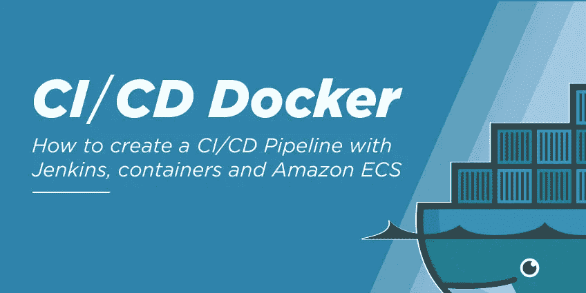

作者图片

如果您仍然以传统的方式构建和交付您的软件应用程序，那么您就错过了软件开发过程或软件开发生命周期中的重大创新。

为了向您展示我所说的内容，在本文中，我将分享“如何使用 Jenkins、Containers 和 Amazon ECS 创建 CI/CD 管道”,它可以部署您的应用程序并克服传统软件交付模型的限制。

这项创新极大地影响了截止日期、上市时间、产品质量等。我将带您一步步完成为一个示例 Nodejs 应用程序设置 CI/CD Docker 管道的整个过程。

CI/CD 管道(或持续集成持续交付)是一组自动化软件测试、构建和部署过程的指令。以下是在您的组织中实施 CI/CD 的一些好处。

1.  较小的代码变更
    CI/CD 管道允许一次集成一小部分代码的能力有助于开发人员在大量工作完成之前发现任何潜在的问题。
2.  更快的交付
    使用 CI/CD 管道可以实现多个每日发布或连续发布。
3.  可观察性
    在开发过程的每个阶段生成大量日志的自动化有助于了解是否出现了问题。
4.  更容易的回滚
    已经部署的代码可能会有问题。在这种情况下，尽快回到以前的工作版本是非常重要的。使用 CI/CD 管道的最大优点之一是，您可以快速轻松地回滚到先前的工作版本。
5.  降低成本
    让重复性任务实现自动化可以解放开发人员和运营人员的时间，让他们可以花在产品开发上。

这些只是为构建和部署使用 CI/CD 管道的一些好处。在这个视频中，你可以继续学习 [CI/CD 的好处](https://youtu.be/ZVC4TKUCqI4)以及为什么你应该首先使用 CI/CD。

现在，在我们继续使用 Jenkins、Containers 和 Amazon ECS 建立 CI/CD 管道之前，让我们简单地看看我们将使用哪些工具和技术。

# CI/CD Docker 工具堆栈

1.  GitHub
    它是一个基于网络的应用程序或基于云的服务，人们或开发者使用 Git 协作、存储和管理他们的应用程序代码。我们将在这里创建并存储示例 Nodejs 应用程序代码。
2.  AWS EC2 实例
    AWS EC2 是由 Amazon Web Services 提供的弹性计算机服务，用于在 AWS 云上创建虚拟机或虚拟实例。我们将创建一个 EC2 实例，并在其中安装 Jenkins 和其他依赖项。
3.  Java
    这是运行 Jenkins 服务器所必需的。
4.  aws CLI
    aws-cli 即 AWS 命令行界面是一个命令行工具，用于使用命令管理 AWS 服务。我们将使用它来管理 AWS ECS 任务和 ECS 服务。
5.  Nodejs 和 Npm
    Nodejs 是一个后端 JavaScript 运行时环境，Npm 是一个节点的包管理器。我们将为 Nodejs 应用程序创建一个 CI/CD Docker 管道。
6.  Docker
    Docker 是一个开源的容器化平台，用于开发、运输和运行应用程序。我们将使用它来构建我们的示例 Nodejs 应用程序的 Docker 映像，并将它们推送到 AWS ECR 或从 AWS ECR 中拉出。
7.  Jenkins
    Jenkins 是一款开源的免费自动化服务器，用于构建、测试和部署软件应用程序。我们将创建 CI/CD Docker 管道，使用 Jenkins 在 AWS ECS 上构建、测试和部署我们的 Nodejs 应用程序
8.  AWS ECR
    AWS Elastic Container Registry 是一个 Docker 映像存储库，完全由 AWS 管理，可以轻松存储、共享和部署容器映像。我们将使用 AWS ECR 来存储我们的示例 Nodejs 应用程序的 Docker 映像。
9.  AWS ECS
    AWS 弹性容器服务是一种完全由 AWS 管理的容器编排服务，可以轻松部署、管理和扩展容器化的应用程序。我们将使用它来托管我们的示例 Nodejs 应用程序。

另请参阅:[AWS、Kubernetes 和 Docker 上的 CI/CD 管道和工作流](https://www.clickittech.com/devops/ci-cd-pipeline/)

# 体系结构

这就是我们的架构在用 Docker 设置了 CI/CD 管道后的样子。

成功设置 CI/CD Docker 管道后，我们将提交到我们的 GitHub 存储库，然后 GitHub Webhook 将触发 Jenkins 服务器上的 CI/CD 管道。然后，Jenkins Server 将提取最新的代码，执行单元测试，构建 docker 映像，并将其推送到 AWS ECR。在映像被推送到 AWS ECR 后，Jenkins 将在 AWS ECS 中部署相同的映像。

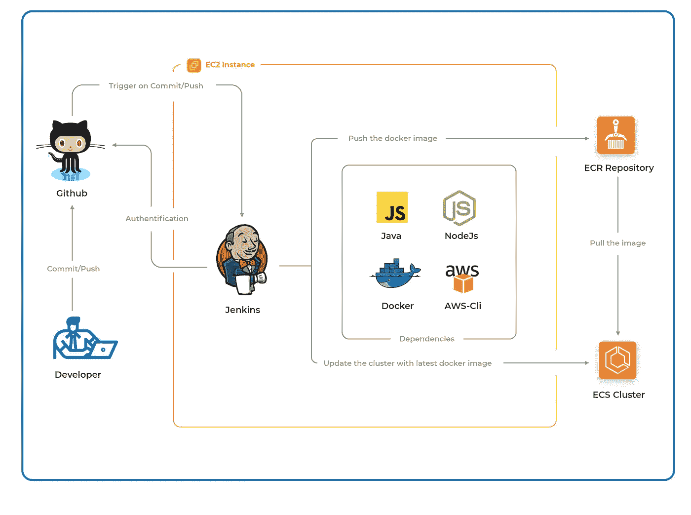

# CI/CD 工作流程和阶段

# 工作流程

CI 和 CD 工作流允许我们专注于开发，同时它以自动化的方式执行测试、构建和部署。

1.  持续集成
    这允许开发人员将代码推送到版本控制系统或源代码管理系统，构建和测试开发人员推送的最新代码，并生成和存储工件。
2.  连续交付
    这是一个让我们在任何需要的时候将经过测试的代码部署到产品中的过程。
3.  连续部署
    这更进了一步，每次生产管道通过所有测试时，无需任何人工干预即可发布每一项变更。

# 阶段

自动化 CI/CD 管道的主要目标是构建最新的代码并进行部署。根据需要可以有不同的阶段。最常见的有以下几种:

1.  触发
    当手动执行或自动触发代码库中的特定操作时，CI/CD 管道可以按照指定的时间表完成工作。
2.  代码拉取
    在这个阶段，每当管道被触发时，管道拉取最新的代码。
3.  单元测试
    在这个阶段，管道执行代码库中的测试，这也被称为单元测试。
4.  构建或打包
    一旦所有测试都通过，流水线就向前移动，并在 docker 化应用的情况下构建工件或 docker 映像。
5.  推送或存储
    在此阶段，如果是 dockerized 应用程序，已经构建的代码将被推送至 artifactory 或 Docker 存储库。
6.  验收测试
    这个阶段或流水线阶段验证软件的行为是否符合预期。这是一种确保软件或应用程序做它应该做的事情的方法。
7.  部署
    这是任何 CI/CD 渠道的最后阶段。在这个阶段，应用程序已经准备好交付或部署。

# 部署策略

部署策略是取下和添加微服务容器的一种方式。有多种选择。但是，我们将只讨论 ECS 提供和支持的功能

# 滚动更新

在滚动更新中，ECS 服务中的计划程序会用新任务替换当前运行的任务。ECS 集群中的任务只不过是根据任务定义创建的运行容器。部署配置控制 Amazon ECS 在服务中添加或删除的任务数量。

应该运行的任务数量的下限和上限分别由`minimumHealthyPercent`和`maximumPercent`控制。

1.  `minimumHealthyPercent`举例:如果`minimumHealthyPercent`的值是 50，期望的任务计数是`4`，那么调度器可以在开始两个新任务之前停止两个现有的任务
2.  `maximumPercent`示例:如果`maximumPercent`的值是`4`并且期望的任务是`4` ，那么调度器可以在停止四个现有任务之前开始四个新任务。

如果你想了解更多，请访问官方文档[这里](https://docs.aws.amazon.com/AmazonECS/latest/developerguide/deployment-type-ecs.html)。

# 蓝色/绿色部署

蓝/绿部署策略使开发人员能够在向新部署发送流量之前，通过安装应用程序的更新版本作为新的替换任务集来验证新部署。

在蓝/绿部署期间，主要有三种流量转移方式。

1.  金丝雀— Traffic 以两个增量移动，在第一个增量中，Traffic 移动到您的更新任务集的百分比，以及在第二个增量中剩余 traffic 移动之前的间隔(以分钟为单位)。
2.  线性-Traffic 以相等的增量移动，traffic 在每个增量中移动的百分比，以及每个增量之间的分钟数。
3.  一次全部-所有 traffic 从原始任务集一次全部转移到更新的任务集。

要了解更多信息，请访问官方文档[这里](https://docs.aws.amazon.com/AmazonECS/latest/developerguide/deployment-type-bluegreen.html)。

在这两种策略之外，我们将在我们的演示应用程序中使用滚动更新部署策略。

# Dockerize Node.js 应用程序

现在，让我们开始动手吧。

示例 Nodejs 应用程序的 docker 文件如下。没有必要复制粘贴这个文件，它已经存在于您之前克隆的示例 git 存储库中。

让我们试着理解一下 docker 文件的说明。

1.  这将是我们容器的基本图像。
2.  `WORKDIR /app`
    这将被设置为容器中的工作目录。
3.  `ENV PATH /app/node_modules/.bin:$PATH`T12【路径】变量被赋予一条路径给`/app/node_modules/.bin`。
4.  `COPY package.json ./`
    将 Package.json 复制到容器的工作目录中。
5.  运行 npm install
    安装依赖项。
6.  `COPY . ./`
    将主机上有依赖关系的文件和文件夹复制到容器中。
7.  `EXPOSE 3000`
    允许到港口 300 的集装箱。
8.  `CMD [“node”, “./src/server.js”]`
    启动应用

这是我们将用来创建 docker 映像的 Docker 文件。

# 设置 GitHub 存储库

# 创建新的存储库

1.  转到[https://github.com/](https://github.com/)，创建一个帐户(如果你还没有的话),否则登录你的帐户并创建一个新的存储库。你可以根据自己的选择来命名；然而，我建议使用相同的名称，以避免任何混淆。

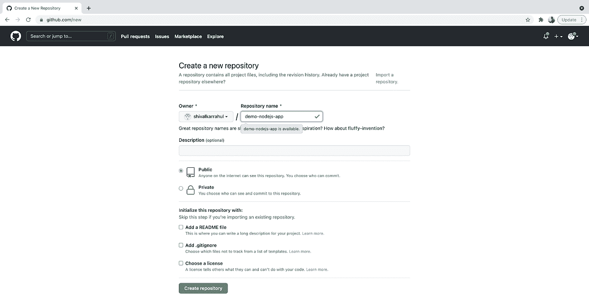

2.您将看到如下屏幕，复制存储库 URL 并保存在手边。将这个 URL 称为 GitHub 存储库 URL，并将其记录在系统的文本文件中。

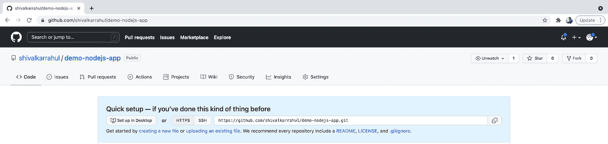

注意:在您的系统上创建一个新的文本文件，并记下稍后需要的所有细节。

# 创建 GitHub 令牌

这是身份验证所必需的。它将用于代替 HTTPs 上 Git 的密码，或者可以用于通过基本身份验证向 API 进行身份验证。

1.  点击右上角的用户图标，进入“设置”，然后点击左侧面板中的“开发者设置”选项。

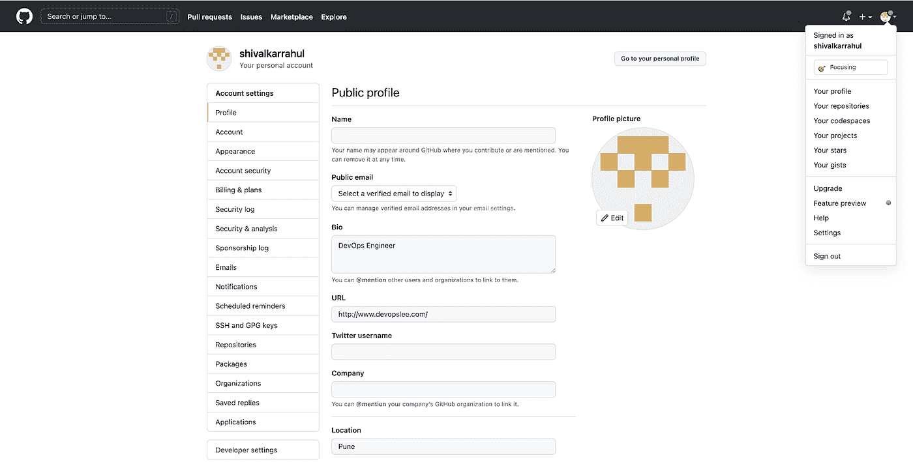

2.单击“个人访问令牌”选项和“生成新令牌”来创建新令牌。

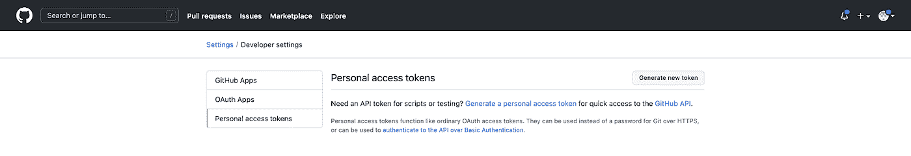

3.勾选“回购”复选框，令牌将“完全控制私有存储库”

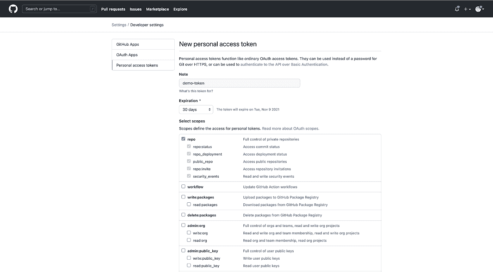

4.现在，您应该看到您的令牌已创建。

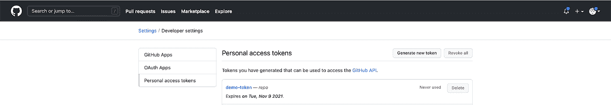

# 克隆示例存储库

1.  检查你现在的工作目录。
    `pwd`

注意:您位于主目录中，即/home/ubuntu。

1.  克隆包含所有必需代码的示例存储库。
    `git clone [https://github.com/shivalkarrahul/nodejs.git](https://github.com/shivalkarrahul/nodejs.git)`
2.  创建新的存储库。此存储库将用于 CI/CD 管道设置。
    `git clone [https://github.com/shivalkarrahul/demo-nodejs-app.git](https://github.com/shivalkarrahul/demo-nodejs-app.git)`
3.  将所有代码从我的 [nodejs](https://github.com/shivalkarrahul/nodejs.git) 仓库复制到新创建的 [demo-nodejs-app](https://github.com/shivalkarrahul/demo-nodejs-app.git) 仓库。
    
4.  更改您的工作目录。
    `cd demo-nodejs-app/`

注意:对于本文的其余部分，不要更改您的目录。留在同一个目录中。就是这里，/home/ubuntu/demo-nodejs-app/，从这里执行所有命令。

1.  `ls -l`
2.  `git status`

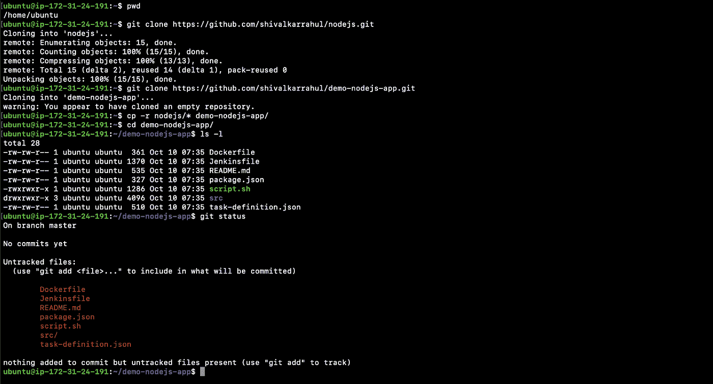

# 将您的第一个提交推送到存储库

1.  检查您当前的工作目录；应该是一样的。在这里，/home/Ubuntu/demo-nodejs-app/
    `pwd`
2.  为 git 提交消息设置用户名。
    `git config user.name “Rahul”`
3.  为您的 git 提交消息设置一个电子邮件。
    `git config user.email “<[test@email.com](mailto:test@email.com)>”`
4.  验证您设置的用户名和电子邮件。
    `git config –list`
5.  检查状态，查看已经更改或添加到 git 存储库中的文件。
    `git status`
6.  将文件添加到 git 临时区域。
    `git add`
7.  检查状态，查看已经添加到 git 临时区域的文件。
    `git status`
8.  用提交消息提交文件。
    `git commit -m “My first commit”`
9.  将提交推送到您的远程 git 存储库。
    `git push`

# 设置 AWS 基础设施

# 创建具有编程访问权限的 IAM 用户

1.  在您的 AWS 帐户中创建一个具有编程访问权限的 IAM 用户，并在文本文件中记下访问密钥和秘密密钥，以供将来参考。向用户提供管理员权限。
    我们不需要管理员权限。但是，为了避免权限问题，也为了演示的方便，让我们从管理员访问开始。

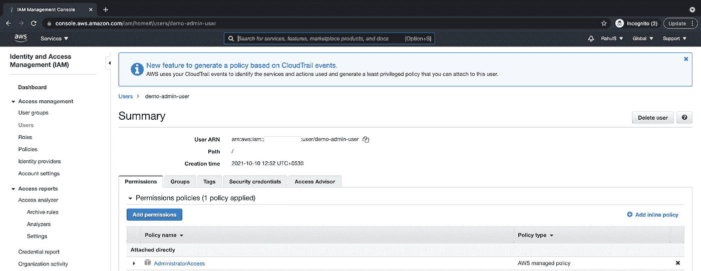

# 创建 ECR 存储库

1.  在您的 AWS 帐户中创建一个 ECR 存储库，并在文本文件中记下它的 URL，以供将来参考。

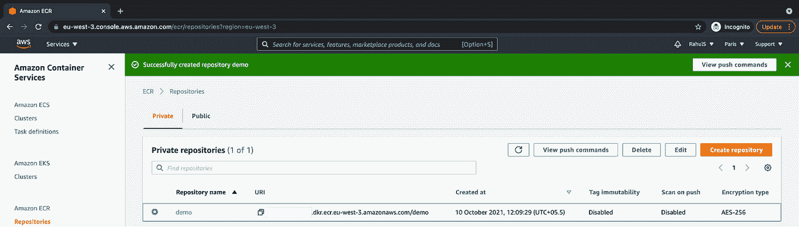

# 创建 ECR 存储库

1.  在您的 AWS 帐户中创建一个 ECR 存储库，并在文本文件中记下它的 URL，以供将来参考。

# 创建 ECS 群集

1.  转到 ECS 控制台，单击“Get Started”创建一个群集。

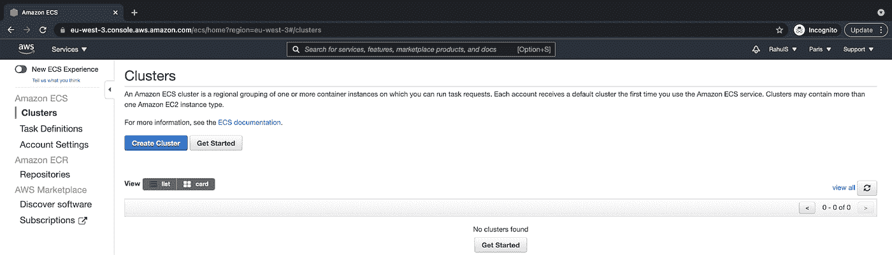

2.单击“容器定义”下“自定义”选项中的“配置”按钮

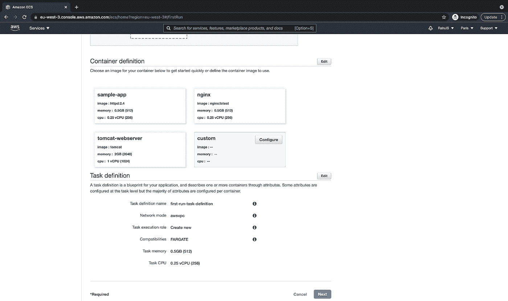

3.将容器的名称指定为"`nodejs-container`，" Image "文本框中的 ECR 储存库 URL，" Port mappings "部分中的" 3000 "端口，然后点击" Update "按钮。您可以为容器指定您选择的任何名称。

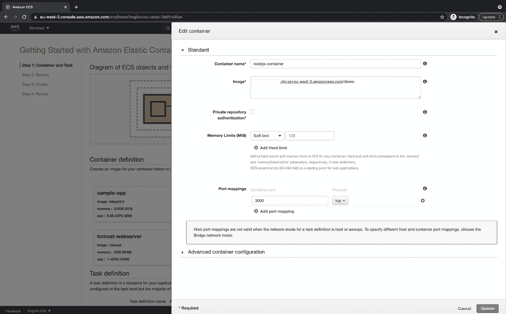

4.现在，您可以看到您在“容器定义”下指定的详细信息单击“下一步”按钮继续。

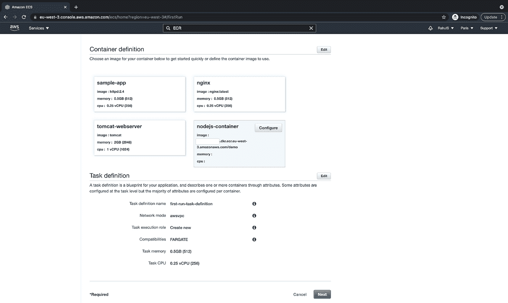

5.选择“定义您的服务”下的“应用程序负载平衡器”,然后单击“下一步”按钮。

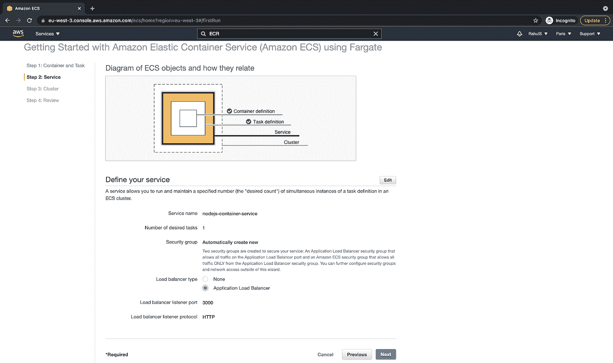

6.将群集名称保留为“默认”,然后单击“Next”按钮继续。如果需要，您可以更改集群名称。

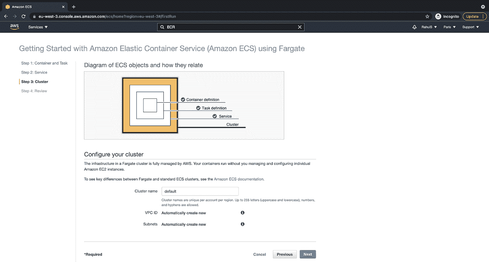

7.查看配置，应该如下所示。如果配置匹配，则单击“创建”按钮。这将启动 ECS 群集创建。

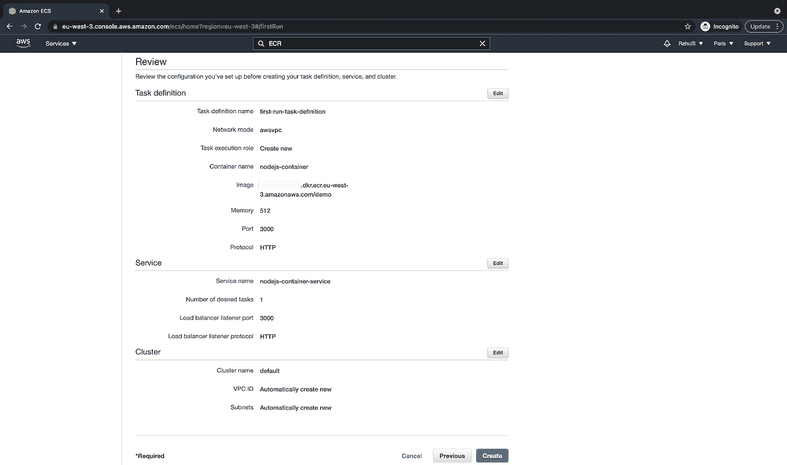

8.几分钟后，您应该已经创建了 ECS 群集，启动状态应该如下所示。

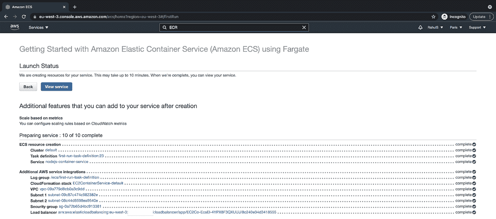

## 创建一个 EC2 实例来设置 Jenkins 服务器

1.  用 Ubuntu 18.04 AMI 创建一个 EC2 实例，在其安全组中为你的 IP 打开它的`Port 22`，为`0.0.0.0/0`打开`Port 8080`。`ssh g\\\\\\\\\\\\\\\\h\`和`8080`需要端口 22 来访问 Jenkins 服务器。`Port 8080`是 GitHub Webhook 试图连接到 Jenkins 服务器的地方，因此我们需要允许它用于`0.0.0.0/0`。

# 在 EC2 实例上设置 Jenkins

在实例可用之后，让我们在其上安装 Jenkins 服务器以及所有的依赖项。

# EC2 实例的先决条件

1.  验证操作系统是否是 Ubuntu 18.04 LTS
    `cat/`
2.  检查内存，最少 2 GB 是我们需要的。
    `free -m`
3.  用于登录服务器的用户应该拥有 sudo 权限。“ubuntu”是对使用“Ubuntu 18.04 LTS”AMI 创建的 EC2 实例具有 sudo 权限的用户。
    `whoami`
4.  检查你现在的工作目录，它将是你的主目录。
    `pwd`

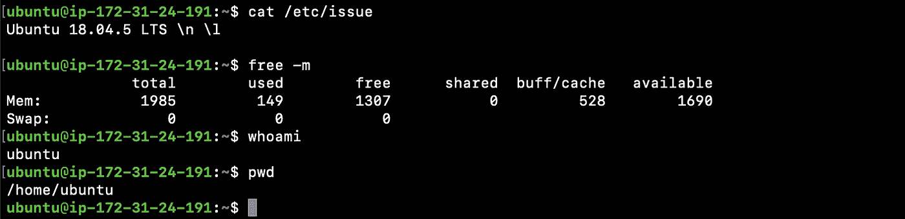

# 在 EC2 实例上安装 Java、JSON 处理器 jq、Nodejs/NPM 和 aws-cli

1.  通过从所有已配置的来源下载软件包信息来更新您的系统。
    `sudo apt update`
2.  搜索安装 Java 11
    `sudo apt search openjdk`
    `sudo apt install openjdk-11-jdk`
3.  安装 jq 命令，JSON 处理器。
    `sudo apt install jq`
4.  安装节点 js 12 和 NPM
    和 
5.  安装 AWS CLI 工具。
    `sudo apt install awscli`
6.  检查 Java 版本。
    `java –version`
7.  检查 jq 版本。
    `jq –version`
8.  检查 Nodejs 版本
    `node –version`
9.  查看 NPM 版
    `npm –version`
10.  检查 AWS CLI 版本
    `aws –version`

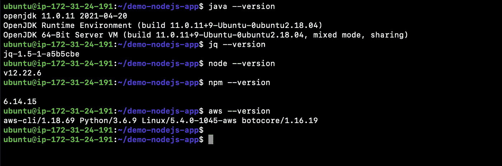

注意:确保您的所有版本都与上图中看到的版本相匹配。

# 在 EC2 实例上安装 Jenkins

1.  Jenkins 可以从 Debian 库
    `wget -q -O — [http://pkg.jenkins-ci.org/debian/jenkins-ci.org.key](http://pkg.jenkins-ci.org/debian/jenkins-ci.org.key) | sudo apt-key add -sudo sh -c ‘echo deb [http://pkg.jenkins-ci.org/debian](http://pkg.jenkins-ci.org/debian) binary/ > /etc/apt/sources.list.d/jenkins.list’`安装
2.  更新 apt 包索引
    `sudo apt-get update`
3.  在机器上安装詹金斯
    `sudo apt-get install jenkins`
4.  检查服务状态是否正在运行。
    `service jenkins status`
5.  你现在应该有你的詹金斯了。如果你在安装过程中遇到任何问题，你可以在这里查阅官方文档[。](https://www.jenkins.io/doc/book/installing/linux/)

# 在 EC2 实例上安装 Docker

1.  安装软件包以允许 apt 通过 HTTPS 使用存储库:
    `sudo apt-get install apt-transport-https ca-certificates curl gnupg lsb-release`
2.  添加 Docker 官方 GPG 键:
    `curl -fsSL [https://download.docker.com/linux/ubuntu/gpg](https://download.docker.com/linux/ubuntu/gpg) | sudo gpg –dearmor -o /usr/share/keyrings/docker-archive-keyring.gpg`
3.  设置稳定资源库
    和`echo “deb [arch=amd64 signed-by=/usr/share/keyrings/docker-archive-keyring.gpg] [https://download.docker.com/linux/ubuntu](https://download.docker.com/linux/ubuntu) $(lsb_release -cs) stable” | sudo tee /etc/apt/sources.list.d/docker.list > /dev/null`
4.  更新 apt 包索引
    `sudo apt-get update`
5.  安装最新版本的 Docker 引擎和 containerd，
    
6.  检查 docker 版本。
    `docker –version`
7.  创建一个“docker”组，这可能会退出。
    `sudo groupadd docker`
8.  将“ubuntu”用户添加到“docker”组
    `sudo usermod -aG docker ubuntu`
9.  将“jenkins”用户添加到“docker”组
    `sudo usermod -aG docker jenkins`
10.  测试你是否能使用“ubuntu”用户创建 docker 对象。
    `docker run hello-world`
11.  切换到【根用户】的
    `sudo -i`
12.  切换到“詹金斯”用户
    `su jenkins`
13.  测试您是否可以使用“jenkins”用户创建 docker 对象。
    `docker run hello-world`
14.  从“詹金斯”用户
    退出`exit`
15.  从【root】用户
    退出`exit`
16.  现在你应该回到“ubuntu”用户了。如果你在安装过程中遇到任何问题，你可以在这里查阅官方文档[。](https://docs.docker.com/engine/install/ubuntu/)

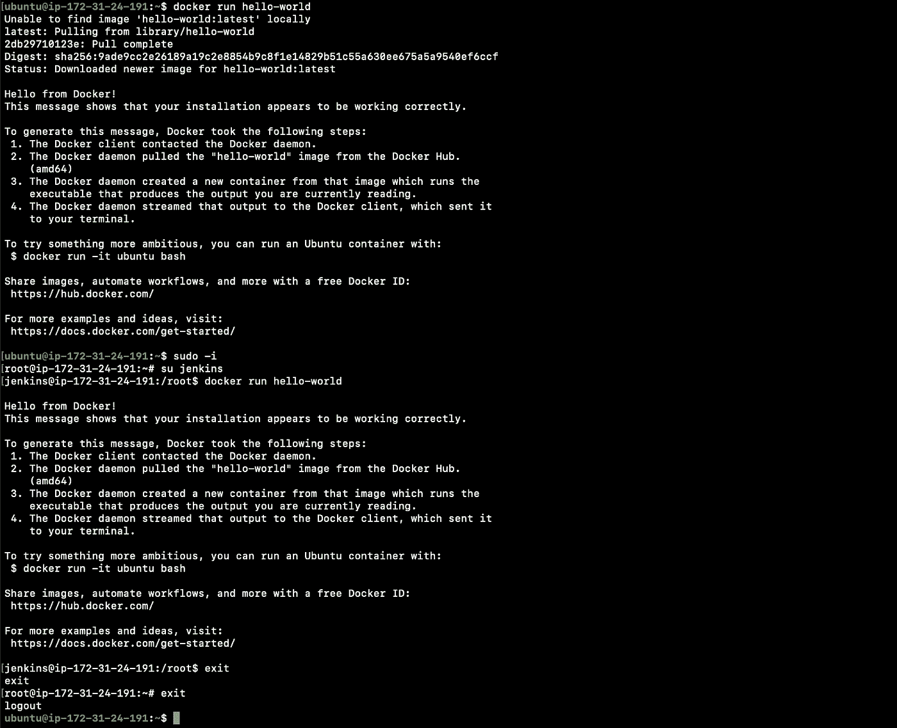

# 配置 Jenkins 服务器

1.  安装完 Jenkins 后，第一步是提取其密码。
    `sudo cat /var/lib/jenkins/secrets/initialAdminPassword`

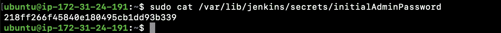

2.在浏览器中点击网址
`Jenkins URL: http://<public-ip-of-the-ec2-instace>:8080`

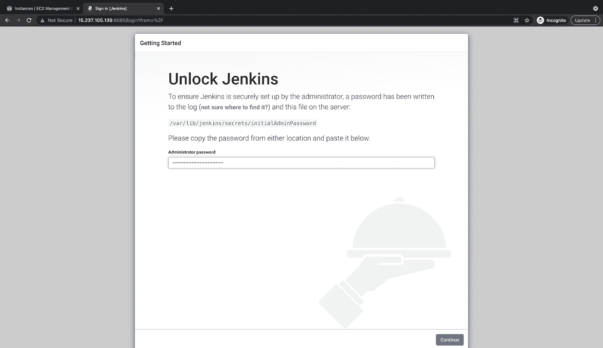

3.选择“安装建议的插件”选项

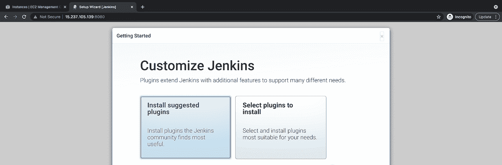

4.为要创建的新管理员用户指定用户名和密码。您可以将该用户用作管理员用户。

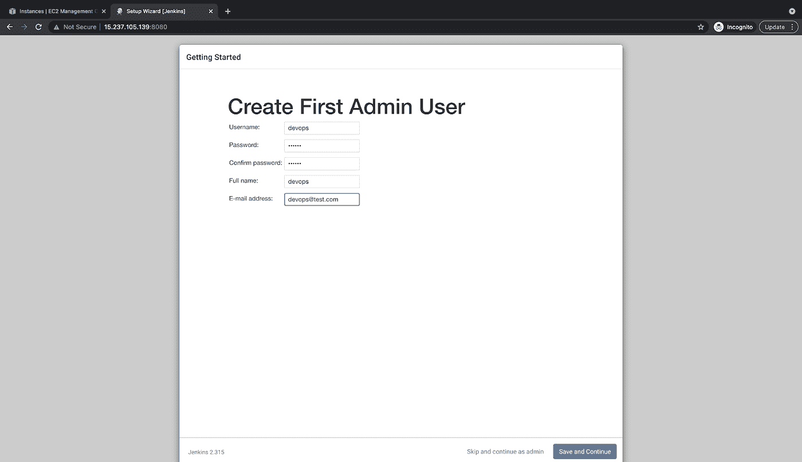

5.此 URL 字段将自动填充，单击“保存并完成”按钮继续。

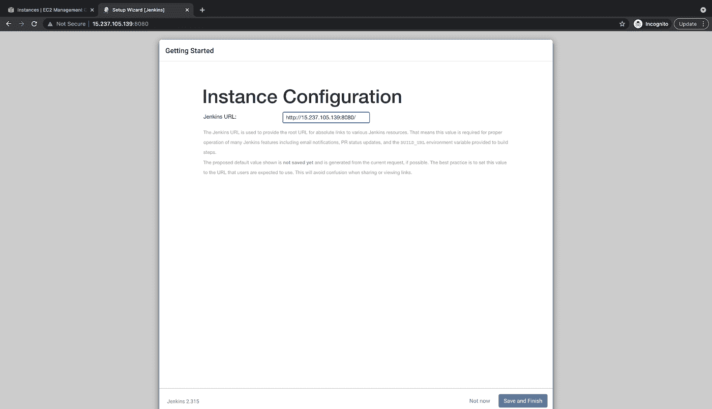

6.你的 Jenkins 服务器已经准备好了。

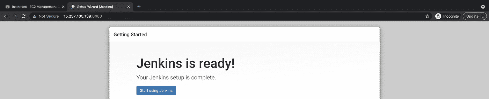

7.这是它的仪表板的样子:

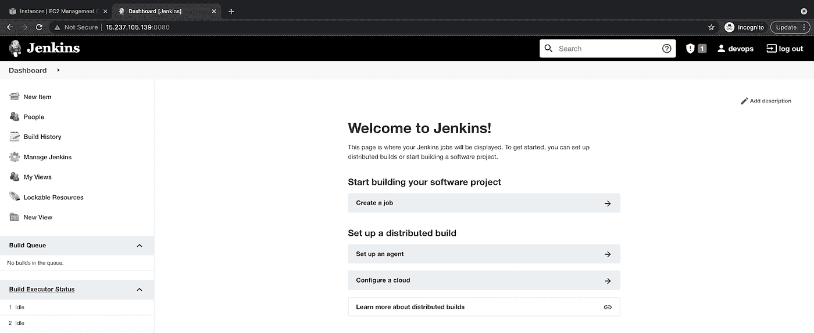

# 安装插件

1.  让我们安装所有我们需要的插件。单击左侧面板中的“管理 Jenkins”。

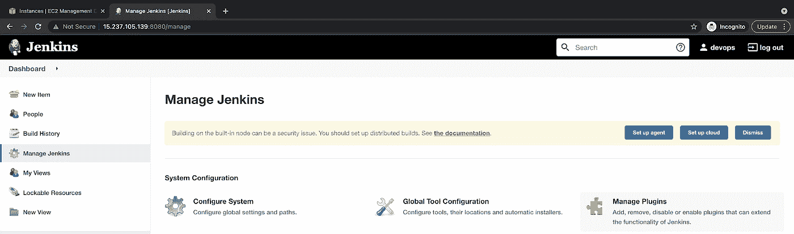

2.这是我们需要安装的插件列表

1.  [CloudBees AWS 凭证](https://plugins.jenkins.io/aws-credentials/) :
    允许存储 Amazon IAM 凭证，即 Jenkins 凭证 API 中的密钥。
2.  [Docker Pipeline](https://plugins.jenkins.io/docker-workflow) :
    这个插件允许构建、测试和使用来自 Jenkins Pipeline 的 Docker 映像。
3.  [亚马逊 ECR](https://plugins.jenkins.io/amazon-ecr) :
    该插件提供了与 AWS 弹性容器注册中心(ECR)
    的集成用法:
4.  [AWS 步骤](https://plugins.jenkins.io/pipeline-aws/) :
    该插件添加了 Jenkins 管道步骤，以与 AWS API 进行交互。

3.在“可用”标签中，搜索所有这些插件，然后点击“无需重启即可安装”

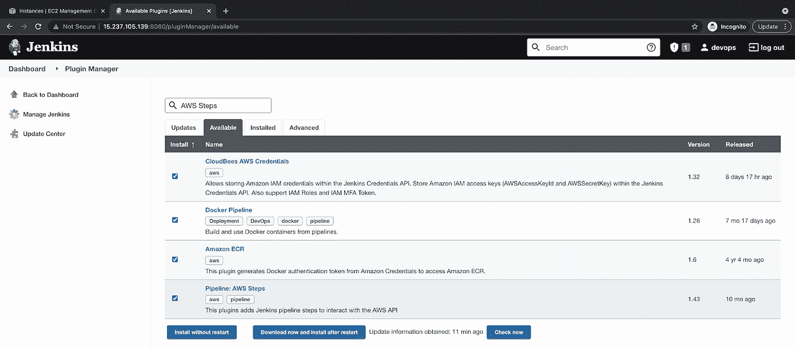

4.插件成功安装后，您将看到如下屏幕。

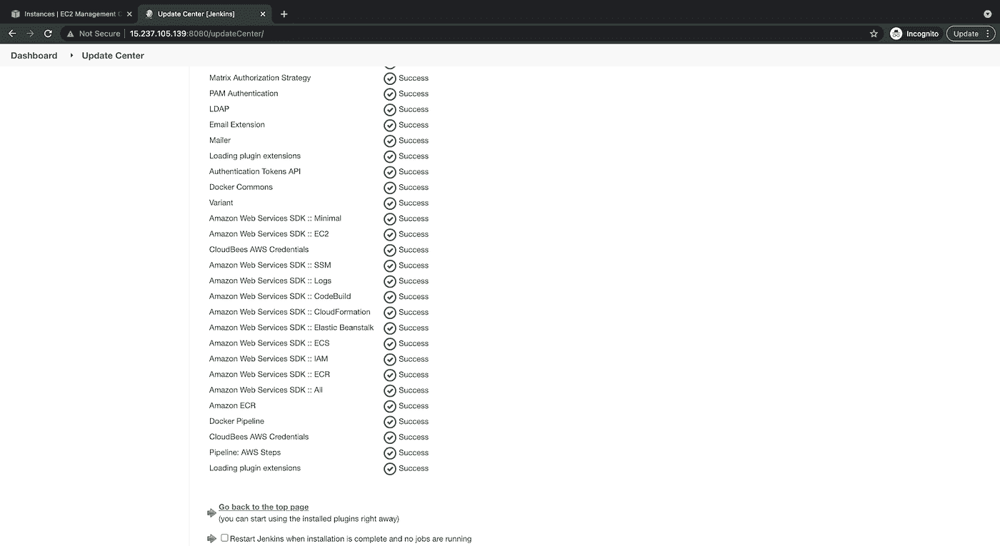

# 在 Jenkins 中创建凭证

1.  [CloudBees AWS 凭据](https://plugins.jenkins.io/aws-credentials/)插件将在此提供帮助。转到“管理 Jenkins”，然后点击“管理凭据”

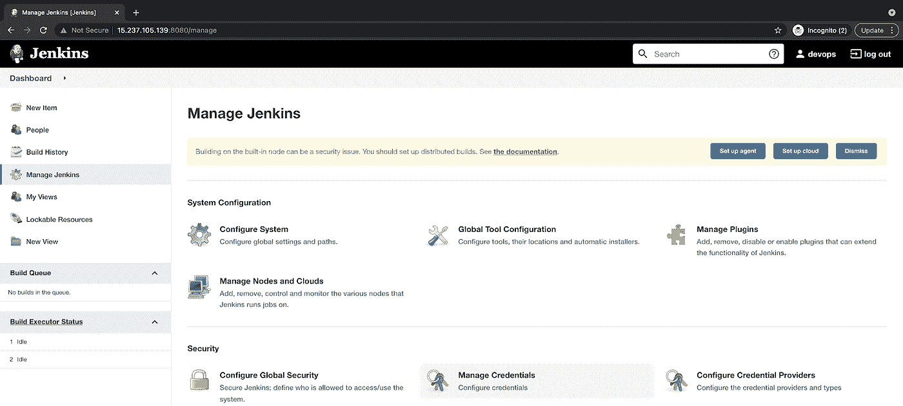

2.点击“(全球)。”"添加凭据。"

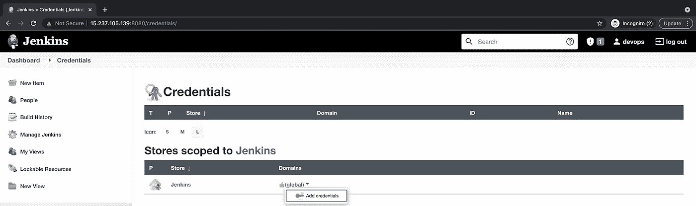

3.选择种类作为“AWS 凭证”，并提供 ID 作为“演示-管理-用户”。这可以根据您的选择来提供，在文本文件中记下这个 ID。指定我们在前面步骤中创建的 IAM 用户的访问密钥和秘密密钥。

单击“确定”以存储 IAM 凭据。

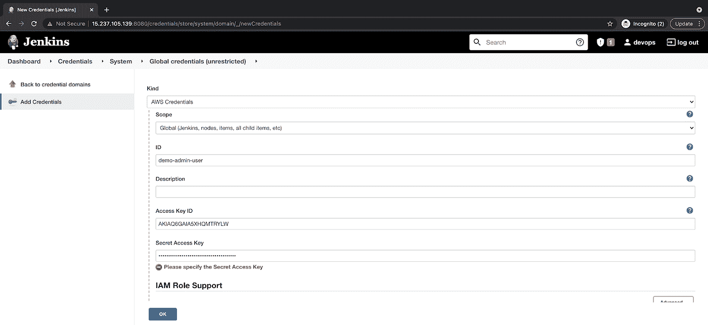

4.遵循相同的步骤，这次选择“带密码的用户名”来存储我们之前创建的 GitHub 用户名和令牌。

点击“确定”保存 GitHub 凭证。

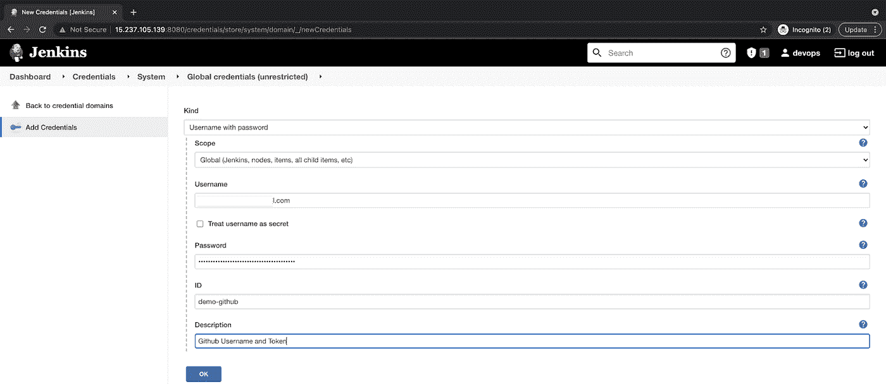

5.现在，您的 Jenkins 中应该有 IAM 和 GitHub 凭据了。

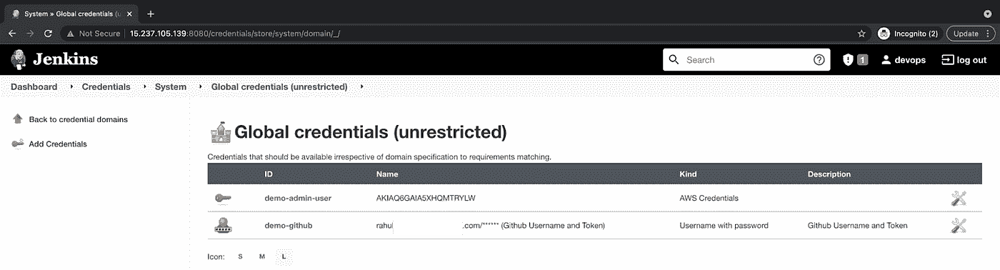

# 创建 Jenkins 作业

1.  转到主仪表板，点击“新项目”创建一个詹金斯管道。

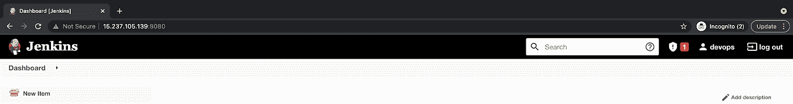

2.选择“Pipeline”并将其命名为“demo-job ”,或者提供您选择的名称。

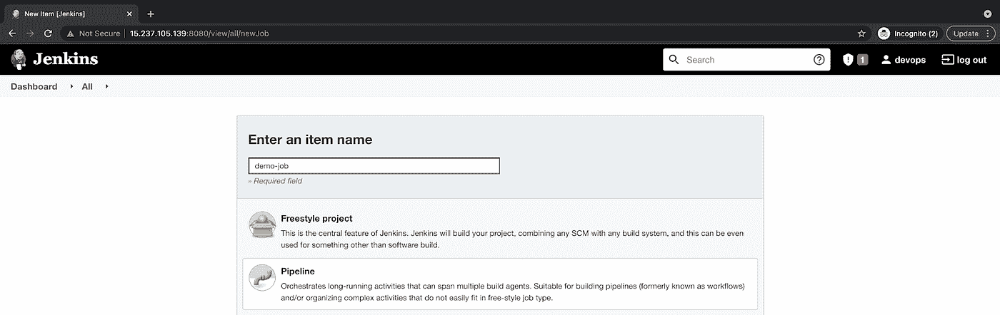

3.勾选“常规”选项卡下的“GitHub 项目”复选框，提供我们之前创建的 GitHub 资源库的 URL。另外，勾选“构建触发器”标签下的“GitHub hook Trigger for GitScm polling”复选框。

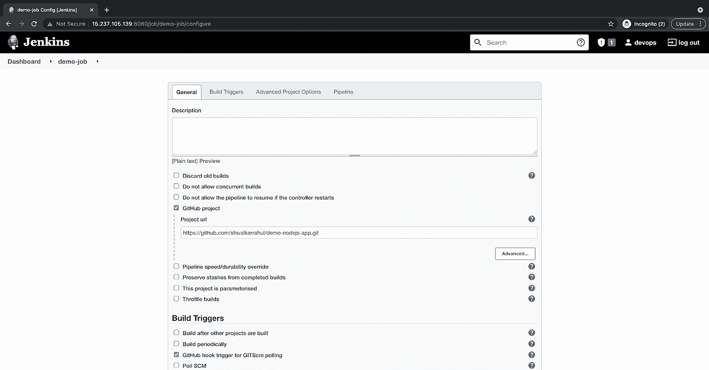

4.在“Pipeline”选项卡下，选择“来自 SCM 的管道脚本”定义，指定我们的存储库 URL，并选择我们为 GitHub 创建的凭证。检查分支名称是否与您将用于提交的名称匹配。

查看配置并单击“保存”以保存您对管道的更改。

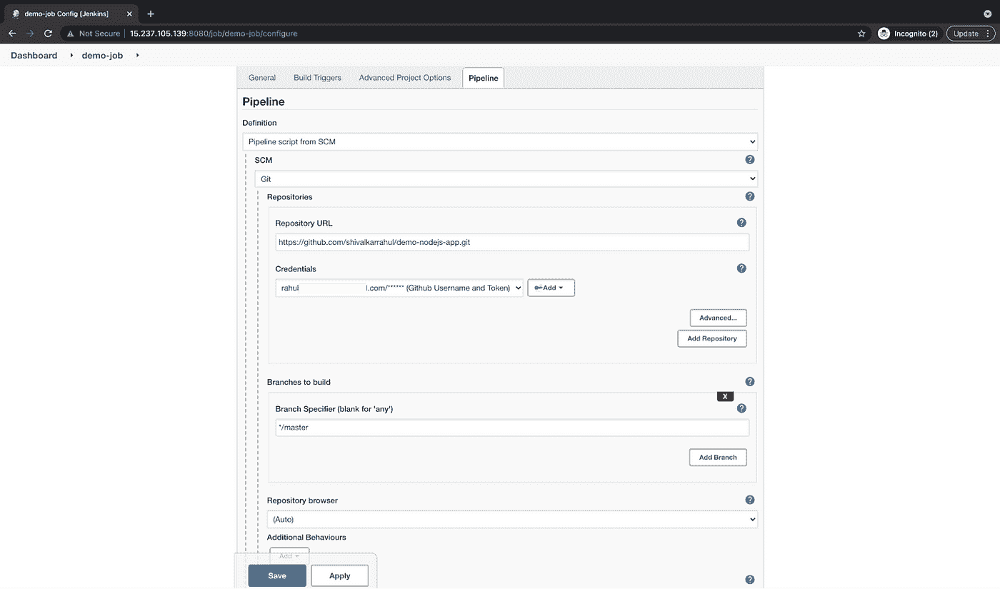

5.现在，您可以看到我们刚刚创建的管道。

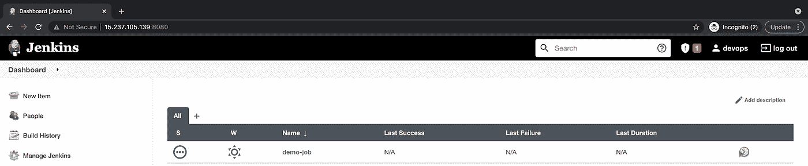

# 集成 GitHub 和 Jenkins

下一步是将 GitHub 与 Jenkins 集成，这样每当 GitHub 存储库上有事件时，它就可以触发 Jenkins 作业。

1.  转到存储库的 settings 标签，点击左边面板中的“Webhooks”。你可以看到“添加网页挂钩”按钮，点击它创建一个网页挂钩。

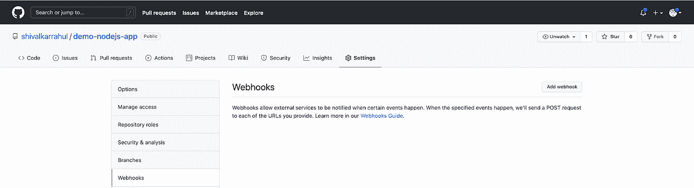

2.提供带有上下文的 Jenkins URL，如“/github-webhook/”。该 URL 将如下所示。

web hook URL:http://<jenkins-ip>:8080/github-web hook/
您可以选择自己喜欢的事件。然而，为了简单起见，我选择了“把所有东西都发给我”</jenkins-ip>

确保选中“活动”复选框。

点击“Add webhook”创建一个 webhook，每当 GitHub 存储库中有任何类型的事件时，它都会触发 Jenkins 作业。

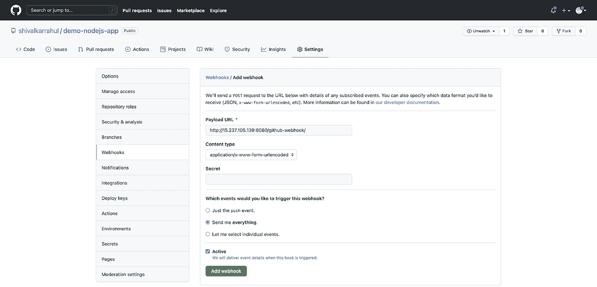

3.你应该看看你的网钩。单击它以查看它是否已被正确配置。

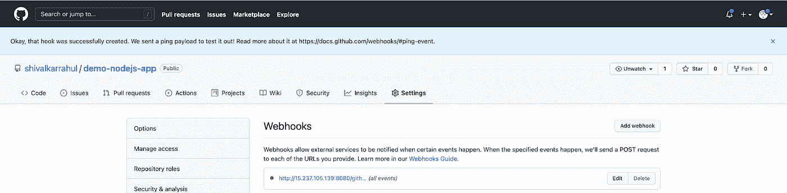

4.点击“最近交付”标签，你应该会看到一个绿色的勾号。绿色勾号表示 webhook 能够连接到 Jenkins 服务器。

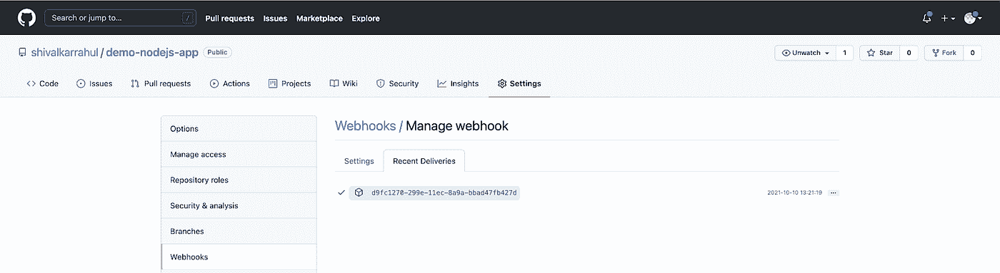

# 将 Nodejs 应用程序部署到 ECS 集群

在我们从 GitHub Webhook 触发管道之前。让我们尝试手动执行它。

# 手动构建作业

1.  转到我们创建的作业并构建它。

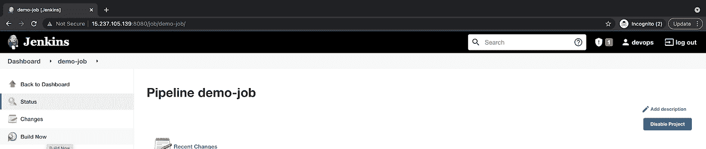

2.如果您查看它的日志，您会发现它失败了。原因是，我们还没有给 Jenkinsfile 中的变量赋值。

# 推动您的第二次提交

提醒:在本文的其余部分，不要更改您的目录。呆在同一个目录下，即/home/ubuntu/demo-nodejs-app，从这里执行所有命令。

## 为 Jenkinsfile 中的变量赋值

1.  为了克服上述错误，您需要对 Jenkinsfile 进行一些更改。该文件中有变量，我们需要为这些变量赋值，以便将我们的应用程序部署到我们创建的 ECS 集群中。将正确的值赋给具有“CHANGE_ME”的变量
    卡特彼勒詹金斯文件

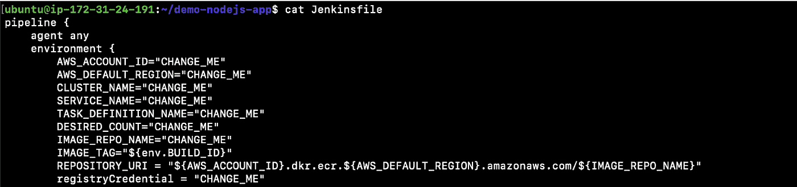

2.为了方便起见，这里列出了一些变量。
我们在 Jenkinsfile 中有以下变量。

1.  `AWS_ACCOUNT_ID=”CHANGE_ME”`
    在此分配您的 AWS 账号。
2.  `AWS_DEFAULT_REGION=”CHANGE_ME”`
    分配您创建 ECS 集群的区域
3.  `CLUSTER_NAME=”CHANGE_ME”`
    指定您创建的 ECS 集群的名称。
4.  `SERVICE_NAME=”CHANGE_ME”`
    分配在 ECS 集群中创建的服务名。
5.  `TASK_DEFINITION_NAME=”CHANGE_ME”`
    分配在 ECS 集群中创建的任务名称。
6.  `DESIRED_COUNT=”CHANGE_ME”`
    分配您想要在 ECS 集群中创建的任务数量。
7.  `IMAGE_REPO_NAME=”CHANGE_ME”`
    分配 ECR 存储库 URL
8.  `IMAGE_TAG=”${env.BUILD_ID}”`
    不改此道。
9.  `REPOSITORY_URI = “${AWS_ACCOUNT_ID}.dkr.ecr.${AWS_DEFAULT_REGION}.amazonaws.com/${IMAGE_REPO_NAME}”`
    不改变这一点。
10.  `registryCredential = “CHANGE_ME”`
    指定您在 Jenkins 中创建的凭证的名称，以存储 AWS 访问密钥和秘密密钥

3.检查状态以确认文件已被更改。
`git status`
`cat Jenkinsfile`

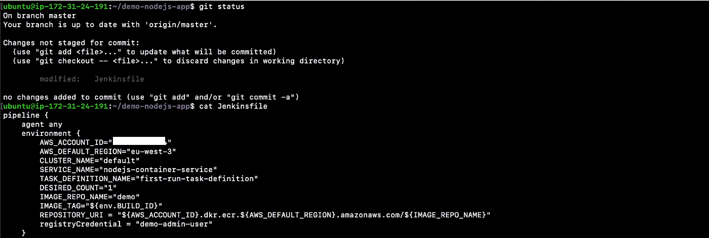

4.向 git staging 区域添加一个文件，提交它，然后将其推送到远程 GitHub 存储库。
`git status`
`git add Jenkinsfile`
`git commit -m “Assigned environment specific values in Jenkinsfile”`

# Jenkins 服务器出错

在提交之后，Jenkins 管道将被触发。

但是，在您的 Jenkins 作业中，您将会看到一个错误“*在尝试连接到 UNIX:///var/run/Docker . sock*的 Docker 守护进程套接字时权限被拒绝”。

原因是 jenkins 作业使用的“Jenkins”用户不允许创建 docker 对象。为了向“jenkins”用户授予权限，我们在上一步中将其添加到了“docker”组中。但是，之后我们并没有重启 Jenkins 服务。

我特意保留了这一点，以便向您展示将“jenkins”用户添加到 EC2 实例中的“docker”组的必要性。

现在你知道需要做什么来克服上述错误。

1.  重新启动 Jenkins 服务。
    `sudo service jenkins restart`
2.  检查 Jenkins 服务是否已经启动。
    `sudo service jenkins status`

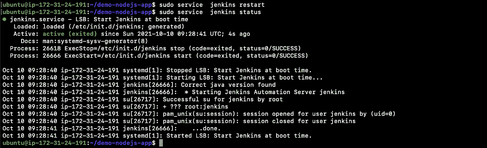

# 推动你的第三次提交

1.  在 README.md 中做一些修改，以提交、推送和测试管道是否被自动触发。
    `vim README.md`
2.  添加、提交和推送文件。
    `git status`
    `git diff README.md`
    `git add README.md`
    `git commit -m`“修改 README.md 重新启动 Jenkins 服务后触发 Jenkins 作业”
    `git push`

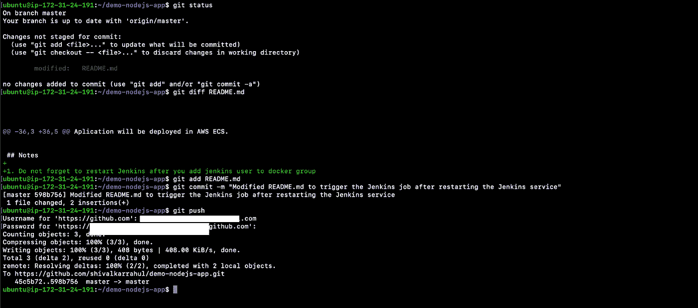

3.这一次，您可以观察到作业一定是自动触发的。去詹金斯工作，并验证相同的。

4.这就是舞台视图的样子。它显示了我们在 Jenkinsfile 中指定的阶段。

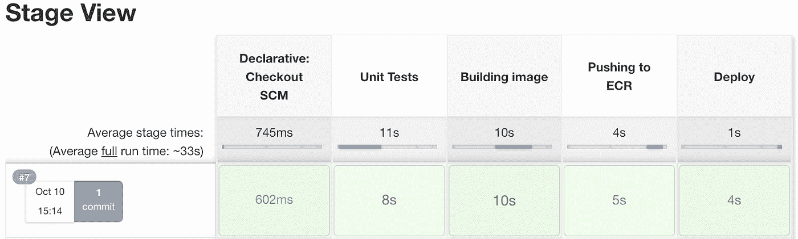

# 检查 ECS 群集中任务的状态

1.  转到集群，点击“任务”选项卡，然后打开正在运行的“任务”

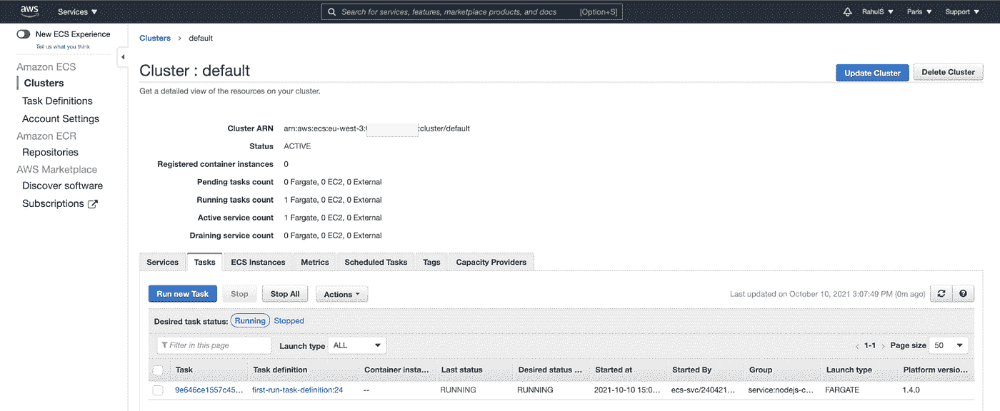

2.单击“JSON”选项卡并验证图像，图像标签应该与 Jenkins 版本号匹配。在这种情况下，它是“6 ”,与我的 Jenkins 职务构建号相匹配。

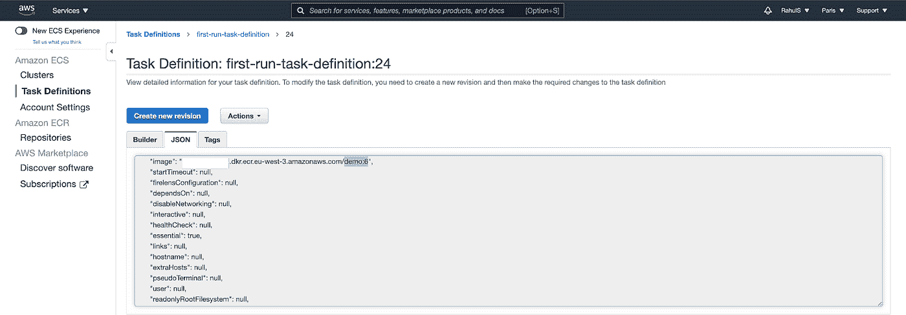

3.点击 ELB URL 检查 Nodejs 应用程序是否可用。点击 ELB 网址后，您应该会在浏览器中看到如下消息。

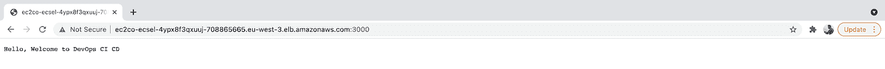

# 推动你的第四次提交

1.  打开"`rc/server.js`文件并在显示消息中进行一些更改，以再次测试 CI/CD 管道。
    `vim src/server.js`
2.  检查已更改的文件。在这种情况下，只能看到一个文件被更改。
    `git status`
3.  检查您的更改在文件中造成的差异。
    `git diff src/server.js`
4.  将您更改的文件添加到 git 临时区域。
    `git add src/server.js`
5.  检查本地存储库的状态。
    
6.  向提交添加消息。
    `git commit -m`【更新欢迎词】
7.  将您的更改推送到远程存储库。
    

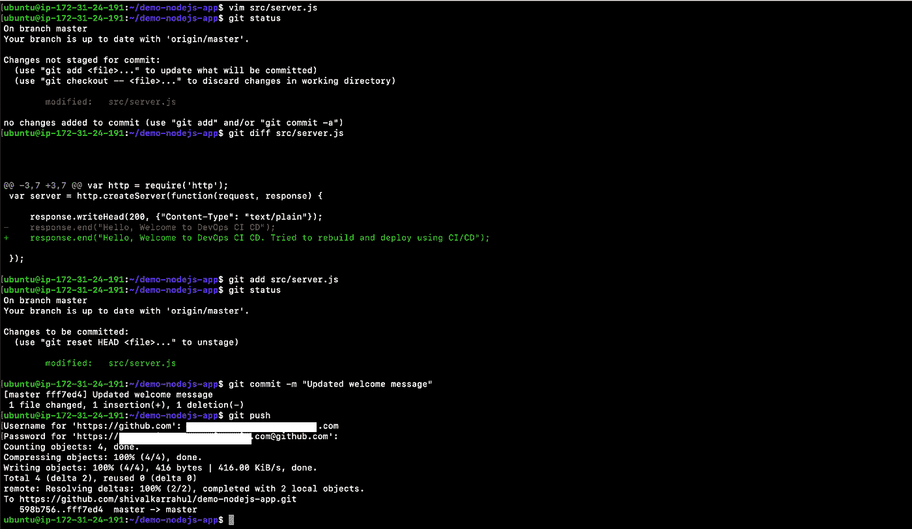

8.转到任务，这次您将看到两个任务正在运行。一个版本较旧，一个版本较新。由于集群中默认配置的滚动更新部署策略，您会看到两个任务。

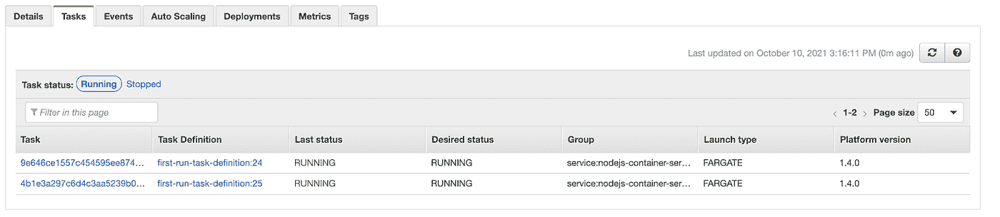

注意:您的修订号可能会有所不同。

9.等待大约 2-3 分钟，您应该只能运行一个带有最新版本的任务。

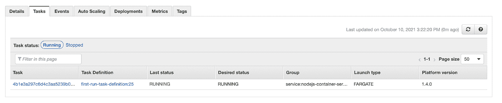

10.再次，点击 ELB 的网址，你应该会看到你的变化。在这种情况下，我们更改了显示消息。

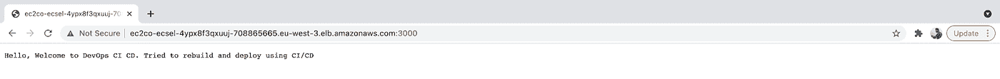

恭喜你！每当您的源代码发生变化时，您都可以使用 Jenkins CI/CD 管道在 AWS ECS 上部署 Nodejs 容器化应用程序。

# 清理我们创建的资源

如果您只是尝试建立 CI/CD 管道以熟悉它，或者出于 POC 目的而在您的组织中不再需要它，最好删除您在执行 POC 时创建的资源。作为 CI/CD 渠道的一部分，我们创建了一些资源。

我们创建了以下列表来帮助您删除它们:

1.  删除 GitHub 存储库
2.  删除 GitHub 令牌
3.  删除 IAM 用户
4.  删除 EC2 实例
5.  删除 ECR 存储库
6.  删除 ECS 集群
7.  取消注册任务定义

# 摘要

最后，这里总结了使用 Jenkins 设置 CI/CD Docker 管道以在 AWS ECS 上部署示例 Nodejs 应用程序需要做的工作。

1.  克隆现有的示例 GitHub 存储库
2.  创建一个新的 GitHub 存储库，并将示例存储库中的代码复制到其中
3.  创建 GitHub 令牌
4.  创建 IAM 用户
5.  创建 ECR 存储库
6.  创建 ECS 群集
7.  创建一个 EC2 实例来设置 Jenkins 服务器
8.  在 EC2 实例上安装 Java、JSON 处理器 jq、Nodejs 和 NPM
9.  在 EC2 实例上安装 Jenkins
10.  在 EC2 实例上安装 Docker
11.  安装插件
12.  在 Jenkins 中创建凭证
13.  创建 Jenkins 作业
14.  集成 GitHub 和 Jenkins
15.  检查部署
16.  清理资源

# 结论

CI/CD 管道是自动化软件应用程序的构建、测试和部署的一种方式。它是任何具有 DevOps 文化的组织的支柱。它对软件开发有许多好处，并极大地促进了您的业务。

在本文中，我们演示了创建 Jenkins CI/CD Docker 管道的步骤，以便在 AWS ECS 上部署一个示例 Nodejs 容器化应用程序。我们看到了如何使用 GitHub Webhooks 在每次推送到存储库时触发 Jenkins 管道，进而将最新的 docker 映像部署到 AWS ECS。

Docker 的 CI/CD 管道最适合您的组织来提高代码质量和快速交付软件版本，而没有任何人为错误。

我们希望这篇文章能帮助您更多地了解 CI/CD Docker 管道的组成部分。

*原帖:*【https://www.clickittech.com/devops/ci-cd-docker/?】*UTM _ source = ci+CD+docker&UTM _ id = Blogs+medium*