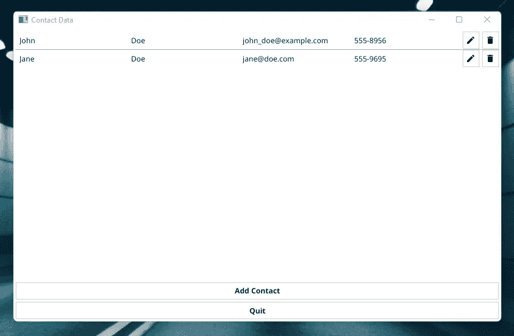
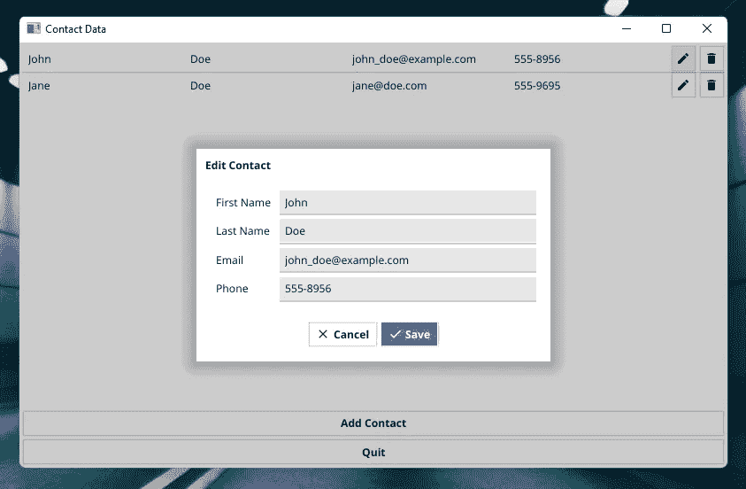
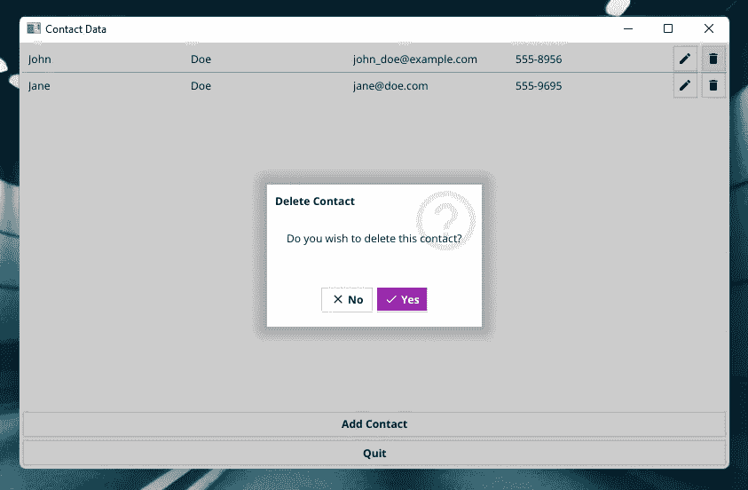
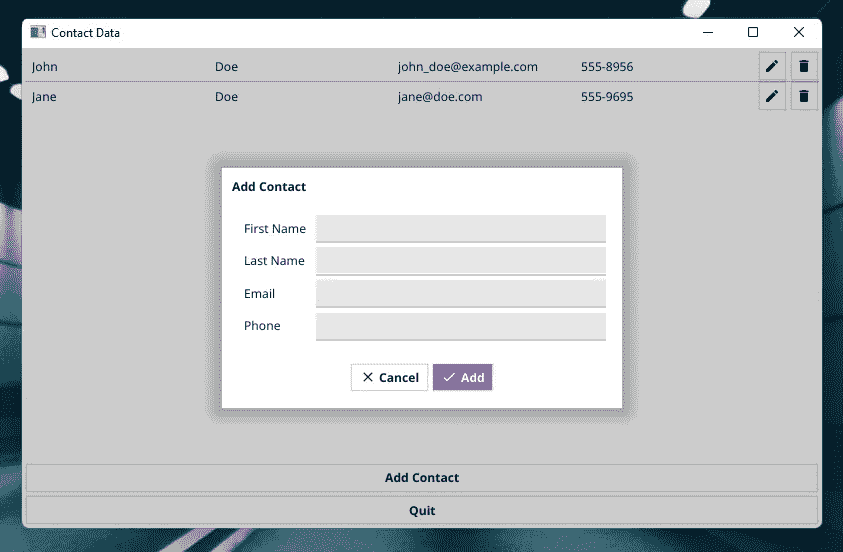

# 如何使用 Golang、Fyne 和 MongoDB 创建 CRUD 桌面应用程序

> 原文：<https://betterprogramming.pub/how-to-create-a-crud-desktop-app-with-golang-fyne-and-mongodb-35c54c37291>

## 下面的例子展示了如何使用 Go 语言、Fyne GUI 工具包和 MongoDB 数据库服务器创建一个能够进行 CRUD 操作的数据输入桌面应用程序。

照片由[叶小开·克里斯托夫·古特瓦尔德](https://unsplash.com/@project2204?utm_source=medium&utm_medium=referral)在 [Unsplash](https://unsplash.com?utm_source=medium&utm_medium=referral) 上拍摄

在本文中，我将向您展示如何创建一个小的桌面应用程序，您可以在其中输入、查看、更新和删除联系信息。我将用 Go 语言(Golang)编写这个应用程序，并使用 Fyne GUI 工具包来创建用户界面。联系信息将存储在 MongoDB 数据库集合中。

此外，本文是我之前关于 [Fyne](/how-to-create-a-simple-data-entry-desktop-app-with-golang-and-fyne-7c9e543d71e) 和 [MongoDB](/how-to-use-golang-with-mongodb-26f043d31d23) 的文章的延续。你会看到那些文章中描述的概念和一些新的想法。如果您在理解本文的概念时遇到困难，那么您可能想先阅读前面的内容。

这些文章是我基于对 Go 语言的研究得出的结论。

# 先决条件

确保您已经为 Go 安装了 Fyne 包和 MongoDB 驱动程序。要构建使用 Fyne 的 Go 程序，还需要安装 GCC。此外，您需要安装 MongoDB 服务器。

我还发现安装 *MongoDB Compass* 应用程序有助于故障排除。

# 基本结构

我们需要一个数据结构来表示我们希望保存在桌面应用程序中的联系人。

这本质上是一个普通的结构，但是增加了对 BSON 的注释。BSON 是 MongoDB 使用的 JSON 的二进制版本。你可以在这里阅读更多关于使用带有 BSON 注释的结构的信息[。](/how-to-use-golang-structs-with-mongodb-f1772e4a1da3)

在第 2 行中，我们创建了一个名为`ID`的特殊属性，当我们创建一个文档并将其插入到一个集合中时，它将保存 MongoDB 给出的惟一标识符`_id`。因此，我们在 BSON 注释中添加了这个键。我们也向`ID`酒店提供了`primitive.ObjectID`型。这是为 MongoDB 标识符定义的特殊类型。

有关 BSON 使用的更多信息，请阅读此处的。

# CRUD 函数

鉴于至少有一个 CRUD 函数需要被多次调用，我决定在`main()`程序函数之外的单独函数中实现它们。此外，这将使将来重组程序变得更加容易。

首先，我们将上下文和 MongoDB 联系人集合“打包”成一个名为`ContactCollection`的数据结构。使用`NewContactCollection()`构造函数可以很容易地创建这个结构。

然后，我们实现 4 个 CRUD 函数:

*   创建由`CreateContact()`实现
*   阅读是由`GetAll()`实现的
*   更新由`UpdateContact()`执行
*   删除由`DeleteContact()`执行

这些函数使用 context 和 contact 集合，这就是我们将它们打包在 struct 中的原因。

# 构建 Fyne GUI

下面你可以找到`main()`函数的骨架。

上面的代码片段中省略了一些部分；你可以在下面的小标题下找到它们。

实际上，上面的代码在屏幕中央创建了一个大小为 1000 像素宽、600 像素高的 Fyne 窗口。此窗口被设置为主窗口。这意味着当此窗口关闭时，所有其他窗口也将关闭。在本例中，这实际上不太重要，因为没有其他窗口。

此外，根据各种布局功能设置窗口的内容。你可以在下面找到结果窗口的截图。

注意，在上面的截图中，添加了两个联系人。

## 设置 MongoDB 客户机、集合并获取所有文档。

在第 3–9 行，我们用`context.TODO()`创建了一个基本的上下文，并连接到运行在`localhost:27017`上的 MongoDB 服务器。

在第 10–12 行，我们 ping 数据库服务器以确保我们已经建立了连接。

在第 13 行，与数据库的断开被推迟。这意味着 disconnect 语句将在`main()`函数的所有其他语句之后执行。

在第 17 行，我们连接到数据库`contactdb`中的`contacts`集合。如果这些不存在，那么它们将被创建。

在第 18 行，使用名为`NewContactCollection()`的函数创建了一个`ContactCollection`结构。这个名为`cc`的结构将保存上下文和指向集合的链接，如前一标题下所述。

在第 20 行，我们使用`GetAll()`函数从数据库集合中获取所有联系人。这些联系人保存在第 1 行定义的名为`loadedData`的片段中。

## 实现列表小部件

在上面的代码片段中，`list`小部件是使用`NewList()`函数创建的。如果你不熟悉 Fyne 的`list`小部件，你可以快速浏览一下[文档](https://developer.fyne.io/api/v2.1/widget/list.html)。

在第 2 行，我们向函数提供第一个参数。该参数是`loadedData`切片的长度。本质上，这是数据库中联系人的数量。

在第 3–13 行，我们在`list`小部件中创建了每一行的布局。这样的一行包含以下图形元素(小部件):

*   特定联系人的名字*的*标签**
*   特定联系人的*姓氏*的*标签*
*   特定联系人的*电子邮件地址*的*标签*
*   特定联系人的*电话号码*的*标签*
*   一个*按钮*用于*编辑*一个特定的触点
*   一个*按钮*用于*删除*一个特定的联系人

使用`NewHBox()`、`NewGridWithColumns()`和`NewBorder()`将这些元素添加到`CanvasObject`中，这取决于我们希望它们放置的位置。点击阅读更多关于布局[的信息。](https://developer.fyne.io/api/v2.1/layout/)

在第 14–105 行，从`loadedData`切片中提取给定联系人的数据(基于`ListItemID`)并输入到前面几行中设置的图形元素中。

在第 17-26 行，从`CanvasObject`中检索实际的图形元素。

在第 28 行，我们得到了当前联系人的 ID。

在第 30–33 行，标签的文本属性是用当前联系人的数据设置的。

在第 35–78 行，我们实现了编辑按钮的功能。当编辑按钮被点击时，一个对话框被打开。此对话框包含一个表单，其中的字段已填充了联系人的现有数据。

当您点击对话框上的“保存”按钮时，新数据被保存到一个名为`contact`的`Contact`结构中。`contact`被发送给`UpdateContact()`函数，它确保数据库得到更新。

此后，使用`GetAll()`更新`loadedData`，并刷新`list`小部件。

下面，你可以看到对话框的截图。

在第 80–103 行，我们实现了删除按钮的功能。单击“删除”按钮时，会打开一个对话框。此对话框包含问题“是否要删除此联系人？”。

现在您可以单击“是”或“否”，如果您单击“是”，当前联系人将被删除。`contactID`被发送到`DeleteContact()`函数，该函数从数据库中删除联系人。

最后，使用`GetAll()`更新`loadedData`，并刷新`list`小部件。

下面，你可以看到一个运行中的删除对话框的截图。

## 实现“添加联系人”按钮

“添加联系人”按钮的功能几乎类似于“编辑”按钮。

当我们点击“添加联系人”按钮时，会打开一个对话框。此对话框包含一个表单，其中包含联系人的四个属性的空字段。

当点击对话框上的“添加”按钮时，新数据被保存到名为`c`的`Contact`结构中。联系人被发送到`CreateContact()`函数，该函数确保联系人`c`被添加到数据库中。

再次使用`GetAll()`更新`loadedData`并刷新`list`小部件。

下面，你可以看到这个对话框的截图。

# 完整的代码

# 评论和进一步的工作

在这个例子中，所有的代码都放在一个文件中。对于生产代码，这不是推荐的编码实践。

CRUD 函数可以为不同的数据库服务器和 JSON 或 YAML 文件实现。

本文中的代码可以构成 CRM 系统的基础。

# 参考

*   [“使用 Gin-Gonic Web 框架创建 Golang REST API&MongoDB”作者 DevProblems](https://youtu.be/vDIAwtGU9LE)
*   [“Fyne 开发者工具包文档”，Fyne](https://developer.fyne.io/index.html)
*   [“如何配合 MongoDB 使用 Go”](/how-to-use-golang-with-mongodb-26f043d31d23)
*   [“如何在 MongoDB 中使用 Golang 结构”](/how-to-use-golang-structs-with-mongodb-f1772e4a1da3)
*   [“如何用 Golang 和 Fyne 创建一个简单的数据录入桌面 App”](/how-to-create-a-simple-data-entry-desktop-app-with-golang-and-fyne-7c9e543d71e)