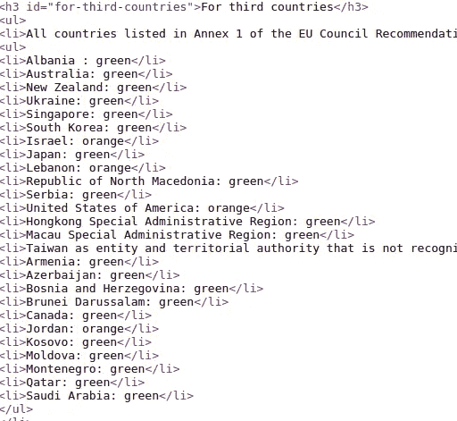
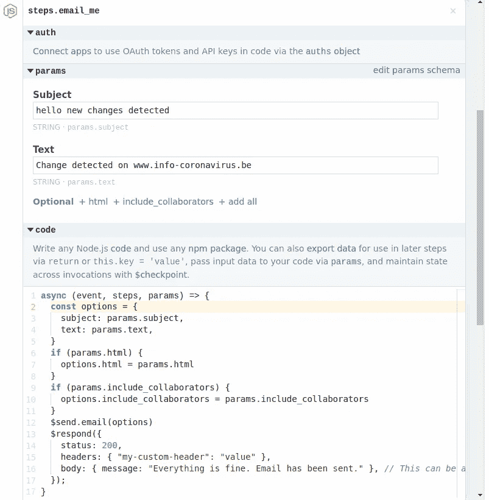
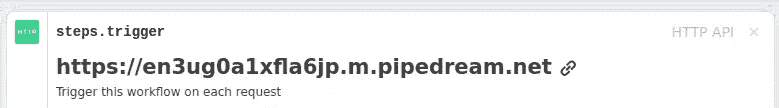

# 如何用 Python 创建自定义页面爬虫

> 原文：<https://betterprogramming.pub/how-to-create-a-custom-page-crawler-with-python-814c477b2952>

## 扫描页面以查看更改，并通过电子邮件获得通知


[黄诗丹·詹纳库迪](https://unsplash.com/@chrissiey?utm_source=medium&utm_medium=referral)在 [Unsplash](https://unsplash.com?utm_source=medium&utm_medium=referral) 上的照片

很多网站都提供新闻订阅，但也有一些情况下，我们只想跟踪特定的信息。当您可能需要这样的工具时，以下是一些想法:

*   有一个你想买的产品，如果能知道价格下降就太好了。
*   如果您正在关注 covid 新闻门户网站，您可能希望在政府宣布新的测量结果时得到通知。
*   您还可以跟踪这些变化，看看数据是如何随时间变化的。这可能有助于准备研究，例如，显示价格如何在一段时间内变化。

在本教程中，我将向您展示一种使用 [Beautiful Soup](https://beautiful-soup-4.readthedocs.io/en/latest/) Python 库跟踪页面变化的简单方法。您还将学习如何在 [Pipedream](https://pipedream.com) 的帮助下免费发送电子邮件，这是一个非常棒的低代码 API 集成平台。

我们开始吧！

# 创建 Python 项目

首先，让我们安装必要的库:

```
pip3 install beautifulsoup4
```

使用以下代码创建一个新的 Python 文件:

页面扫描仪

代码解释:

*   只要网站没有变化，while 循环就返回 true。程序会等待 60 秒，然后继续扫描。
*   我们将使用`requests` Python 库下载一个页面。在本例中，我选择了一个列出受影响的 covid19 国家及其颜色(绿色、橙色、红色)的页面。
*   为了处理内容，我们将使用 Beautiful Soup Python 库。它解析页面内容。这样，我们可以搜索任何元素。
*   示例的页面源代码在一个`<li>`标签中显示了一个国家列表:



从页面来源提取的国家/地区列表

主要逻辑:

我们希望检索列表并记录国家的数量。每当列表大小改变时，我们将触发一个电子邮件发送请求。我将在下一节解释电子邮件配置。

*别忘了把占位符 URL 换成你自己的。* *你需要修改逻辑来匹配你的用例。*

*   `ul_items`列表包含来自 HTML 源代码的`ul`元素，`li_items`包含来自 HTML 源代码的`li`元素。我使用美汤的`find`方法提取了`**<h3>**`下的值，然后搜索`nextSibling`来收集`ul` 值。
*   目前，这些国家有 31 个。所以，我们在检查自上次扫描后号码是否有变化。

# 配置 Pipedream

Pipedream 是一个 API 集成平台，用于创建事件驱动的工作流。我已经在另一篇文章中介绍过了—

[](/pipedream-api-integration-made-easy-f098de654cd1) [## Pipedream: API 集成变得简单

### 了解如何使用 Pipedream 通过几次点击来连接 API

better 编程. pub](/pipedream-api-integration-made-easy-f098de654cd1) 

在本文中，我们将使用电子邮件发送功能。酷的是，你不需要拥有一个域名或配置一个电子邮件服务器。

## Pipedream 入门

1.  首先，在 Pipedream 中创建一个帐户。

2.登录并转到[工作流程](https://pipedream.com/workflows)选项卡。点击**新建**按钮创建工作流程。

3.选择 **HTTP API** 作为触发器。

4.在下一个屏幕上，点击**“+”**符号添加一个步骤。

再来补充一下“**给自己发邮件**”。请注意，它会将邮件发送到您注册时使用的电子邮件地址。

添加自己的主题和正文。

该步骤带有现成的生成代码(操作):

5.点击**保存**，然后**部署**。

例如，我的设置如下所示:



电子邮件步骤设置

## 测试工作流程

从步骤屏幕顶部复制唯一的 URL:



触发工作流的 URL

在浏览器中打开 URL。它将返回一个默认的响应页面。

为了稍微定制一下响应，让我们将这段代码添加到操作中:

保存并再次部署。如果您现在调用 URL，您应该会收到一封电子邮件，并在浏览器中看到自定义消息:

```
{"message":"Everything is fine. Email has been sent."}
```

## 用 Python 连接 Pipedream

唯一缺少的步骤是将页面扫描仪与电子邮件管道连接起来。

回到 Python 代码，将 URL 粘贴到`requests.get()`部分。

现在，每次我们的脚本检测到变化，Pipedream 都会发送一封电子邮件。

# 结论

在这个简短的教程中，您学习了如何使用 Python 和漂亮的 Soup 库来检测网站中的变化。您还知道如何使用 Pipedream 配置电子邮件发送。您可以随意使用代码作为起点，并根据您的需要进行调整。

在现实生活中，页面扫描程序将运行在远程服务器上，或者托管在云中。如果你正在寻找一个免费的解决方案，试试 Heroku，在那里你可以免费托管一个应用程序。

如果你喜欢美丽的汤和烟斗梦，你可能也会喜欢我的相关教程:

*   [使用 Wit.ai 和 Beautiful Soup 创建自己的图书推荐应用](/create-your-own-book-recommendation-application-using-wit-ai-and-beautiful-soup-8d0343288d28)
*   [使用 Pipedream](/create-your-unique-newsletter-with-pipedream-f0bc2de1a067) 创建您独特的简讯

我希望你喜欢这篇文章。感谢您的阅读，祝您编码愉快！