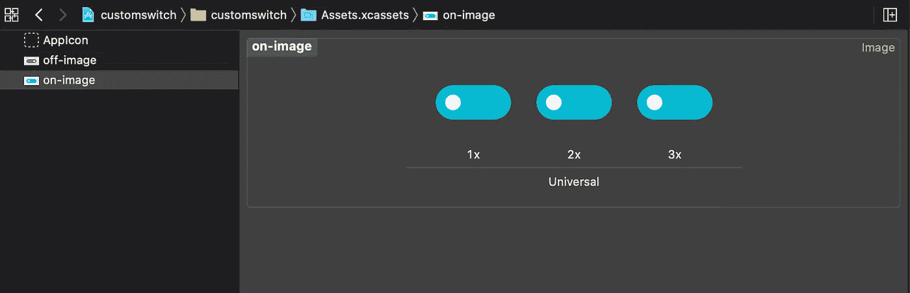
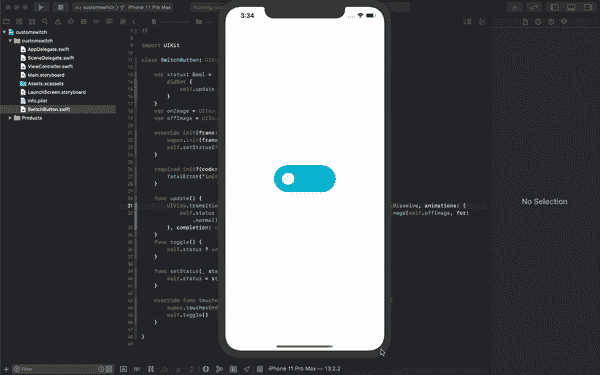

# 如何使用 UIButton 创建自定义开关

> 原文：<https://betterprogramming.pub/how-to-create-a-custom-switch-using-uibutton-cd89bf273fa4>

## 定制它——让它变得美丽


照片由 [Yogesh Pedamkar](https://unsplash.com/@yogesh_7?utm_source=medium&utm_medium=referral) 在 [Unsplash](https://unsplash.com?utm_source=medium&utm_medium=referral) 上拍摄

切换或开关非常适合让用户打开或关闭应用程序中的功能——关闭通知、启用黑暗模式或您希望用户选择的任何其他偏好设置。

我们应该给用户尽可能多的选择，让他们得到他们想要的体验，而不是我们强迫他们拥有的东西。你可能会说:“哦，我们需要保持简单。”是的，保持简单，但还是让人们来决定。

我们不打算继承子类`UISwitch;`，而是使用`UIButton`。为什么？因为我想展示实现自定义开关的最简单方法。如果你想创造更高级的东西，你应该研究一下子类化`UISwitch`。

# 1.创建一个新类

为您的自定义开关按钮创建一个新文件。我叫我的`SwitchButton.swift`

```
class SwitchButton: UIButton {
}
```

# 2.导入开/关状态图像

我们将使用这些图像来显示开关按钮的开/关状态。



# 3.开始实现开关按钮

将开和关图像定义为 UIImage。我们将使用 UIView 转换来呈现状态变化，因为这将给用户一种这不仅仅是一幅图像的感觉。你可以根据你想要给人的感觉来玩这个动画。

另外，我在`sendHapticFeedback`功能中使用`CoreMotion`添加了触觉反馈。这将增加更多的感觉，因为当用户点击切换时，它会给用户一个物理反馈。

# 4.展示您的自定义开关按钮

现在我们有了一个定制的开关按钮，我们可以调用它并在视图控制器中显示它。

现在，运行您的应用程序，测试您的交换机！



您可能会用到这个开关的状态，所以下面是获取状态的方法。

```
let status = switchButton.status
```