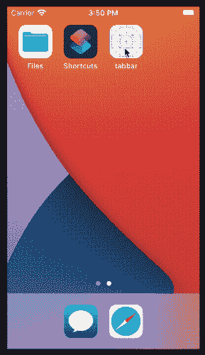
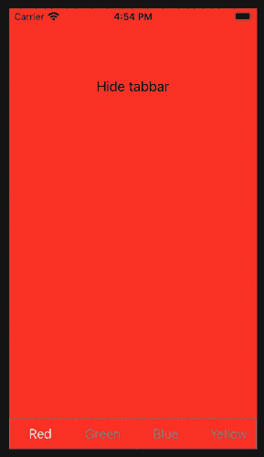

# 如何在 Swift 中创建自定义标签栏

> 原文：<https://betterprogramming.pub/how-to-create-a-custom-tabbar-in-swift-d44b3db3ac0e>

## 使用 Containment API 创建一个我们完全控制的 TabBar

照片由[莱昂](https://unsplash.com/@myleon?utm_source=medium&utm_medium=referral)在 [Unsplash](https://unsplash.com?utm_source=medium&utm_medium=referral) 上拍摄。

SwiftUI 每天都在变得越来越成熟，但 UIKit 还在。这是其他技术在过去已经发生过的事情。例如，Swift 于 2014 年发布，但仍有许多应用程序是用 Objective-C 编写和维护的。

UIKit 提供了几个组件来构建我们的应用程序，但有时它们的 API 并不像我们希望的那样灵活。有时这些组件工作起来很奇怪，我们很难改变它们的行为。例如，你有没有尝试过为一个`UITabBarButton`实现一个自定义动画？

在今天的文章中，我想分享如何构建一个自定义的`TabBar`来完全控制它。一旦实现了主要特性，我们就可以根据需要添加许多其他功能:复杂的按钮动画、不同的栏高、自定义动画等等。

# 什么是 TabBar？

首先，让我们明确我们想要达到的目标。我们希望:

*   实现一个可以容纳其他视图控制器的视图控制器。
*   显示其中一个视图控制器。
*   在屏幕底部所示的视图控制器上显示一个选项卡栏。
*   当用户点击标签栏按钮时，在各种视图控制器之间切换。

期望的结果是这样的:

达到这个结果的主要工具是由苹果公司提供的[包容 API](https://developer.apple.com/library/archive/featuredarticles/ViewControllerPGforiPhoneOS/ImplementingaContainerViewController.html) 。

其基本思想是，`UIViewController`并不局限于包含视图。它也可以包含其他的`UIViewControllers`。然后容器的责任是管理孩子，决定显示什么，什么时候，以及如何处理他们的交互。

在代码方面，我们可以使用下面的代码片段将包容 API 的强大功能带到我们的选项卡栏中:

上面的代码片段包含了扩展了`UIViewController`类的`TabBar`的声明。这是我们想要实现的所有其他视图控制器的容器。

然后，在扩展中，我们可以定义两个函数来处理`UIViewController`的孩子:`add`和`remove`。`add`功能将新的视图控制器添加到层次结构中。为此，我们:

1.  调用`TabBar`的`addChild`方法。
2.  设定儿童的框架。默认情况下，它将使用父对象的整个框架，但是我们可以自定义它来覆盖屏幕的不同部分。
3.  将子视图添加到选项卡栏视图层次结构中。当添加一个新视图时，它将被放置在所有视图之上。因此，我们必须将它向后移动。
4.  通知子视图控制器它已经被移动到不同的父视图。

`remove`方法做相反的事情，顺序相反:

1.  它通知孩子它将搬到不同的父母那里。
2.  它从层次结构中移除子视图。
3.  它将子对象从当前父对象中移除。

# TabBar 视图

让我们从创建视图开始。我们需要展示一些用户可以与之交互的东西来使一切工作，并且它与`TabBar`是独立的，所以这是一个很好的起点。

`TabBarView`由一组按钮组成，用户可以点击这些按钮从一个标签切换到另一个标签。我们将使用一个`UICollectionView`来实现这个行为。集合中的每个按钮实际上都是一个`TabBarCell`。

选项卡栏在屏幕上的呈现方式取决于以下视图模型:

视图模型由一组选项卡和所选选项卡的索引组成。为了简单起见，我决定只处理选项卡的标题。尽管如此，创建一个任意复杂的模型来保存不同州的图像、徽章、自定义颜色等其他属性还是很容易的。

然后，有一个实用方法来控制我们何时需要重新加载表。抽象这个细节很重要:它将数据重载与我们将来可能添加的其他行为分离开来，使代码更易于维护。

对于包含集合的视图来说，视图的代码是非常标准的:

这段代码比平常稍微长一点，但是很简单。让我们关注有趣的部分:

*   在标有`2`的部分，我们用一个`lazy`变量声明集合视图。这样，集合创建一次，并在第一次使用属性时自动创建。然后，我们用数据源、委托和许多其他属性来配置`UICollectionView`。最后，我们归还它。
*   在标有`7`的部分，我们访问视图模型，了解是否需要重新加载一些数据。
*   在标有`8`的部分，我们布置了子视图。请注意，我们从`safeAreaInsets.bottom`开始处理 iPhone 的缺口。

## UICollectionViewDataSource 和 uicollectionview delegateflowlayout

在第`3`节中，我们声明了一个不在任何地方使用的闭包。我们需要这个闭包来让`TabBar`对用户输入做出反应。这是`UICollectionViewDelegateFlowLayout`协议的一项任务。该协议的另一个任务是定义每个小区必须有多大。

最后，我们必须实现`UICollectionDataSource`委托，让集合知道它必须呈现多少项。

## 将 ViewController 连接到视图

既然我们有了两种主料，让我们一起煮吧。首先，我们在`Tabbar`中定义了一些助手属性和函数。

在这里，我们实现了视图控制器的框架:我们定义了选项卡栏的主要属性(`viewControllers`和`selectedTab`)，我们实现了基本的视图控制器生命周期方法(`loadView`和`viewDidLoad`)，并且我们添加了一些助手方法:`setupInteractions`来设置所有的用户交互，`updateVM`来从单个点更新视图模型。

最后一步是将所有东西连接在一起，这样当`TabBar`中的一个属性改变时，UI 也会改变。要做到这一点，我们可以利用物业观察员。

`viewControllers`属性的观察者非常简单。当视图控制器的数组改变时，我们更新视图模型。

有趣的部分来自于`selectedTab`的观察者。当用户点击集合中的一个单元格时，此属性会更改。当这种情况发生时，我们:

1.  检查用户是否点击了不同于当前单元格的单元格。
2.  从标签栏中删除旧的孩子。
3.  添加新的。
4.  更新用户界面。

在第 2 步和第 3 步中，我们最终使用包容 API 来显示不同的视图控制器！

# 使用 TabBar

现在一切都连接好了，我们终于可以使用它了。在`AppDelegate`中，我们可以用一堆标准的`UIViewControllers`作为孩子来创建标签栏视图控制器。

这是一个非常标准的`AppDelegate`代码:我们创建了一个新的视图控制器，我们设置了几个变量(在我们的例子中，是`viewControllers`和`selectedTab`)，然后我们显示了窗口。

如果我们现在运行该应用程序，我们应该会观察到上面视频中显示的相同结果。

# 结论

今天，我们探索了如何使用包容 API 将一个`UIViewController`放入另一个。

我们使用自定义选项卡栏的创建作为工作示例。不过，我们可以在任何组件上使用这个想法。假设您正在实现一个包含几个控件的复杂 UX，每个控件都拥有一个非常复杂的逻辑。一个好主意是将该逻辑隔离在它自己的视图控制器中，并组合不同的视图控制器来实现令人惊奇但可维护的结果。

相反，如果你想知道为什么我们需要一个定制的标签栏，那么，并不是所有我们需要实现的行为都可以用默认的`[UITabBarController](https://developer.apple.com/documentation/uikit/uitabbarcontroller)`轻松实现。有时我们想要更多的灵活性，最好的解决方案是自己实现。

在我的 [CustomTabBar 存储库](https://github.com/cipolleschi/CustomTabBar)中，你可以找到我们在本文中共同开发的所有代码，以及一些更多的特性:自定义标签栏高度和用漂亮的动画隐藏标签栏的可能性。

