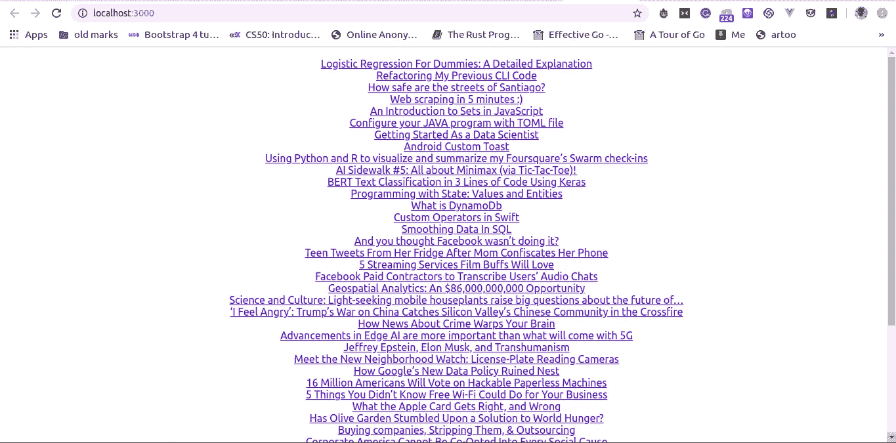

# 如何创建带有 React 挂钩的自定义 useInfiniteScroll()

> 原文：<https://betterprogramming.pub/how-to-create-a-custom-useinfinitescroll-with-react-hooks-248f4531384c>

## 无限滚动应该更容易


在我的一篇文章中，我解释了如何创建定制的`useModal()` React 挂钩，这些挂钩可以被挂钩到模态组件中。

在本文中，我将解释如何创建可用于无限滚动组件的`useScrollInfinite()` React 钩子。无限滚动是一种现代的分页方式，你不必跳到下一页就能看到更多的内容。

它会自动检测您是否在页面末尾，并使用 Ajax 和其他异步数据获取技术加载更多内容。

无限滚动极大地提升了现代应用程序的性能，因为在页面加载时只显示一点数据，然后在向下滚动页面时获取更多数据，这使得应用程序速度更快。

无限滚动通常非常适合处理文本、图像、视频、状态更新、提要和表格数据等列表。

在本教程中，我将使用一个名为 [Medrum](http://medrum.herokuapp.com) 的 REST API 来获取随机文章。它从网上抓取文章，然后把它们分解成数据。

# 构建一个列表(文章)组件

首先要做的是构建一个简单的列表组件。您可以使用[创建 React 应用](https://github.com/facebook/create-react-app)来设置 React 应用。

在本教程中，我将使用 [axios](https://github.com/axios/axios) 作为 HTTP 客户端库。您可以按如下方式安装它:

```
yarn add axios
```

要进一步了解如何在 React 中发送 HTTP 请求，请观看下面的视频:

现在，让我们看看下面的简单组件:

下面是我们在上面所做的:

1.  增加了一个`useState`来存储和设置我们的数据。
2.  增加了一个`useEffect`，只在组件挂载时加载我们的数据。
3.  检查数据是否准备好。
4.  然后，在物品列表中绘制地图，并将其显示在`<li>`中。

它看起来是这样的:



如果你向下滚动，它不会加载更多的数据，因为它还不能检测到任何底部，这是我们教程的下一阶段。让我们看看怎样才能实现它。

# 通过探测底部加载更多数据

现在，让我们看看如何通过检测何时滚动到主体或特定容器的底部来加载更多的数据。

有很多方法可以做到这一点，这取决于您的用例以及您的 DOM 是什么样子的。

然而，最常见的方法是检查窗口`window`对象的内部高度加上文档`window`对象的`scrollTop`是否等于文档的`offsetHeight`。

```
 *window.*addEventListener("scroll", ()=>{
  if(window.innerHeight + document.documentElement.scrollTop!==document.documentElement.offsetHeight){
  return;
}
else {
  console.log("scrolling down");
}
})
```

使用上面的代码，我们将能够知道用户何时滚动到页面底部。

然后，可以在我们的`useEffect`生命周期挂钩中使用它，如下所示:

```
function isScrolling(){
if(window.innerHeight + document.documentElement.scrollTop!==document.documentElement.offsetHeight){
  return;
}
else {
  console.log("scrolling down");
}}useEffect(()=>{
window.addEventListener("scroll", isScrolling);
return () => window.removeEventListener("scroll", isScrolling);}, [])
```

在上面的代码中，我们注册了我们的`isScrolling`函数来监听事件`scroll`。所以现在，每当用户滚动时，就会调用`isScrolling`。

因为我们将在用户向下滚动时获取数据，所以我们需要知道数据何时完成获取，因此我们有如下内容:

```
const [isFetching, setIsFetching] = useState(false);function isScrolling(){
if(window.innerHeight + document.documentElement.scrollTop!==document.documentElement.offsetHeight){
  return;
}
else {
  setIsFetching(true)
}}useEffect(() => {
    if (isFetching){
       console.log("Fetch data")
    }
  }, [isFetching]);
```

现在我们需要从我前面提到的文章 API 中获取数据，我们将使用`axios`:

```
const [page, setPage] = useState(1);const fetchData = () =>{
let url = "https://medrum.herokuapp.com/articles";
axios.get(url).then(res => {
setData(res.data);
});
}const moreData = () => {
let url = `https://medrum.herokuapp.com/feeds/?source=5718e53e7a84fb1901e05971&page=${page}&sort=popular`;
axios.get(url).then(res => {
setData([...data, ...res.data]);
setPage(page+1)
setIsFetching(false)
});
}
```

我们在上面做了什么:

1.  我们添加了一个名为`page`的`useState`——它将递增并用作文章 API 的分页。
2.  我们创建了两个函数:`loadData` 和`moreData`。
3.  `loadData`第一次加载页面时加载数据，被触发一次。
4.  `moreData`获取更多数据，当用户向下滚动到底部时被触发。
5.  在`moreData`中，我们增加页面状态值，并将`isFetching`设置为`false`，以表示数据已经完成加载。

然后，将所有这些放在一起，我们可以编写如下的`List`组件:

我们添加了两个`useEffect`——第一个在浏览器加载时加载我们的数据，并将我们的`isScrolling`回调绑定到事件监听器，而第二个监听`isFetching` `useState`，然后在`true`时获取更多数据。

# 构建自定义 React 挂钩

我们已经看到了当用户向下滚动到页面底部时，如何加载更多的数据，并且一切似乎都运行良好。

然而，我们只在我们的文章组件中实现了它，而不是一个可以被另一个组件重用的自定义 React 挂钩。

让我们看看如何在自定义的 React 挂钩中实现这一点。

在你的`src`目录下创建一个新的`useInfinite.js`文件，让我们添加一个自定义的 React 钩子函数，如下所示:

```
const useInfiniteScroll = callback => {
  const [isFetching, setIsFetching] = useState(false);
  useEffect(() => {
     *if* (!isFetching) *return*;
     callback();
  }, [isFetching]);
  *return* [isFetching, setIsFetching];
};
export default useInfiniteScroll;
```

在我们的`useInfiniteScroll`定制钩子中，我们:

1.  增加了一个参数`callback`,当用户向下滚动时就会被触发。
2.  增加`isFetching` `useState`表示数据加载与否。
3.  添加了一个`useEffect`生命周期，当`isFetching`状态改变并且值等于`true`时调用我们的回调。
4.  然后，我们导出`isFetching`和`setIsFetching`，这样它就可以在功能组件中被访问。

接下来的事情是将我们的`isScrolling`函数注册到`scroll` 事件中:

我们在上面做了什么:

1.  添加了一个新的`useEffect`生命周期——它将`isScrolling`函数绑定到滚动事件。
2.  我们添加了我们的`isScrolling`函数。

就这样，我们定制的 React 挂钩就做好了。让我们看看如何用我们的文章组件实现它。转到文章组件，按如下方式重构:

在上面，我们做了一些修改:

1.  我们导入了新创建的`useInfinite`钩子。
2.  我们初始化了`useInfiniteScroll`定制钩子，并传递给它一个当用户向下滚动时触发的函数。
3.  我们现在只有一个`useEffect`生命周期，加载一次数据。
4.  我们从函数表达式到函数声明重构了我们的`moreData`函数。

仅此而已。最后，我们现在可以对任何组件使用自定义的 React 钩子，以便在用户向下滚动时加载数据。

您可以在 GitHub repo 中找到完整的代码:

[](https://github.com/CITGuru/react-useinfinitescroll) [## cit guru/react-use infinite scroll

### 这个项目是用 Create React App 引导的。在项目目录中，您可以运行:在…中运行应用程序

github.com](https://github.com/CITGuru/react-useinfinitescroll) 

要看现场演示，你可以在这里查看:[https://react-useinfinitescroll.now.sh/](https://react-useinfinitescroll.now.sh/)