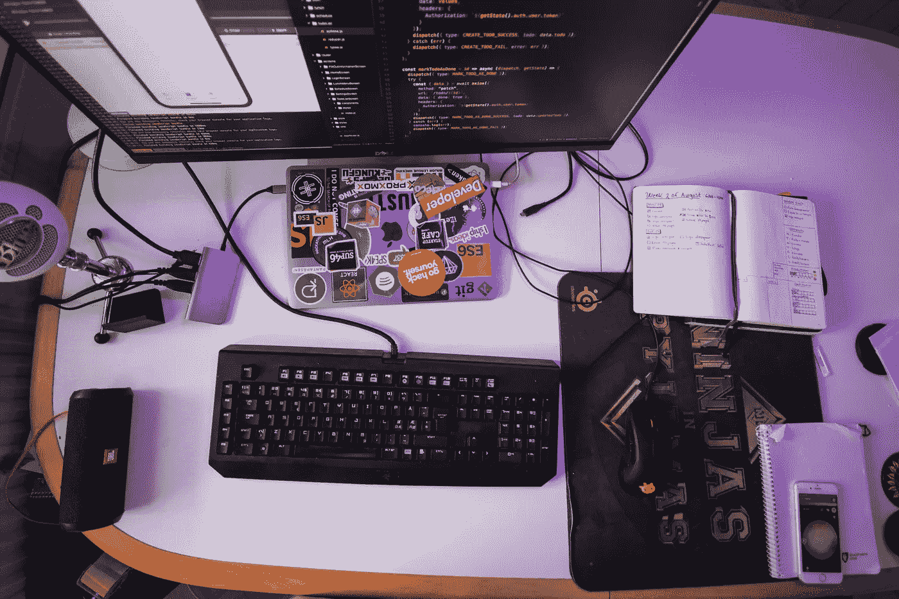
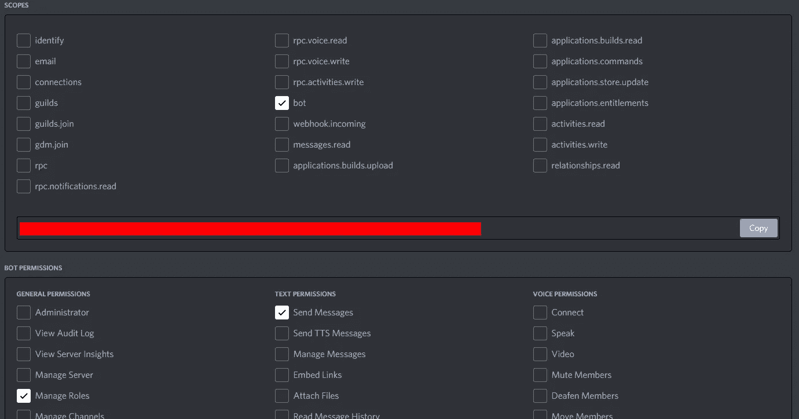
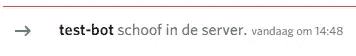
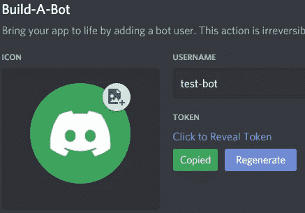
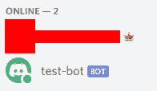
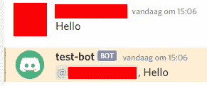

# 如何用 10 行 JavaScript 代码创建一个不和谐机器人

> 原文：<https://betterprogramming.pub/how-to-create-a-discord-bot-with-10-lines-of-code-6ad05e28e5f3>

## *释放 Node.js 和 Discord.js 的力量*



奥斯卡·伊尔迪兹在 [Unsplash](https://unsplash.com/s/photos/javascript?utm_source=unsplash&utm_medium=referral&utm_content=creditCopyText) 拍摄的照片。

[Discord](https://discord.com/) 是一款非常流行的消息和 VOIP 应用。主要由游戏玩家使用，它现在非常普遍，并且与游戏、启动器有很大的集成，它甚至有一个移动应用程序。

像 [Telegram](/how-to-create-a-telegram-bot-with-10-lines-of-code-4b38bc3a101a) 一样，它提供了创建群组的可能性，在群组中你可以拥有自动执行某些任务的机器人。对我们来说幸运的是，通过使用 [Discord.js](https://discord.js.org/#/) ，我们可以使用 Node.js 创建这些。所以让我们看看如何创建非常基本的机器人供我们使用。

*注意:本文假设您对 Node.js 和 npm 有基本的了解。*

# 注册我们的机器人

像 Telegram 一样，我们需要注册我们的机器人。我们需要在 [Discord 开发者门户](https://discord.com/developers/applications)注册。

单击“新建应用程序”并输入应用程序的名称。我用过“测试机器人”当您创建 bot 时，您将被重定向到一个包含您的项目的各种信息的页面(比如 API 密钥)。


DD 门户的侧菜单

在屏幕左侧，选择“机器人”选项卡。在这里，您可以单击“添加机器人”按钮来创建您的第一个机器人。单击“接受”,您将被重定向到一个页面，在该页面上您可以更改您的机器人的数据。我们现在已经成功注册了它，可以继续在 IDE 中进行安装了。

# 装置

在保存 bot 代码项目的地方创建一个新文件夹。在您选择的 IDE 中打开新文件夹。我将使用 Visual Studio 代码，因为它非常漂亮和简约。

打开终端并初始化 NPM:

```
npm init -y
```

我们现在有了我们的`package.json`文件，我们可以继续安装 Discord.js。我还将安装 [Nodemon](https://medium.com/quick-programming/why-you-almost-always-want-to-use-nodemon-b446286eabdf) 以便于重新启动:

```
npm i discord.js
npm i nodemon
```

运行这两个命令，我们现在就有了创建一个 Discord bot 所必需的依赖项。如果你想隐藏你的 API 密匙，你也可以安装 Dotenv。我写了[一个关于这个话题的教程](https://javascript.plainenglish.io/introduction-to-dotenv-f2bdf93e4a1)。

# 创建机器人的启动命令

在我们的文件夹中，创建一个`index.js`文件。这个文件将是我们的应用程序的入口点。我们还需要更改我们的`package.json`,这样我们就可以实际运行文件了。打开您的`package.json`文件并添加以下脚本:

使用`npm run start`，我们可以在最终可能部署应用程序时启动它。通过`npm run dev`，我们将使用 Nodemon 启动开发服务器。

# 进入我们不和谐服务器的机器人

在我们继续之前，我们需要将 bot 添加到 Discord 服务器。我在我的 Discord 上创建了一个空的测试服务器，这样我就不会打扰我的任何朋友。

返回开发者门户，点击“OAuth2”选项卡。这里，我们需要选择 bot 的范围。在这种情况下，它只是“机器人”勾号。您还可以在下面的权限块中添加“管理角色”和“发送消息”复选标记。



开发人员门户中的权限

要将 bot 输入服务器，请从作用域内复制链接。出于显而易见的原因，我已经模糊了我的。

复制链接并在浏览器中转到该地址。您将收到一条标准的授权信息。将机器人添加到适当的服务器(我们的测试服务器)这样你就不会打扰你的朋友了。

完成后，您应该会看到机器人已经通过 Discord 服务器中的消息以及网页上的确认屏幕加入了您的服务器。



欢迎我们的机器人加入服务器。

# 编写我们的机器人

我们终于可以开始编码了。从开发人员门户的“bot”选项卡中复制 Bot 的令牌，并将其添加到您的代码中(如果您选择这样做，最好是在 Dotenv 文件中)。这对开发来说不是必需的，但是这样做更安全。

*注意:我将混淆我的 gists，其中我用全大写字母显示了带有虚构常数的代码。*



获取令牌

第一个任务是登录机器人。它在我们的服务器里，但是我们的甜蜜机器人仍然离线。

当您通过运行`npm run dev`以适当的`BOT_KEY`运行这段代码时，您会注意到机器人现在在我们的服务器上是在线的。



但是现在它没有做任何事情。当它准备做其他事情时，我们应该首先让它在终端中发送一个消息。我们使用`client.on()`函数来完成这项工作。这个函数需要一个事件名和一个到达该事件时要执行的函数。

现在，当您保存文件时(如果您不使用 Nodemon，可以选择重启服务器)，您会在我们的终端中注意到一条消息。

让它回复一条“你好”的消息吧。我们为此使用了`client.on("message", ...)`函数。在我们作为参数传递的函数中，我们可以检查消息是否说了“Hello ”,并用一个问候来回复它。

当我们再次重启服务器时，我们可以说“你好”并得到回复。



友好的机器人

如果我们不想回复一条消息，而只是简单地发送一条新消息，我们可以用`msg.channel.send(STRING)`代替`msg.reply(STRING)`。试试看。

*要警惕的是，如果它寻找的消息(“Hi”)与它发送的消息(“Hello”)相同，如果你不检查它是否发送，它就会向你的服务器发送垃圾邮件。*

# 结论

当然，这个最小的十行代码是针对一个基本的机器人的。我甚至可以试着用五行代码得到一个更小的机器人，但那将是非常愚蠢的。

通过这段简单的代码和开发人员门户上的少量工作，您已经可以创建赌博机器人或在遇到问题时提供信息的机器人——至少如果您有适当的 JavaScript 技能。

对我来说，搞清楚这一点很有趣。关于机器人，我还有很多东西要学，我已经迫不及待了。

非常感谢您的阅读，祝您度过美好的一天。