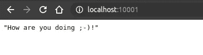

# 如何为 Python 应用程序创建 docker 文件

> 原文：<https://betterprogramming.pub/how-to-create-a-dockerfile-for-a-python-application-8d078b16bc9a>

## 创建 Python 容器的分步指南


格里芬·伍尔德里奇在 [Unsplash](https://unsplash.com?utm_source=medium&utm_medium=referral) 上拍摄的照片。

在本文中，您将发现如何创建 Python Dockerfile 文件。我们将涵盖足够让你开始你自己的项目。这个 Dockerfile 是我的两个宠物项目目前使用的文件。一个是从外部服务中检索图书封面，另一个是为我的博客生成预览。

因此，我们将逐行检查 over 文件并从中学习。别担心，你不需要任何先验知识。我相信，在这篇文章结束时，您将能够自己做到这一点。在当前的软件开发环境中，拥有 Docker 知识是必须的。

太多的数据科学项目仅仅因为生产问题而失败。业务人员经常低估软件开发带来的一切。与其一遍又一遍地创建概念证明，不如将更多的注意力放在创建有价值的软件上。通过阅读本文，您将了解到软件开发周期中非常重要的一部分。这篇文章是关于可用的软件。

# 创建应用程序

因此，我假设您已经创建了一个基本的应用程序。如果还没有，最好用 FastAPI 实现一个基本的 GET 请求。在本教程中可以找到一个很好的例子[。这是一个很好的锻炼，为什么不自己试试呢？](https://fastapi.tiangolo.com/tutorial/first-steps/)



乔伊·崔比昂尼的名言。

因为拥有一个应用程序对于本文的其余部分至关重要，所以包含了一个主应用程序的源代码示例:

此时，您应该只需使用以下命令就可以运行应用程序了:

```
**python** "main.py"
```

从现在开始，我将在下一节详细解释 Dockerfile 文件的每一行。如果你有不明白的地方，不要害怕在下面的评论中提问！

# 创建 Dockerfile 文件

我们将要创建的 docker 文件的第一行是关于我们的语言的。随着世界对 Python 3 越来越熟悉，我选择了最新的 Python 版本之一也就不足为奇了。如果你对 Python 其他可用的 Docker 基本图像感兴趣，这个[页面](https://hub.docker.com/_/python)是你的朋友。

```
FROM python:3.8
```

当人们写或谈论 Docker 时，下面的两句话经常被忽略。然而，在我看来，它们非常重要。下面几行代码确保您在容器中所做的一切都是由普通用户完成的。你也没有在 Linux 中对每个命令都使用`sudo`，对吗？这些行可以防止您弄乱 Docker 映像的内部结构，并避免以后出现特权问题。

下面两行添加了一个`user`组，一个名为`user`的用户，以及一个位于目录`/home/user`下的主目录:

```
RUN useradd -ms /bin/bash user
USER user
```

因为我们很懒——就像优秀的开发人员一样——我们不想将主目录添加到我们将要执行的每个命令中。因此，我们在 docker 文件中使用下面一行。这确保了我们所做的一切都在主目录中完成:

```
WORKDIR /home/user
```

在 Docker 容器环境之外，使用虚拟环境是最佳实践。我来给你介绍一下`requirements.txt`文件的样子:

```
mockito~=1.2.2
requests~=2.24.0
Pillow~=7.2.0
pylint~=2.6.0
fastapi~=0.61.1
uvicorn~=0.11.8
```

当你处理多个项目时，虚拟环境非常有用。通过这种方式，您可以防止升级或降级您正在其他地方使用的包，这些包可能会破坏您昨晚运行的应用程序。您不希望这种情况发生，您的团队领导也不希望听到这种情况。

所以在这一行中，我们将所有需要的库从您的主机复制到 Docker 容器:

```
COPY requirements.txt .
```

有了这个文件，我们可以为我们的应用程序安装所有需要的库。之后，我们不再需要 Docker 容器中的这个文件，所以我们不要把它放在那里。

*注意:这个由你自己考虑，但是我没有发现在这里创建第二个 Docker 层有什么价值。*

```
RUN pip install -r requirements.txt && rm requirements.txt
```

好的，来源呢？好了，源代码的时候到了。我们马上复制过来。

我很难猜测你把你的测试文件放在哪里，但是你不希望它们在你的 Docker 容器中。如果您想优化您的容器，请记住这一点。为了简单起见，这一部分被省略了。

```
COPY src .
```

倒数第二行是为了便于记录。因为我们在端口 10000 上运行应用程序，所以我们使用`expose`指令来说明这一点。这样，我们也知道在生产环境中暴露了哪些端口。

```
EXPOSE 10000
```

最后一行是关于启动应用程序的。因为关于如何启动应用程序的所有内容都包含在`main.py`中，所以这对于其他应用程序来说非常通用。这样，我们就不必经常打开 docker 文件。

```
ENTRYPOINT [ "python", "main.py"]
```

就是这样——整个 Dockerfile 文件只有几行。

因此，让我们用一个令人敬畏的标签来构建图像，这样我们就可以与我们的同事分享它:

```
docker image build . -t "awesome_tag"...Successfully built 41612ca5ccfd
Successfully tagged awesome_tag:latest
```

现在我们唯一要做的就是旋转容器！

```
docker container run -t awesome_tag:latest -p 10000:10000INFO:     Started server process [1]
INFO:     Waiting for application startup.
INFO:     Application startup complete.
INFO:     Uvicorn running on [http://0.0.0.0:10000](http://0.0.0.0:10000)
```

这就是在 Docker 中运行一个 Python 应用程序的全部工作。在这一点上，对于任何项目，您应该能够自己做到这一点。

# 结论

在本文中，我们看到了如何创建 Python 应用程序并在 Docker 容器中运行它。为一个小应用程序创建 Dockerfile 非常简单，就像我们用 FastAPI 创建的那样，所以我一直建议尽早使用容器。

使用 Docker，测试应用程序的新版本变得容易得多，因为您实际上可以在安装了 Docker 的每个环境中轻松地设置它。如果你还有任何问题，欢迎在评论中提问。我将非常乐意回答所有这些问题。