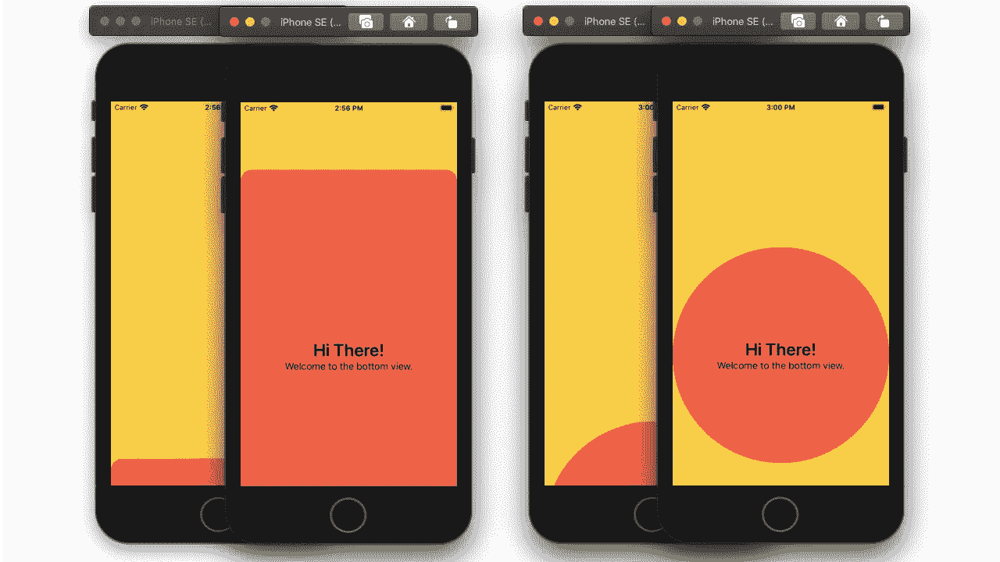
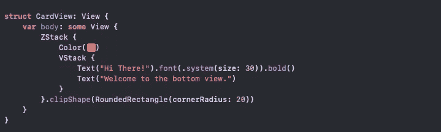
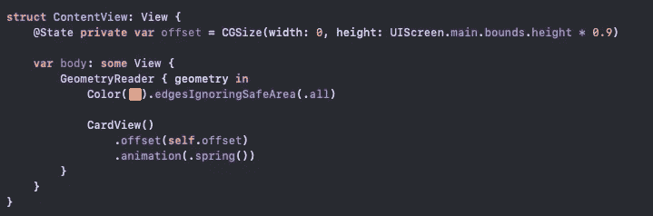
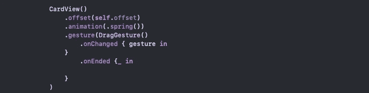
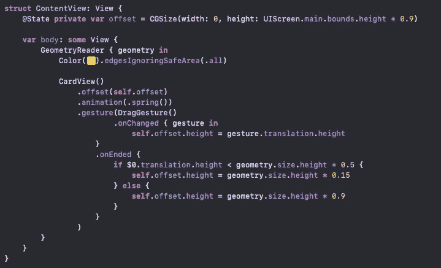
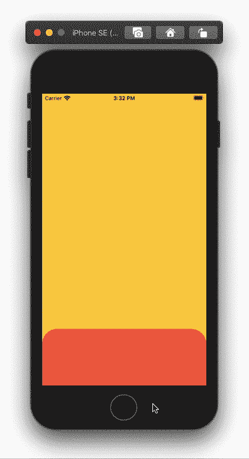
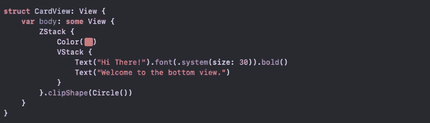
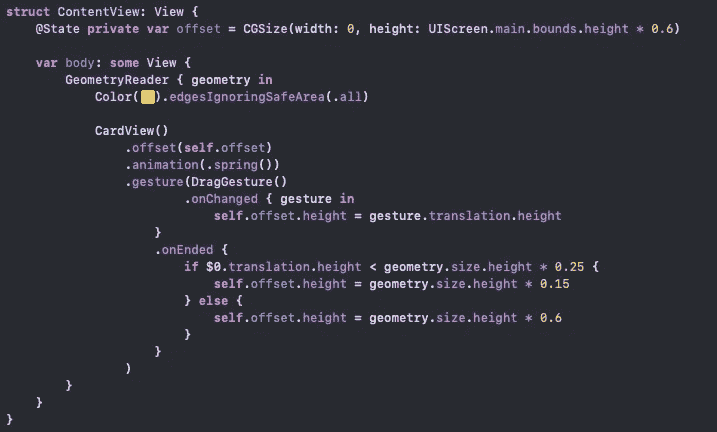
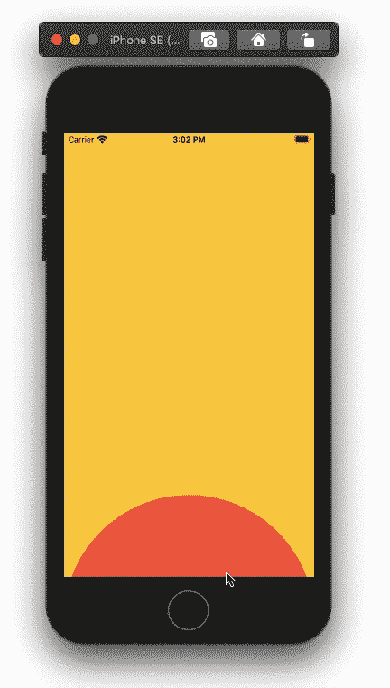

# 如何在 SwiftUI 中创建可拖动卡

> 原文：<https://betterprogramming.pub/how-to-create-a-draggable-card-in-swiftui-86387397071d>

## 用拖动手势构建底部卡片视图



SwiftUI 中的可拖动卡(作者拍摄)

# 卡片视图

首先，让我们开始我们的`CardView`。对于教程，我只有一个带颜色和一些文字的`ZStack`。要获得圆角边缘，您可以使用`.cornerRadius(radius: CGFloat)`或`.clipShape(shape: Shape)`。



在我们的主视图中，我们将要显示我们的卡片，我们需要一个变量来偏移卡片的位置。下面，我把可变高度作为屏幕高度乘以 0.9。这将使我们的视角偏移到屏幕底部的 10%。你可以尝试其他值，因为 10%在像 iPhone 11 Pro Max 这样的长屏幕中可能很小。

```
@State **private** **var** offset = CGSize(width: 0, height: UIScreen.main.bounds.height * 0.9)
```

将我们的`CardView`添加到主视图(`ContentView`)，然后添加偏移和弹簧动画:



# **拖拽手势**

因为我们想要利用`GeometryReader`值，所以避免在`GeometryReader`之前声明`DragGesture`的变量，如下面的代码所示:

取而代之的是下面的手势:



在`.onChanged`，内，将偏移高度分配给手势平移高度。这将允许我们的卡上下拖动，而不是向两侧拖动:

```
**self**.offset.height = gesture.translation.height
```

在`.onEnd`内部，使用`GeometryReader`代理值检查手势平移是在视图的底部 50%还是在视图的顶部 50%。如果手势在底部 50%，则通过将几何尺寸高度乘以 0.15 来偏移卡片以覆盖视图的 85%。否则，通过将几何尺寸高度乘以 0.9，使视图再次只覆盖 10%，从而将视图返回到底部。

```
**if** $0.translation.height < geometry.size.height * 0.5 {**self**.offset.height = geometry.size.height * 0.15} **else** {**self**.offset.height = geometry.size.height * 0.9}
```

`ContentView`的最终代码如下:



卡片起始位置在底部 20%的代码示例

您可以调整我们正在使用的偏移和平移高度值，以适合不同的形状。

要将我们的`CardView`改为圆形，我们可以使用`.clipShape(Circle())`:



这会让我们的`CardView`因为我们的偏移而消失。调整偏移变量高度，使视图在底部 40%而不是 10%:

```
@State **private** **var** offset = CGSize(width: 0, height: UIScreen.main.bounds.height * 0.6)
```

现在，我们需要调整`.onEnd`中的条件，将我们的卡片放在视图的底部。你可以使用我下面的值，让这个视图达到我们视图的前 50%。



代码示例—圆形卡片

全部完成！感谢阅读！