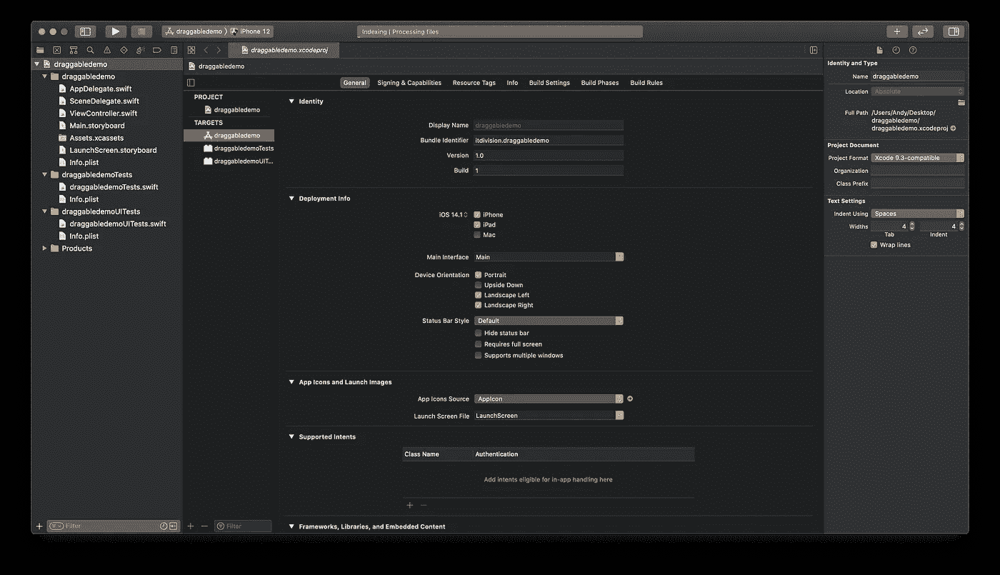
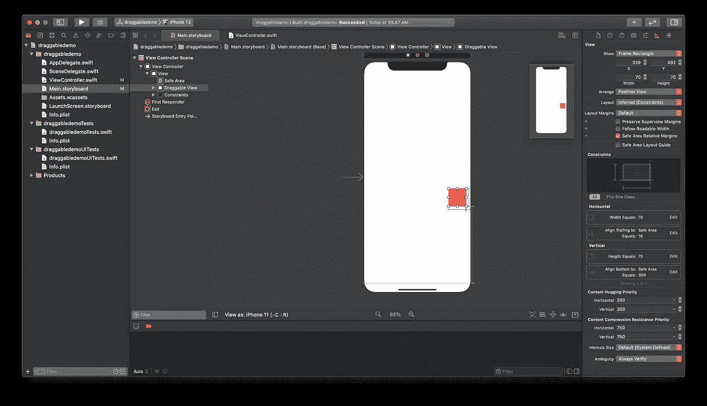
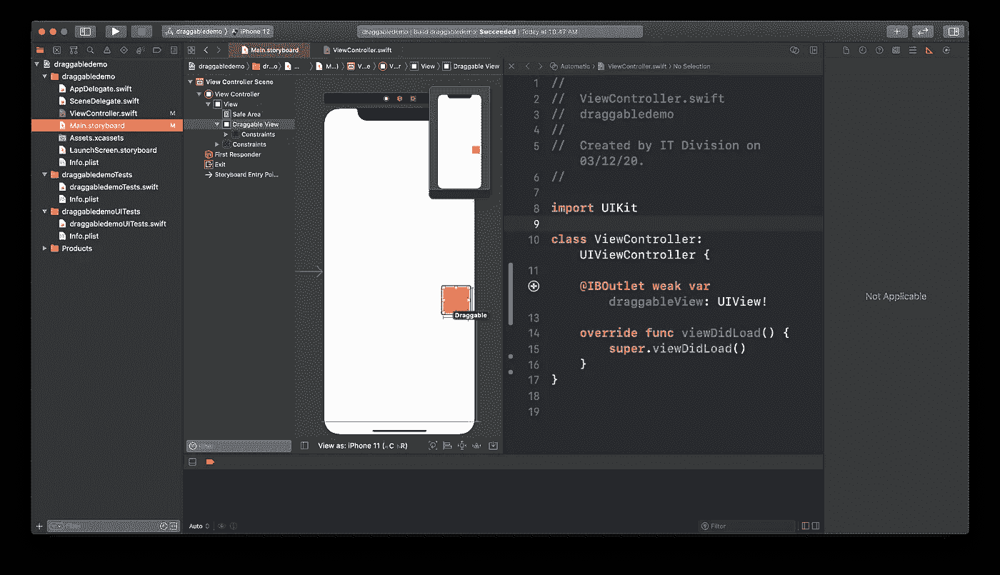
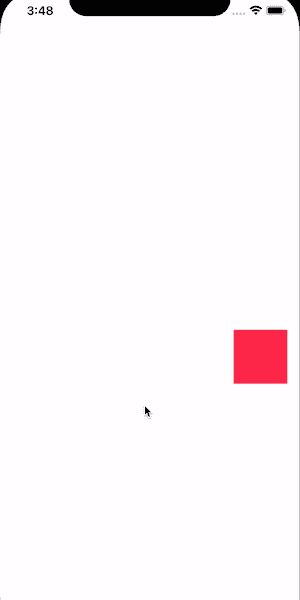
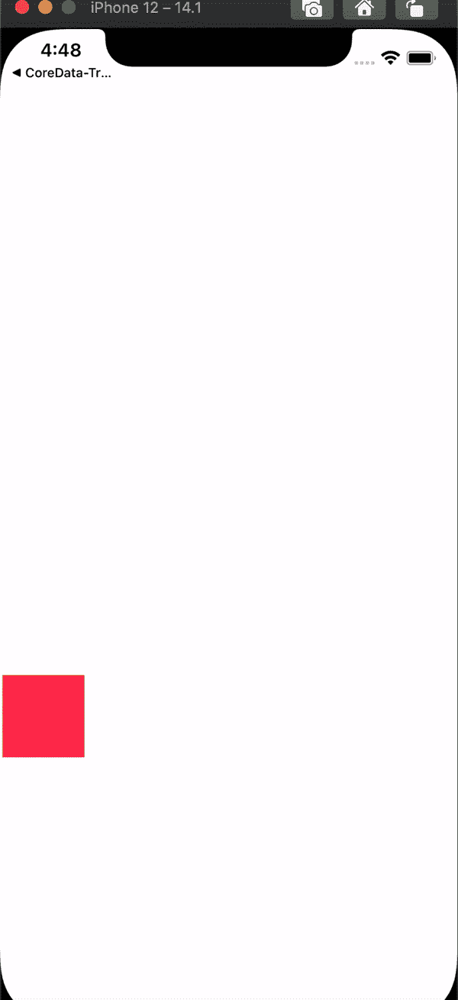

# 如何在 Swift 中创建可拖动的浮动视图

> 原文：<https://betterprogramming.pub/how-to-create-a-draggable-floating-view-in-swift-13802a410e>

## 为你的应用添加有趣的用户界面元素

照片由[将](https://unsplash.com/@terrawill?utm_source=medium&utm_medium=referral)放在[的 Unsplash](https://unsplash.com?utm_source=medium&utm_medium=referral) 上。

长话短说，在我们的最新项目中，我们的团队必须实现一个可以在屏幕上自由拖动的浮动视图。对于那些有 Android 开发背景的人来说，可以把它想象成一个悬浮的动作按钮，但不是静止在屏幕的某些部分，而是可以自由拖动！

对于那些不知道的人，看看这些图片:

浮动视图用红色圈出，如上图所示。

在进行了一些研究后，我们发现在 iOS 应用程序上从头实现它并不困难。本教程将涵盖你需要创建一个的每一件事。

*注意:由于我还没有在苹果的 HIG 上找到这个组件的正式名称，所以在本文中我将继续称它为可拖动视图。*

# 准备

在 Xcode 上创建一个 iOS 项目，选择 storyboard 作为项目的界面，UIKit App Delegate 作为其生命周期。然后我们以您非常喜欢的普通 Xcode 启动代码结束:

然后，转到`Main.storyboard`，添加一个`UIView`，放在屏幕的某个地方。您可以自由决定将视图放在哪里。例如，我的答案是:

我制作了一个红色的 UIView，宽度和高度为 70 磅，通过 16 磅的约束将其尾部与安全区域对齐，并将 300 磅与安全区域的底部对齐。

为了简单起见，我们的可拖动视图只是一个圆形视图，上面有一些背景颜色。你可以进一步定制它(比如添加一张图片或其他东西)。

我们接下来要做的是将我们新创建的视图连接到`ViewController`:

如果我们现在运行我们的应用程序，我们会在屏幕上看到一个小红框。

# 我们开始吧

为了使我们的视图可拖动，我们必须添加一个名为`UIPanGestureRecognizer`的手势识别器。

[苹果对`UIPanGestureRecognizer`的解释](https://developer.apple.com/documentation/uikit/uipangesturerecognizer#//apple_ref/occ/cl/UIPanGestureRecognizer)相当直白:

> "解释平移手势的离散手势识别器。
> 
> …
> 
> 这个类的客户端可以在它们的动作方法中查询`UIPanGestureRecognizer`对象，以获得手势的当前平移(平移(输入:))和平移的速度(速度(输入:))。"

更简单地说，这个手势可以检测视图上发生的任何平移，甚至使您能够获得它的属性，如速度、最终位置等。

让我们试着在我们的`ViewController`上实现它:

以下是详细报道:

1.  在第 16 行，我们为我们的可拖动视图设置了一个`UIPanGestureRecognizer`,在这里我们还为我们的识别器创建了一个回调函数(每次发出平移事件时都会调用这个函数)。
2.  在处理函数中，我们只是打印手势的当前位置。

尝试运行应用程序，然后自由拖动视图。请注意，尽管我们的视图没有移动，但我们可以在调试控制台上看到某种元组，这是坐标中给出的当前手势位置。我们正在实现我们的目标！

# 现在怎么办？

既然我们已经设置了手势识别器，我们要做的就是更新视图的位置。因为我们已经从处理函数中获得了最终位置，所以让我们重用它。

将此代码添加到我们的`ViewController`:

在上面的代码中:

1.  在第 20 行，我们得到了手势的当前位置。
2.  在第 21 行，我们将发送平移事件的手势视图(我们的可拖动视图)赋给一个变量。
3.  然后，我们用之前获取的当前位置更新视图的中心。

如果你再次尝试运行应用程序，我们的视图最终会被拖动。耶！

已成功使视图可拖动

但是有些事情是不对的:虽然我们成功地使视图可拖动，但是我们可以将它拖动到屏幕之外，这不是一种正常的行为。

除此之外，*普通*可拖动视图有能力在用户停止拖动时将自己拖动到屏幕最近的一侧，而我们的没有。

那么我们能做些什么呢？

实际上，要实现这种行为，我们只需要做一点变通。当用户停止拖动时，我们可以应用一些逻辑。将此代码添加到我们的`ViewController`:

逻辑是这样的:

1.  从第 24 行开始，我们向处理程序添加一些逻辑，使视图具有我们期望的行为。
2.  我们检查用户是否已经停止拖动，然后我们比较当前视图的`midX`位置和它的超级视图的一半宽度。我们通过比较来确定当前视图是更靠近其超级视图的左侧还是右侧。
3.  如果视图的`midX`大于或等于其超级视图宽度的一半(更靠近屏幕的右侧)，那么我们将它的`X`位置更新为其超级视图宽度减 40。这意味着我们的视图的最终位置将位于其超级视图的尾部 40 点。
4.  如果它更靠近左边的屏幕，我们就把它的`X`位置更新为`40`。这意味着我们的视图的最终位置将位于离它的超级视图尾部 40 磅的地方。

尝试运行应用程序。瞧啊。我们的视图现在的行为与预期的一样:

我们的可拖动视图正在运行

# **结论**

如你所见，在 iOS 上创建一个可拖动的视图并不像看起来那么难。我们只需要实现一些关于视图最终位置的逻辑。

编码快乐！