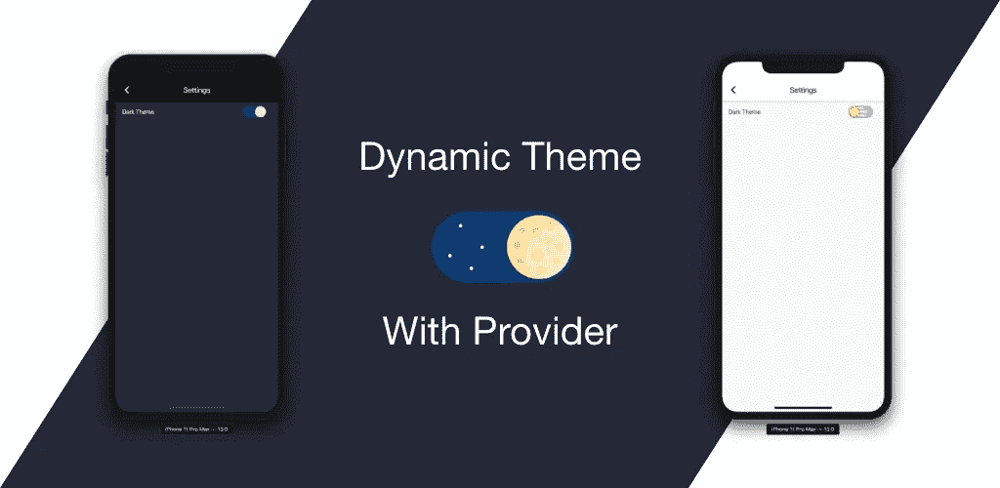
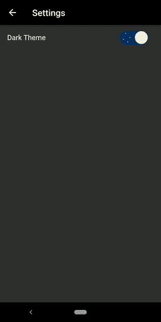

# 如何使用 Provider 在 Flutter 中创建动态主题

> 原文：<https://betterprogramming.pub/how-to-create-a-dynamic-theme-in-flutter-using-provider-e6ad1f023899>

## 如何将黑暗模式添加到您的应用程序中



我们都喜欢应用程序中的主题。尤其是所谓的*黑暗题材*。一个黑暗的主题现在已经成为移动应用必不可少的一部分。所有主要的应用程序都支持黑暗主题，一些应用程序甚至默认为黑暗主题。

> 深色主题会降低设备屏幕发出的亮度，同时仍能满足最低的颜色对比度。它们有助于改善视觉人体工程学，减少眼睛疲劳，根据当前照明条件调整亮度，并有助于在黑暗环境中使用屏幕，同时节省电池电量。配备有机发光二极管屏幕的设备受益于随时关闭黑色像素的能力。

我们知道黑暗面的力量，这就是我们在这里的原因！所以让我们用这种力量来舞动吧。

我们将使用[提供者](https://pub.dev/packages/provider)包。将提供者插件添加到 pubspec.yaml 文件中。

```
dependencies:   
  **provider: ^3.1.0**
```

我们将创建两个主题——浅色主题和深色主题。我已经手动完成了，但是你可以使用 [panache](https://rxlabz.github.io/panache_web/#/) 来创建主题。

```
import 'package:flutter/material.dart';

final darkTheme = ThemeData(
  primarySwatch: Colors.grey,
  primaryColor: Colors.black,
  brightness: Brightness.dark,
  backgroundColor: const Color(0xFF212121),
  accentColor: Colors.white,
  accentIconTheme: IconThemeData(color: Colors.black),
  dividerColor: Colors.black12,
);

final lightTheme = ThemeData(
  primarySwatch: Colors.grey,
  primaryColor: Colors.white,
  brightness: Brightness.light,
  backgroundColor: const Color(0xFFE5E5E5),
  accentColor: Colors.black,
  accentIconTheme: IconThemeData(color: Colors.white),
  dividerColor: Colors.white54,
);
```

当主题准备好时，我们创建一个主题通知类来通知我们主题的变化:

```
import 'package:flutter/material.dart';

class ThemeNotifier with ChangeNotifier {
  ThemeData _themeData;

  ThemeNotifier(this._themeData);

  getTheme() => _themeData;

  setTheme(ThemeData themeData) async {
    _themeData = themeData;
    notifyListeners();
  }
}
```

接下来，我们用`ChangeNotifierProvider`包装我们的应用程序。然后我们就可以用`ThemeNotifier`来获取主题了。

是时候手动改变主题了。我们使用`[DayNightSwitch](https://pub.dev/packages/day_night_switch)`来完成这项工作——它的工作方式就像 Flutter 中普通的 switch 小部件一样。在`[DayNightSwitch](https://pub.dev/packages/day_night_switch)`的`onChanged`回调里面，我们调用`onThemeChanged`方法，用`themeNotifier`设置主题，通知整个 app。

```
void main() => runApp(
      ChangeNotifierProvider<ThemeNotifier>(
        builder: (_) => ThemeNotifier(darkTheme),
        child: MyApp(),
      ),
    );

class MyApp extends StatelessWidget {
  @override
  Widget build(BuildContext context) {
    final themeNotifier = Provider.of<ThemeNotifier>(context);
    return MaterialApp(
      title: 'Chitr',
      theme: themeNotifier.getTheme(),
      home: HomePage(),
    );
  }
}
```

就是这样。只需几行代码，我们就可以动态地改变应用程序的主题。让我们看看它是什么样子的:



看起来很棒，但是…

我们的主题未被保存，如果我们重新启动应用程序，它将返回默认状态。所以我们使用 use `SharedPreferences`来存储当前主题。在`onThemeChanged`方法中，我们保存当前主题。

```
void onThemeChanged*(*bool value, ThemeNotifier themeNotifier*)* async *{
  (*value*)* ? themeNotifier.setTheme*(*darkTheme*)* : themeNotifier.setTheme*(*lightTheme*)*;
  var prefs = await SharedPreferences.*getInstance()*;
  prefs.setBool*(*'darkMode', value*)*;
*}*
```

我们在 main 方法中使用`SharedPreferences`值:

```
SharedPreferences.*getInstance()*.then*((*prefs*) {* var darkModeOn = prefs.getBool*(*'darkMode'*)* ?? true;
  runApp*(* ChangeNotifierProvider*<*ThemeNotifier*>(* builder: *(*_*)* => ThemeNotifier*(*darkModeOn ? darkTheme : lightTheme*)*,
      child: MyApp*()*,
    *)*,
  *)*;
*})*;
```

你可以点击查看完整的源代码[。](https://github.com/divyanshub024/chitr)

# 推荐阅读

[](https://medium.com/flutter-community/everything-you-need-to-know-about-flutter-page-route-transition-9ef5c1b32823) [## 你需要知道的关于 Flutter 页面路由转换的一切

### 我们知道在 Flutter 中从一条路线导航到另一条路线是多么容易。我们只需要做推和弹出。

medium.com](https://medium.com/flutter-community/everything-you-need-to-know-about-flutter-page-route-transition-9ef5c1b32823)