# Mat-snackbar 改造:如何用 Tailwind CSS 创建一个奇特的版本

> 原文：<https://betterprogramming.pub/how-to-create-a-fancy-mat-snackbar-with-tailwind-css-a9fa0cf0b0c9>

## 在 Angular 项目中实际使用 tailwind CSS

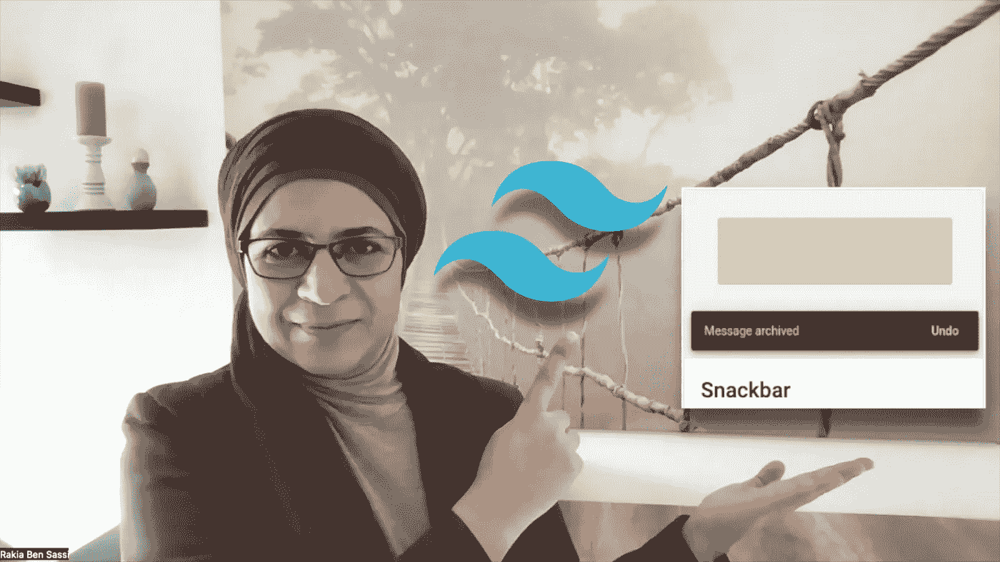

作者图片

我今年做的一件了不起的事情是学习 [tailwind CSS](https://tailwindcss.com/) 并在我的一些项目中使用它。我喜欢它为开发人员提供的广泛的 CSS 类，以满足他们的需求，以及我们可以通过正确使用框架创建的漂亮的用户界面。

在本文中，我将向您展示如何优化 web 应用程序的用户体验，方法是在一个用 tailwind CSS 优化的别致的 Angular Material 小吃店上显示消息。

首先，让我展示一下对默认的`mat-snackbar`样式表进行调整后的最终结果。

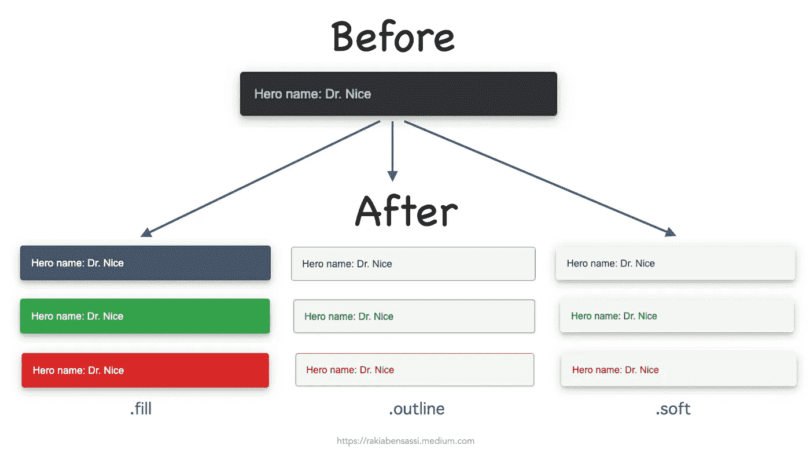

使用 tailwind CSS 前后的 mat-snack bar—作者截图

*   在顶部，您可以看到使用默认样式表的 Angular Material 小吃店的外观。
*   在底部，您可以看到三种外观——`fill`、`outline`和`soft`——用于三种类型的通知:`info`、`success`和`error`。

如果你喜欢看，这里有一个视频版本:

如何用 CSS 创建一个漂亮的 mat-snackbar

# 设置项目

为了构建这些小吃店，我通过运行命令`ng new`创建了一个新的 Angular 应用程序`ng-snackbar-tailwind`:

```
ng new ng-snackbar-tailwind
```

而且我把[角游英雄教程](https://angular.io/tutorial/toh-pt1)里的`heroes`组件加进去了。

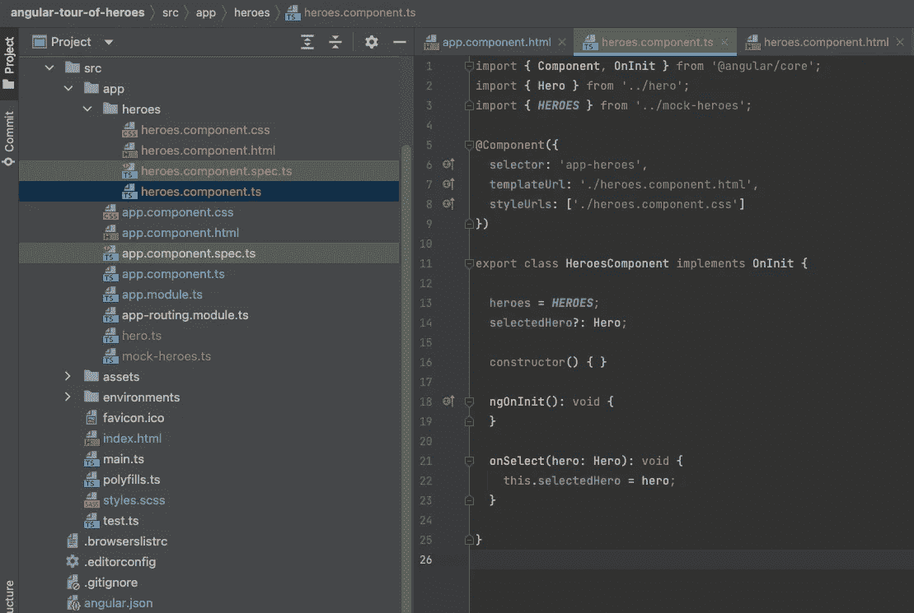

角斗士英雄之旅 app——作者截图

英雄.组件. ts

然后我安装[角材](https://material.angular.io/components/table/overview)如下:

```
ng add @angular/material
```

我选择了`Indigo/pink`作为预建主题，并回答了“是”关于设置全局角度材料排版样式和角度材料浏览器动画的两个问题:

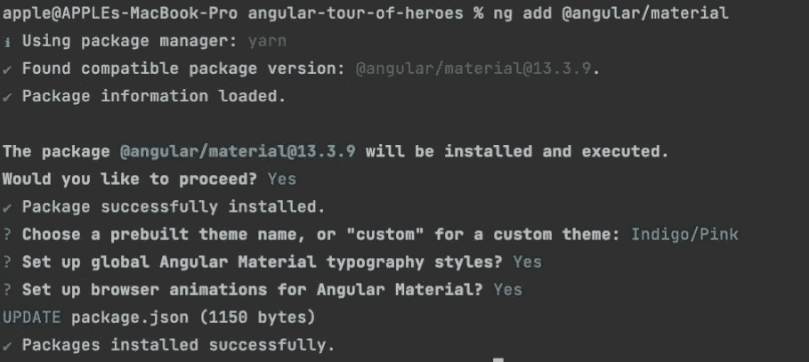

安装角度材料和选择主题—作者截图

这将使用新添加的依赖项更新您的`package.json`文件:

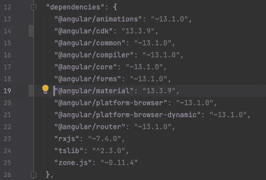

package.json 中的角度材料及其依赖项—作者截图

如果我们现在看一下`heroes`组件中的内容，我们会注意到它只是显示了一个英雄列表，每当用户单击其中一个，他们就可以在底部看到详细信息(id 和姓名):

heroes.component.html

如果我通过运行`ng serve`来部署应用程序，我可以检查它在浏览器上的外观:

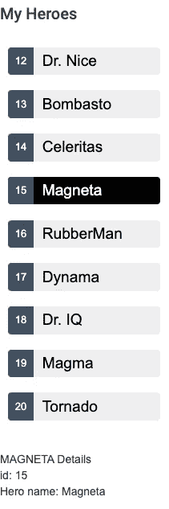

英雄榜——作者截图

# 开小吃店

好吧。让我们回到源代码，调整`heroes.components.ts`如下:

heroes .带 mat-snackbar 的组件

在这里，我在构造函数中注入了`MatSnackBar`，并用英雄的名字调用了`snackbar.open(..)`，作为用户选择英雄时显示的消息。

为此，不要忘记将`MatSnackBarModule`添加到`AppModule`的`imports`模块:

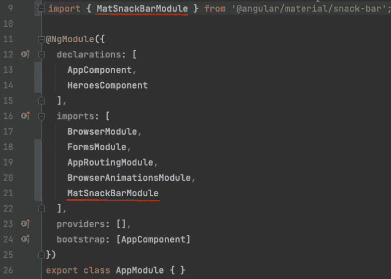

在 AppModule 中导入 MatSnackBarModule 作者截图

正如您所注意到的，我已经向`snackbar`对象的`open(..)`方法传递了一些配置参数:

打开有角的材料棒

*   `duration: 5000`表示我希望我的小吃店在被自动解雇之前等待 5000 毫秒。
*   `verticalPosition: ‘top’`和`horizontalPosition: ‘center’`表示我希望小吃店显示在屏幕的顶部中央。

让我们再次运行`ng serve`并在浏览器上查看我们现在的结果:

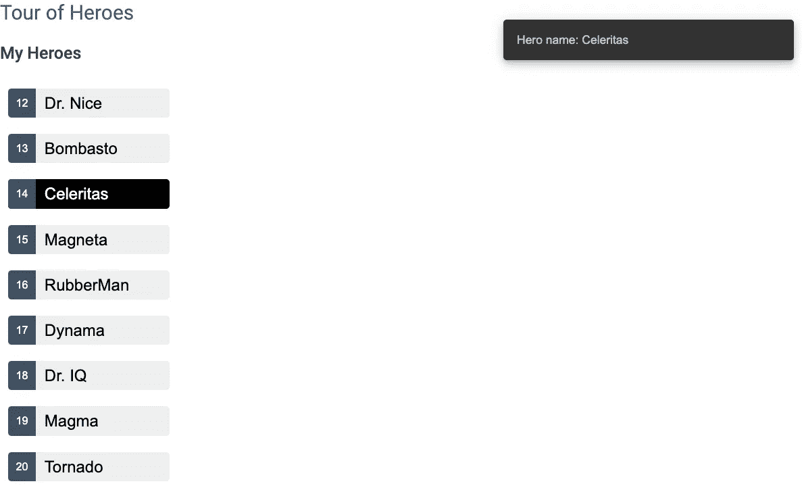

点击英雄名字后显示默认的小吃店——作者截图

# 添加顺风 CSS

下一步是按照顺风文档上的说明将顺风 CSS 添加到项目中:[安装带角度的顺风 CSS](https://tailwindcss.com/docs/guides/angular):

*   首先，我们需要通过运行`npm install -D tailwindcss postcss autoprefixer`来安装`tailwindcss`及其两个依赖项`postcss`和`autoprefixer`。也可以用`yarn`代替`npm`。
*   然后我们需要通过运行`npx tailwindcss init`生成一个`tailwind.config.js`文件。
*   一旦生成了配置文件，我们需要通过添加`"./src/**/*.{html,ts}”`来更新它的`content`块:

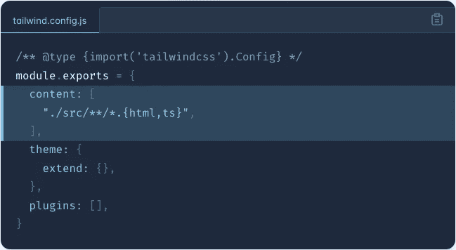

tailwind.config.js — [来源](https://tailwindcss.com/docs/guides/angular)

*   我们还需要向项目中的`/src/styles.scss`文件添加三个指令:

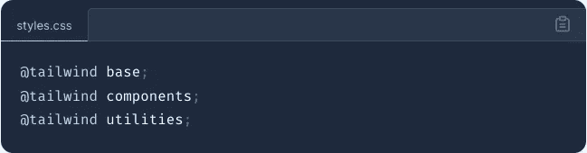

styles.css — [来源](https://tailwindcss.com/docs/guides/angular)

我们准备好出发了。

# 更改默认的 mat-snackbar 样式表

为了使用 tailwind 的实用程序类来设计 Angular Material 小吃店的样式，我将向`/src/styles.scss`添加以下自定义 CSS 类:

要应用于 mat-snackbar 的顺风 CSS 样式表

我想要三种小吃店:`info`、`success`、`error`，三种外观:`fill`、`outline`、`soft`。

在外观上`fill`:

*   我使用`bg-green-600`作为背景色来显示类型为`success`的消息。
*   `bg-red-600`用作背景色，显示类型为`error`的消息。
*   `bg-gray-600`用作背景色，显示类型为`info`的消息。
*   `text-white`用作字体颜色。

让我们回到`heroes.component.ts`并创建一个保存配置参数的变量。我将把`panelClass`参数添加到配置中，这允许我指定一个自定义样式表来应用于小吃店容器。我将把`duration`从 5000 毫秒改为 50000 毫秒，以便能够在浏览器上调整 DevTools 上的 CSS。

最后一步是优化代码设计，并创建一个更可重用的方法来打开小吃店:

开口角形材料棒

我将新方法命名为`openSnackBar()`，它有参数:`message`、`duration`、`appearance`和`type`。

*   `appearance`可以有一个值`'fill’`、`'outline’`或`'soft’`，默认为`'fill’`。
*   `type`可以有值`'info’`、`'success’`或`'error’`，默认为`'info’`。

我还把最后一行`onSelect()`换成了`this.openSnackBar(message, 5000, 'soft', 'info')`。

现在我们可以在浏览器上查看`info`、`success`和`error`类型的结果，以及这三种外观。

如有疑问，留言评论。一如既往的感谢阅读！

# 升级到角度 15°

*(2022 年 12 月 23 日更新)*

如果您在使用[版本 15 的 Angular 和 Angular Material](/angular-15-193cb008e8f3) 的项目中尝试上述样式表，您会注意到您的自定义 CSS 不起作用。无论是成功、错误还是信息消息，您的小吃店都不会改变其背景颜色。

这种回归的原因是角形材料 15 使用[基于材料设计的组件(MDC)](https://levelup.gitconnected.com/angular-upgrade-26d331837012) :

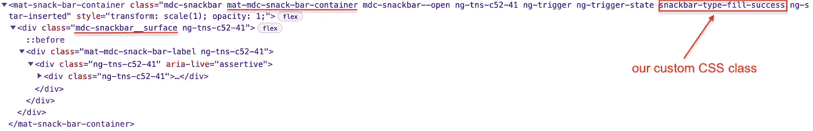

角料 15 小吃店(作者截图)

它的背景颜色覆盖了我们定义的颜色:

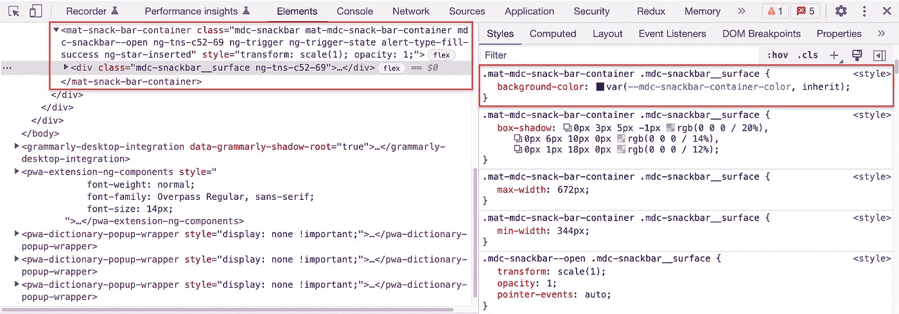

角料 15 小吃店的样式表(作者截图)

但是不要慌！我们会修好它的。

你所需要做的就是把`**.mat-mdc-snack-bar-container**`作为前缀加到`snackbar-type-(appearance)-(messageType)`上，然后在其后加上`**.mdc-snackbar__surface**`。

如果您已经在小吃店中添加了一个按钮，不要忘记将`.mat-button`或`.mat-button-wrapper`改为`.mat**-mdc**-button`。

您还需要通过使用`**@text-white** #{'!important'}`来覆盖`.mat-mdc-snack-bar-container .mdc-snackbar__label`的`**color**`属性的值:

使用角形材料时调整小吃店样式表 15

```
**Want to Connect?**I write about engineering, technology, and leadership for a community of smart, curious people. [Join my free email newsletter for exclusive access](https://rakiabensassi.substack.com/).
```