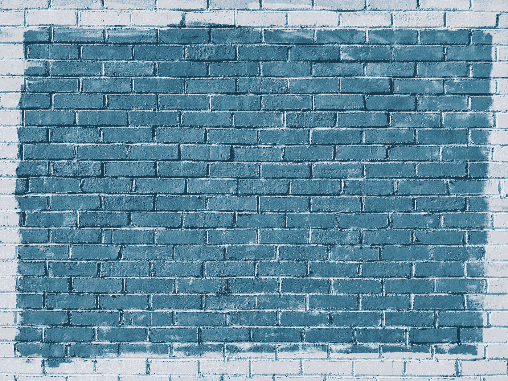
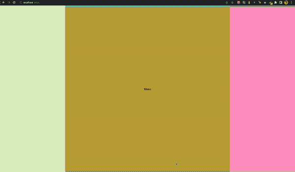

# 如何在 React 中创建类似 Figma 的无限画布

> 原文：<https://betterprogramming.pub/how-to-create-a-figma-like-infinite-canvas-in-react-a2b0365b2a7>

## 为用户创造无限的体验



网页是你的画布。你要做什么？

我最近写了关于如何在 WebGL 中构建无限画布的文章，但是当我开始在无限画布上构建更多想法时，我意识到 HTML 对于原型制作来说是多么简单。所以我想我应该合并两者，在 React 中构建一个无限画布。这允许我利用浏览器提供的所有好处，这些好处必须为 WebGL 重写:拖放、文本、iFrames 等。

对于那些没有阅读过其他文章的人，我建议你至少阅读一下基础部分，尽管阅读全部内容会帮助你理解我在这里使用的代码。在前一篇文章中，我提到了如何在任何框架中实现这种逻辑，我是认真的。我还将展示在 React 中实现会是什么样子。

注意:我已经做了一个代码沙箱，所以你可以查看整个代码并玩它[这里](https://codesandbox.io/s/infinite-canvas-react-nhfbb0?file=/src/index.tsx)

## 即时模式渲染

在我们开始实现之前，让我给你介绍一个计算机图形学中的概念，叫做即时模式渲染。这对于它带来的性能优势是必要的。

> 在即时模式下，场景(渲染图元的完整对象模型)保留在客户端的内存空间中，而不是图形库中。这意味着在即时模式应用中，要呈现的图形对象的列表由客户端保存，而不是由图形库 API 保存。

在 React-land 中，这意味着我们不依赖 React 来呈现整个应用程序。React 通常会保留整个树，并在状态改变时重新渲染树的各个部分。但是你能想象这对一个无限的画布会有什么影响吗？React 跟踪无限中的每个组件，查看并运行每个组件的钩子，并放置它们？退一步说，这将是非常低效的。

相反，我们将控制并告诉 React 渲染什么。我们将保持一个 60fps 的循环，并告诉 React 渲染哪些组件以及在哪里渲染它们。我们将隐藏画布外部的任何组件，因此 React 必须进行足够的渲染来显示内部的元素。它甚至不知道画布之外的元素。

我们如何在 React 中做到这一点？我们编写了一个定制的钩子，在每一个`RequestAnimationFrame`运行一个循环

```
import CanvasStore from "modules/state/CanvasStore";
import { useEffect, useRef, useState } from "react";

class RenderLoop {
  private lastFrameTime: number = 0;
  private lastRequestId: number | null = null;
  constructor(private fps: number = 0, private draw: () => void) {}

  initialize(fps: number) {
    this.fps = fps;
  }

  start() {
    this.lastFrameTime = performance.now();
    this.loop();
  }

  stop() {
    if (this.lastRequestId) cancelAnimationFrame(this.lastRequestId);
    this.lastRequestId = null;
  }

  private get fpsInterval() {
    return 1000 / this.fps;
  }

  private loop() {
    this.lastRequestId = requestAnimationFrame(() => this.loop());
    const now = performance.now();
    const elapsed = now - this.lastFrameTime;
    if (elapsed > this.fpsInterval) {
      this.lastFrameTime = now - (elapsed % this.fpsInterval);
      this.draw();
    }
  }
}

let renderLoop: RenderLoop;
export function getRenderLoop(fps = 15, draw: () => void) {
  if (!renderLoop) return new RenderLoop(fps, draw);
  else return renderLoop;
}

export const useRenderLoop = (fps: number = 15) => {
  const [frame, setFrame] = useState("0");
  const loop = useRef<RenderLoop>(
    getRenderLoop(fps, () => {
      if (CanvasStore.shouldRender) {
        setFrame(`${performance.now()}`);
        CanvasStore.shouldRender = false;
      }
    })
  );

  useEffect(() => {
    CanvasStore.shouldRender = true;
    loop.current.start();

    return () => loop.current.stop();
  }, []);
  return frame;
};

export default useRenderLoop;
```

其工作方式是，当应用程序启动时，我们启动一个 RenderLoop，它一直调用`requestAnimationFrame`，并根据`fps`触发 draw 函数，该函数基于当前时间设置一个帧字符串。每当这个值改变时，状态也会改变，所以我们的根组件会每秒每隔`fps`帧重新渲染一次。

## 履行

既然我们已经在前面的章节中介绍了 React 的使用方法，并在前面的[博客文章](https://medium.com/better-programming/how-to-create-a-figma-like-infinite-canvas-in-webgl-8be94f65674f)中介绍了投影的基础，我们就可以开始实施了。我们可以像上次一样保持我们的预期输出，即创建 9 个大块来测试以下内容

*   放大和缩小画布并查看更多块
*   移动相机，看到不同的街区


我们计划的预期产出。它是一个由许多颜色组成的网格，每个块上都有文字

让我们从如何放置最基本的元素开始。我们需要一个组件，可以在画布上放置任何具有全局坐标的元素。

它获取可见的屏幕(由我们的`CanvasStore`维护，稍后介绍)，并根据我们的屏幕对其进行局部定位。因此，给定我们的屏幕+全局坐标，该组件将其转换为局部坐标，并将其放置在屏幕上。

```
import CanvasStore from "modules/state/CanvasStore";
import { PropsWithChildren } from "react";
import { inBounds } from "./math-utils";

export interface CanvasPosition {
  top: number;
  left: number;
  width: number;
  height: number;
}

export const Position = ({
  left,
  top,
  width,
  height,
  children,
}: PropsWithChildren<CanvasPosition>) => {
  const screen = CanvasStore.screen;
  if (
    inBounds(
      { left, top, height, width },
      {
        left: screen.x,
        top: screen.y,
        width: screen.width,
        height: screen.height,
      }
    )
  ) {
    return (
      <div
        className="absolute inline-block"
        style={{
          left: `${left - screen.x}px`,
          top: `${top - screen.y}px`,
        }}
      >
        {children}
      </div>
    );
  } else return null;
};
```

我们还没有实现`inBounds`功能。这将检查带有全局坐标的矩形在画布中是否可见。重叠逻辑在[该堆栈溢出回答](https://stackoverflow.com/a/306332)中有详细解释。

```
// math-utils.ts
export const radians = (angle: number) => {
  return angle * (Math.PI / 180);
};

interface Rect {
  left: number;
  top: number;
  width: number;
  height: number;
}

export const inBounds = (rect1: Rect, rect2: Rect) => {
  if (
    rect1.left < rect2.left + rect2.width &&
    rect1.left + rect1.width > rect2.left &&
    rect1.top < rect2.top + rect2.height &&
    rect1.top + rect1.height > rect2.top
  )
    return true;
  else return false;
};
```

现在我们知道了如何在画布上放置元素，我们可以构建我们的`InfiniteCanvas`组件并放置 9 个包含文本元素的大块

```
import { RECT_H, RECT_W } from "modules/core/constants";
import { CanvasPosition, Position } from "modules/core/foundation";
import CanvasStore from "modules/state/CanvasStore";
import { memo } from "react";

interface TextBlockProps extends CanvasPosition {
  text: string;
  color: string;
  width: number;
  height: number;
}

const TextBlock = ({
  text,
  color,
  left,
  top,
  width,
  height,
}: TextBlockProps) => {
  return (
    <Position left={left} top={top} width={width} height={height}>
      <div
        className="flex items-center justify-center"
        style={{
          width: `${width}px`,
          height: `${height}px`,
          background: color,
        }}
      >
        {text}
      </div>
    </Position>
  );
};

const InfiniteCanvas = ({ frame }: { frame: string }) => {
  const texts = [
    "Infinite",
    "Canvases",
    "Are",
    "Easy",
    "When",
    "You",
    "Know",
    "The",
    "Fundamentals",
  ];

  const colors = [
    "#f1f7ed",
    "#61c9a8",
    "#7ca982",
    "#e0eec6",
    "#c2a83e",
    "#ff99c8",
    "#fcf6bd",
    "#9c92a3",
    "#c6b9cd",
  ];
  const rectW = RECT_W;
  const rectH = RECT_H;
  const scale = CanvasStore.scale;

  return (
    <div
      className="w-full h-full"
      style={{
        transform: `scale(${(scale.x, scale.y)})`,
        transformOrigin: "top left",
      }}
    >
      {texts.map((text, index) => (
        <TextBlock
          key={index}
          text={text}
          color={colors[index]}
          left={(index % 3) * rectW}
          top={Math.floor(index / 3) * rectH}
          width={rectW}
          height={rectH}
        />
      ))}
    </div>
  );
};

export default memo(InfiniteCanvas);
```

现在我们应该通过构建我们的`CanvasRoot`并将它添加到我们的`ReactDOM`来将它合并到我们的 UI 中:

```
import CanvasStore from "modules/state/CanvasStore";
import { PointerEvent, useEffect, useRef, WheelEvent } from "react";
import useSize from "@react-hook/size";
import InfiniteCanvas from "./InfiniteCanvas";
import useRenderLoop from "modules/core/RenderLoop";

const wheelListener = (e: WheelEvent) => {
  const friction = 1;
  const event = e as WheelEvent;
  const deltaX = event.deltaX * friction;
  const deltaY = event.deltaY * friction;
  if (!event.ctrlKey) {
    CanvasStore.moveCamera(deltaX, deltaY);
  } else {
    CanvasStore.zoomCamera(deltaX, deltaY);
  }
};

const pointerListener = (event: PointerEvent) => {
  CanvasStore.movePointer(event.clientX, event.clientY);
};

const CanvasRoot = () => {
  const canvas = useRef<HTMLDivElement>(null);
  const [width, height] = useSize(canvas);
  useEffect(() => {
    if (width === 0 || height === 0) return;
    CanvasStore.initialize(width, height);
  }, [width, height]);
  const frame = useRenderLoop(60);
  return (
    <div className="w-full h-full">
      <div
        className="w-full h-full relative overflow-hidden overscroll-none"
        ref={canvas}
        onWheel={wheelListener}
        onPointerMove={pointerListener}
      >
        <InfiniteCanvas frame={frame}></InfiniteCanvas>
      </div>
    </div>
  );
};

export default CanvasRoot;
```

我们初始化`CanvasStore`并设置`RenderLoop`，在这里简单地调用我们的`InfiniteCanvas`。

我们还需要将画布容器的宽度和高度传递给`CanvasStore`，这是通过一个我们已经导入的钩子来完成的。现在唯一剩下的部分是`CanvasStore`，它看起来像这样

```
import {
  cameraToScreenCoordinates,
  scaleWithAnchorPoint,
} from "../core/camera-utils";
import { CAMERA_ANGLE, RECT_H, RECT_W } from "../core/constants";
import { radians } from "../core/math-utils";

export interface CanvasState {
  shouldRender: boolean;
  pixelRatio: number; // our resolution for dip calculations
  container: {
    //holds information related to our screen container
    width: number;
    height: number;
  };
  pointer: {
    x: number;
    y: number;
  };
  camera: {
    //holds camera state
    x: number;
    y: number;
    z: number;
  };
}
const getInitialCanvasState = (): CanvasState => {
  return {
    shouldRender: true,
    pixelRatio: window.devicePixelRatio || 1,
    container: {
      width: 0,
      height: 0,
    },
    pointer: {
      x: 0,
      y: 0,
    },
    camera: {
      x: 0,
      y: 0,
      z: 0,
    },
  };
};

let canvasData = getInitialCanvasState();

export default class CanvasStore {
  private static get data() {
    if (!canvasData)
      canvasData = {
        shouldRender: true,
        pixelRatio: window.devicePixelRatio || 1,
        container: {
          width: 0,
          height: 0,
        },
        pointer: {
          x: 0,
          y: 0,
        },
        camera: {
          x: 0,
          y: 0,
          z: 0,
        },
      };
    return canvasData;
  }

  static initialize(width: number, height: number) {
    const containerWidth = width;
    const containerHeight = height;
    canvasData = getInitialCanvasState();
    canvasData.pixelRatio = window.devicePixelRatio || 1;
    canvasData.container.width = containerWidth;
    canvasData.container.height = containerHeight;
    canvasData.camera.x = 1.5 * RECT_W;
    canvasData.camera.y = 1.5 * RECT_H;
    canvasData.camera.z = containerWidth / (2 * Math.tan(CAMERA_ANGLE));
  }
  public static get screen() {
    const { x, y, z } = this.camera;
    const aspect = this.aspect;
    const angle = CAMERA_ANGLE;
    return cameraToScreenCoordinates(x, y, z, angle, aspect);
  }
  public static get camera() {
    return this.data.camera;
  }
  public static get scale() {
    const { width: w, height: h } = CanvasStore.screen;
    const { width: cw, height: ch } = CanvasStore.container;
    return { x: cw / w, y: ch / h };
  }
  public static get shouldRender() {
    return canvasData.shouldRender;
  }
  public static set shouldRender(value: boolean) {
    canvasData.shouldRender = value;
  }

  private static get container() {
    return canvasData.container;
  }

  private static get pointer() {
    return canvasData.pointer;
  }

  private static get aspect() {
    return canvasData.container.width / canvasData.container.height;
  }

  private static isCameraInBounds(
    cameraX: number,
    cameraY: number,
    cameraZ: number
  ) {
    return true;
  }

  public static moveCamera(mx: number, my: number) {
    const scrollFactor = 1.5;
    const deltaX = mx * scrollFactor,
      deltaY = my * scrollFactor;
    const { x, y, z } = this.camera;
    if (this.isCameraInBounds(x + deltaX, y + deltaY, z)) {
      this.data.camera.x += deltaX;
      this.data.camera.y += deltaY;
      // move pointer by the same amount
      this.shouldRender = true;
      this.movePointer(deltaY, deltaY);
    }
  }

  public static zoomCamera(deltaX: number, deltaY: number) {
    // Normal zoom is quite slow, we want to scale the amount quite a bit
    const zoomScaleFactor = 10;
    const deltaAmount = zoomScaleFactor * Math.max(deltaY);
    const { x: oldX, y: oldY, z: oldZ } = this.camera;
    const oldScale = { ...this.scale };

    const { width: containerWidth, height: containerHeight } = this.container;
    const { width, height } = cameraToScreenCoordinates(
      oldX,
      oldY,
      oldZ + deltaAmount,
      CAMERA_ANGLE,
      this.aspect
    );
    const newScaleX = containerWidth / width;
    const newScaleY = containerHeight / height;
    const { x: newX, y: newY } = scaleWithAnchorPoint(
      this.pointer.x,
      this.pointer.y,
      oldX,
      oldY,
      oldScale.x,
      oldScale.y,
      newScaleX,
      newScaleY
    );
    const newZ = oldZ + deltaAmount;
    this.shouldRender = true;
    if (this.isCameraInBounds(oldX, oldY, newZ)) {
      this.data.camera = {
        x: newX,
        y: newY,
        z: newZ,
      };
    }
  }

  // pointer position from top left of the screen
  public static movePointer(deltaX: number, deltaY: number) {
    const scale = this.scale;
    const { x: left, y: top } = this.screen;
    this.data.pointer.x = left + deltaX / scale.x;
    this.data.pointer.y = top + deltaY / scale.y;
  }
}
```

我们在之前的帖子中已经讨论过这个`CanvasStore`背后的逻辑，所以如果你仍然困惑，我建议你去看看那篇帖子，以便更加清晰。唯一附加的部分是一个`shouldRender`布尔的概念。

如果什么都没有改变，我们不想在`60fps`渲染整棵树。所以我们只在 UI 中出现新的东西时设置`shouldRender`。这是一个优化，应该使我们的代码更具性能

这就是我们把所有东西放在一起的结果。



具有滚动和收缩缩放功能的无限画布

我希望你在许多工具和框架中学习并体验了更多的无限画布。我相信它们是你能给用户的最强有力的体验之一，这个概念给了我很多灵感。祝您旅途顺利，并继续打造美好的事物:)