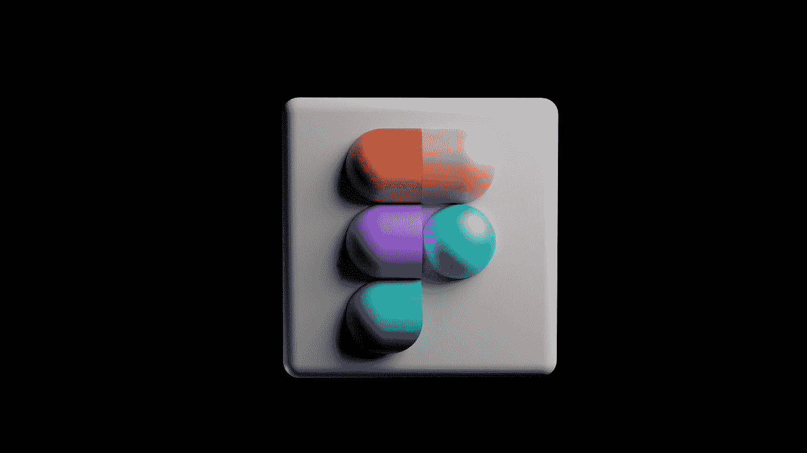
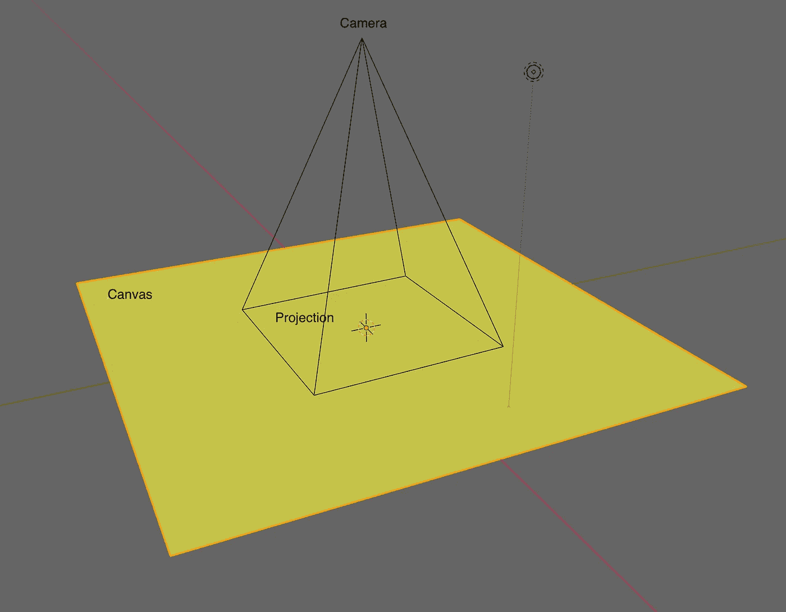
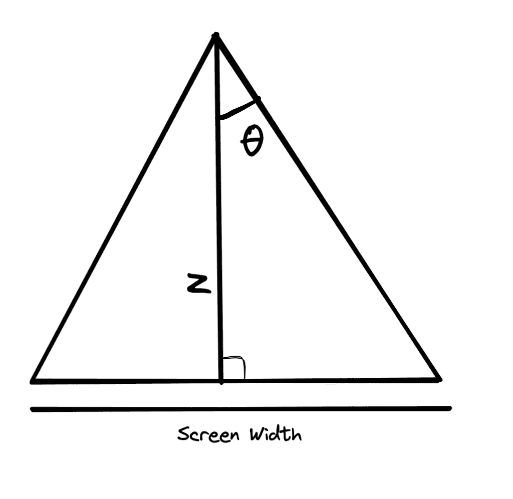
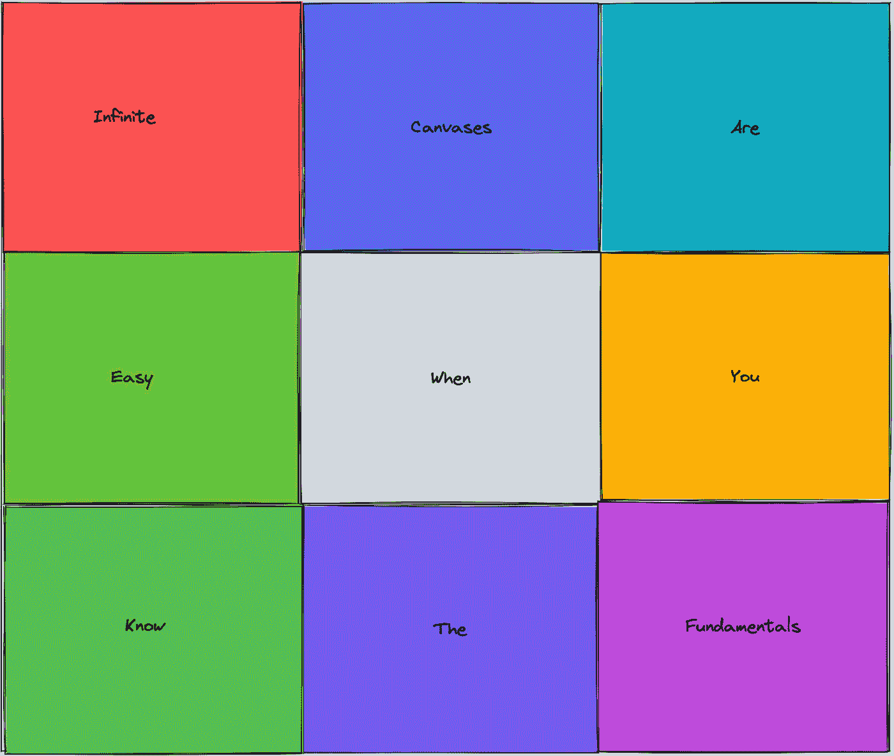
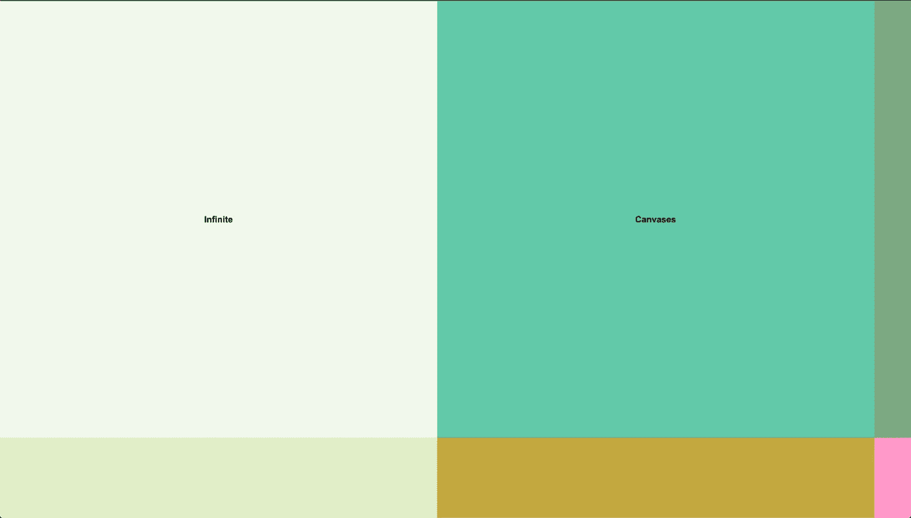
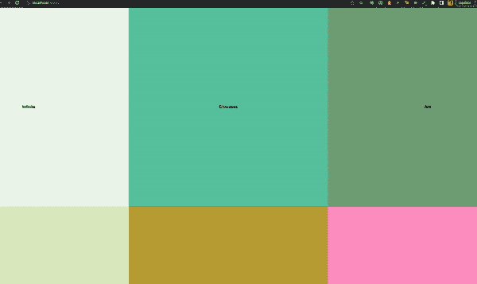
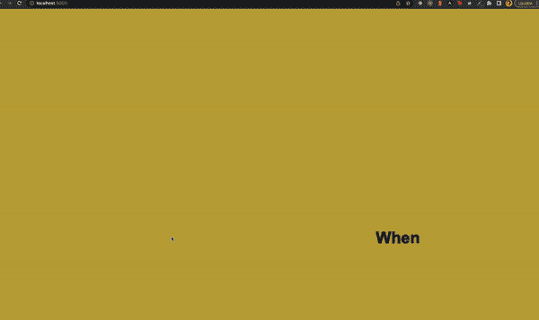

# 如何在 WebGL 中创建类似 Figma 的无限画布

> 原文：<https://betterprogramming.pub/how-to-create-a-figma-like-infinite-canvas-in-webgl-8be94f65674f>

## 关于如何做一个简单的 2D 相机投影来模拟一个无限的画布的初级读本



由 [Unsplash](https://unsplash.com?utm_source=medium&utm_medium=referral) 上的 [Shubham Dhage](https://unsplash.com/@theshubhamdhage?utm_source=medium&utm_medium=referral) 拍摄的照片

无限画布是你能给用户的最美的体验之一。互联网的好处之一是我们可以创造在现实世界中不可能获得的体验。您可以在 Blender 中构建任意宽任意远的 3D 模型，而不受现实世界的任何空间限制。

然而，无限画布并不是新发明。3D 工具已经有很长时间了，游戏引擎和其他创作工具也是如此。如果我们选择接受它，我们的挑战是将我们需要的来自这些现有工具的想法合并起来，并构建我们自己的简化版本。

# 基础

为了做到这一点，我们需要首先了解什么是三维投影。无限画布背后的思想是，有一个世界(所有物体都放在那里)，有一个相机(相机只是世界的投影)。用户看到的就是相机投射的东西。用户可以在摄像机周围随意移动。这样，世界可以存在于看似无限的空间中，你可以沿着 x-y 轴的正负走向无限。如果需要，您可以限制相机只显示一个区域，但是如果您愿意，您也可以允许在画布上进行无限的探索。

对于 3D 投影来说，这样做的方式很吸引人，但是对于我们来说，实现投影矩阵可能有点大材小用。由于我们是在类似 Figma 的画布上模拟 2D 世界，我们的数学看起来简单多了，只需要记住一些几何概念。



摄像机在画布上对某个区域的投影

在我们的例子中，我们的相机是 z 轴上的一个点，它总是指向我们的 x-y 平面。我们可以通过将相机限制在某些 z 值来控制允许的缩放比例。我们的画布可以在 x 轴和 y 轴上无限延伸。

首先，我们需要找到我们的初始投影。这意味着我们需要找到最初放置相机的位置。我们只想在浏览器上投射足够的画布。如果用户看不到画布，就没有必要在画布上绘制更多的内容。所以我们将使用浏览器屏幕的长宽比。

为了得出我们的方程，让我们试着在画布上画一个区域。我们将从在 x-y 平面上从(0，0)到(屏幕宽度，屏幕高度)投影画布开始。让我们试着想想把相机放在哪里，这样我们就能看到这个区域了。相机的 x 和 y 坐标很简单。我们将把它们放在投影的中间，向下看。所以 x 和 y 坐标是(屏幕宽度/ 2，屏幕高度/ 2)。

为了放置我们相机的 z 坐标，我们需要设置一个常数，这个常数将保持不变，与变焦或相机的位置无关。这个常数就是摄像机的角度。我们将保持 30 度，但我们也可以用不同的值进行实验。

一旦我们知道了我们的角度，我们就有可能找到相机的高度。但在此之前，让我们先复习一些简单的几何概念



计算摄像机高度的图表

```
tan θ is also called as **law of tangent**. The tangent formula for a right-angled triangle can be defined as the ratio of the opposite side of a triangle to the adjacent side.Tan(θ) = (ScreenWidth / 2) / z
z = ScreenWidth / (2 * Tan(θ))
```

一旦我们有了这个公式，我们就可以放置摄像机。每当我们移动摄像机，我们就可以用上面的公式计算出投影矩形的宽度。一旦你算出了宽度，我们就可以推导出浏览器屏幕的长宽比。我们希望保持相同纵横比的原因是，我们不想绘制超出用户所能看到的内容。

# 履行

既然我们已经了解了无限画布的 2D 投影背后的主要概念，我们可以进入实现阶段了。在我们进入状态管理和逻辑之前，让我们对我们正在构建的东西建立期望。我们想测试一些东西-

*   我们应该放大和缩小画布，看到更多的画布
*   我们应该能够左右移动相机，看到画布的不同部分

为了测试这些东西，这是我们能做的最简单的概念证明，它将测试我们所有的条件-



我们计划的预期产出。它是一个由许多颜色组成的网格，每个块上都有文字

这个想法是，我们在每个块的中间画一堆不同颜色和不同文字的块。我们最初将相机设置在画布的中间，然后当我们缩放和滚动时，我们可以看到我们无限的画布在运动。

我将使用 Pixi.js 作为我们的 WebGL 库来进行绘制，但是绘制的确切框架并不重要。状态管理和逻辑可以用任何库和语言来理解和实现。一旦奠定了基础，它就可以随处使用。

```
import { Application, Container, Graphics, Text } from "pixi.js";
// Listener that will host our zoom and strafe camera actions
const wheelListener = (e: Event) => {
  e.preventDefault();
  e.stopPropagation();
};
// Listener to keep track of our pointer. Used for accurate zoom
const pointerListener = (event: PointerEvent) => {
  CanvasStore.movePointer(event.offsetX, event.offsetY);
};
class App {
  // Draws blocks with texts in the middle of them
  private drawCanvas() {
    const container = new Container();
    const colors = [
      0xf1f7ed, 0x61c9a8, 0x7ca982, 0xe0eec6, 0xc2a83e, 0xff99c8, 0xfcf6bd,
      0x9c92a3, 0xc6b9cd,
    ];
    const texts = [
      "Infinite",
      "Canvases",
      "Are",
      "Easy",
      "When",
      "You",
      "Know",
      "The",
      "Fundamentals",
    ];
    const rectW = 500;
    const rectH = 500;
    for (let i = 0; i < 9; i++) {
      const block = new Container();
      const randomColor = colors[i];
      const bg = new Graphics();
      const leftOffset = (i % 3) * rectW;
      const topOffset = Math.floor(i / 3) * rectH;
      bg.beginFill(randomColor);
      bg.drawRect(leftOffset, topOffset, rectW, rectH);
      bg.endFill();
      block.addChild(bg);
      const textElement = new Text(texts[i], {
        fontSize: 10,
        fill: 0x000000,
        fontWeight: "700",
        wordWrap: false,
      });
      textElement.anchor.set(0.5);
      textElement.position.set(leftOffset + block.width / 2, topOffset + block.height / 2);
      block.addChild(textElement);
      container.addChild(block);
    }
    return container;
  }
  attach(root: HTMLElement) {
    const app = new Application({
      width: document.body.clientWidth,
      height: document.body.clientHeight,
      backgroundColor: 0xffffff,
      resolution: 2,
      antialias: true,
      autoDensity: true,
    });
    root.appendChild(app.view);
    const canvas = this.drawCanvas();
    app.stage.addChild(canvas);
    root.addEventListener("mousewheel", wheelListener, { passive: false });
    root.addEventListener("pointermove", pointerListener, {
      passive: true,
    });
  }
  detach(root: HTMLElement) {
    root.removeEventListener("mousewheel", wheelListener);
    root.removeEventListener("pointermove", pointerListener);
  }
}
// Loading and Unloading logic for our app
let _app: App | null;
window.onload = () => {
  _app = new App();
  _app.attach(document.body);
};
window.onbeforeunload = () => {
  if (_app) _app.detach(document.body);
};
```



在没有投影和滚动/缩放的情况下，我们当前的输出是什么样的

## 状态管理

我们现在已经画出了我们的画布，但我们无法欣赏它所有的辉煌。我们既不能滚动也不能放大。这是因为我们还没有设置我们的摄像机，所以让我们从这开始。现在，我们将保留一个名为 CanvasStore 的单例，它保存我们的逻辑和相机状态。根据应用程序的规模和需求，我们可以将所有这些迁移到更好的结构中，但这不是概念验证所必需的。

```
interface CanvasState {
  pixelRatio: number; // our resolution for dip calculations
  container: {   //holds information related to our screen container
    width: number;
    height: number;
  };
  camera: {  //holds camera state
    x: number;
    y: number;
    z: number;
  };
}
export const getInitialCanvasState = (): CanvasState => {
  return {
    pixelRatio: window.devicePixelRatio || 1,
    container: {
      width: 0,
      height: 0,
    },
    camera: {
      x: 0,
      y: 0,
      z: 0,
    },
  };
};
const radians = (angle: number) => {
  return angle * (Math.PI / 180);
};
export const CAMERA_ANGLE = radians(30);
export const RECT_W = 500;
export const RECT_H = 500;
export default class CanvasStore {
  private static get data() {
    if (!canvasData) canvasData = {
    pixelRatio: window.devicePixelRatio || 1,
    pixelsPerFrame: 1,
    container: {
      width: 0,
      height: 0,
    },
    pointer: {
      x: 0,
      y: 0,
    },
    canvas: {
      width: 0,
      height: 0,
    },
    camera: {
      x: 0,
      y: 0,
      z: 0,
    },
  };
    return canvasData;
  }
static initialize(width: number, height: number) {
    const containerWidth = width;
    const containerHeight = height;
    canvasData = getInitialCanvasState();
    canvasData.pixelRatio = window.devicePixelRatio || 1;
    canvasData.container.width = containerWidth;
    canvasData.container.height = containerHeight;
    canvasData.camera.x = 1.5 * RECT_W;
    canvasData.camera.y = 1.5 * RECT_H;
    canvasData.camera.z = containerWidth / (2 * Math.tan(CAMERA_ANGLE));
  }
public static get screen() {
    const { x, y, z } = this.camera;
    const aspect = this.aspect;
    const angle = radians(30);
    return cameraToScreenCoordinates(x, y, z, angle, aspect);
  }
public static get camera() {
    return this.data.camera;
  }
public static get scale() {
    const { width: w, height: h } = CanvasStore.screen;
    const { width: cw, height: ch } = CanvasStore.container;
    return { x: cw / w, y: ch / h };
  }
```

上面代码块中的一个重要概念是`initialize`方法，它设置了以下值

*   如果需要，存储我们的`pixelRatio`进行密度独立像素计算
*   存储浏览器上画布元素的高度和宽度(目前是整个文档体，但可以是任意大小)
*   计算并设置我们的初始摄像机位置。它在我们 9 个街区的中间。每个块的尺寸为`RECT_W` x `RECT_H`。在这篇文章的开始，我们已经列出了相机高度的公式

另一个重要的概念是这个函数`cameraToScreenCoordinates`，我们还没有讲到。这个函数的工作方式是，它获取相机坐标、相机角度、容器纵横比，并向我们返回用户可见的无限画布部分。因此，我们可以只显示这个函数的返回值指定的矩形，用户将看到摄像机看到的内容。

```
export const cameraToScreenCoordinates = (
  x: number,
  y: number,
  z: number,
  cameraAngle: number,
  screenAspect: number
) => {
  const width = 2 * z * Math.tan(CAMERA_ANGLE);
  const height = width / screenAspect;
  const screenX = x - width / 2;
  const screenY = y - height / 2;
return { x: screenX, y: screenY, width, height };
};
```

## 整合摄像机投影

现在我们已经设置了逻辑和状态，我们需要将它连接到我们的显示代码，以便我们只看到和绘制要显示给用户的摄像机投影。我们这样做的方法是，我们必须重写我们上面使用的`attach` 函数。现在看起来是这样的:

```
attach(root: HTMLElement) {
    CanvasStore.initialize(
      document.body.clientWidth,
      document.body.clientHeight
    );
    const app = new Application({
      width: document.body.clientWidth,
      height: document.body.clientHeight,
      backgroundColor: 0xffffff,
      resolution: 2,
      antialias: true,
      autoDensity: true,
    });
    root.appendChild(app.view);
    const canvas = this.drawCanvas();
    app.stage.addChild(canvas);
    app.ticker.add(() => {
      const { x, y } = CanvasStore.screen;
      const scale = CanvasStore.scale;
      canvas.position.set(-scale.x * x, -scale.y * y);
      canvas.scale.set(scale.x, scale.y);
    });
    root.addEventListener("mousewheel", wheelListener, { passive: false });
    root.addEventListener("pointermove", pointerListener, {
      passive: true,
    });
  }
```

我们已经在应用程序开始时初始化了我们的存储，每一帧，我们都在重新定位我们的应用程序，将`CanvasStore.screen` 提到的区域移动到(0，0)和(屏幕宽度，屏幕高度)。

所以现在，基于比例和位置，只有相机投影对用户可见。我们还可以添加一个遮罩，只根据屏幕大小来绘制部分，但这是留给用户的练习。

## 用锚点实现滚动和缩放

现在我们已经设置了我们的显示和状态，我们可以进入本教程最重要和最有趣的部分——让事物移动。无限画布的全部好处是可以到处乱搞和移动。让我们来看看我们将放在`CanvasStore`中的滚动函数:

```
public static moveCamera(mx: number, my: number) {
    const scrollFactor = 1.5;
    const deltaX = mx * scrollFactor;
    const deltaY = my * scrollFactor;
    const { x, y, z } = this.camera;
    this.data.camera.x += deltaX;
    this.data.camera.y += deltaY;
    // move pointer by the same amount
    this.movePointer(deltaY, deltaY);
  }
public static movePointer(deltaX: number, deltaY: number) {
    const scale = this.scale;
    const { x: left, y: top } = this.screen;
    this.data.pointer.x = left + deltaX / scale.x;
    this.data.pointer.y = top + deltaY / scale.y;
  }
```

这里面的逻辑非常简单，我们根据滚动的量来移动摄像机和指针。我们也有一个滚动因子，所以我们可以加快或减缓滚动行为。为什么我们要保持指针的位置？当我们开始实现下一部分——使用锚点滚动时，我们会明白这一点。描述这种行为的最佳方式是展示它



向指针位置目标缩放(在文本元素处)

在上面的放大图中，你可以看到我们检测到用户的指针位置，并确保放大到他们的指针停留的地方。我们这样做的方法是，我们改变比例，但也滚动画布一点点，使指针仍然指向相同的像素。既然我们已经理解了这种行为是如何工作的，我们就可以深入逻辑了:

```
const scaleWithAnchorPoint = (
  anchorPointX: number,
  anchorPointY: number,
  cameraX1: number,
  cameraY1: number,
  scaleX1: number,
  scaleY1: number,
  scaleX2: number,
  scaleY2: number
) => {
  const cameraX2 =
    (anchorPointX * (scaleX2 - scaleX1) + scaleX1 * cameraX1) / scaleX2;
  const cameraY2 =
    (anchorPointY * (scaleY2 - scaleY1) + scaleY1 * cameraY1) / scaleY2;
return { x: cameraX2, y: cameraY2 };
};
public static zoomCamera(deltaX: number, deltaY: number) {
    // Normal zoom is quite slow, we want to scale the amount quite a bit
    const zoomScaleFactor = 10;
    const deltaAmount = zoomScaleFactor * Math.max(deltaY);
    const { x: oldX, y: oldY, z: oldZ } = this.camera;
    const oldScale = { ...this.scale };
const { width: containerWidth, height: containerHeight } = this.container;
    const { width, height } = cameraToScreenCoordinates(
      oldX,
      oldY,
      oldZ + deltaAmount,
      this.cameraAngle,
      this.aspect
    );
    const newScaleX = containerWidth / width;
    const newScaleY = containerHeight / height;
    const { x: newX, y: newY } = scaleWithAnchorPoint(
      this.pointer.x,
      this.pointer.y,
      oldX,
      oldY,
      oldScale.x,
      oldScale.y,
      newScaleX,
      newScaleY
    );
    const newZ = oldZ + deltaAmount;
    this.data.camera = {
      x: newX,
      y: newY,
      z: newZ,
    };
  }
```

我们现在可以将它集成到上面定义的滚轮处理程序中:

```
const wheelListener = (e: Event) => {
  e.preventDefault();
  e.stopPropagation();
  const friction = 1;
  const event = e as WheelEvent;
  const deltaX = event.deltaX * friction;
  const deltaY = event.deltaY * friction;
  if (!event.ctrlKey) {
    CanvasStore.moveCamera(deltaX, deltaY);
  } else {
    CanvasStore.zoomCamera(deltaX, deltaY);
  }
};
```

做完这些，我们终于可以看看我们无限画布的输出了。我们从第五块中间的摄像机开始，我们滚动、缩小和放大文本几次，以显示它是如何一起工作的。



# 结论

这是关于如何做一个简单的 2D 相机投影来模拟一个无限的画布的初级读本。剩下的唯一事情就是把东西放在无限的画布上，这个相机系统理论上应该能够容纳和显示任意数量的内容，这取决于用例。我一直对有 Canvas 接口的 creator 工具很着迷，很好奇想看看别人上来的是什么。

如果你喜欢这个教程，并希望看到更多这样的内容，请喜欢，分享和评论，也许我会做一些更复杂的深入项目。前进，建造东西。