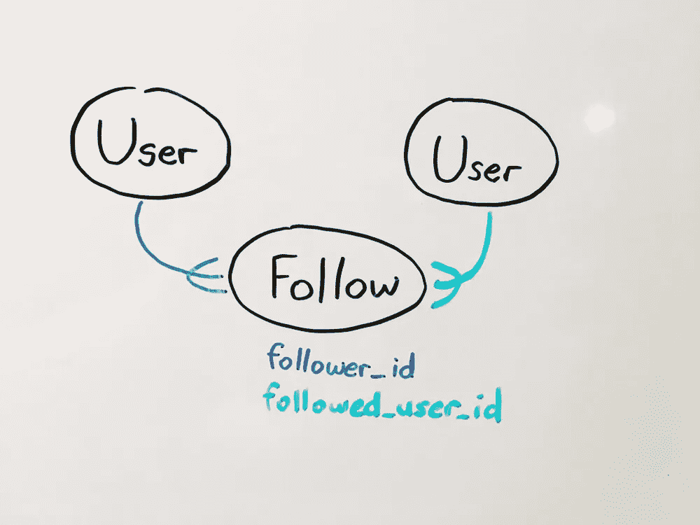
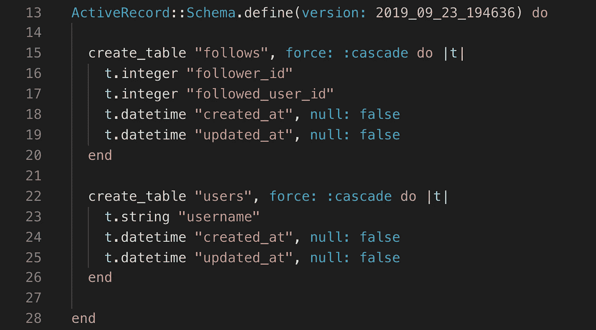

# 如何通过别名关联在 Rails 中创建跟随特征

> 原文：<https://betterprogramming.pub/how-to-create-a-follow-feature-in-rails-by-aliasing-associations-30d63edee284>

## 使用宏创建关联方法


本·科尔德在 [Unsplash](https://unsplash.com?utm_source=medium&utm_medium=referral) 上的照片

为了让用户能够在你的 Rails 应用中关注其他用户，你需要创建一个关注列表。下表将是一个连接表，它将用户表连接到自身。

现在，将表连接到自身的连接表有点令人费解。下表当然不能有两个`user_id`列。幸运的是，Rails 提供了别名关联的能力。我们可以告诉 Rails，一个 ID 是做以下事情的用户，另一个是被跟踪的用户。

请参见下图:



一个用户作为关注者有很多关注者，一个用户作为被关注用户有很多关注者。我在这个图上画了两个用户模型，好像它们是分开的，但实际上它们是同一个模型。为了便于理解，这里将它们分开。

现在我们已经了解了我们打算建立的关联，让我们开始吧。

# 创建下表

在 Rails 应用程序目录下的终端中，运行以下代码或类似的代码，以便将 follows 表添加到数据库中。

```
rails g model Follow follower_id:integer followed_user_id:integer
```

这将生成一个用于创建表的迁移文件，以及我们稍后将使用的模型文件。

在这里，`follower_id`列保存了为其他用户提供关注的用户实例的 ID，而`followed_user_id`将保存被关注的用户的 ID。

确保运行`rails db:migrate`，并检查您的模式看起来与下面类似。



请注意，我们已经有了一个用户表

# 概念理解

在我们继续之前，让我们确保您了解我们最终要在这里构建什么。

当创建用户和关注者之间的关联时，实际上有两个最终目标——第一个是让给定的`user`实例能够调用`user.followers`来查看他们所有的关注者。第二个是用户能够调用`user.followed_users`来查看他们关注的所有用户。

这两个最终目标都需要一个两步的过程。1.别名化用户表和 follows 表之间的多对多关联。2.别名化用户和用户之间的 has-many-through 关联。这是双向进行的。

follower(用户)-> follows -> followed_users(用户)

追随者 _ 用户(用户)->追随者->追随者(用户)

一个 followed_user 有很多关注他们的用户(关注者)，一个关注者有很多他们关注的用户(followed_users)。

# 别名关联

让我们将下表连接到 users 表。我们将首先建立一个`followed_user`和他们的追随者之间的 has-many 关系。

## 关注属于用户(关注者和被关注用户)

您可以告诉 ActiveRecord 允许您能够呼叫`user.followers`或`user.followed_users`。

**注意:**如果我提供的命名约定令人困惑，考虑将`user.followed_users`重命名为类似于`user.users_they_follow`的名称，或者任何适合您的名称。

参见第 3 行和第 6 行

让我们把注意力集中在 3 号线上。这里，我们告诉 Rails 创建一个名为`follower`的实例方法，以返回在给定 follow 实例中关注其他人的用户实例。

行`foreign_key: :follower_id`告诉 Rails 在下表中的属性`:follower_id`下查找 ID。然后，它获取这个 ID 并查看第`class_name: “User”`行，这告诉 Rails 在 users 表的 ID 列中搜索给定的 ID。将返回具有所述 id 的用户实例。

基本上，为了获得关注者，Rails 将使用`follower_id`并尝试找到具有该 ID 的用户。

第 6 行是另一个用户——被跟踪的用户。给定一个`follow_instance`，我们可以调用`follow_instance.followed_user`来返回第一个用户跟随的用户的用户实例。

Rails 将在下表中的`followed_user_id`列下查找被跟踪的用户实例的 ID。然后，它将在 users 表中搜索有问题的用户，并将其返回。

就像前面一样，Rails 基本上是采用`followed_user_id`，找到具有该 ID 的对应用户，并返回它。

## 用户有许多已收到的关注

与任何隶属于关联一样，在另一个模型上也有一个伴随的 has-many 关联。

让我们从能够看到用户实例的关注者开始。在这种情况下，我们需要告诉我们的用户，它有许多 follow 实例，其中用户是被关注的对象。也许我们可以尝试创建调用`user.received_follows`的功能，以获得所有 follow 实例的数组，其中用户的 ID 列在`followed_user_id`属性下。

**注意:** `has_many :follows`不够用。如果你要打电话给`user.follows`，你怎么知道这个用户是关注者还是被关注者？

让我们首先关注第 3 行——这里，我们正在创建`received_follows`的实例方法。就像前面一样，当我们编写选项`foreign_key: :followed_user_id, class_name: “Follow”`时，我们告诉 Rails 检查 follow 表的`followed_user_id`列，并搜索`followed_user_id`匹配用户 ID 的 follow 实例。

## 用户通过收到的关注拥有许多关注者

让我们现在专注于第 6 行。这是一切汇集的地方。

```
has_many :followers, through: :received_follows, source: :follower
```

这里，我们正在创建一个名为`followers`的实例方法。注意`:received_follows`和`:follower`的使用，这是我们之前创建的两个方法。

在常规的 has-many-through 关系中，我们首先选择列有实例 ID 的连接表中的所有实例。这将在连接表中返回一个实例数组，然后我们通过使用由`belongs_to`方法创建的实例方法将它映射到一个不同的模型实例。

这里，我们做同样的事情——我们只是告诉 Rails 什么是连接表，以及我们将它映射到什么。

通过`:received_follows`部分指定`user.received_follows`是连接表实例。事实上，它返回一个 follow 实例数组，其中所讨论的用户是 followed _ user。

接下来，Rails 将 follow 实例映射到它们对应的 follower(一个用户实例)。代码行`source: :follower`告诉 Rails 通过对每个实例调用`.follower`来映射从`received_follows`返回的 follow 实例数组。这将创建一个用户实例数组，所有这些实例都是给定用户的追随者。

这将把关注者转换成给`followed_user`一个关注的用户。很好。

# 为用户追随的用户的关联设置别名

如前所述，实际上有两个最终目标。我们让自己能够调用`user.followers`来获取用户关注者的数组，但是如何获取用户关注的用户的数组呢？为此，我们还需要建立“多对多”和“多对多”协会。

这个概念基本上保持不变，但是所引用的列和方法会有所不同。

让我们将以下内容添加到用户模型中。

参见第 11 行和第 14 行

## 用户有许多给定的追随者

对于第 11 行，我们使用`has_many`宏来创建实例方法`:given_follows`，它将返回一个 follows 数组，其中用户是 follower。它通过查看下表(`class_name: “Follow”`)并搜索所有`:followed_user_id`是用户 ID ( `foreign_key: :followed_user_id`)的 follow 实例来实现这一点。

## 用户有许多以下通过给定的以下

最后，第 14 行创建了一个实例方法，用于获取用户关注的所有用户。它运行`:given_follows`(我们在第 11 行创建的)来获取 join 实例，然后通过在每个实例上调用`:followed_user`(我们在第 6 行的`our follow.rb`文件中创建的，见上文)来映射它们。这将返回一个用户数组。

# 结论

你现在应该可以调用`user.followers`和`user.followings`了。现在，你可以使用这些方法在你的应用程序中显示社交媒体订阅源或计算用户的关注度。

感谢您的阅读，祝您编码愉快。