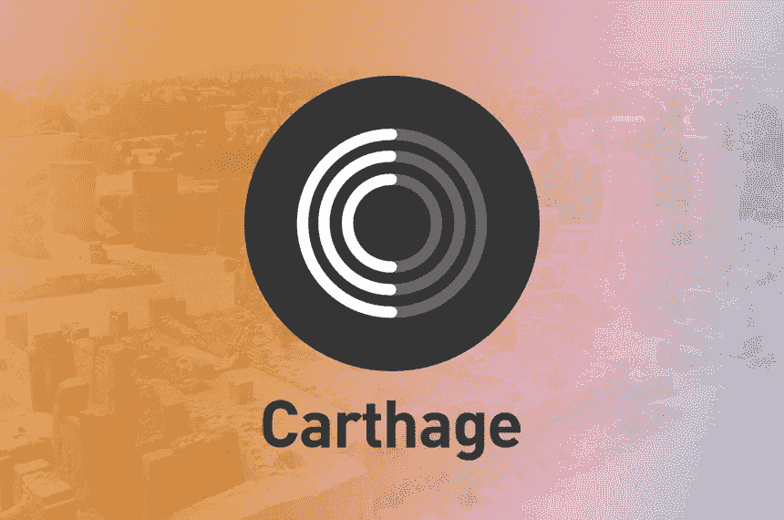
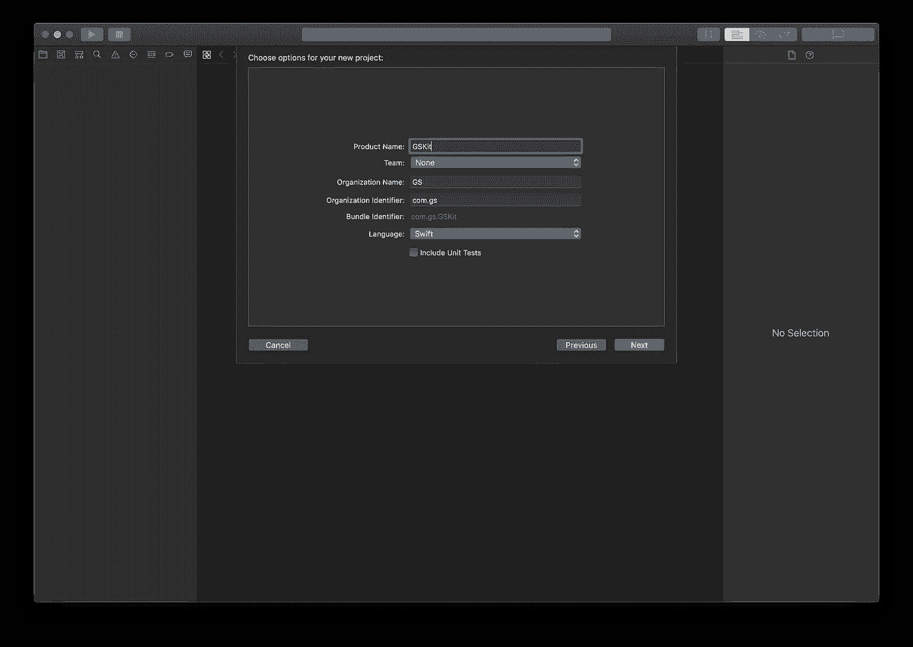
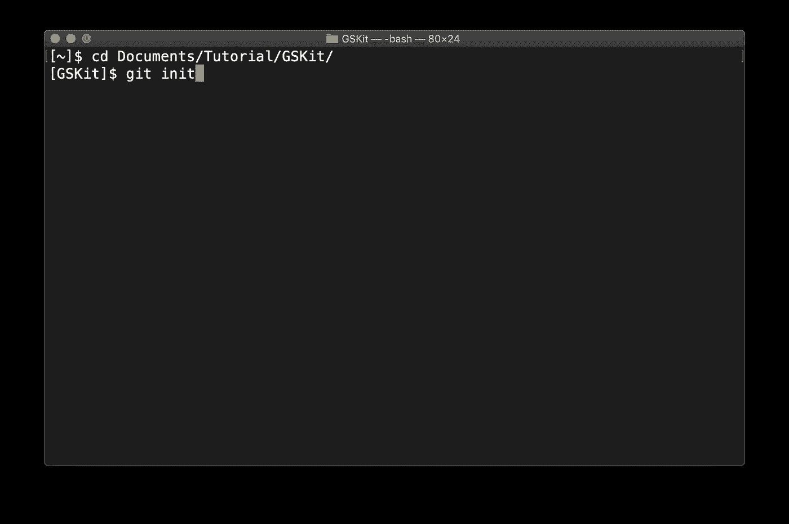
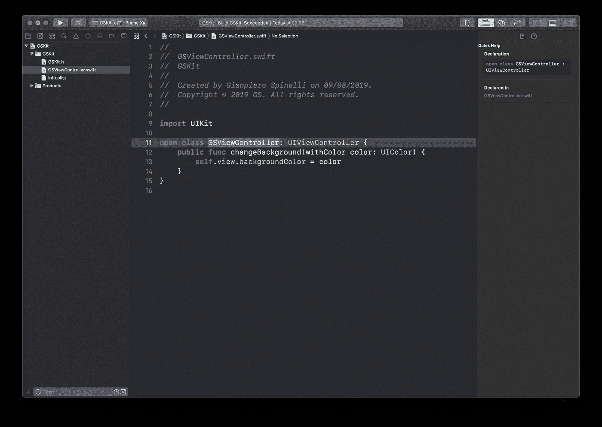
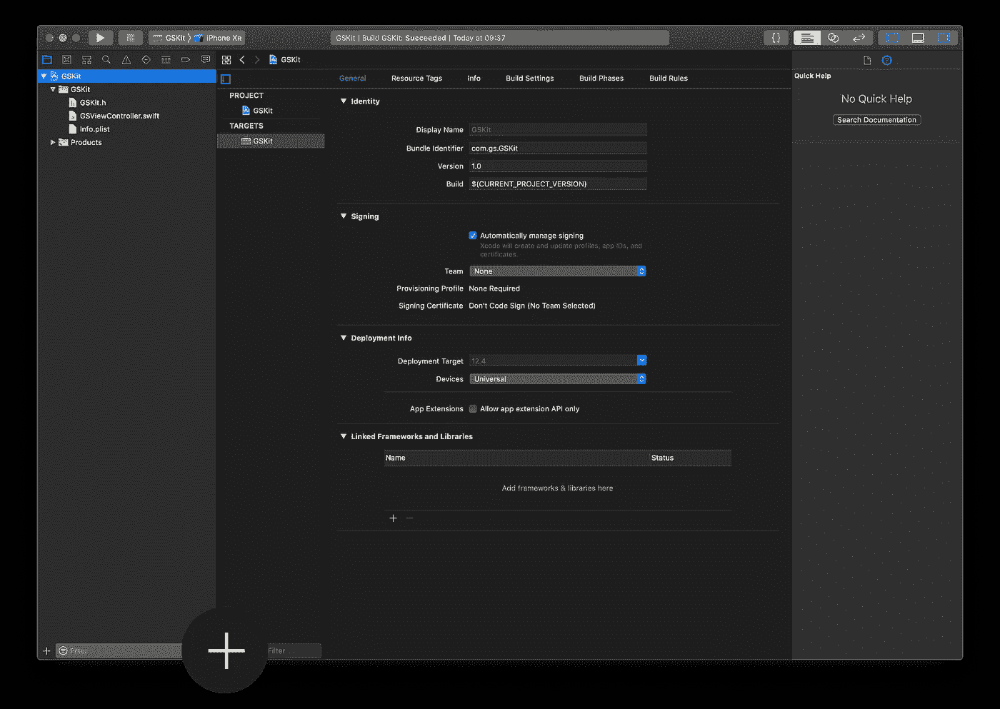
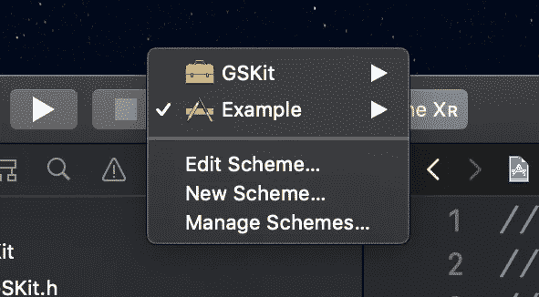
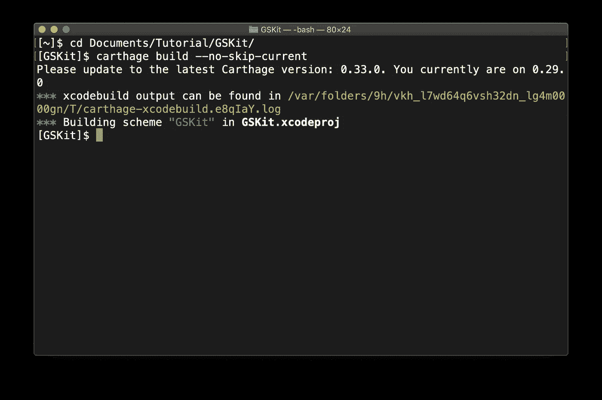

# 如何创建一个支持 Carthage 的框架

> 原文：<https://betterprogramming.pub/how-to-create-a-framework-with-carthage-support-c30b596d3a7a>

## 简化的框架管理



也许你想知道迦太基是什么。Carthage 是 cocoa 的分散依赖管理器。那是什么意思？这意味着它通过处理所有依赖于框架管理的问题简化了我们的生活。

在本指南的最后，你将拥有一个由[迦太基](https://github.com/Carthage/Carthage)支持的基本框架。

# 开拍！

要继续，您的计算机上需要一些软件包。我推荐安装[家酿](https://brew.sh/index_it)，一个可以简化你的安装生活的包管理器。

如果您还没有安装 Carthage，请运行以下命令:

`brew install carthage`

一旦你这样做了，你就可以开始了！

# 创建框架

首先，我们必须创建我们的框架。在这种情况下，我们将创建一个简单的方法来改变视图的背景颜色。新建一个 Xcode 项目， *iOS，Cocoa Touch 框架:*


点击 next，然后给它起个名字(我就叫它 *GSKit* )。



再次点击下一步并保存。

# 添加 Git 控件

为了共享你的框架，你必须把它放在 Github 上，所以让我们创建本地 git 版本。打开终端，`cd`项目的文件夹，执行`git init`。它创建了一个 git 的本地版本，我们稍后会上传它。



# 开始编码

现在我们需要一些东西来执行。那么我们来创建一个文件:Cmd+N，选择 Swift 文件，命名为 *GSViewController* 保存。现在让我们写一些代码:

您应该会看到如下所示的内容:



让我们回顾一下刚刚编写的代码:

*   *第 9 行*:我们正在导入 UIKit 框架，以便能够使用对 UIViewController 和 UIColor 的引用。
*   *第 11 行*:我们正在创建一个名为 *GSViewController* 的新类，它继承了 *UIViewController* 类。我们将类*打开*，以便能够在它的目标之外继承它。
*   *第 12 行*:我们创建了一个名为 changeBackground 的函数，带有一个 UIColor 类型的名为::color::的参数。这个函数是公共的，因为我们想在这个框架之外使用它。在函数中，我们只是简单地改变背景的颜色。

# 示例项目

我们将创建一个样例应用程序来展示如何使用我们漂亮的新框架。要创建此应用程序，请单击该项目，然后单击左下方的加号图标。



然后选择 iOS，和单视图应用程序。将其命名为 Example 并保存。


接下来，我们必须链接框架，以便能够在我们的示例应用程序中使用它。单击链接的框架和库下的加号图标，并从菜单中选择 GSKit。


# 测试我们的框架

现在我们可以通过在 ViewController 类中使用这段代码来测试框架是否以正确的方式工作。

```
import UIKit
import GSKit

class ViewController: GSViewController {

    var colors: [UIColor] = [.red, .green, .blue, .orange, .purple]
    var currentIndex = 0

    override func viewDidLoad() {
        super.viewDidLoad()

        changeBackground(withColor: colors[currentIndex])

        self.view.addGestureRecognizer(UITapGestureRecognizer(target: self, action: #selector(handleClick)))
    }

    @objc func handleClick() {
        currentIndex += 1

        if !colors.indices.contains(currentIndex) {
            currentIndex = 0
        }

        changeBackground(withColor: colors[currentIndex])
    }
}
```



将构建目标更改为 Example 并运行应用程序。它将打开一个红色背景的应用程序，如果你点击查看，颜色会发生变化。有用！

点击管理方案，然后取消标记并重新标记 GSKit 附近的“共享”语音。

# 为迦太基而建

现在是时候在迦太基建立我们的框架了。如果您关闭了“终端”窗口，请重新打开它，并再次导航到项目的文件夹。我们现在唯一需要做的就是运行这个命令:`carthage build --no-skip-current`。它将构建框架并在项目文件夹中创建一个 *Carthage* 文件夹。



我们离终点只有一步之遥了！我们现在要做的就是把文件夹推送到 GitHub。为此，我们在终端中使用以下命令:

```
add .
git commit -m 'first commit'
git tag "v1.0"
git remote add origin "URL OF THE REPO"
git push origin "v1.0"
```

你需要首先在 GitHub 上创建一个 repo。回购的 URL 是指向您创建的回购的链接。

*该框架现已发布在 GitHub 上！*

# 如何使用它

要使用它，你需要做的就是创建一个 [Cartfile](https://github.com/Carthage/Carthage/blob/master/Documentation/Artifacts.md#cartfile) 并添加这个:`git "URL OF THE REPO" ~> 1.0`

保存文件，打开终端，导航到项目的文件夹并运行`carthage update`。

将框架从 Carthage/Build/iOS/GS kit . framework 拖到 Xcode 目标中链接的框架和库。

现在，您必须使用:`/usr/local/bin/carthage copy-frameworks`为应用程序目标的构建阶段创建一个新的运行脚本阶段

在输入文件中你必须添加这个:`$(SRCROOT)/Carthage/Build/iOS/GSKit.framework`

而这个在输出文件中:`$(BUILT_PRODUCTS_DIR)/$(FRAMEWORKS_FOLDER_PATH)/GSKit.framework`

全部完成！您现在可以在您的新项目中使用您的框架了！

你可以在 GitHub 上的[我的回购](https://github.com/gianpispi/GSKit)中找到这个项目的代码。