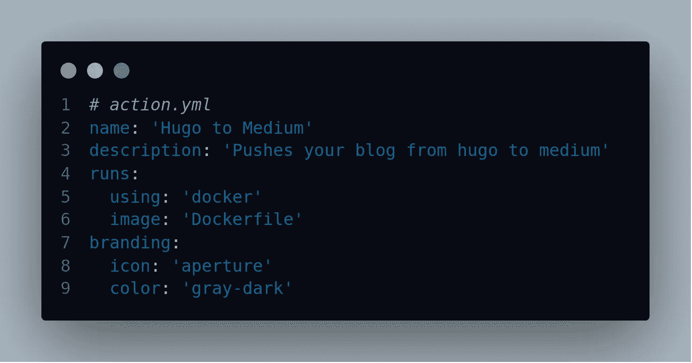

# 如何创建一个 GitHub 动作将帖子从 Hugo 上传到 Medium

> 原文：<https://betterprogramming.pub/how-to-create-a-github-action-to-upload-posts-from-hugo-to-medium-6a2a5ba9818e>

## 将你的最新文章直接上传到 Medium，同时上传到你的 Hugo 博客



用 CodeSnap 制作的照片。

# 动机

每次我在我的个人网站上添加博客(这种情况非常罕见)，我都必须进入我的介质配置文件并手动导入。一旦我了解了 [GitHub Actions](https://github.com/features/actions) ，我的第一个想法就是自动化这个过程。此外，这个项目是为了更好地理解 GitHub 的行为。

# 描述

每当我用一个特殊的提交消息将我的代码推送到 GitHub repo 时，我们的操作就接受新的 post，使用 Medium API，并在我的 Medium 帐户上创建一个新的草稿。

下面是一个提交消息的示例:

```
added: blog PUBLISH post.md
```

好了，让我们开始吧。

# 发展

首先，让我澄清一些事情。由于这是我的第一次 GitHub 操作，我不知道这一切是如何集成的。我花了很长时间才开始明白，所以我对新手的建议是创建两个库:一个用于您的操作，另一个用于测试该操作。

[官方安装指南](https://help.github.com/en/actions/building-actions/creating-a-docker-container-action)很好，但对我来说还是有点混乱，因为 Docker 容器的例子非常简单，只包含了一个`Hello World`类型。

在我们开始之前，请阅读如何在 GitHub 中设置环境变量，并从[介质应用](https://medium.com/me/applications)和[介质设置](https://medium.com/me/settings)中生成您的`APP_ID`、`APP_SECRET`和`ACCESS_TOKEN`。

# 创建 action.yml

首先，让我们看看代码:

所以这很简单:

*   `name`:我们行动的名称。
*   `description`:我们行动的正常描述。
*   这是它开始的地方。基本上，它使用我们的 Dockerfile 并生成它。
*   这只是一个将在市场上使用的普通品牌。

# 创建 Dockerfile 文件

好，我们的 docker 文件将使用 Python Alpine 图像。然后，它将安装所需的模块。之后，我们将安装媒体库，稍后将使用它来提供媒体和我们的项目之间的接口。

然后它将复制我们的`entrypoint.sh`和`post.py`，最后入口点定义将首先运行的脚本。

# 创建入口点. sh

这也很简单。基本上，它会找到我们最新的 GitHub 提交消息，并将其发送给我们的`post.py`脚本。我们可以通过使用 Python 很容易地做到这一点(因为我们以后会需要 Python)，但是出于某种原因，我想使用 bash 来遍历一个 JSON 文件。老实说，这很好。对于那些好奇的人来说，请看一下它的文档。

`$GITHUB_EVENT_PATH`存储 JSON 文件的路径，该文件存储关于我们的 repo(提交、所有者等)的信息。).

# 创建 post.py

所以让我们来看看发布到 Medium 的代码。正如我们在开始时提到的，我们将使用环境变量。`BLOG_DIR`是你发布博客的目录。

例如，`content\blog`:

代码接受所有的环境变量，也接受从`entrypoint.sh`传来的提交消息。

它检查提交消息是否包含`PUBLISH`。如果是，那么我们继续从博客目录的所有文件中进行匹配。一旦找到提交消息中给出的博客名称，它就获取文件并将其发送给我们的函数，该函数将处理媒体部分。

中间部分很简单。摘自 Medium 的官方文档。它从环境变量中获取`APP_ID`和`APP_SECRET`来创建我们的客户端。然后从环境中取`ACCESS_TOKEN`。接下来，我们获取用户详细信息，并使用`user id`来创建帖子。

我们帖子的标题是现在的文件名。我们以降价的格式发送代码，因为我们的 Hugo 博客是降价的。就是这样！我们的帖子被上传到我们的媒体档案。

但是等一下！那些`join split strips`呢？好了，我上面说的都是事情应该怎么发展。老实说，我的 GitHub 动作日志一度显示类似于`Post.MD == Post.MD => False`的内容。经过 30 分钟的测试和修改，我发现两个字符串的长度不同，因为有空格。所以这就是为什么我们要剥掉它们。

除此之外，`join`只是将字符串列表转换成一个字符串，`split`是获取提交消息`PUBLISH`中标签之后的内容。

# Sample main.yml

让我们看一个在我们个人项目中设置的示例`main.yml`。

我们使用 checkout 操作，因为我们将需要 docker 文件中的回购内容。然后我会从主分支调用我的行动。

把这个粘贴到`.github/workflows/`就大功告成了。

你可以在 [@pr4k/Hugo-To-Medium](https://github.com/pr4k/hugo-to-medium) 找到完整的源代码。感谢阅读。