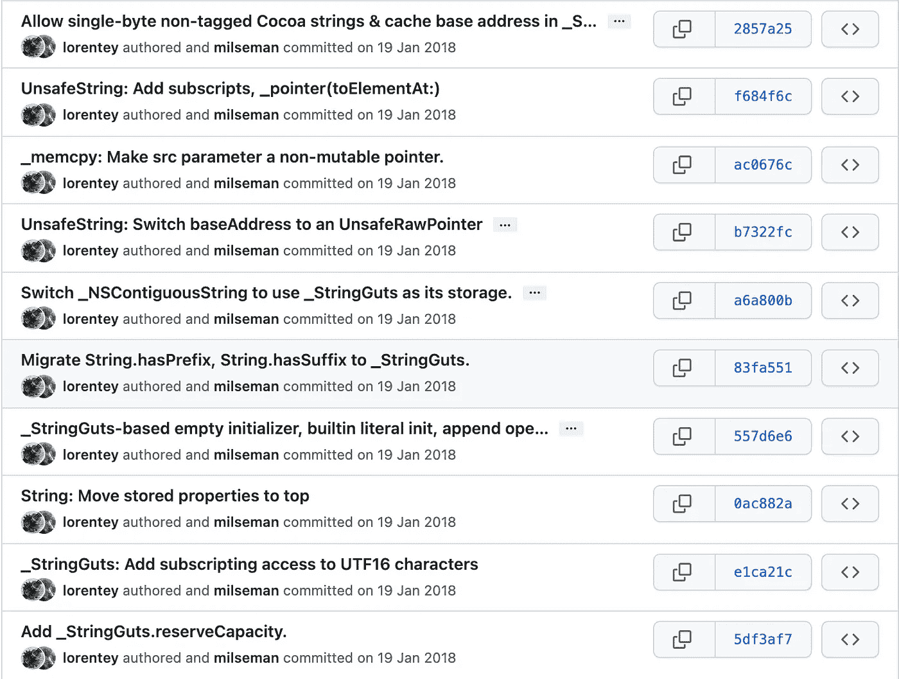
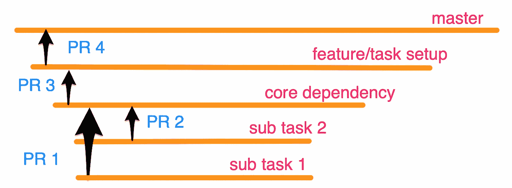
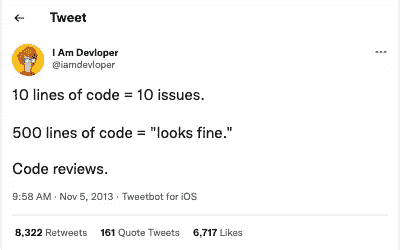
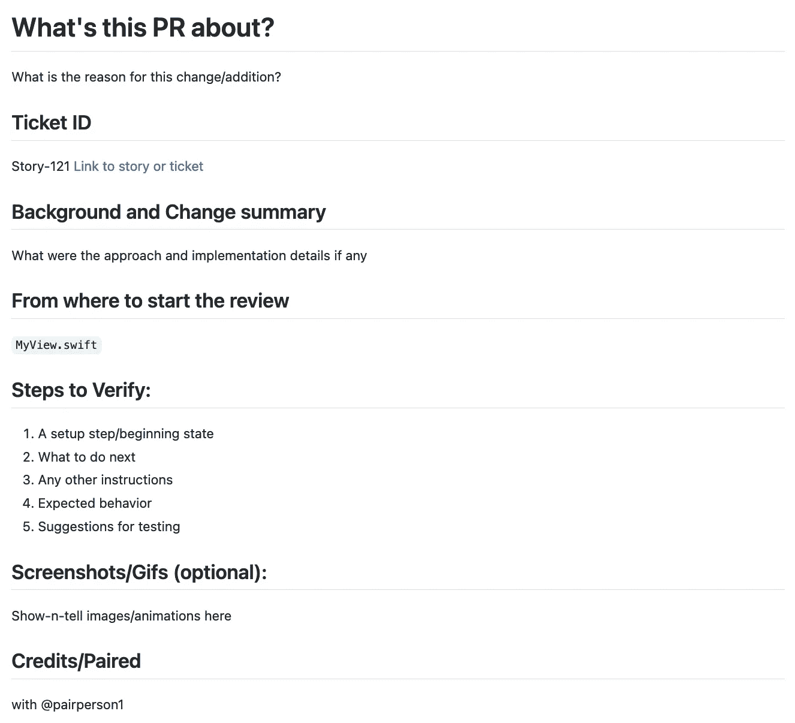
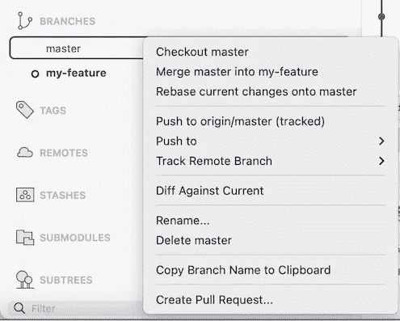
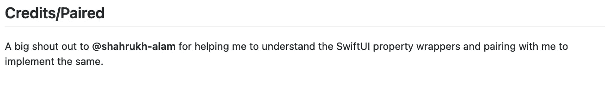
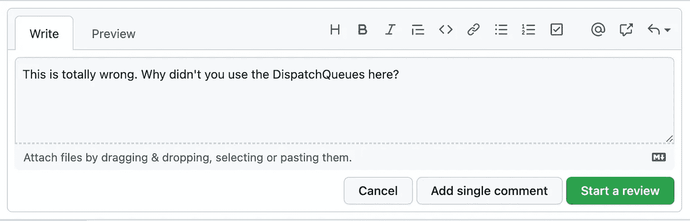
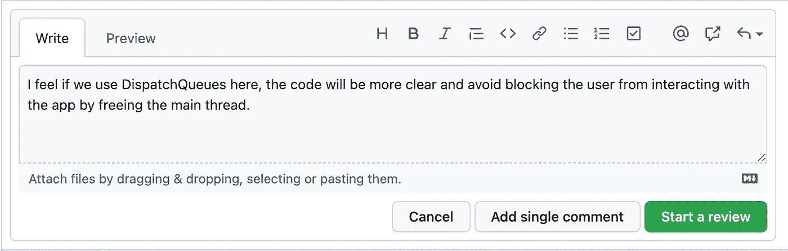

# 如何创建一个好的拉动式请求，以及如何审核？

> 原文：<https://betterprogramming.pub/how-to-create-a-good-pull-request-and-how-to-review-one-c30a13f61fd2>

## 创建和查看拉式请求时要使用的提示


由 [Unsplash](https://unsplash.com?utm_source=medium&utm_medium=referral) 上的 [Parabol](https://unsplash.com/@parabol?utm_source=medium&utm_medium=referral) 拍摄

我每天上班做的第一件事📈就是审核所有未完成的拉取请求。同样，我试图在结束一天的工作之前打开☑️的拉取请求。让我们看看为什么它很重要，以及如何做一个完美的！

## **什么是** [**拉动请求**](https://git-scm.com/docs/git-request-pull) **？**

```
**git request-pull** [-p] <start> <url> [<end>]
```

当您准备好变更(特性/bug-fix/任何东西)时，您通过一个 pull 请求让团队或贡献者知道这些变更，以便他们可以检查和响应它们。

“拉取请求”这个名字的由来是因为你要求项目(合作者)从你的分支(分叉)中**拉取**变更。在版本控制工具中，它们提供了一种简单的、基于 web 的方式来将您的工作(通常称为“补丁”)提交到项目中。

# **拉取请求与合并请求**

这两个术语似乎不同/令人困惑，但它们实际上做的是完全相同的事情。

GitHub 和 Bitbucket 选择“pull request”这个名字是因为*第一个手动动作是拉特征分支*。

GitLab 等工具选择“合并请求”这个名字是因为*最终动作是合并特征分支。*

# **如何创建一个好的拉动式请求？**

## **1。正确的提交历史记录**

拉请求是从一组提交中派生出来的，确保每个提交都有一个适当的消息，它们一起讲述了一个关于如何带来变化的故事。提交消息应该说明发生了什么变化，以及原因。



## **2。创建小型 PRs**

在开发之初就计划何时创建公关



并避免创造大量的公关与大量的变化。一个小 PR 是

*   易于回顾并鼓励添加反馈，
*   降低引入无声错误的风险



## **3。提供关于 PR 的适当信息**

PR 描述是到达目的地的地址。一个人在开始复习之前，应该先有个正确的想法。

在您的团队中遵循或创建一个 [PR 模板](https://docs.github.com/en/communities/using-templates-to-encourage-useful-issues-and-pull-requests/creating-a-pull-request-template-for-your-repository)来创建新的 PR。这样每个人都可以使用它来创建带有适当上下文的 PR，以帮助审阅者。一份好的公关包括:

*   不言自明的标题
*   JIRA 机票 ID，链接(如果有)
*   关于变更的信息(pr 的主体)
*   添加描述更改的视频或 gif
*   相关拉取请求的链接
*   如有需要，可查阅参考资料



## **4。给你的简历添加评论**

在开发过程中可能会有很多思考过程、研究和决策。所以最好在创建 PR 的时候，在适当的地方加上**为什么**的评论。

## **5。在创建一个 PR** 之前重设主基准

在创建 PR 之前，将最新的 Master 或 Main 分支更改合并到您的分支中。这使你免于测试失败，新的错误，了解你的公关的最新变化。



## **6。感谢大家的建议和帮助**

我总是在公关描述中提到那些与我合作过的人，以及我寻求过帮助的人，以示感谢。



## **快速回复评论**

创建 PR 后。处理评论通常需要一些时间。修复一个错别字，添加一个缺失的测试用例，重命名一个方法。如果你做得很快，你的同事就不必花太多时间去记住公关的内容。更少的合并时间意味着更快乐的同事，这意味着更多的利润！

# **审查拉动请求时要考虑的因素**

审查拉取请求是困难的。真的很难。在合并之前，评审者的责任是确保代码是正确的，并且符合质量标准。您应该通过查看差异和更改的文件列表来做到这一点。

您必须了解拉请求试图实现什么，采用什么方法，发生了什么，以及所有这些文件是如何组合在一起的——足以让您提出改进建议。你可能需要注意拼写错误或风格问题。这是评审者需要做的很多事情，特别是在一个大的(特性)拉请求中。让我们看看几个领域，我们可以在这些领域轻松实现所有这些目标。

## **1。理解上下文**

对 PR 的目的有一个清晰的认识，在回顾之前，很多时候，它可以从 PR 描述中，链接到一张 JIRA 机票，一段视频/gif 的实现。

## **2。不要觉得有压力就批准**

永远不要为了合并而批准一份公关，或者只是为了显示你的存在。如果有时候完全可以不同意这些改变，不认可这些改变。确保你传达了你的想法，并以合作的方式来处理它们。

## **3。不要害怕问“为什么？”**

公共关系是一个合作的地方，在这里问为什么是完全可以的。不要犹豫，询问与变化相关的解释。如果你想更多地了解所提出的变化，可以加入讨论。

## **4。不要害怕添加迂腐的评论**

打字错误、删除不必要的行、函数的另一个名字等也很重要，尽管它们并没有被视为附加值。

## **5。查看尽可能多的 PRs**

评审 PRs 是团队成员之间的双赢，所以尽可能多的评审是很重要的。通过审阅 PR，您可以获得更多关于代码库中正在发生的事情的上下文，提交 PR 的开发人员有一双额外的眼睛来查看他们的工作的好处。

## **6。保留您自己的审核清单**

一个团队中的许多开发人员在审阅 PR 时有几个要点，它包括:

*   测试用例被覆盖并通过了吗？
*   变更是否遵循已定义的架构？
*   能不能简化成更好的版本？
*   代码是否模块化/清晰易懂？
*   它是否遵循 SRP 和其他编码原则？

我建议根据团队和项目的风格创建一个清单。例如，在我的 iOS 项目 PRs 中，我检查:

*   代码会导致内存泄漏吗？
*   属性是用正确的存储语义声明的吗？(例如，弱小、无主)
*   每个实现都有一个正确的访问说明符(final、public 等)
*   闭包和委托被标记为“弱”
*   确保视图和视图控制器不包含任何业务逻辑
*   变更是否遵循项目命名约定风格
*   布局在所有 iOS 设备中都能正确渲染吗

## **危险**

为了自动化大多数重复的代码审查场景，开源社区提供了一个名为“ [Danger](https://github.com/danger/danger) 的伟大附加功能，您可以将 Danger 与您的版本控制工具集成并自动化它们。你可以用危险来编纂你的团队规范，让人类去思考更难的问题。

# **公关检阅礼仪**

审查 PR 的过程成为软件开发的基本部分。我们还应该记住与 it 得体方法相关的几个要点:

## **1。避免过于严肃**

说到底只是个公关，不用那么认真。您应该记住，每个团队成员的角色都是为整个团队的项目增加价值，并保持我们保存在库中的代码的质量。

## **2。尊重每个人的喜好**

当涉及到提供公关反馈时，主观和客观之间有一条细微的界限。作为一名软件开发人员，你必须知道这条线在哪里。

仅仅因为你会以某种方式做某件事并不一定意味着它就应该这样做。不同的人往往有不同的观点，在某些情况下，做某事可能没有“正确”的方式，这没关系。

## **3。永远不要把过程私人化**

目标是提供关于代码/设计/方法的反馈，而不是人。你不应该混淆这两者。

## **4。添加建设性反馈**

即使您正在审查代码，也要记住代码背后是人。小心你可能会触发别人的情绪，尤其是因为你在谈论他们的工作。



上述内容可以用更好的方式提及，例如:



希望这篇文章对你有所帮助。感谢阅读。

# 资源

1.  [bliki: PullRequest](https://martinfowler.com/bliki/PullRequest.html)
2.  [最佳拉动式需求规模—小型企业规划](https://smallbusinessprogramming.com/optimal-pull-request-size/)

```
**Want to Connect?**You catch me on [LinkedIn](https://www.linkedin.com/in/muralidharankathiresan/).
```