# 如何创建与 Go 集成的 Google Assistant

> 原文：<https://betterprogramming.pub/how-to-create-a-google-assistant-integration-with-go-9a2ca1f26fbf>

## 使用 Google Actions 和 Go 扩展您的 Google Assistant 功能


图片由[穆罕默德·哈桑](https://pxhere.com/en/photographer/767067)在 [PxHere](https://pxhere.com/en/photo/1584463) 拍摄

一周前，我试图创建一个由 go 驱动的 Google Action，并发现很奇怪没有多少教程/文档用 Go 编程语言来做这件事。大多数例子都在 Node.js 中，并且 [Dialogflow Go SDK](https://cloud.google.com/dialogflow/docs/reference/libraries/go) 文档很少。

那么，今天我在这里帮助填补空白，并向您展示如何构建自己的 Google Assistant 与 Go 的集成。

让我们直接开始吧。

# 首先创建一个 Google Action

完全公开:我已经在我现有的项目中做过一次，但我们只是要用一个新的项目来重新创建功能。首先，我们将从 Google Action 设置开始。

首先转到[谷歌操作控制台，](https://console.actions.google.com/)并创建一个新项目。


我将一直向下滚动，选择对话。

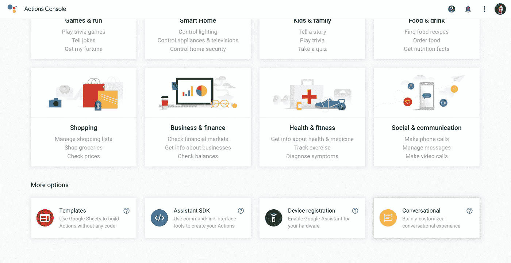

现在，我们将单击“决定如何调用您的操作”

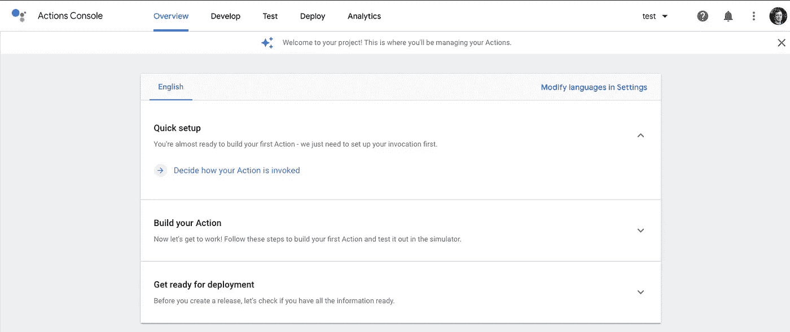

接下来，我们需要给 Google 一个产品名称，以便人们引用我们的集成。我将使用“Gopher news”**作为我的显示名称**。****

**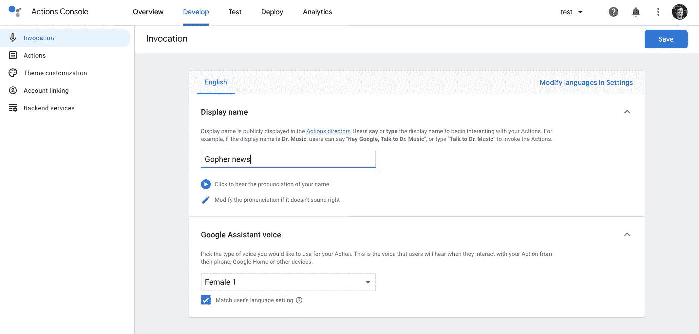**

**单击保存继续。**

**接下来，让我们通过点击左侧的动作来添加一个动作。**

**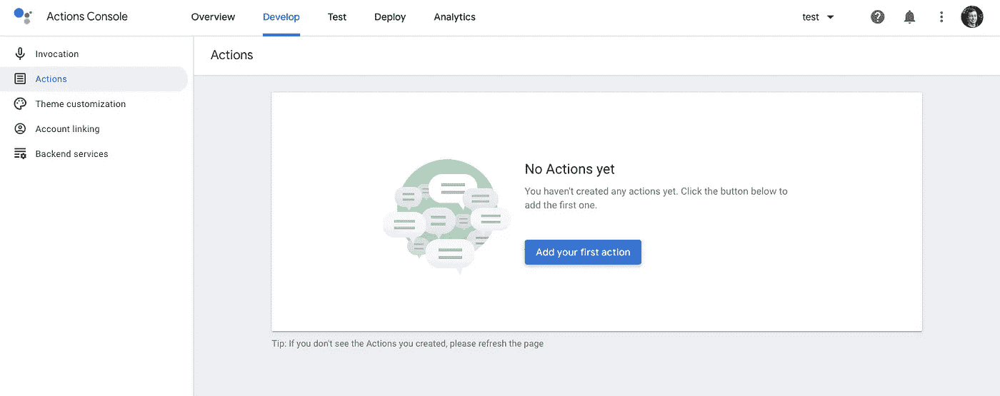**

**现在，当你创建一个动作时，你还需要创建一个所谓的意图。*意图*是当用户说出某些短语/关键词时执行的动作。**

**我们将通过选择“自定义意图”来创建我们自己的意图然后，按构建。**

****

**接下来，谷歌应该带你进行另一次认证，以确保你继续使用当前的 Gmail 帐户。继续身份验证屏幕，您将被重定向到 Dialogflow。**

**您将被要求创建一个新的代理，我将这些视为意图，尽管这可能是错误的(这里有很多专有术语)。说出你的短语的目标是什么。我的将会是"给我找点新闻之家"**

**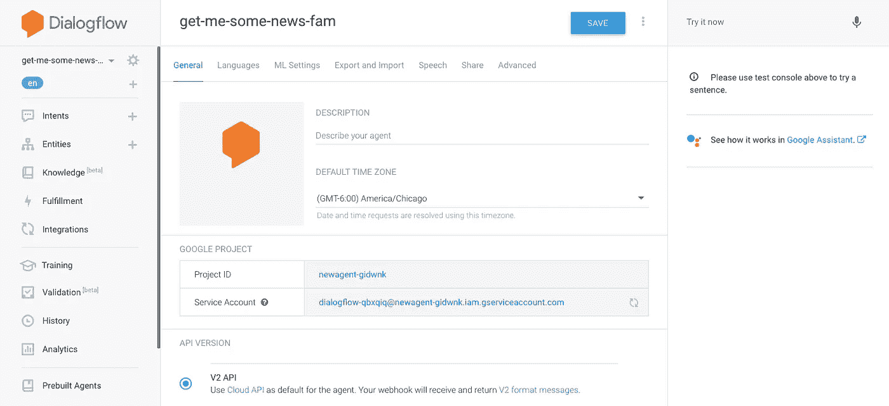**

**现在回到你的意图，让我们实际上实现我们之前讨论过的意图。**

**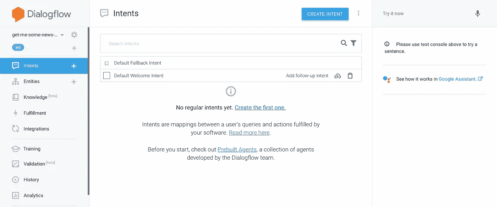**

**我将修改默认的欢迎意图。如果愿意，您可以重命名它，但这不是必需的。我将删除此意图下的所有现有训练短语，并创建一个显式短语来调用我的应用程序。**

**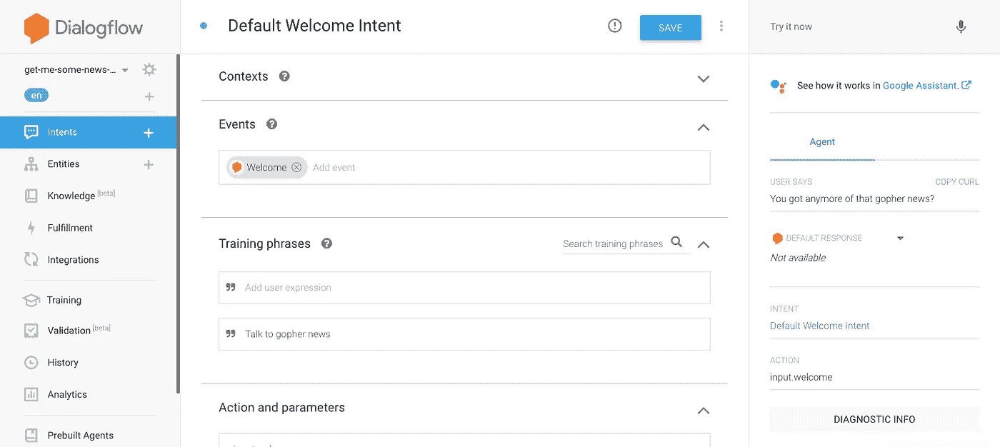**

**“与 gopher news 交谈”将是用户调用我们的应用程序时需要说的短语。**

**接下来，我们将删除所有默认响应，将意图设置为对话结束，并为此意图启用 webhook 调用。这样，我们没有任何硬编码的响应，而是完全依赖于 webhook 返回动态数据。**

**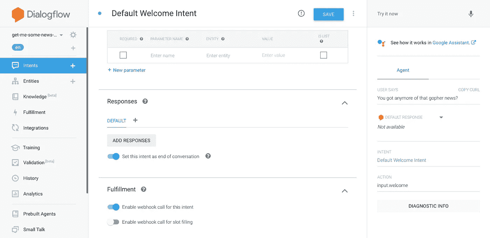**

# **通过网络钩子向谷歌发送数据**

**既然我们已经运行了所有的 Dialogflow 设置，我们实际上需要一个 web 应用程序，当用户调用操作时，它可以响应 Google。对于这个应用程序，我们不从用户那里寻找任何特定的数据，我们只是希望它被调用并让 webhook 响应**

**对于这个应用程序，我想使用[谷歌的旋转浏览界面](https://developers.google.com/assistant/conversational/responses#browsing_carousel)。因此，我需要根据文档中提到的内容，对 JSON 响应进行建模。因为这个项目，我发现了一个叫做 [JSON to Go](https://mholt.github.io/json-to-go/) 的很酷的网站，它允许你粘贴 JSON。然后，它返回 Go 结构。**

**因此，我没有手工构建每个结构，而是复制了上面链接的谷歌网站上的内容。然后，我将它粘贴到 JSON to Go 中，瞧:这就是我需要的形成 JSON 有效载荷并发送回 Google 的完整结构。**

**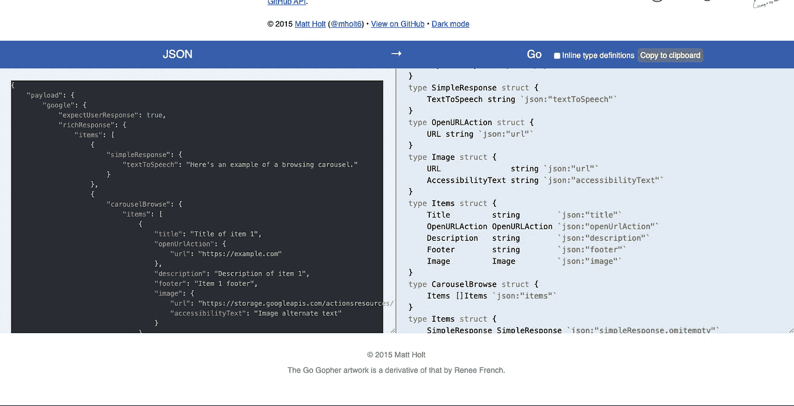**

# **构建 Webhook**

**我最喜欢的 so we 框架是 [Gin](https://github.com/gin-gonic/gin) ，所以我们将使用它作为 web 服务器将 JSON 响应发送回 Google。**

**这是我们应用程序外观的基础。**

**这里我们说 Gin 将启动一个 web 服务器(默认情况下，它将在端口 8080 上监听)并在路由`/webhook`上监听`POST`请求。**

**当向`/webhook`发出`POST`请求时(谷歌会这么做)，就会调用`handleWebhook`函数。**

**然后，`handleWebhook`函数将依靠 Gin 发回一个 HTTP 200 状态代码和一个`application/json` content-type 头。然后，它将把由`buildFulfillment()`返回的结构编组到 JSON 中。**

# **创建与 Google 兼容的 JSON 响应**

**为了构建实现，我们需要把之前从 [JSON 获得的类型放到](https://mholt.github.io/json-to-go/)中，并把它们放到我们的`types.go`文件中。请注意，我确实需要在我的 struct 键中添加一些`omitempty`来确保多余的值在不存在时被移除——否则 Google 不会喜欢的。**

**现在我们已经有了合适的类型，我们可以构建响应了。为了避免任何魔法，我们将使用静态数据进行响应。实际上，你肯定会动态地构建数据(我下面的联系回购就是这么做的)。**

**现在告诉我:这将会是一个非常嵌套的结构，但是这应该有希望描绘出我们想要完成的准确的画面。**

**这里是`buildFulfillment()`:**

**现在，当你把所有这些放在一起时，你可以用`go run`启动服务器，并通过`curl`点击 web 服务器。**

```
curl -s -X POST [http://localhost:8080/webhook](http://localhost:8080/webhook)
```

**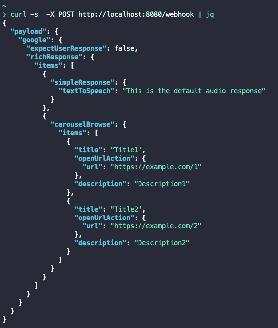**

**耶！我们现在有一个谷歌兼容的有效载荷。**

**这是我们刚刚在一个文件中完成的所有内容，可帮助您立即投入运行。**

# **部署 Go 应用程序**

**现在，有一百万种方法来运行 Go 应用程序。为了简单起见，我个人把我的 webhook 部署在了 [Heroku](https://heroku.com) 上。**

**无论您决定如何部署它，这都超出了本文的范围，但是请确保 Google 能够实现它。对于测试，我喜欢使用 [webhook.site](https://webhook.site) 返回静态有效载荷。当您第一次到达该站点时，您可以点击右上角的编辑按钮，并给它一个静态有效载荷来返回——以及一个`content-type`头。**

**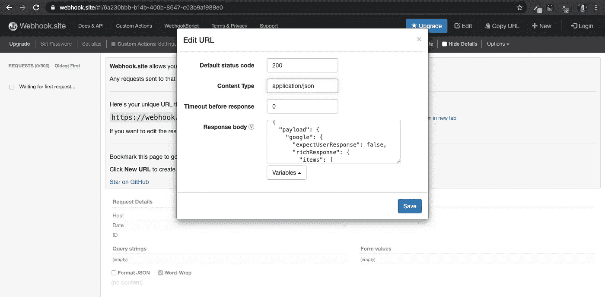**

# **配置您的 Google 操作来使用我们的 Webhook**

**接下来，您需要单击左侧的 fulfillment 选项卡。这就是我们要告诉 Google 如何与我们的 web 服务对话，从而满足用户请求的地方。**

**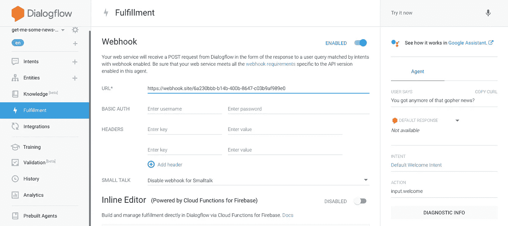**

**这里，我们使用了返回静态 JSON 的 [webhook.site](https://webhook.site) 链接，因为我无法监督应用程序的部署。但是一旦你打开了顶部的 enabled 开关，并输入了你的 webhook 的 URL，点击底部的 Save(这让我有些不知所措)。保存后，点击右上角的“在谷歌助手中查看它是如何工作的”。**

**接下来，在模拟器中选择手机界面，因为浏览转盘只能在有屏幕输出的 Google Assistant 设备上工作。**

**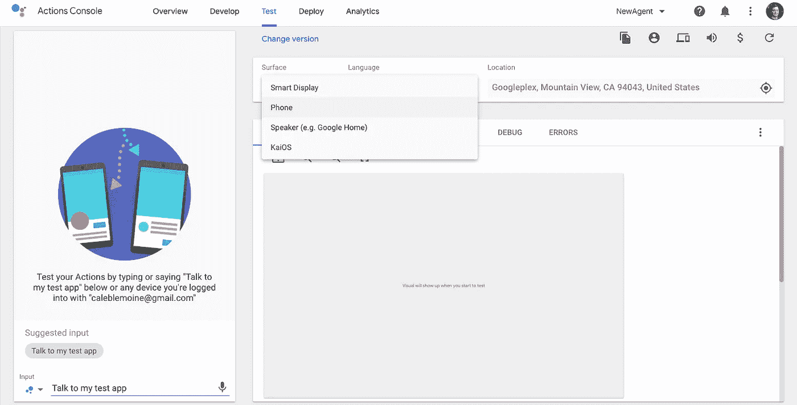**

**现在，如果您注意到左下角，您将能够通过使用保留短语“与我的测试应用程序对话”来与助手模拟器进行交互**

**另一个有用的小消息是，当这个屏幕打开时，你可以在连接到你的谷歌帐户的真正的谷歌助手设备上测试你的谷歌动作，说:“好的，谷歌。跟我的测试 app 聊。”**

**这是我们输入特殊短语“与我的测试应用程序对话”后得到的结果**

**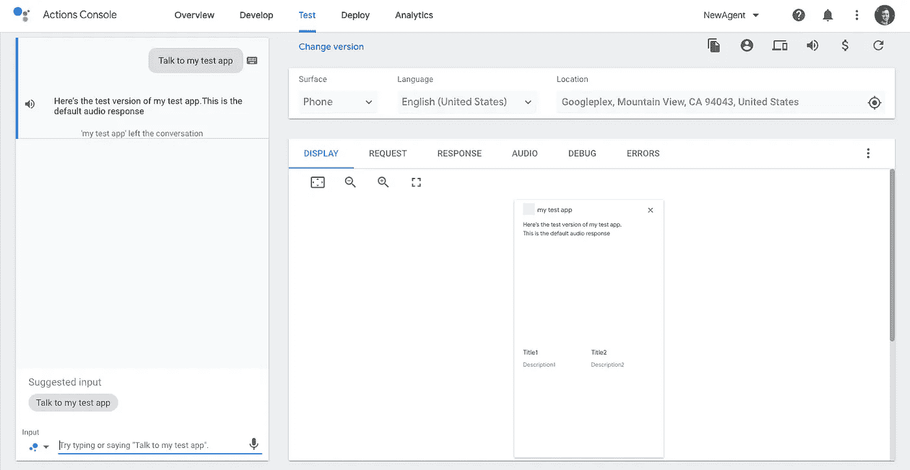**

**现在我们有了一个浏览转盘。当然，它不是直接来自我们的 Go 应用程序，但是 JSON 的响应仍然是一样的。**

# **完成您的应用并部署**

**最后，你需要返回到[谷歌操作控制台](https://console.actions.google.com/)并填写关于你的应用程序的所有剩余信息。**

**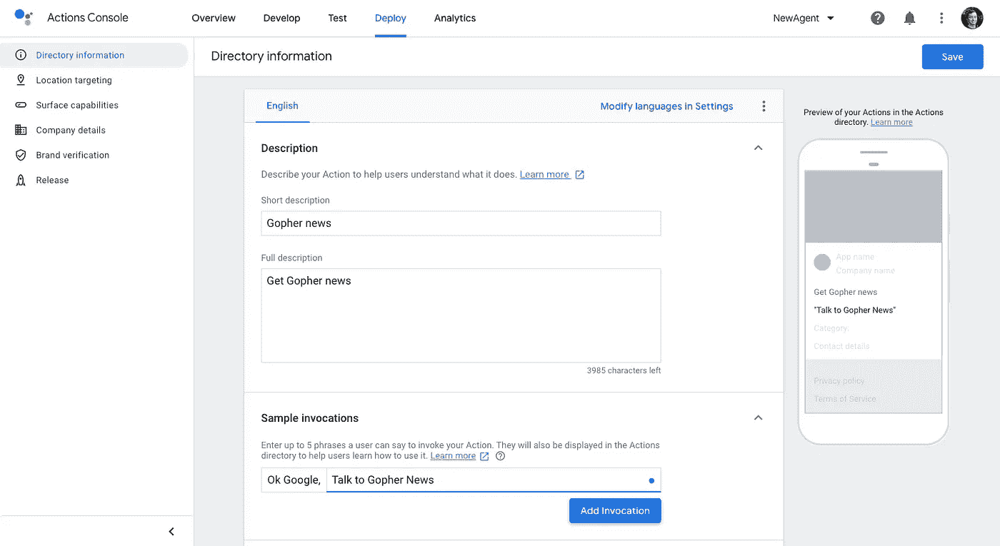**

**你还需要一个图像和隐私政策(我用了[这个生成器](https://app-privacy-policy-generator.firebaseapp.com/))。然后你可以做定位之类的事情，在某些国家部署行动。**

**一旦你完成填写所有必要的信息，以满足谷歌的要求，然后你可以提交给谷歌审查，并希望他们批准。只要你没有收集任何类型的个人数据，侵犯另一家公司，等等，它就应该被批准。**

# **有用的资源**

*   **[我的 webhook GitHub 回购](https://github.com/circa10a/google-home-aws-news)**
*   **[谷歌动作视频教程(20 分钟。)](https://www.youtube.com/watch?v=03i5LoO_neU)**

**我写这篇文章是为了帮助填补我在 Go 中搜索 Google Assistant 集成时认为缺失的空白。希望能节省你的时间！**