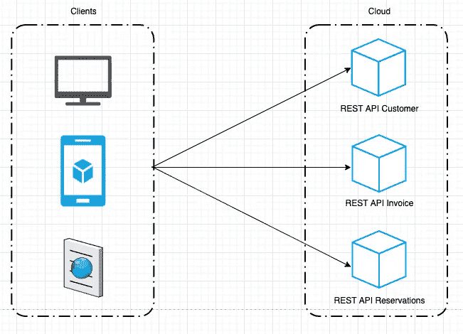
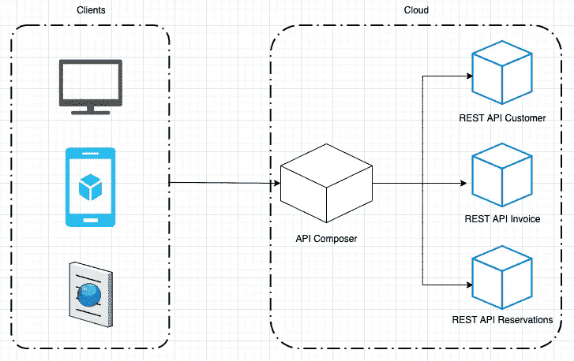
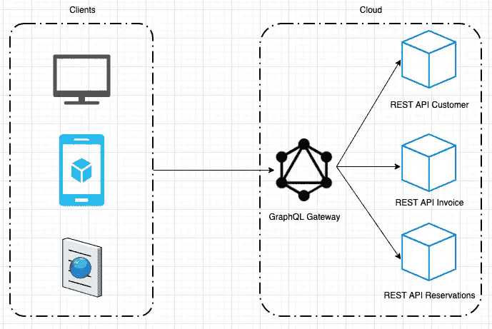
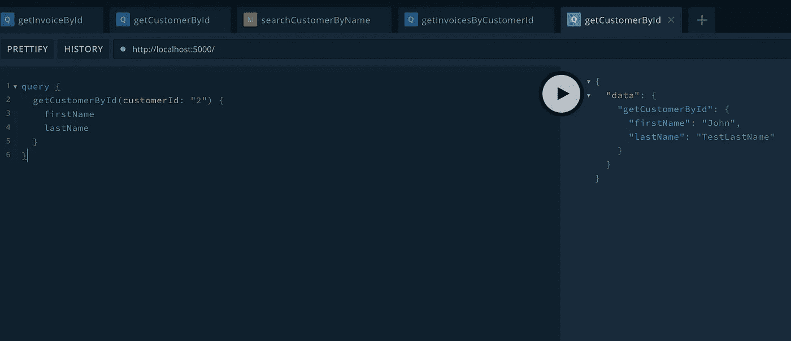

# 如何用 REST APIs 创建 GraphQL 网关

> 原文：<https://betterprogramming.pub/how-to-create-a-graphql-gateway-with-rest-apis-and-not-dying-in-the-intent-e4eee697c51b>

## 探索不同的选择和挑战

照片由[克莱顿](https://unsplash.com/@ibidsy?utm_source=medium&utm_medium=referral)在 [Unsplash](https://unsplash.com?utm_source=medium&utm_medium=referral) 上拍摄

有多少次，在使用基于 REST 的分布式架构时，我们最终会遇到 API 复杂性问题的项目，因为随着项目的增长:

*   越来越多的服务直接依赖/相互耦合
*   服务之间的数据聚合(例如前端消费)成为一个巨大的负担，减慢了项目的速度
*   服务的数量增加了，如果它们之间没有通信契约，这可能是一个可维护性问题

在前端，复杂性大致反映了上述问题:

*   与许多不同的 REST APIs 通信可能很麻烦
*   尤其是当 API 之间存在数据依赖关系时，检索单个视图的所有相关数据可能会涉及多次 REST API 调用，从而降低开发和应用程序的速度

通过使用一个 **GraphQL 网关**，这些复杂性中的许多都可以被简化。它统一和标准化了 REST 微服务之间的通信，并为前端带来了定义良好的自动生成数据类型、查询和变异的独特访问接口。

简而言之，GraphQL 网关在属于不同服务的越来越多的实体之间创建数据关系，而没有创建深度耦合或不可阻挡的 REST 调用网的危险。

# **什么是 GraphQL？**

> GraphQL 是一种 API 查询语言，也是一种用现有数据完成这些查询的运行时语言。GraphQL 为 API 中的数据提供了完整且易于理解的描述，使客户能够准确地要求他们需要的东西，使 API 更容易随时间发展，并支持强大的开发工具。
> 
> 关于 [GraphQL 文档](https://graphql.org/faq/)的更多信息。

让我们以这个[仓库](https://github.com/segpacto/graphql-gateway-microservices-sample)为例。它包含了两个微服务的实现— [客户](https://github.com/segpacto/graphql-gateway-microservices-sample/tree/master/customer)和[发票](https://github.com/segpacto/graphql-gateway-microservices-sample/tree/master/invoice)。两者都公开了使用 OpenAPI/Swagger 记录的 REST API。

现在，我们想在前端显示发票支付金额和客户名称。我们将如何实现这一点？

# **选项 1**

我们可以将业务逻辑转移到客户端(浏览器、电话等)，因此它会创建两个 REST 调用，一个调用客户 API，另一个调用发票 API，在这种情况下，调用会随着新微服务的数量不断增加。

在这种方法中，前端需要知道多个 API，当微服务的数量不断增加时，这很难维护。

此外，当新的微服务整合到架构中时，我们的前端需要添加新的 URL 和端点(如果有多个的话),并处理不同类型的 HTTP 请求及其配置。

在本例中，网页显示了实体 customer 和 invoice 之间的关系(每个客户一个发票列表)。要在手机应用程序上访问相同的数据聚合，需要在那里再次实现，因为实体的关系不能被重用。

除了前面提到的，控制 REST APIs 响应负载的属性并不是现成的。这可能意味着，每次我们请求客户或发票数据时，无论我们是否需要，它都是带有所有属性的实体。这可能会由于网络延迟和通过互联网传输大数据块而导致性能问题。

# **选项 2**

另一种方法是创建一个 [API Composer 服务](https://microservices.io/patterns/data/api-composition.html)，它应该公开端点，允许我们通过在前端只做一次调用来检索实体及其聚合。一个客户的所有相关发票。

该服务无疑比前一个选项执行得更好，因为减少了调用的数量，但是关系仍然是不可重用的，我们可以在特定的 get 端点上从 API Composer 服务获得关系 customer 和 invoices，但是不能在另一个使用 POST 并返回相同的 Customer 实体的端点上做同样的事情，而不手动实现数据的聚合，因此需要找到另一个解决方案。

API Composer 服务上的每个端点都返回实体之间的关系(例如:客户-发票、客户-预订、发票-预订)，但是一旦需要新的关系，如客户-发票-预订，响应有效负载就会变得巨大，因为 REST 调用不会在没有实现它的情况下从响应中排除属性，并且以前的关系不能在端点之间重用，需要重新实现，从而导致无法管理的增长。

# **GraphQL 网关作为解决方案**

通过在我们的架构上引入 [GraphQL Gateway](https://github.com/segpacto/graphql-gateway-microservices-sample/tree/master/graphql-gateway) 服务，无论后端有多少服务，前端都有一个访问数据的入口点。

数据关系/聚合可以由不同的客户端(web 应用程序、电话应用程序)重用，因为它们是在实体之间建立的。一旦我们声明 Customer 实体与 Invoice 实体有关系，所有使用这些实体的操作(查询、变异)都可以使用它。

查询和变异的 GraphQL 类型和解析器是自动生成的，这意味着服务根据 OpenAPI 文档创建自己的 GraphQL 类型，并且知道在哪里可以找到数据以及使用哪些 HTTP 方法(POST、GET 等)。

前端只请求和接收实体所需的属性，这减少了后端和前端之间通过互联网传输的数据量。前面的优势也有助于通过只做一次请求来获得客户和相关发票。

向我们的后端添加新服务不需要在前端做任何改变来访问新的数据类型、查询和变化。

# **graph QL 网关实际上是做什么的？**

GraphQL Gateway 在内部使用包 [gql-gateway](https://www.npmjs.com/package/gql-gateway) ，它负责连接到每一个微服务，读取、解释、自动将所有 OpenApi/Swagger 文档转换为 GraphQL 类型，并自动生成所有查询和变异的解析器。

该服务创建一个具有所有特性的 [Apollo 服务器](https://www.apollographql.com/docs/apollo-server/)，负责验证输入数据，并只解析客户端请求的属性。

因此，当前端请求实体 Customer 和 Invoice 时，服务会准确地知道连接到哪个服务来检索数据。

该服务是完全无状态的，这允许我们根据请求和使用的数量来扩展它。

# **实施这种方法有多难？**

创建带有所有自动生成的 GraphQL 类型、查询和变异的[网关](https://github.com/segpacto/graphql-gateway-microservices-sample/tree/master/graphql-gateway)应该只需要几行代码。

让我们从头开始…

假设我们有两个微服务在端口`3000`和`3001`上公开 OpenApi/Swagger 文档，这两个端口描述了检索[客户](https://github.com/segpacto/graphql-gateway-microservices-sample/blob/master/customer/swagger.json)和[发票](https://github.com/segpacto/graphql-gateway-microservices-sample/blob/master/invoice/swagger.json)的端点。

简单 graphQl 网关

常量`endpointsList`包含所有微服务 OpenApi/Swagger 文档的列表。这个配置被传递给 [gql-package](https://www.npmjs.com/package/gql-gateway) ，它负责创建监听端口 5000 的 Apollo 服务器。

我们可以通过导航到 [http://localhost:5000](http://localhost:5000) 来访问 [apollo playground](https://www.apollographql.com/docs/apollo-server/v2/testing/graphql-playground/) ，它给出了所有自动生成的类型、查询和可用变异的概念。

现在，让我们创建一些`Entity`关系:

具有实体关系的 GraphQl 网关

所有这些可能看起来像复杂的代码，但实际上是创建 [GraphQL 模式委托](https://www.graphql-tools.com/docs/schema-delegation)的标准方式，这意味着实体内特定属性的解析将被委托给特定的查询或变异。

在这种情况下，为了表明客户将有一个相关发票的列表，我们只需通过添加发票类型的数组来扩展`localSchema`常量上的客户类型。然后，在解析器上，我们指示客户的 invoices 属性将通过委托给属于`invoiceApi`的查询`getInvoicesByCustomerId`来解析。

> 要更深入地了解 **gql-package** ，请查看 [**自述文件**](https://github.com/segpacto/gql-gateway) 或 [**高级示例**](https://github.com/segpacto/gql-gateway/blob/master/examples/advanced.js) 。

从现在开始，每次客户被包括在任何 GraphQL 查询或变体的响应中，我们也可以访问发票，反之亦然。委托和模式拼接是一种以可伸缩的方式解决和创建数据关系的优雅方式。

当然，GraphQL 网关本身并不是所有问题的解决方案，这只是在提高开发速度方面的一个简化表示。

为了成功地应用上述解决方案，实现应该伴随着良好的开发实践、作为我们的服务和互联网之间的媒介的 API 网关、负载平衡器、设计良好的缓存策略以及良好的 CI/CD 策略，这里仅举几个例子。没有解决大型基础设施技术问题的灵丹妙药，但实验仍然是学习如何解决的最佳方式。

要深入了解相关主题，您可以查看:

*   [API 组合模式](https://microservices.io/patterns/data/api-composition.html)
*   [聚合器 vs API 组合模式](https://dzone.com/articles/microservices-integration-aggregators)
*   [GraphQL 网关审查](https://itnext.io/auto-generated-graphql-gateways-bring-your-rest-apis-together-for-great-and-for-better-9d74470820cc)
*   [阿波罗网关](https://www.apollographql.com/docs/federation/gateway/)
*   [阿波罗联邦](https://www.apollographql.com/docs/federation/)
*   [GraphQL 模式委托](https://www.apollographql.com/docs/apollo-server/v2/api/graphql-tools/#delegatetoschema)
*   [GraphQL 模式拼接](https://www.apollographql.com/docs/federation/migrating-from-stitching/)
*   [OpenAPI/Swagger](https://swagger.io/specification/)