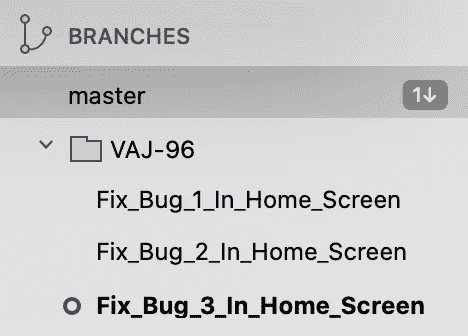
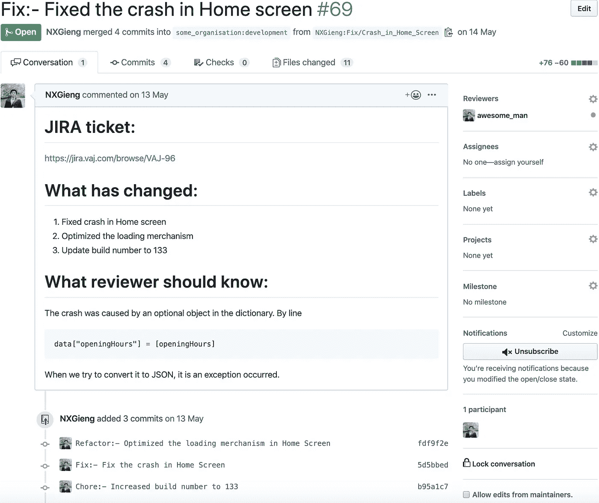

# 如何在短短 5 个步骤中创建一个很好的拉动式请求

> 原文：<https://betterprogramming.pub/how-to-create-a-great-pull-request-in-just-5-steps-c49086c6d647>

## 什么是伟大的拉请求？


[扬西·敏](https://unsplash.com/@yancymin?utm_source=unsplash&utm_medium=referral&utm_content=creditCopyText)在 [Unsplash](https://unsplash.com/s/photos/github?utm_source=unsplash&utm_medium=referral&utm_content=creditCopyText) 上的照片

首先恭喜你！你已经走了这么远。创建拉请求是向代码所有者和其他贡献者推荐您的代码的最后一步。

有一个很好的拉请求是非常重要的，因为它将帮助评审者更好地理解和学习你交付的代码。因此，这里有五个步骤，你可以用它们来创造下一个更好的目标。

# 1.树枝

> 分支意味着你偏离了开发的主线，并且继续工作而不打乱主线。
> 
> 这样，Git 分支非常轻量级，使得分支操作几乎是即时的，并且在分支之间来回切换通常也一样快。— [Git 文档](https://git-scm.com/book/en/v2/Git-Branching-Branches-in-a-Nutshell)。

新的分支应该从上游的目的分支的最新代码中创建。这意味着，在分支时，本地分支的`HEAD` 提交必须与上游分支的`HEAD` 提交相同。

这将有助于清除即将到来的拉请求中的提交历史。为了做到这一点，如果您使用 Git 命令，您可以遵循以下步骤:

```
git fetch --all #1
git checkout upstream/dev #2
git checkout -b Feature/New #3
```

*   #1 从您的远程仓库获取所有最新代码。
*   #2 从上游检查开发分支的最新代码。
*   #3 从开发分支的最新代码中创建一个名为`Feature/New`的新分支。

您也可以使用 [SourceTree](https://www.sourcetreeapp.com/) 并应用上面类似的步骤来实现同样的事情。

关于命名**、**你大多看到*主*、*发布*，或者*发展*作为一个分支的通用名称。但是，对于重构分支、新特性分支或者 bugfix 分支，你会给它们取什么名字呢？

我想建议两种方式让你选择你的偏好。

## ***基于票号或发行号的名称***

假设你正在制作一张[吉拉](https://www.atlassian.com/software/jira)票 VAJ-96，修复主屏幕上的一个 bug。然后，您可以像这样命名新分支:

```
VAJ-96*/Fix_Bug_In_Home_Screen*
```

因为一个标签可能需要多个分支来完成，所以也可以应用这个命名约定。像这些:

```
VAJ-96*/Fix_Bug_1_In_Home_Screen* VAJ-96*/Fix_Bug_2_In_Home_Screen* VAJ-96*/Fix_Bug_3_In_Home_Screen*
```

## ***分支类型基础名称***

在开发周期中，至少有三种分支类型，包括特性、修复和重构。我们可以在此基础上对我们的分支机构进行分类，如下所示:

```
Feature/Pet_Dating
Feature/Music_For_Pet#or
Fix/Loading_Issue
Fix/Crash_In_Home_Screen#or
Refactor/Duplicated_Code
Refactor/Module_A
```

如果您正在使用终端，您会清楚地看到的一个好处是使用自动完成功能。如果您正在使用 SourceTree，它看起来是这样的:



我们可以很容易地按照惯例对分支进行分类。

# 2.犯罪

要有一个好的拉请求，我们需要一个好的提交列表。因此，我们如何定义一个伟大的承诺是很重要的。

## ***提交内容***

提交应该只包含它需要的内容。每当你有规律地完成某件事时，最好是投入。如果您需要恢复一些提交或者挑选任何提交到其他分支，这会对您有所帮助。

不要等到所有事情都做完了才提交，也不要提交你写的每一行代码。为了工程师的荣誉，好好干！

## ***提交人姓名***

你见过像“这是一个提交”，或“修复待办事项”，或“我不知道我在做什么”这样的提交吗？听起来很滑稽，但这每天都在发生。老实说，如果你或你的队友回头寻找什么，那将成为未来的噩梦。

出于这个原因，提交的名称应该告诉更改本身，它可能看起来像这样:

```
Fix: - Fixed the crash in Home Screen.
Feature: - Implemented GameView in Play Screen.
Merge: - Merged latest develop to the feature branch.
Chore: - Increased the build number to 68 on Production.
Refactor: - Replaced Singleton pattern by Dependencies Injection.
```

让我们保持信息简洁明了。有一天它可能会救你的命！

最后但同样重要的是，如果其中的代码不干净或不正确，拉请求就不会很好。因此，确保您编写的代码是干净的、结构良好的、最优的，并且遵循您组织的惯例，这是非常重要的。

我在这里的建议是，在第 3 步创建拉取请求之前，扮演一个评审者的角色，最后一次亲自评审变更。如果你认为有什么可以变得更好，那就让它变得更好！

这是为了确保您请求其他人审查的代码处于最佳状态。因此，这将有助于节省您和其他审阅者的大量时间。

# 3.建议

一个好的拉取请求应该有一个清晰的名称，接着是详细的描述和附加的标签。

## ***拉取请求的名称***

通常，拉请求的名字应该告诉变更本身，以给出拉请求是关于什么的概述。它可以遵循我们前面看到的提交命名标准。

## ***拉式请求的描述***

描述有助于评审者更好地理解代码、成就和贡献者解释背后的动机。因此，它应该回答三个问题:为什么、做什么和如何做。

*   为什么？—您正在处理哪些票证/问题/提案？
*   什么？—你做了什么？
*   怎么会？—审稿人应该知道什么？

我在这里附上模板，这样你就可以下载并把它放在你的源回购。它将自动填充下一个拉取请求的默认描述。

您可以下载并直接使用的拉取请求模板。

## ***标记和标签***

有时，您想要为拉取请求添加更多信息，以便我们可以有更好的过滤和概述。这是一个可选步骤。



这是我最大的拉动请求之一。

# 4.回顾

一个好的拉式请求应该在评审者和贡献者之间有响应的交互。

审查者在批准之前可能会也可能不会给你关于代码的反馈。在这种情况下，在做出任何改变之前，确保你正确理解反馈是很重要的。

在这一点上可能会发生冲突，因为人们可能有不同的方法。

所以，如果你认为代码是完全正确的，或者你的解决方案更好，请有礼貌地辩论，并平静地向评审者解释。否则，不要犹豫，修改你的代码，然后提交新的变化，这完全没问题。

另一方面，如果你是评审者，我的建议是关注代码，而不是人。专业地、经常地去做，这对你和他人都有帮助。

不要花太多时间争论或把它私人化。归根结底，我们是一个团队，努力让世界变得更美好，而不是去打架，对吗？


杰西·奥里科在 [Unsplash](https://unsplash.com/s/photos/teamwork?utm_source=unsplash&utm_medium=referral&utm_content=creditCopyText) 上的照片

# 5.批准，合并

在解决了所有的变更请求并获得批准之后，您现在可以将您的拉请求合并到目标分支。有多种策略可以合并拉请求。

然而，我使用的两个最常见的策略是在拉请求中的提交之上创建一个合并提交，以及将拉请求中的所有提交压缩成一个合并提交。

简而言之，第一个策略主要是将一个大的特性或者一个重构分支合并到一个目标分支中，以保存提交的历史。

第二种策略不关心拉请求中的提交历史。它将挤压所有的提交，然后创建一个新的，使历史更简单，更清晰。因此，它主要是为了一个小特性或者一个快速的错误修复分支。

合并了？！现在由您和您的分支模型来决定是删除原始分支还是保留它以供将来参考。不管怎样，坐下来放松一下。

恭喜你完成了任务。休息一下，开始新的任务吧！

感谢您的阅读，我希望您能像我喜欢写这篇文章一样喜欢阅读这篇文章。请随时让我知道你对这些步骤的想法，我会喜欢更多的聊天。