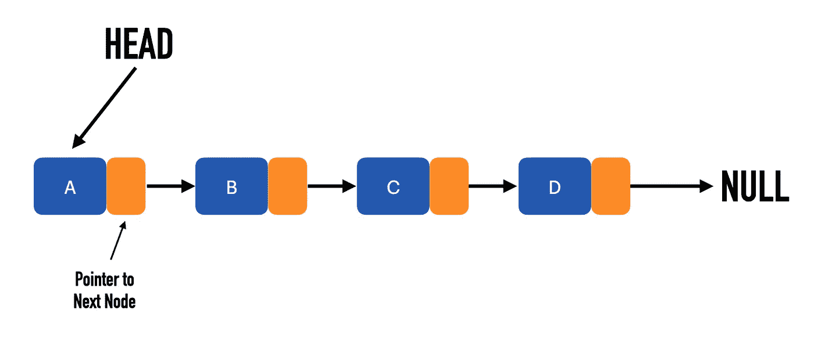
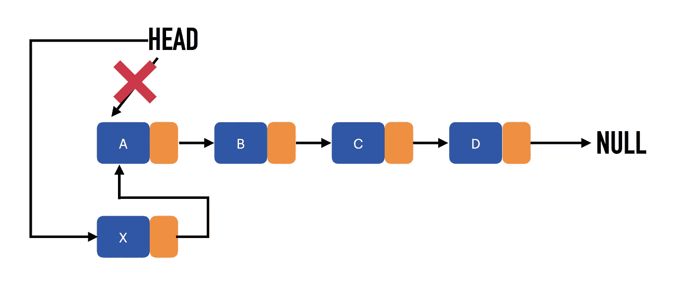
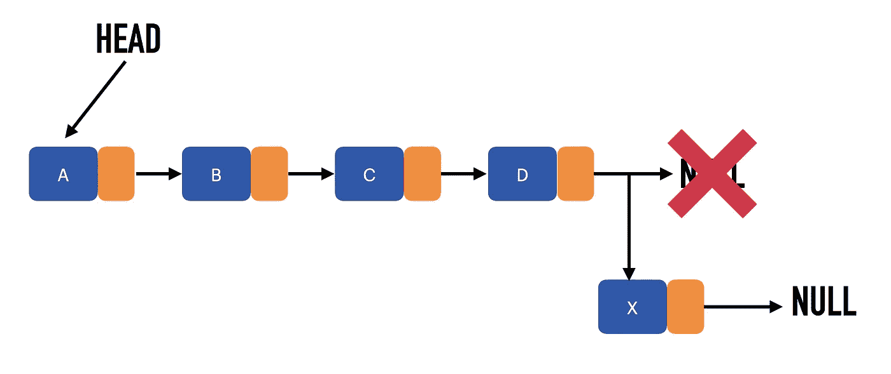
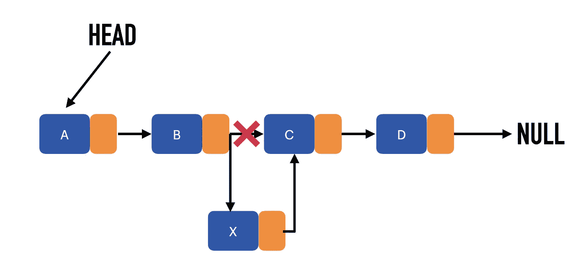

# 如何在 Python 中创建链表

> 原文：<https://betterprogramming.pub/how-to-create-a-linked-list-in-python-aaf2796e0dd6>

## 通过实现一个链表来练习您的 Python 技能


照片由[郭佳欣·阿维蒂斯扬](https://unsplash.com/@kar111?utm_source=medium&utm_medium=referral)在 [Unsplash](https://unsplash.com?utm_source=medium&utm_medium=referral) 上拍摄。

# 什么是链表？

链表是一种基本的数据结构。它是用指针将每个节点连接到下一个节点的节点集合。

每个节点由两项组成:

*   数据(如数字)
*   指向下一个节点的指针

下面是一个链接列表的图示:



链表形成了一个节点链。每个节点保存数据并指向下一个节点。图片由作者提供。

# 如何在 Python 中实现链表

接下来，您将学习如何用 Python 实现一个链表。此外，您将实现有用的链表方法，例如节点的插入和删除。

让我们开始吧。

## 链表的基本结构

让我们创建一个基类来表示一个链表。链表对象只需要知道列表从哪里开始。这个起始节点也称为头节点:

然后，让我们创建一个表示链表节点的类:

如上所述，节点保存数据和指向下一个节点的指针。

太棒了。现在你有了一个基本的链表，可以进行测试了。

让我们通过创建三个节点和一个链表对象来测试您的链表。让我们将第一个节点转换为列表的`head`节点。然后我们将第二个节点设置为第一个节点的`next`节点，以此类推:

要看到它的样子，你不能使用`print()`方法。相反，您需要逐个遍历节点，并打印每个节点的数据:

输出:

```
a -> b -> c -> None
```

它像预期的那样工作。

## 链表的字符串可视化

您看到的字符串可视化非常有用。这样很容易看出链表的结构，但是你不想一遍又一遍地写这个循环。

让我们抓住上面的循环，并将其放入`LinkedList`类中一个名为`visualize()`的方法中:

从现在开始，您可以为您的链表对象调用`visualize()`方法:

```
l_list.visualize()
```

看看它此刻的样子:

```
a -> b -> c -> None
```

## 遍历一个链表

使用链表时，一个常见的实用工具是能够遍历它们。此外，您希望循环链表的语法与循环常规链表的语法相同。

为了实现这一点，让我们实现`LinkedList`类的`__iter__`方法:

这个方法遍历链表的所有节点。它生成每个节点，并移动到下一个节点，直到遇到一个节点`None`(列表的末尾)。

为了测试循环现在是否工作，让我们创建一个包含三个字符串的链表:

现在，您可以像遍历常规节点列表一样遍历链表来打印每个节点:

```
**for** node **in** l_list:
    print(node.data)
```

输出:

```
a
b
c
```

现在你可以遍历一个链表。接下来，让我们看看如何插入新节点。

# 将节点插入到链表中

当您在链接列表中插入新项目时，您可以:

*   在列表的开头。
*   在列表的两个节点之间。
*   在名单的最后。

理解这一点很重要，因为你必须分别处理每个案例。

## 在列表开头插入一个节点

在列表的开头插入一个节点是最简单的选择。你需要做的就是:

*   将当前头设置为`next`节点。
*   将新节点设置为`head`。

下面是将节点添加到列表开头的简单视图:



让我们把这个想法变成代码:

让我们测试代码以确保它能正常工作:

输出:

```
A -> B -> None
```

## 在列表末尾插入一个节点

在列表末尾插入一个节点意味着在添加新节点之前，需要先遍历整个列表。如果列表为空，那么可以将新节点设置为列表的头部。

下面是一个将节点添加到链表末尾的示例:



接下来，将这个方法添加到您的`LinkedList`类中:

行`**for** current_node **in** self: **pass**`遍历到链表的末尾，使`current_node`成为最后一个节点。这个最后节点的下一个节点然后被更新成为新节点。

让我们通过创建一个链表来测试它，在链表的开头添加两个节点，在末尾添加第三个节点:

输出:

```
A -> B -> C -> None
```

它像预期的那样工作。

## 在两个节点之间插入一个节点

在两个节点之间插入是实现链表插入的最棘手的部分。这是因为您需要遍历列表并重新布线。

在本指南中，在两个节点之间插入意味着在目标节点之后插入一个节点。



在代码中:

代码在链表中循环，寻找目标节点。当遇到目标节点时，它将新节点的下一个引用设置为目标节点的下一个引用。然后，它将目标节点的下一个引用设置为新节点。

如果链表为空，则不可能找到目标节点。

让我们测试代码:

输出:

```
A -> B -> C -> None
```

现在，您已经有了将项目插入链表的所有必要方法。接下来，让我们看看如何从链表中移除一个条目。

# 如何从链表中移除节点

要从链表中删除一个项目，需要遍历链表，直到找到要删除的节点。当你找到一个目标时，你需要做的就是链接上一个和下一个节点。

让我们仔细看看代码:

*   如果链表为空，则引发异常。
*   删除`head`节点就可以了。将`head`节点的`next`节点设置为新的头节点。
*   如果以上都不适用，就需要遍历链表，直到找到目标节点。如果找到了，更新目标之前的节点以指向目标节点之后的节点。
*   如果找不到目标节点，则引发异常。

让我们测试代码以确保它能正常工作:

输出:

```
A -> C -> None
```

它像预期的那样工作。

这就是本指南的全部内容。现在你知道如何用 Python 实现一个链表了。

# 结论

链表是一种基本的数据结构，它是由指向下一个节点的指针连接在一起的节点的集合。

实现基本链表时，需要启用:

*   遍历链表。
*   插入。
*   删除。

感谢阅读。编码快乐！

# 你可能会发现这很有见地

[](/10-useful-python-snippets-to-code-like-a-pro-e3d9a34e6145) [## 10 个有用的 Python 片段，让你像专业人士一样编写代码

### 我每天使用的有用的提示和技巧

better 编程. pub](/10-useful-python-snippets-to-code-like-a-pro-e3d9a34e6145)