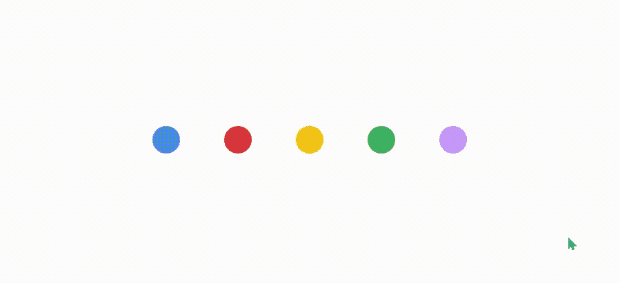

# 如何在 NextJs 中为客户端抓取创建加载屏幕

> 原文：<https://betterprogramming.pub/how-to-create-a-loading-screen-for-client-side-fetching-in-nextjs-eaede11c0921>

## 让我们继续，假设您熟悉 NextJs 或 ReactJS 和 CSS 动画

文章横幅

NextJs 提供了几种从后端获取数据的方法，客户端获取是其中之一。

因为 NextJs 使用服务器端呈现，所以所有组件都在服务器端呈现，数据也在服务器端缓存。有些情况下，我们可能需要从客户端检索数据，这可能包括

1.  当我们需要从客户端访问*会话*或*本地存储*时。
2.  当网页内容需要频繁更新时。
3.  当我们不需要预先渲染数据时。
4.  当页面不需要 SEO 索引时(提取敏感数据)

与其关注 NextJs 如何在客户端获取数据，不如让我们讨论如何创建加载屏幕。

让我们继续，*假设*你熟悉 NextJs 或 ReactJS 和 CSS 动画。

NextJs 支持两种获取客户端数据的方法:`useEffect` Hook 或`SWR` library。在这两种情况下，我们都必须显示一个 ***预加载器*** ，直到我们的组件被渲染并且数据在客户端被获取。

下面是来自[*NextJs’docs*](https://nextjs.org/docs/basic-features/data-fetching/client-side)的一个示例，其中显示了客户端数据获取，预加载器在`
`标签内显示 ***“正在加载…***”。

我们要做的是，我们将创建一个新的 react 功能组件，其名称和扩展名为`LoadingScreen.jsx`，并编写以下代码。

加载屏幕反应组件

我们的 LoadingScreen 组件的容器分部包含五个子分部。我们将使用 CSS 动画制作这五个部门的动画。

现在，我们将使用容器 div 的类名`loading-screen`来设计加载屏幕的背景。

是时候使用类名`dot`来设计所有的点了，如下所示，

现在，我们将为每个点设计出伪元素。在 CSS 动画的帮助下，每个伪元素将缩放实际点的 2.5 倍。如果你对理解下面定义的 CSS 有困难，你可以参考 MDn 关于 [CSS 动画](https://developer.mozilla.org/en-US/docs/Web/CSS/CSS_Animations/Using_CSS_animations)的文章。

到目前为止，动画是工作的，但没有指定任何点的颜色，因此我们甚至看不到任何点。

让我们在`n-th child()`选择器的帮助下给所有的点填充颜色

在将颜色应用到所有的点之后，您可以看到如下图 1 所示的东西。

图一。正在加载动画 gif

看起来很酷，对吧？但所有的点都在同一时间动画，这看起来很生硬。让我们给每个点添加动画延迟，并使它们同步。

让我们添加动画延迟为

还有 tada！

最终点加载动画

现在，您可以在任何您想使用的地方导入和使用加载屏幕组件，如下所示。

*注意:-导入 make 时，给出正确的源路径和条件渲染。*

最后，这篇文章相对简单，我希望将来会有很多人开始使用它。它足够灵活，可以与任何类型的前端框架一起工作，因为所有的工作都是由 CSS 完成的。