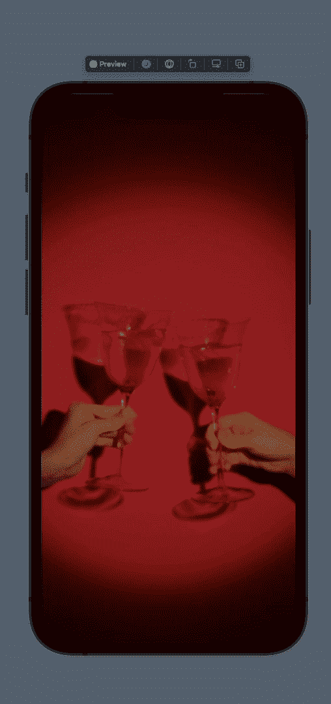
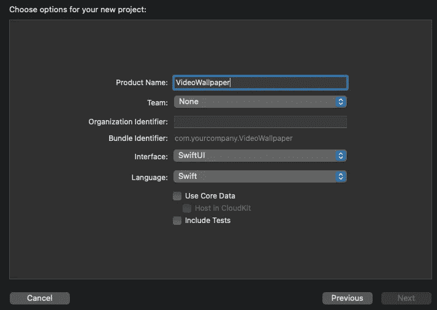
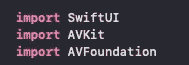
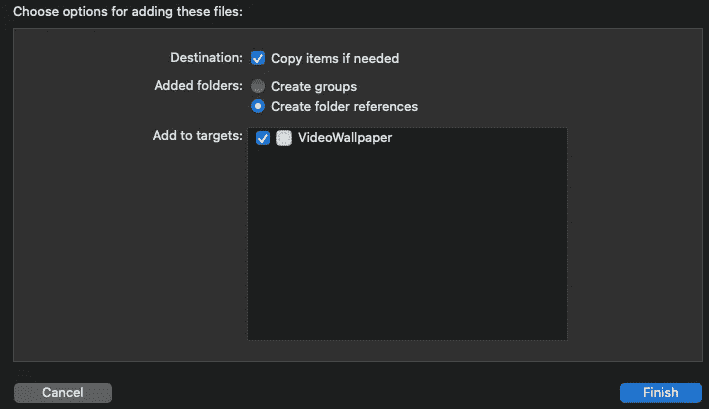
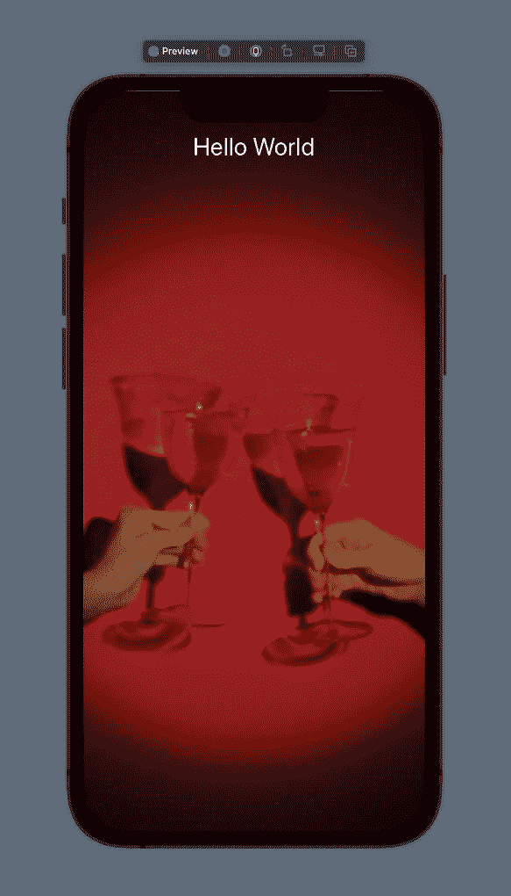

# 如何在 iOS 15 版 SwiftUI 中创建循环视频背景

> 原文：<https://betterprogramming.pub/how-to-create-a-looping-video-background-in-swiftui-3-0-b4844553880d>

## 通过 UIViewRepresentable 利用 AVFoundation 框架


照片由[雅各布·欧文](https://unsplash.com/@jakobowens1?utm_source=medium&utm_medium=referral)在 [Unsplash](https://unsplash.com?utm_source=medium&utm_medium=referral) 上拍摄

在撰写本文时，还没有一种简单的方法可以将视频背景或视频播放器整合到 SwiftUI 中。幸运的是，在苹果提供的 AVKit 和 AVFoundation 的帮助下，我们仍然可以通过一点点麻烦来让它工作。

完成本文后，我们将实现以下结果:



安娜·施瓦茨在 [Pexels](http://pexels.com) 上的视频

现在让我们深入教程！

首先打开你当前的项目或创建一个新的项目。给你的项目取一个好听的名字，确保选择 SwiftUI 作为接口。此外，指定一个组织标识符，可以是您想要的任何东西，只要它以`com.<herecomesyourtext>`开头。



然后创建新的或打开现有的 Swift 文件。在我们的例子中，我们将使用已经设置好的`ContentView.swift`文件，如下所示:

首先，我们需要导入`AVKit`和`AVFoundation`，因为我们将使用它们来设置和播放我们的视频。在`import SwiftUI`标准下直接进口这些。



当我们有了这个装置。让我们创建类型为`UIViewRepresentable`的`PlayerView`:

将这段代码复制并粘贴到您的`ContentView`结构之上。

现在我们已经配置了我们的`PlayerView`，我们希望能够用我们的视频‘填充’这个视图，播放并循环播放它！

在我们的`PlayerView`结构下创建类型`UIView`的类`LoopingPlayerUIView`。以下是完整的课程:

在我们找到并添加我们的视频和视频类型之前，让我们先将`PlayerView`添加到`ContentView`中！

从`ContentView`中移除`Text(“Hello World”)`并添加以下代码:

我们添加了一个`GeometryReader`,因为我们希望设备能够响应，并且能够填满整个屏幕。我们还为视频添加了覆盖和模糊，以便用户可以将视频与前景内容区分开来。

如你所见，这里使用了修饰语`.edgesIgnoreSafeArea(.all)`。如果我们不使用这个，在我们视频的所有边缘都会有一个安全区域。这可能是你想使用的效果，但对于本教程，我们希望我们的视频覆盖整个屏幕。不过，你可以随意摆弄`PlayerView()`修改器。

现在我们只需要找到一个视频作为我们的背景。现在，我将使用[像素](http://pexels.com)并过滤纵向拍摄的视频。我发现了一个看起来很有趣的红酒杯视频——所以让我们在应用程序中使用它吧！

下载视频并将其拖放到您的项目中。确保将视频添加到目标:



记下视频名称和类型:


回到我们班，找到`fileUrl`。将`forResource`更改为您的视频名称，将`withExtension`更改为您的视频扩展名。我们的情况是这样的:

```
**let** fileUrl = Bundle.main.url(forResource: "demoVideo", withExtension: "mp4")!
```

现在我们可以预览我们的内容，它会播放我们的视频，并自动循环播放！

如果没有正确填充`fileUrl`，预览可能会崩溃。如果发生这种情况，只需检查您的视频名称和扩展名是否填写正确。此外，检查扩展是否受 Apple 支持。


Tadaa！我们有一个循环视频背景！！

就是这样！我们做到了！最后，我们可以在一个`ZStack`中添加播放器，并且能够在播放器前面显示内容，就像这样:

结果:



恭喜你！现在去用你新发现的知识创造一些令人敬畏的东西吧！

完整的源代码和项目可以在这里找到:

[](https://github.com/infxmousrogue/VideoWallpaperApp) [## GitHub—infxmousrogue/video wallpaper app:swift ui 3.0 的循环视频背景

### 此时您不能执行该操作。您已使用另一个标签页或窗口登录。您已在另一个选项卡中注销，或者…

github.com](https://github.com/infxmousrogue/VideoWallpaperApp)