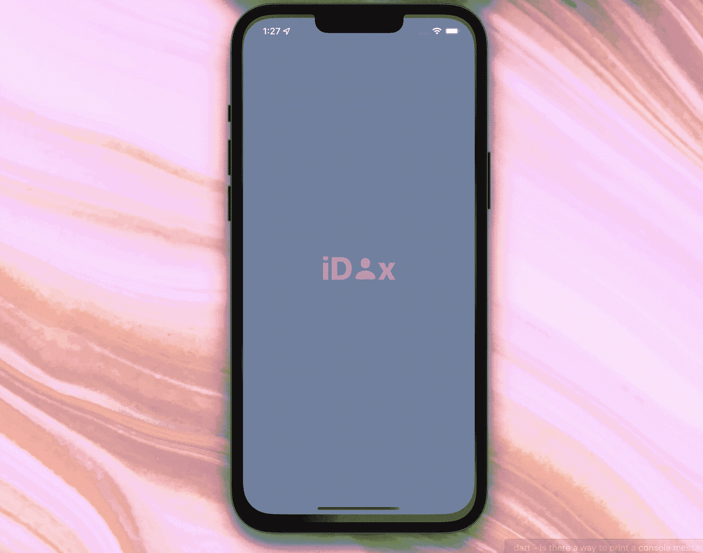
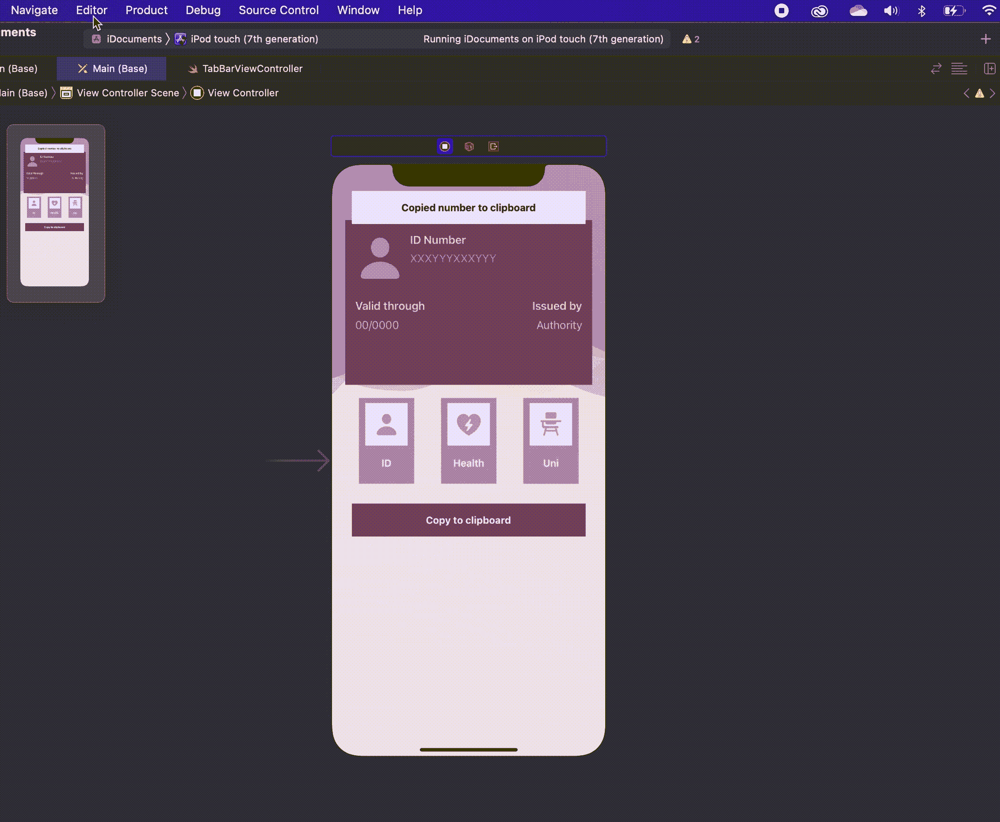
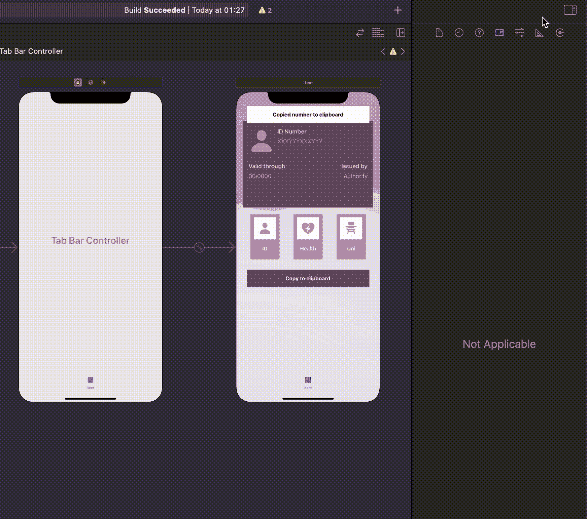
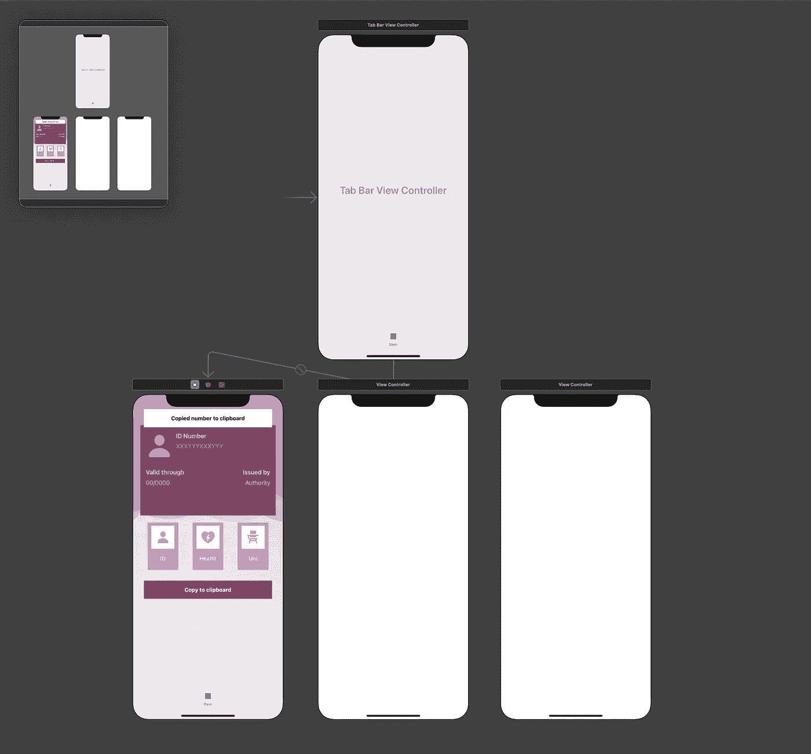
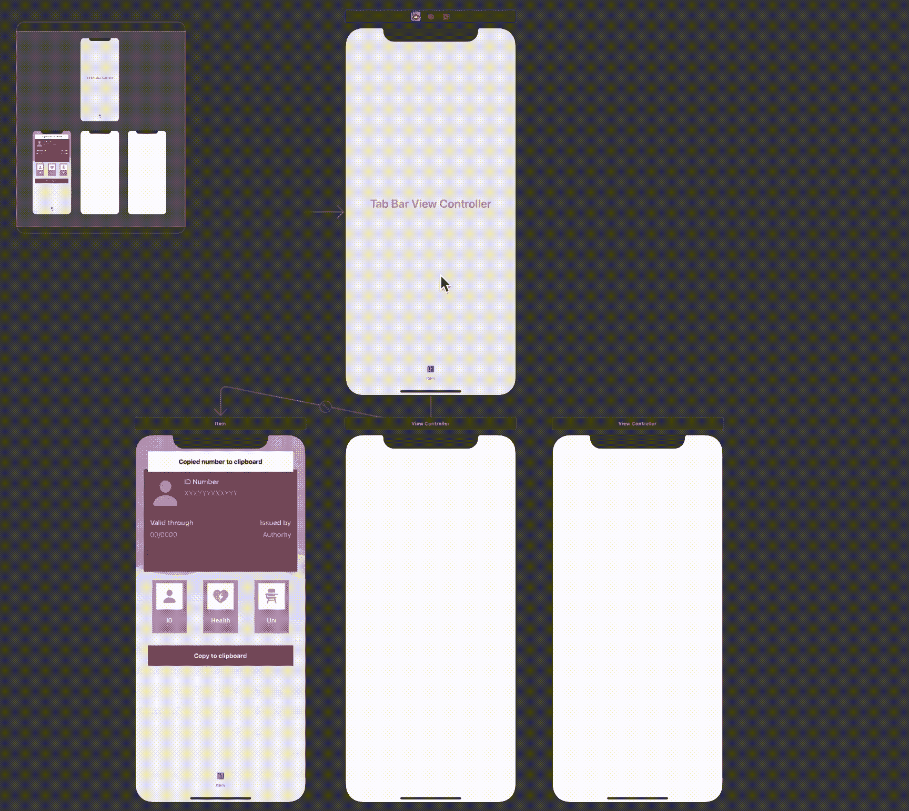
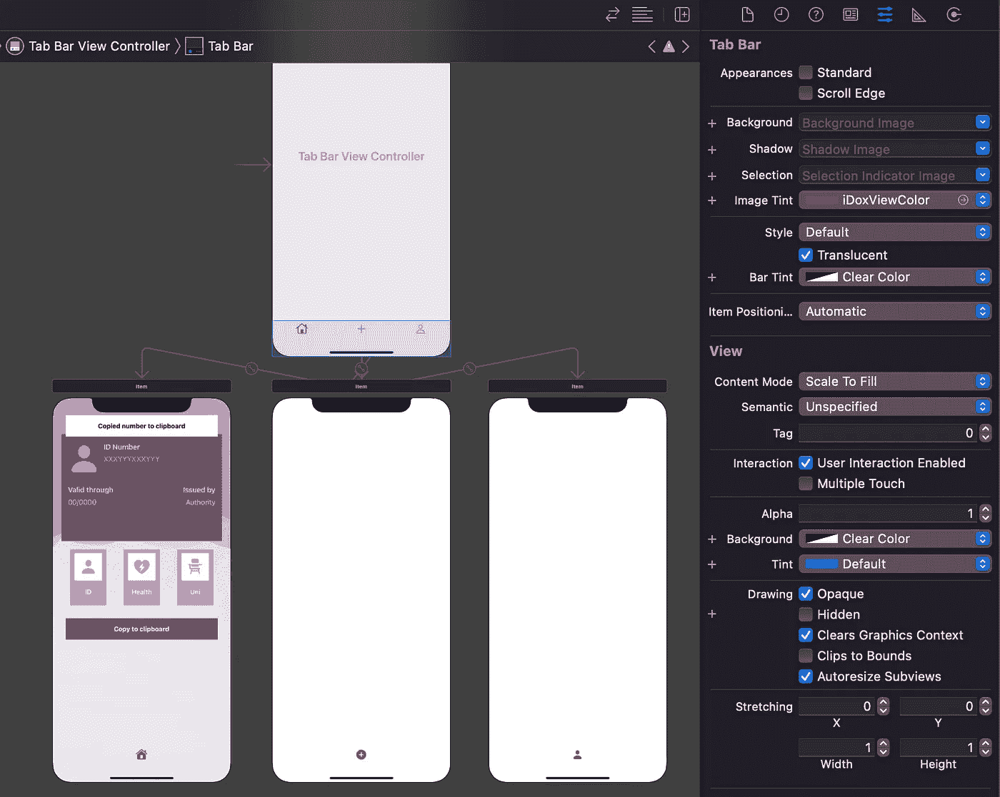
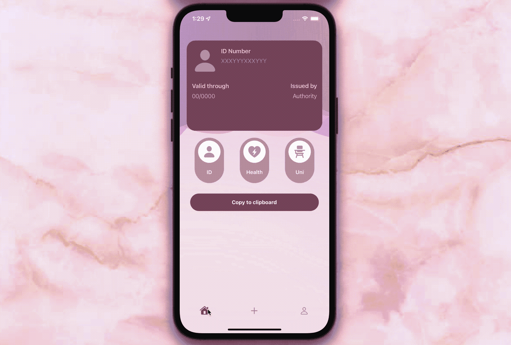
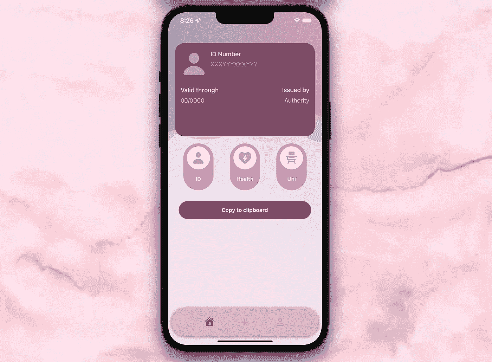

# 使用 Swift 5 在 iOS 应用中设计一个类似 Dribbble 的 UITabBar

> 原文：<https://betterprogramming.pub/how-to-create-a-nice-uitabbar-for-your-ios-app-using-swift-5-pt-1-f9d2d5450909>

## 在 iOS 上为 UITabBar 创建漂亮的 UIs 第 1 部分


还有谁厌倦了老一套的标签栏？

是的，是的，我知道:我们仍然需要它们来导航。我知道它们肯定比导航条更吸引人。如果你的应用很棒，用户可能不会介意简单的设计。但是…是什么阻止了它变得更伟大呢？

问题是，我已经看到圆角标签栏好几年了，当我看到一个时，我仍然很兴奋。所以当我开发我自己的东西的时候，我想，为什么不做我自己的版本呢？

还在读书？意味着你也准备好迈出这一步了！继续读下去，在你的应用上实现它，如果你只是在练习，[在这里下载入门材料，和我一起开发我的示例应用](https://github.com/Margels/iDoxSampleApp/tree/main/iDocuments%20-%20starter)！

准备，预备，开始！

## 前提:示例应用程序

如今，一些政府发布的服务会在进行任何在线请求之前要求我们提供个人文件的详细信息。驾照号码，身份证有效期，医疗卡发行人。我没意见，但是我真的要离开沙发去找我的钱包吗？2022 年？听起来这是一个值得解决的问题。



有用吧？这款应用即将在 App Store 上架！[查看我的个人资料获取更新](https://apps.apple.com/us/developer/margels/id1538283183)！

## 步骤 1:创建标签栏

在故事板上，选择视图控制器。打开编辑器菜单，选择嵌入>标签栏控制器。



选择标签栏视图控制器，并将其连接到我已经在示例应用程序中创建的`TabBarViewController()`类。如果你正在开发自己的项目，你可以从 GitHub starter 项目[这里](https://github.com/Margels/iDoxSampleApp/blob/main/iDocuments%20-%20starter/iDocuments/TabBarViewController.swift)下载这个类。



现在我们有了选项卡栏，是时候向它添加一些项目，并将它们连接到相应的视图。为此，您需要将剩余数量的视图控制器添加到我们的故事板中。我将添加两个，这样我的选项卡栏总共有三个项目:



我为我的标签栏总共设置了三个视图控制器。

单击选项卡栏视图控制器，并按住 ctrl 键一个接一个地拖动到新的视图控制器。然后，选择`Relationship Segue` > `View Controllers`。



## 步骤 2:标签栏的基本样式

一旦连接了每个视图控制器，我将为每个选项卡栏项目选择一个图像。对于我的示例应用程序，我将使用以下代码:

*   我的第一个视图控制器的系统的`house`图像，作为主屏幕，当它处于选中状态时系统的`house.fill`；
*   我的第二个视图控制器的系统的`plus`图像，用户将在这里添加一个卡，当它处于选中状态时，系统的`plus.circle.fill`图像；
*   我的第三个视图控制器的系统的`person`图像，这将是用户的信息和配置文件，以及当它被选中时的系统的`person.fill`。


但是蓝色是怎么回事？让我们通过选择标签栏视图控制器上的标签栏，并选择与我们的应用程序颜色相匹配的图像色调，将其更改为更好的颜色。对于我的示例应用程序，我选择了:

*   `iDoxViewColor`从我的资产作为图像色调、
*   *清除我的条形色调的颜色*，
*   *透明色*为我的背景色。



运行应用程序，并确保您得到了想要的结果。您现在应该会看到这样的内容:



现在是时候让我们的标签栏看起来更可爱了！

## 步骤 3:创建圆形标签栏效果

由于编辑标签栏的边缘使其看起来呈圆形几乎是一项不可能的任务，所以创建圆形标签栏效果最简单的方法就是使用`CAShapeLayer()`。

我们将首先在我们的`TabBarViewController()`类中创建一个:

```
let layer = CAShapeLayer()
```

还要创建一个`layerHeight`属性，我们将在第 2 部分中使用它来在标签栏中放置我们的自定义中间按钮:

```
var layerHeight = CGFloat()
```

在我的示例应用程序中，我设置了一些将在标签栏中使用的颜色。我将为它们创建一个参考，以便更容易地访问这些特定的颜色。我的想法是:

*   背景颜色，这将是你的标签栏的颜色；
*   第二种颜色，用于标签栏中未被选中的项目(除非你希望它们自动变成灰色)；
*   将用作标签栏阴影的第三种颜色(如果你需要的话)。

在我的课堂上会是这样的:

```
let bgColor = UIColor(named: “iDoxLightColor”)
let sColor = UIColor(named: “iDoxAccentColor”)
let tColor = UIColor(named: “iDoxShadowColor”)
```

现在是时候给我们的层一个形状了。为了使它看起来和第一张图中的一模一样，我使用了以下准则:

*   x 位置，即图层与屏幕左边缘的距离，应设置为 10；
*   连续地，层的宽度应该和屏幕一样，减 20(所以到屏幕右边的距离也会是 10)；
*   y 位置，即层到屏幕顶部的距离，应该对应于原始选项卡栏的 y 位置，减去 20；
*   层的高度应该与选项卡栏的高度相同，加上 30。

我还补充道:

1.  阴影，使用我上面提到的第三种颜色；
2.  项目的宽度和位置，使它们更加居中；
3.  未选中项目的颜色，使用第二种颜色。

最后，我将图层的高度记为`layerHeight`属性。我们稍后将需要访问它来设置对选项卡栏的自定义中间按钮的约束。

我把所有东西都放在一个叫做`setUpTabBar()`的函数中，就像这样:

这个函数将在我们的`viewDidLoad()`函数内的`TabBarViewController()`类中被调用:

运行您的项目，您应该会看到类似这样的内容:



嗒哒！已经很好看了！

我知道这已经是很多东西了，但是本教程继续说明如何在我们的标签栏中添加一个中间按钮！你准备好了吗？

然后从这里开始第二部分:

[](/how-to-create-a-nice-uitabbar-for-your-ios-app-using-swift-5-pt-2-9285466846c8) [## 使用 Swift 5 设计 iOS 中 UITabBar 的中央按钮

### 在 iOS 上为 UITabBar 创建漂亮的 UIs 第 2 部分

better 编程. pub](/how-to-create-a-nice-uitabbar-for-your-ios-app-using-swift-5-pt-2-9285466846c8) 

你喜欢这个教程吗？它和你的项目合作得好吗？让我知道你的反馈！

```
**Want to Connect?**Follow me on…
❤️ [YouTube](https://www.youtube.com/channel/UC5hqYiHxie458KSO1PAnA8Q)
💖 [Dribbble](https://dribbble.com/margelss)
💜 [Instagram](https://www.instagram.com/itsmargels/)
💙 [Ko-Fi](https://ko-fi.com/margelss)
🖤 [GitHub](https://github.com/Margels)
```