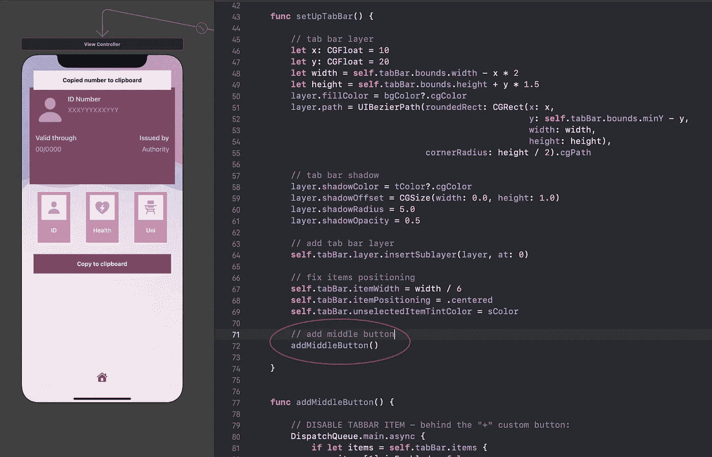
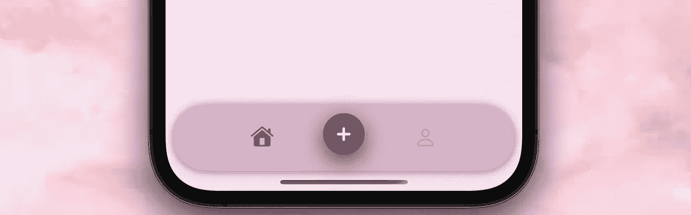
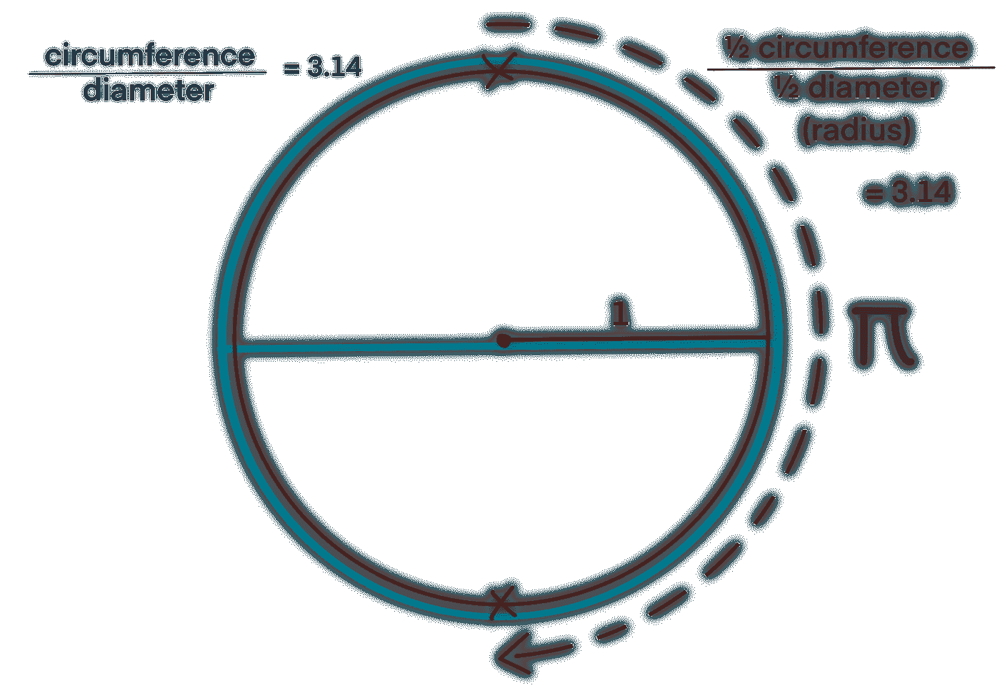
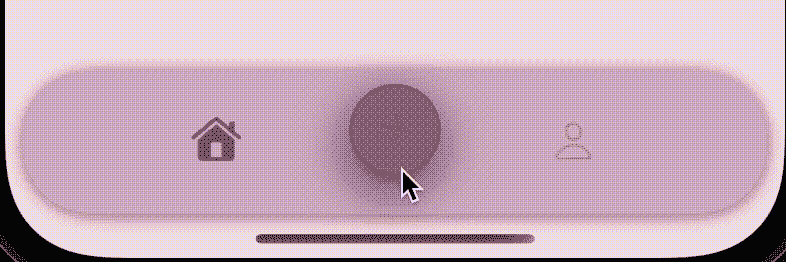
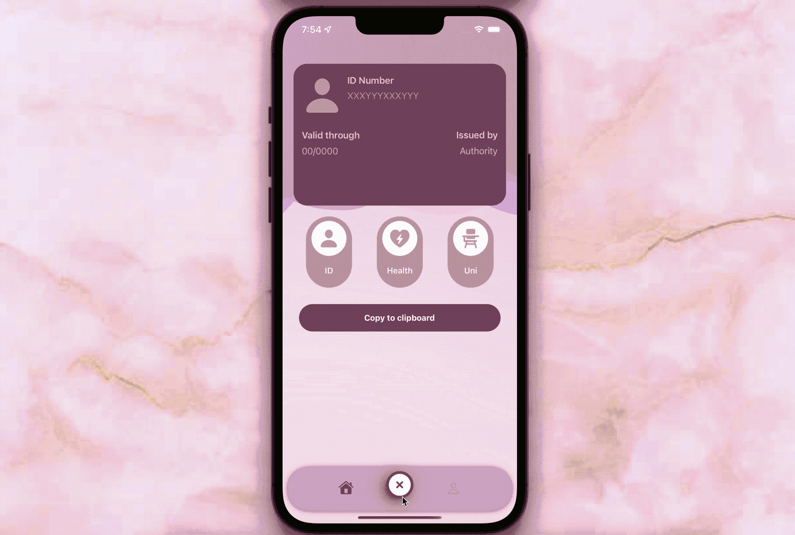

# 使用 Swift 5 为 iOS 中的 UITabBar 设计一个自定义中央按钮

> 原文：<https://betterprogramming.pub/how-to-create-a-nice-uitabbar-for-your-ios-app-using-swift-5-pt-2-9285466846c8>

## 在 iOS 上为 UITabBar 创建漂亮的 UIs 第 2 部分


这是我们项目的最终外观！很可爱，对吧？

你好陌生人！已经一分钟了！

很高兴你能来参加我的 UITabBar 教程的第二部分！你在找第一部分吗？可以在这里[找到](/how-to-create-a-nice-uitabbar-for-your-ios-app-using-swift-5-pt-1-f9d2d5450909)！

在我的教程的第二部分，我们将了解如何制作中央按钮，以及如何让它旋转。我希望你很有动力，因为你需要在这里补上一些数学。没有人喜欢数学。但是我们喜欢 UI 设计，所以有时候要给计算留些余地。叹气。

# 步骤 4:添加中间按钮

下一步是创建标签栏的中间按钮。我将在`viewDidLoad()`函数前添加以下代码:

```
var **layerHeight** = CGFloat()
var **middleButton**: UIButton = {
   let b = UIButton()
   let c = UIImage.SymbolConfiguration(pointSize: 15, weight: .heavy, scale: .large)
   b.setImage(UIImage(systemName: "plus", withConfiguration: c), for: .normal)
   b.imageView?.tintColor = .white
   b.backgroundColor = UIColor(named: “iDoxViewColor”)
   return b
}()
```

接下来，我们需要做一些基本的格式化。我将通过创建一个函数来做到这一点，您可以在下面找到它，但首先我将解释它的所有功能。

它将执行以下操作:

*   禁用第二个选项卡栏项目，这样用户就不会意外地点击一个导致空视图控制器的按钮:

```
DispatchQueue.main.async {
   if let items = self.tabBar.items {
      items[1].isEnabled = false 
   }
}
```

*   将我们的`middleButton`添加到标签栏视图，并给它一个形状、一个阴影，最重要的是，一个位置:

```
// add middle button
tabBar.addSubview(middleButton)
let size = CGFloat(50)
let constant: CGFloat = -20 + ( layerHeight / 2 ) - 5// set constraints
let constraints = [
   middleButton.centerXAnchor.constraint(equalTo: tabBar.centerXAnchor),
   middleButton.centerYAnchor.constraint(equalTo: tabBar.topAnchor, constant: constant),
   middleButton.heightAnchor.constraint(equalToConstant: size),
   middleButton.widthAnchor.constraint(equalToConstant: size)
]
for constraint in constraints {
   constraint.isActive = true
}
middleButton.layer.cornerRadius = size / 2// shadow
middleButton.layer.shadowColor = tColor?.cgColor
middleButton.layer.shadowOffset = CGSize(width: 0, height: 8)
middleButton.layer.shadowOpacity = 0.75
middleButton.layer.shadowRadius = 13// other
middleButton.layer.masksToBounds = falsemiddleButton.translatesAutoresizingMaskIntoConstraints = false
```

*   每次点击按钮时的自定义操作:

```
// action
middleButton.addTarget(self, action: #selector(buttonHandler(sender:)), for: .touchUpInside)
```

此时，系统会给你一个错误，因为 Objective-C 函数`buttonHandler(sender:)`还没有创建。我们很快就会这样做，错误应该会自行消失。

整个函数应该如下所示:

我将在我们的`setUpTabBar()`函数的最后调用`addMiddleButton()`函数。这是为了确保`CAShapeLayer()`已经在视图中并设置好了，因为我用它的 y 和高度值来制作我们的中间按钮。



运行你的应用程序，确保按钮的位置符合预期。



是时候定义链接到这个按钮的动作，并摆脱那个烦人的错误了！通过在代码中复制粘贴下面一行来创建 Objective-C 函数`buttonHandler(sender:)`:

```
@objc func buttonHandler(sender: UIButton) {}
```

在这个函数中，我们将决定这个按钮将执行哪些操作。它会打开一个新的视图控制器吗？会让你的 iPhone 着火吗？它会召唤外星人并引发星系间战争吗？它会召唤丹妮莉丝的龙来对我们发泄愤怒吗？这取决于你。我自己不是一个小心翼翼的女孩，所以我的只是旋转并显示三个按钮。胜过三条愤怒的龙…

# 第五步:旋转按钮

这就是你们中那些数学和几何很差的人将会暴露的时候。我知道，这并不适合所有人。但是只要解释的好就很好玩很简单！所以让我试着让它简单一些，这样它就不会令人厌烦或者完全令人困惑。如果你已经知道我在说什么，或者不太关心细节，你可以直接跳到代码部分。

> 无聊的部分…

我们将使用方法`CGAffineTransform(rotationAngle:)`来旋转我们的按钮。角度不是以度来计算的:因此，它不像仅仅使用 45 度、90 度或 180 度那么简单。我们将需要用*弧度*来计算我们的角度，这意味着我们将使用一个圆的半径来确定我们的形状应该在哪里停止旋转。



一个圆的周长除以它的直径总是等于 3.14 左右的一个数，叫做圆周率(π)。因此，如果我们用一个圆的半周长除以半直径(半径)，我们也应该得到 3.14 (π)。因此，在弧度中，180 度对应π。

正如你们中的许多人所知，圆的周长除以其直径总会得到一个大约为 3.14 的数字，称为圆周率，在数学中缩写为以下符号:π(希腊字母“P”)。这意味着，如果我们有一个直径为 2 厘米的圆，它的周长大约是 6.28 厘米

从逻辑上讲，如果你用一个圆的半周长或半圆除以它的半径，即直径的一半，结果也是 3.14:在上面的例子中，一个直径为 2 厘米的圆的半径是 1 厘米，因此周长是 3.14 厘米。

因为我们是用圆的半径来计算我们的角度，所以我们将使用半圆作为参考。因为半圆在度数上相当于 180 度，也相当于 3.14 度，我们可以认为下面的陈述是正确的:

*   角度上，π对应顺时针 180 度；
*   -π对应于逆时针 180 度。

正如你从我的演示 gif 中看到的，我将按钮移动 45 度，将表示添加内容的加号变成十字符号，表示关闭内容:



你得到正确的公式了吗？还是你屈服于数学的力量？好吧，不管怎样，解决办法是这样的:

```
π / 4 = 45 degrees
```

在 Swift 中，它看起来像这样:

```
CGFloat.pi / 4
```

> …还有最酷的部分！

首先，设置一个名为`buttonTapped`的布尔值，并将其设置为 false:

```
var buttonTapped = false
```

让我们填写 x 函数！它是这样工作的:

*   当 boolean x 设置为 false 时，按钮将移动 45 度，当 boolean 设置为 true 时，按钮将移回其原始位置；
*   按钮的背景在被选中时会变成白色，不被选中时会变回紫色；
*   按钮被选中时会有紫色边框，被选中时没有边框；
*   按钮的图像在被选中时会从白色变成紫色，在未被选中时会变回白色；
*   无论按钮处于何种状态，它都会有阴影。

我们的函数将如下所示:

如果你愿意，你可以调整动画时长、颜色和旋转角度，看看你更喜欢哪个动画。

运行您的项目并确保按钮正常工作:



哇！你应该为自己在这里成功感到骄傲！

对第三部分兴奋了吗？请点击这里查看:

[](/design-dribbble-like-floating-buttons-for-your-uitabbar-for-ios-using-swift-5-8bf5eb71f79a) [## 使用 Swift 5 在 iOS 中为你的 UITabBar 设计类似 Dribbble 的浮动按钮

### 在 iOS 上为 UITabBar 创建漂亮的 UIs 第 3 部分

better 编程. pub](/design-dribbble-like-floating-buttons-for-your-uitabbar-for-ios-using-swift-5-8bf5eb71f79a) 

你喜欢这个教程吗？它和你的项目合作得好吗？

```
**Want to Connect?**Follow me on…
❤️ [YouTube](https://www.youtube.com/channel/UC5hqYiHxie458KSO1PAnA8Q)
💖 [Dribbble](https://dribbble.com/margelss)
💜 [Instagram](https://www.instagram.com/itsmargels/)
💙 [Ko-Fi](https://ko-fi.com/margelss)
🖤 [GitHub](https://github.com/Margels)
```