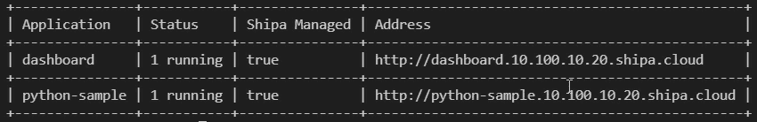
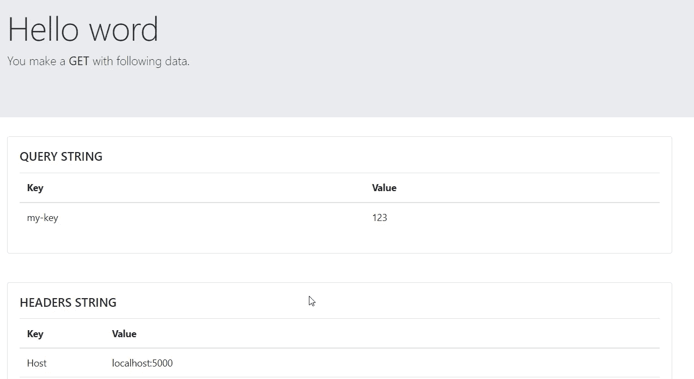
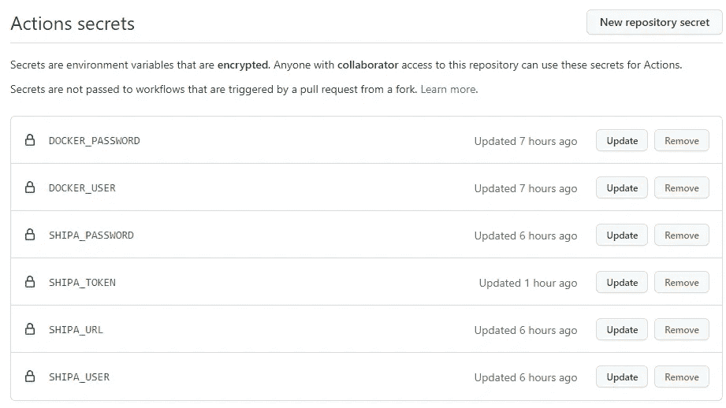

# 如何使用 GitHub 操作 Kubernetes 和 Shipa 创建 NoOps 部署

> 原文：<https://betterprogramming.pub/how-to-create-a-noops-deployment-with-github-actions-kubernetes-and-shipa-18aab208fe7a>

## 发现 DevOps 的简单性并降低 Kubernetes 的复杂性


由[保罗·沃克默](https://unsplash.com/@laup?utm_source=medium&utm_medium=referral)在 [Unsplash](https://unsplash.com?utm_source=medium&utm_medium=referral) 上拍摄的照片

由于公共云和服务为我们提供了开箱即用的解决方案，NoOps 趋势现在成为可能。无论如何，许多这些服务都有一些限制，或者成本随着资源的使用而激增。这就是为什么许多开发人员仍然喜欢像 Kubernetes 这样的解决方案，因为这样可以保持对应用程序的控制，并有充分的实现自由。无论如何，Kubernetes 治理是昂贵的，我们的目标是减少应用程序开发附近的摩擦。

在本文中，我们将创建一个类似 NoOps 的解决方案，使用 Shipa 来管理 Kubernetes 和 GitHub action，将源代码直接与服务器连接起来。

# 设置解决方案

对于本文，我使用了 [Shipa](https://shipa.io/) 。对于那些不习惯的人来说，Shipa 是一个自动化和简化 Kubernetes 应用的平台，使用起来更加流畅和简单。换句话说，由于 Shipa，您将只关注开发部分，而不是基础设施问题。要了解更多关于这个话题，你可以阅读我以前的文章 devo PS is[Dead Long Life to appos](/devops-appops-f096cdbb02ac)。该解决方案的另一个参与者是 GitHub，我认为他们不需要任何介绍😄由于 GitHub 的行动，我们将在几分钟内建立一个 DevOps 流程。

要安装和配置 shipa，您可以[遵循本教程](https://towardsdatascience.com/improve-development-experience-kubernetes-5d16da4105d7)。

# 应用程序的首次运行

第一步是创建应用程序。这可以使用 UI 或通过以下代码来完成:

```
shipa app create python-sample\ 
   -t shipa-admin-team \
   -k shipa-framework
```

对于这个例子，我们创建了一个 Python 应用程序，它只打印发送到 URL 的数据。我使用的代码如下。模板省略了，可以签入到`templates/index.html`文件中。

现在，您可以通过键入以下命令来检查所有功能是否正常工作:

```
shipa app list
```

输出如下所示:



注意，如果您使用自管理的 Shipa 版本，那么生成的 URL 是不公开的，所以您必须将它添加到您的`localhost`文件中。

下一步是向 Shipa 描述申请是如何制作的。所以，我们添加一个特殊的 YAML 文件，内容如下:

如您所见，我们使用了端口 5000，这与我们硬编码到 [Python](https://medium.com/u/845dbbffa85e?source=post_page-----18aab208fe7a--------------------------------) 文件中的端口相同。该数据将用于将 Kubernetes 应用服务连接到 Pod/容器的正确端口。

最后一个配置步骤是添加一个`Procfile.`。使用这个文件是因为 Shipa 框架使用 Heroku Buildpack 来构建映像，所以它可以告诉我们这是哪种类型的应用程序。在我们的例子中，我们只需要使用 Python 告诉`app.py`文件。该文件的内容如下:

```
web: python app.py
```

现在，我们准备开始我们的第一次手动部署。使用下一个命令。

```
shipa app deploy -a python-sample . \
   -i zeppaman/python-sample:1.0 \
   --shipa-yaml=./shipa.yml
```

该命令将构建一个新的 docker 映像，并将其推送到给定的存储库。要执行此步骤，您必须先登录您正在使用的 docker 注册表。

然后，您可以在 UI 上检查部署的状态，或者简单地尝试在浏览器上测试它。下图显示了导航`http://python-sample.10-10-10-10.shipa.cloud?my-key=123`的输出:



运行的应用程序

好了，现在我们已经完成了我们的第一次手动部署，我们只需要用 GitHub 动作来自动化它！

# 设置 GitHub 操作

这里的主要概念是，我们必须简单地自动化本文前一部分中完成的手动步骤。为此，我们有两种选择:

*   第一个是使用我们在示例的前一部分安装的`shipa`工具
*   第二个选择是使用`shipa-ci`,这是一个用于自动化应用程序部署的 Python 工具。

在本教程中，我们将测试这两者！

## 使用 Shipa cli 部署

要使用 Shipa cli 进行部署，我们只需执行几个步骤:

1.  登录 docker
2.  安装 shipa 客户端
3.  添加 shipa 目标
4.  登录 shipa
5.  部署应用程序

除了步骤 4 之外，所有步骤都是对之前在本地上运行的命令的简单复制和粘贴。事实上，它会提示输入密码，并且实际上没有任何文档化的选项来自动执行该步骤。无论如何，有一个简单的方法可以解决这个问题。

shipa cli 的所有数据都存储在`~/.shipa`文件夹中。登录后，认证令牌会保存到`./.shipa/token`和`./.shipa/tokens/<targetname>`中。因此，我们要做的是在本地登录，复制令牌并在管道上使用它。

要读取令牌，请运行以下命令:

```
cat ${HOME}/.shipa/token
```

此时，我们可以从设置 Github 工作流开始。首先，在你的个人资料中打开 Github secrets 页面，输入如下图所示的秘密:



Github 秘密

既然秘密已经存在，您可以创建一个新的 CI 管道，将`shipa-cli-yml`添加到`.workflow`文件夹中。该文件的内容应该如下:

让我们一步步来看文件的内容。第一步是使用官方插件登录 docker:

```
- name: Log in to Docker Hub        
  uses: docker/login-action@v1.10.0
        with:
          username: ${{ secrets.DOCKER_USER }}
          password: ${{ secrets.DOCKER_PASSWORD }}
```

然后，我们将添加目标，就像我们在手动情况下所做的那样，并使用下面的脚本将 toke 写入文件。

注意，文件夹可能还没有创建，所以`mkdir -p`确保路径存在。

现在是最后一步:部署应用程序。这可以通过在所有前面的命令之后添加 deploy 命令来实现:

```
shipa app deploy -a python-sample . -i zeppaman/python-sample:1.0 --shipa-yaml=./shipa.yml
```

## 使用 Shipa CI 工具部署

shipa CI 工具是一个 python 工具，可以使用 Pip 安装，并支持显式身份验证，因此它的使用没有任何技巧。无论如何，它只支持部署思想尚未完成的 docker 图像。因此，我们在文件夹中添加一个 docker 文件，内容如下:

```
FROM python:3.8-slim-buster

WORKDIR /app

COPY requirements.txt requirements.txt
RUN pip3 install -r requirements.txt

COPY . .

CMD [ "python3", "-m" , "flask", "run", "--host=0.0.0.0","-port=5000"]
```

使用此工具，自动化步骤如下:

1.  登录 docker
2.  建立并推广 docker 映像
3.  使用`shipa-ci`进行部署

为了实现这个工作流程，在`.workflow`文件夹中创建一个名为`shipa-ci.yml`的文件，内容如下:

我们来看看每一步的意义。下一个代码块表示 docker 登录和 docker 推送:

由于这一步，我们有了可用的映像，所以我们可以使用`shipa-ci`命令进行部署:

```
- name: Run a multi-line script
        run: |
          pip install shipa-ci
          shipa-ci --server=${{ secrets.SHIPA_URL }} --insecure --email=${{ secrets.SHIPA_USER }} --password=${{ secrets.SHIPA_PASSWORD }} --ca="$CA"  app deploy -a python-sample  -i github.io/zeppaman/python-sample:latest
```

通过您所使用的方法，您可以将部署的结果检查到 Shipa 仪表板中。在日志中，您应该会发现类似于下面的截图:


应用程序部署日志

现在我们已经完成了部署部分，我们的应用程序已经准备好了！

# 带回家

只需几个步骤，我们就部署了一个应用程序，并创建了一个 100%可重用的部署脚本。注意，通过使用构建包，部署脚本是完全不可知的。您可以使用 PHP、Python 或 Java 应用程序，并且无需更改 YAML 工作流。这一部分非常值得注意，因为它允许您减少应用程序部署过程之间的差异，并消除定义新应用程序设置的工作。

此外，在幕后使用 Kubernetes 支持本地场景，并为您提供对所有资源的完全(托管)控制。

所有的源代码都可以在这个库中公开获得。以下是一些参考资料:

*   [GitHub 上的源代码](https://github.com/zeppaman/shipa-github-deploy/)
*   [石帕平台](https://shipa.io/)