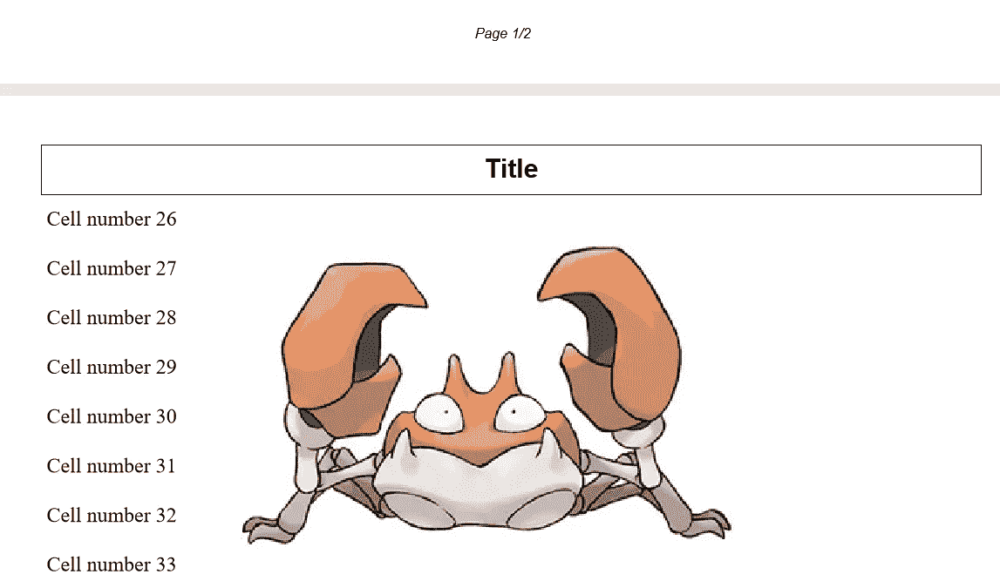

# 如何用 Python 创建 PDF

> 原文：<https://betterprogramming.pub/how-to-create-a-pdf-in-python-71fac9f7bcd6>

## 利用 PyFPDF，一个用于 PDF 生成的库


安妮·斯普拉特在 [Unsplash](https://unsplash.com/s/photos/documents?utm_source=unsplash&utm_medium=referral&utm_content=creditCopyText) 上的照片

在本文中，您将学习如何使用名为`PyFPDF`的模块创建您自己的定制 PDF。根据官方文献记载，`PyFPDF`是

> “…一个在 Python 下生成 PDF 文档的库，从 PHP 移植而来(参见 [FPDF](http://www.fpdf.org/) :“免费”——PDF，一个众所周知的 PDFlib-extension 的替代品，有很多例子、脚本和衍生品)。
> 
> 与其他 PDF 库相比，PyFPDF 简单、小巧、功能多样、功能先进，并且易于学习、扩展和维护。"
> 
> — [PyFPDF 文档](https://alexanderankin.github.io/pyfpdf/mkdocs_docs/index.html)

它提供以下功能:

*   Python 2.7 到 3.5 支持。
*   Unicode (UTF-8) TrueType 字体子集嵌入。
*   内部/外部链接。
*   PNG、GIF 和 JPG 支持(包括透明度和 alpha 通道)。
*   形状，线描。
*   单元格/多单元格/明文书写，自动分页符。
*   基本的 html2pdf(带有可视化设计器的模板)。
*   异常支持、其他小的修复、改进和 PEP8 代码清理
*   毒性测试。

本教程有四个部分:

*   [设置](#b0fb)
*   [基本用法](#3565)
*   [例题](#43f0)
*   [结论](#14b8)

让我们开始安装必要的模块。

# 1.设置

## 从 PyPI 安装

您可以使用`pip install`轻松安装它。对于本教程，我将使用以下命令安装原始`PyFPDF`的分叉版本:

```
pip install fpdf2
```

如果您正在寻找原始版本，请使用以下命令进行安装:

```
pip install fpdf
```

您可以克隆存储库并将其直接安装在您的本地机器上。如果你这样安装的话，它需要额外的依赖项，比如`Pillow`。

在下一部分，我们将探讨本模块中的一些特性和功能。

# 基本用法

## 导入

让我们从在 Python 文件中添加以下 import 语句开始。

```
from fpdf import FPDF
```

## FPDF 的例子

下一步是初始化 FPDF 的实例，它是类的构造函数。它接受以下输入参数:

```
fpdf = FPDF(orientation = 'P', unit = 'mm', format='A4')
```

*   `orientation`:默认页面方向。可能的值是(不区分大小写)`P`或`L`。默认值为`P`。
*   `unit`:用户单位。可能的值有`pt`、`mm`、`cm`、`in`。默认值为`mm`。
*   `format`:页面使用的格式。可以是下列值之一(不区分大小写):`A3`、`A4`、`A5`、`Letter`、`Legal`或包含宽度和高度的元组。默认值为`A4`。

您可以将其初始化为空白构造函数。但是，请记住单位是`mm`，不是`point`。如果你在处理图像，尺寸通常用`point` s 来表示。根据您的用例进行修改。

```
fpdf = FPDF()
```

## 新页面

用下面的代码设置一个新页面。字体设置(如颜色和线宽)保留了上一次调用的内容:

```
fpdf.add_page()
```

## 字体

`set_font`功能帮助设置用于打印字符串的字体。在打印单元格中的文本之前，您需要至少调用一次该方法，否则输出文档将无效。多次调用它将覆盖基于最后一次配置的设置。颜色的设置由另一个函数调用。

```
fpdf.set_font(family, style = '', size = 0)
```

*   `family`:字体家族。它可以是由`add_font`定义的名称，也可以是标准系列(不区分大小写)中的一个，如`Courier`、`Arial`、`Times`、`Symbol`、`ZapfDingbats`。传递空字符串将保留当前字体系列。
*   `style` :字体样式。可能的值有(不区分大小写):`B`、`I`、`U`或空字符串。默认值是 regular，由空字符串指定。粗体和斜体样式不适用于`Symbol`和`ZapfDingbats`。也可以传入一个组合。
*   `size`:字体大小，以磅为单位。默认值是当前大小。如果从文件开始就没有指定尺寸，则取值为`12`。

## 细胞

单元格是显示文本的矩形框，具有可选的背景和边框设置。

```
fpdf.cell(w, h = 0, txt = '', border = 0, ln = 0, 
          align = '', fill = False, link = '')
```

*   `w`:单元格宽度。如果`0`，单元格将延伸到右边距。
*   `h`:单元格高度。默认值:`0`。
*   `txt`:要打印的字符串。默认值:空字符串。
*   `border`:指示是否必须在单元格周围绘制边框。该值可以是数字，如`0`(无边框)、`1`(框架)，也可以是以下字母的组合:`L`(左)、`T`(上)、`R`(右)、`B`(下)。默认值为`0`。
*   `ln`:指示调用后当前位置应该去哪里。可能的值有:`0`(向右)、`1`(到下一行的开头)、`2`(下面)。默认值为 0。
*   `align`:允许文本居中或对齐。可能的值有:`L`(左)、`C`(中)、`R`(右)。默认值是一个空字符串，表示左对齐。
*   `fill`:表示单元格背景是必须上色(`True`)还是透明(`False`)。默认值为`False`。你需要事先调用`set_fill_color`来改变背景颜色。
*   `link`:您可以通过此参数传入一个链接。它接受由`add_link`返回的 URL 或标识符。

## 输出

完成后，您可以根据需要将文档输出到不同的目的地。

```
fpdf.output(name = '', dest = '')
```

*   `name`:文件的名称。仅在写入文件时使用。
*   `dest`:文件的目的地。这可以取下列值之一:`I`或`D`(将文档写到`sys.stdout`)。如果没有给定文件名，这是默认的)，`F`(用给定的名称保存到本地文件。可能包含路径。如果给定了文件名，这是默认设置)，`S`(以字节字符串的形式返回文档)。

我将在下一部分向您展示几个示例，供您参考。

# 例子

## 简单的例子

让我们通过使用下面的代码生成一个打印`Hello World!`的简单文档来测试一下。

```
from fpdf import FPDF

pdf = FPDF()
pdf.add_page()
pdf.set_font('Arial', 'B', 16)
pdf.cell(40, 10, 'Hello World!')
pdf.output('example1.pdf', 'F')
```

您应该得到以下输出:


## PDF 格式的图像

您可以利用图像功能输出文档中的图像。与`cell`不同，`image`基于指定的坐标和尺寸放置在所有东西的顶部:

```
fpdf.image(name, x = None, y = None, w = 0, h = 0, type = '', link = '')
```

支持的格式有 JPEG、PNG 和 GIF。文档中将只使用 GIF 的第一幅图像。一个常见的错误是假设文档的尺寸与图像使用相同的单位。下面是一个名为`example.jpg`的示例图片。大图像会影响文档的整体大小。

```
from fpdf import FPDFpdf = FPDF()
pdf.add_page()
pdf.set_font('Arial', 'B', 16)
pdf.cell(40, 10, 'Hello World!')
pdf.image('example.jpg', 10, 30, 100)
pdf.output('example2.pdf', 'F')
```

运行代码时，您应该会看到以下输出:


## 页眉和页脚

`FPDF`类带有`header`和`footer`函数，它们本身什么也不做。您必须扩展这些类，并为它们实现您自己的功能。

你可以像最初的 FPDF 类一样正常调用子类。至于页码，则

> “…当前页码由`page_no`方法返回；至于总页数，它是通过特殊值`{nb}`获得的，该值将在文档关闭时被替换(假设您首先调用了 `alias_nb_pages`)。”

如果内容超出页面限制，它会自动为您执行分页，而不需要显式的`add_page`调用。尝试增加范围限制，并注意文档中的页数是如何增加的。

当您运行 Gist 中的代码时，您应该会看到一个包含以下内容的两页 PDF:



# 结论

让我们回顾一下今天所学的内容。

我们从通过`pip install`简单安装`PyFPDF`模块的分叉版本开始。

接下来，我们探讨了一些基本特性和功能。你可以在这里找到参考文献的完整列表和手册[。](https://alexanderankin.github.io/pyfpdf/mkdocs_docs/ReferenceManual/index.html)

最后，我们看了几个例子，生成一个简单的`Hello World!`文档和另一个带有图像的文档。我们看到了这个模块如何支持页眉和页脚的生成，前提是您扩展了基类`FPDF`并自己实现了逻辑。

感谢你阅读这篇文章。希望下一篇文章能再见到你！

# 参考

*   [PyFPDF 文档](https://alexanderankin.github.io/pyfpdf/mkdocs_docs/index.html)
*   [PyFPDF 原 Github](https://github.com/reingart/pyfpdf)
*   [PyFPDF2 Github](https://github.com/alexanderankin/pyfpdf)