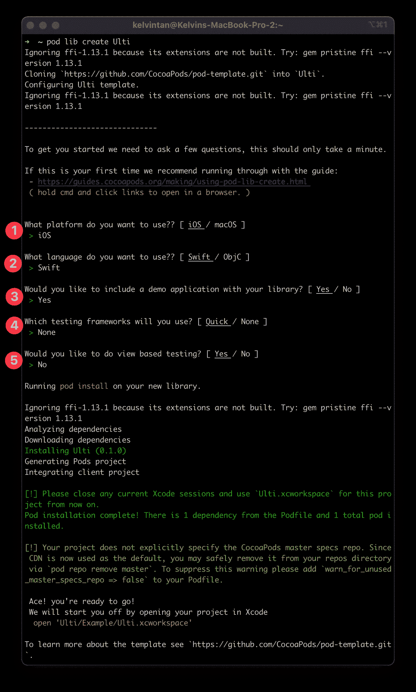
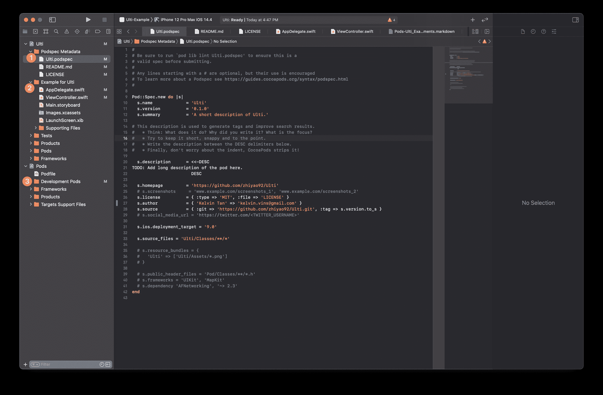
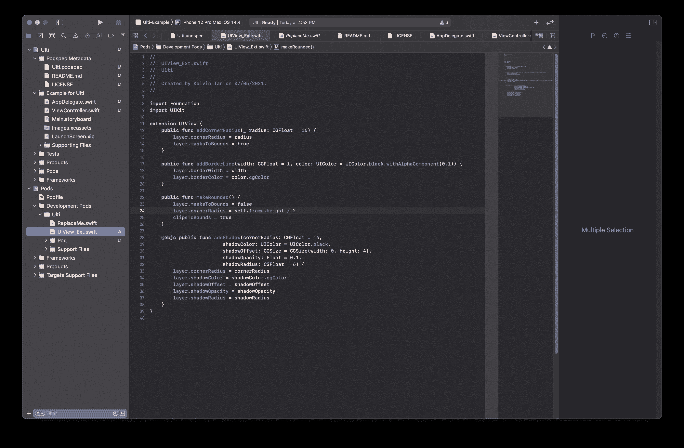
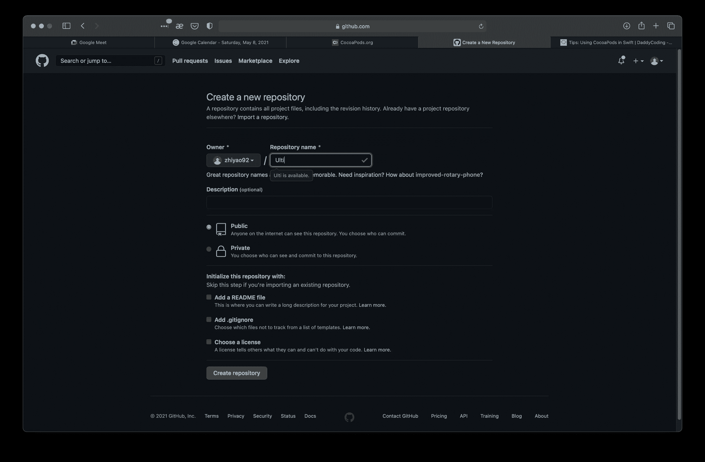
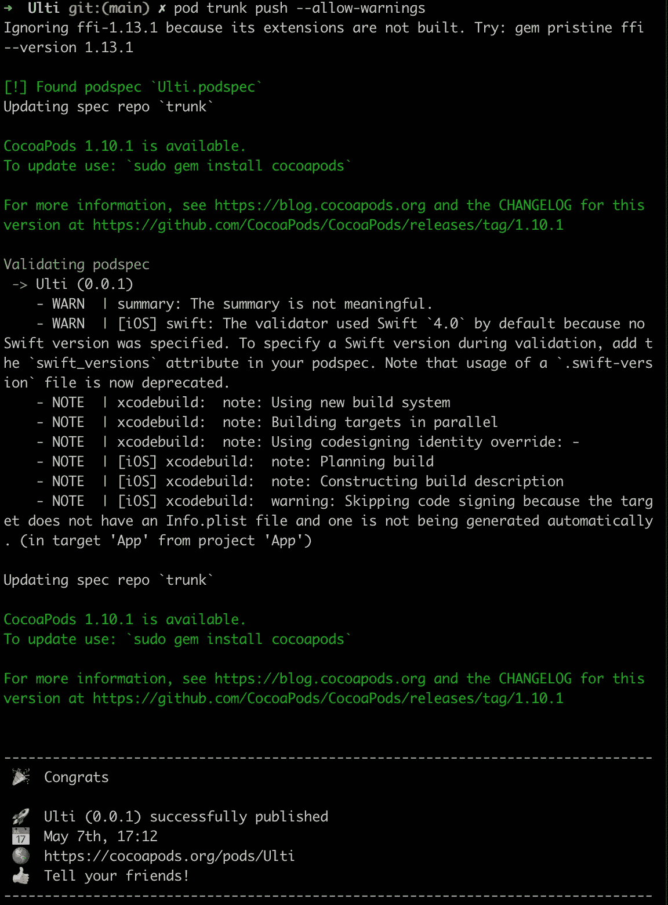
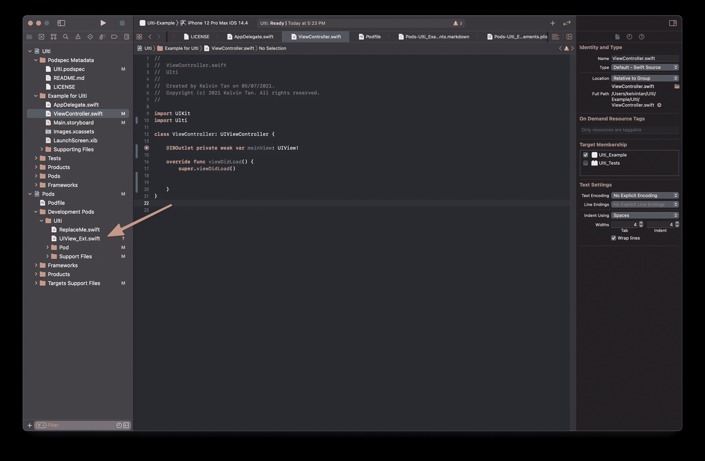
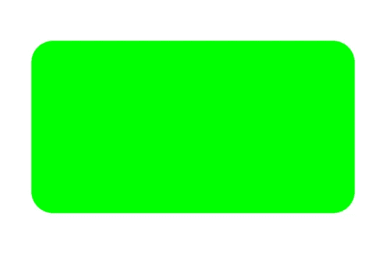
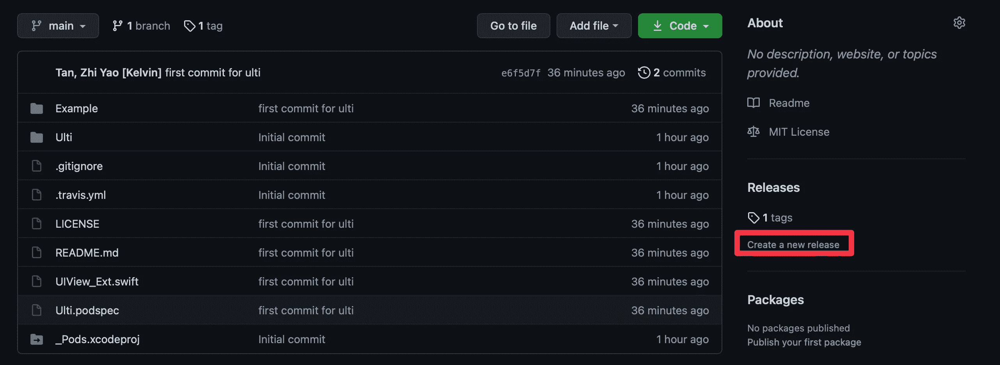
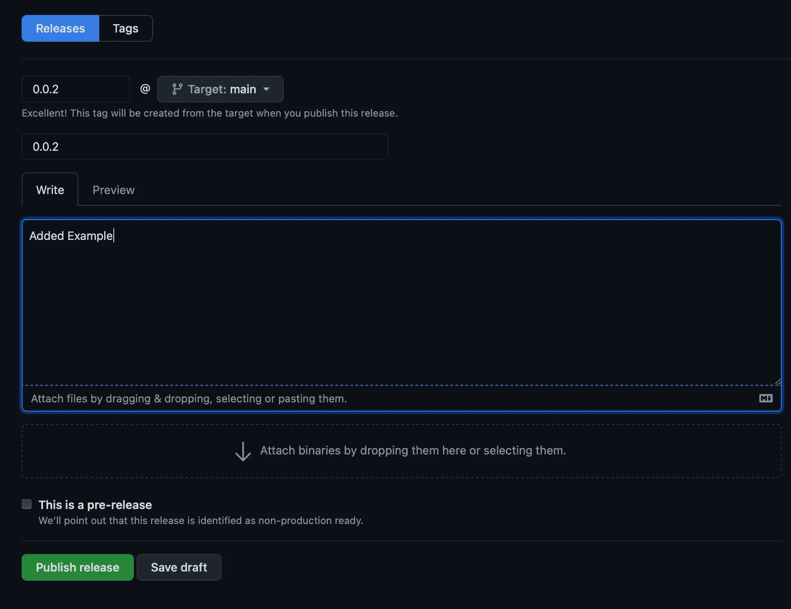
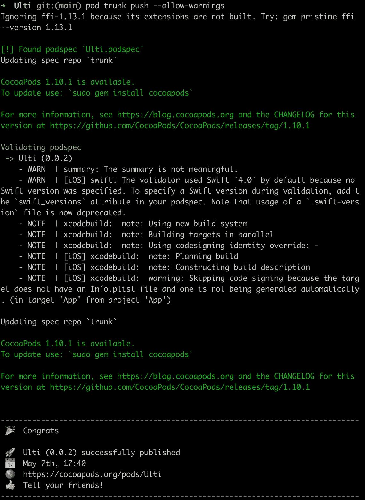

# 如何创建公共 CocoaPods 库

> 原文：<https://betterprogramming.pub/how-to-create-a-public-cocoapods-library-23e9c8f773f8>

## 运送你自己的图书馆


优素福·萨尔汗在 [Unsplash](https://unsplash.com?utm_source=medium&utm_medium=referral) 上的照片

您可能已经从其他人创建的第三方库中受益。第三方库可能会在构建应用程序时为你节省大量时间，因为它们是即插即用的。第三方库也有不同于依赖项的名称。

最常见和最广泛使用的依赖管理器是 CocoaPods。CocoaPods 拥有超过 82，000 个库，并且还在不断增加，被超过 300 万个应用程序使用。

您可以选择创建公共或私有第三方库。公共库可以被其他人使用，他们可以对你的代码提出改进建议。另一方面，私有库只对您的项目可用。

过去，我制作了一个私有的第三方库，其中包含项目的所有组件。它是私有的，只供我的团队使用。

我们还必须向那些洒下血泪将图书馆公之于众、为我们节省无数时间的人致敬。

# 先决条件

要学习本教程，您需要了解以下方面的一些基本知识:

*   对 Swift 的基本熟悉
*   对 Git 的基本熟悉
*   至少 Xcode 12

## 创建椰子

如果你不点击[这里](https://daddycoding.com/2017/11/15/ios-tutorials-using-cocoapods-swift/)开始，你肯定需要在你的 Mac 上安装 CocoaPods。

如果您已经设置了 CocoaPods，请跳到第一个命令。你将做一个有益于你的项目和其他人的扩展——我们称之为 Ulti。

启动终端并开始键入以下命令:

```
pod lib create Ulti
```

您将被问到五个问题，根据您的需要回答，但现在，我们将这样做:



然后，您的项目将自动打开，表明您已经创建了一个框架。

快速浏览一下你的项目。最终，您应该只担心以下部分:

1.  该文件夹包含配置 pod 信息所需的文件，如版本、描述、自述文件等。

2.此文件夹是您提供如何使用代码的示例的地方。这是为了让别人知道如何使用你的吊舱。

3.这是你的代码所在的地方——特别是在**开发舱**里面



看上面的图片，你应该总是在类内部创建你的 Swift 文件，因为那是它获取所有源文件的地方。您可以将它们更改为不同的路径或不同的名称。

# 神奇的代码

接下来，让我们将代码插入到**开发包**中，这样任何决定使用 **Ulti** 的人都可以使用我添加的代码。

您可以在**开发舱** > **Ulti** 内创建一个新文件



本质上，代码允许你添加圆角半径，边界等。

```
import UIKit

extension UIView {
    public func addCornerRadius(_ radius: CGFloat = 16) {
        layer.cornerRadius = radius
        layer.masksToBounds = true
    }

    public func addBorderLine(width: CGFloat = 1, color: UIColor = UIColor.black.withAlphaComponent(0.1)) {
        layer.borderWidth = width
        layer.borderColor = color.cgColor
    }

    public func makeRounded() {
        layer.masksToBounds = false
        layer.cornerRadius = self.frame.height / 2
        clipsToBounds = true
    }

    @objc public func addShadow(cornerRadius: CGFloat = 16,
                         shadowColor: UIColor = UIColor.black,
                         shadowOffset: CGSize = CGSize(width: 0, height: 4),
                         shadowOpacity: Float = 0.1,
                         shadowRadius: CGFloat = 6) {
        layer.cornerRadius = cornerRadius
        layer.shadowColor = shadowColor.cgColor
        layer.shadowOffset = shadowOffset
        layer.shadowOpacity = shadowOpacity
        layer.shadowRadius = shadowRadius
    }
}
```

我对这个功能非常满意，希望其他人也喜欢它。接下来，我们把这些代码推送到 Github。

# 在 GitHub 上托管您的代码

你可以选择在 GitHub 上任何你喜欢的地方托管它。

你需要先这样做，以防你想要的名字不可用——幸运的是 Ulti 是可用的。



按照 GitHub 给出的指导方针，我只需要执行以下命令:

```
git init
git add .
git commit -m "first commit"
git tag -a 0.0.1 -m "Version 0.0.1"
git branch -M main
git remote add origin git@github.com:zhiyao92/Ulti.git
git push -u origin main
git push origin --tags
```

当你刷新页面时，你会看到你的代码现在出现在 [GitHub](https://github.com/zhiyao92/Ulti) 上。

我只需要写一个 Git 命令将代码推送到 GitHub

无论何时进行最终提交，都要添加一个标签，这一点非常重要——这是用来跟踪版本的。


## 推至椰子

最后，您可以将您的 pod 推到 CocoaPods，这样其他人都可以使用您的代码。

由于我们已经将版本标记为 0.0.1，我们需要在`Ulti.podspec`上更改版本，以便版本与标记一致。

```
s.version          = '0.0.1'
```

设置好这些之后，您就可以启动下面的命令来公开发布它了。

```
pod trunk push --allow-warnings
```

如果每个人都相应地工作，这是你将得到的快乐信息。



但是有一个问题，我们没有分享如何使用代码的例子。开发人员如何知道如何使用它？让我们看看如何编写一个示例代码，并向您的 CocoaPods 推送新的更新。

# 修复常见问题

我还故意犯了一些常见的错误，以便我们知道如何纠正它们:

1.  之前我们创建了一个文件，理想情况下，所有新创建的文件都需要在 **Ulti** > **类**中，因为在 **Ulti.podspec** 中声明我们正在使用该路径中的文件。查看 Finder 中的文件，它位于根项目中——我们必须移动它。如果你想改变路径，你也可以改变`source_files`:

```
s.source_files = 'Ulti/Classes/**/*'
```

# 分享示例代码

您需要进入示例文件夹，通过键入以下命令来安装 pod。

```
pod install
```

然后，您将在**开发箱**中看到您的文件。如果没有，您必须按照上面**修复常见问题 1 中的说明进行修复。**



有了这个，你就可以使用来自**开发单元**的代码。接下来，您需要导入 pod。

```
import Ulti
```

现在，您可以使用自己创建的函数了。请确保这些函数是**公共的**，这样它们就可以在项目中使用。

您的代码应该如下所示:

```
import Ulti

class ViewController: UIViewController {

    @IBOutlet private weak var mainView: UIView!

    override func viewDidLoad() {
        super.viewDidLoad()

        mainView.backgroundColor = .green
        mainView.addShadow()
        mainView.addCornerRadius()
    }
}
```

当您运行项目时，您会看到一个带有拐角半径的阴影:



通过查看您的示例，开发人员现在知道如何使用您的代码。这对他们会很有帮助！

# 推送 CocoaPods 更新

接下来，您需要将代码公开，以便其他人可以访问最新的更改。

确保您在根路径中，而不是在示例中。推送更新将有额外的步骤。在 GitHub 中，您必须创建一个版本号与 podspec 中的标签和版本号相匹配的发行说明。



发布新闻稿。

接下来，在`Ulti.podspec`里面，撞版本:

```
s.version          = '0.0.2'
```

然后，您需要执行一些 Git 魔法:

```
git add .
git commit -m "Added Example"
git tag -a 0.0.2 -m "Version 0.0.2"
git push
```

最后推给 CocoaPods

```
pod trunk push --allow-warnings
```

如果一切正常，这将是您看到的成功提示:



祝贺你，你现在已经创建了一个公共的椰子。如果你想学习如何制作一个私人的椰子，请告诉我，这样我就可以再写一个了。