# 如何使用 Python 创建公共概念集成

> 原文：<https://betterprogramming.pub/how-to-create-a-public-notion-integration-70af2e8921b9>

## 努力创建公共概念集成并访问其他用户的概念数据库？这是一个 Python 实现

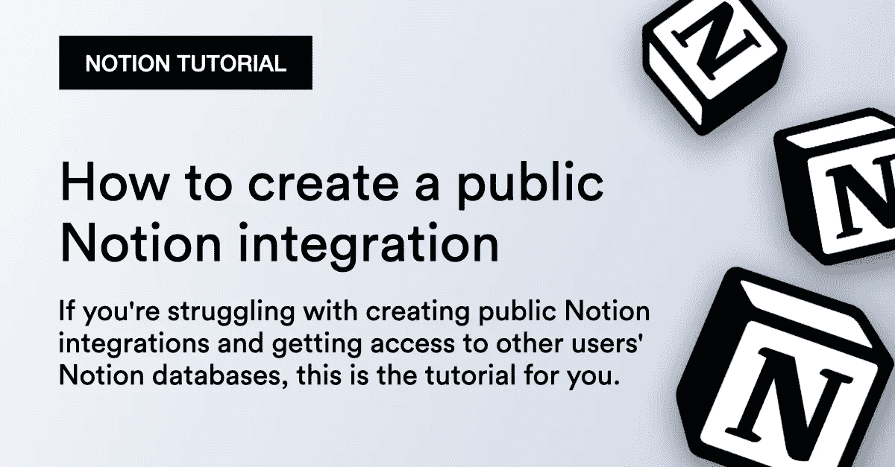

通过此演练，您将能够对用户进行身份验证，获取他们的访问令牌，并将数据添加到他们与您的公共概念集成共享的数据库中。

以下是我们将使用的:

1.  计算机编程语言
2.  概念 API

# 步伐

1.  创建公共概念整合
2.  创建要共享的表
3.  创建概念授权 2.0 授权流
4.  向授权表中添加数据

我们走吧。

# 1.创建公共概念整合

让我们从创建公共概念集成开始。

登录你的概念账户，进入[https://www.notion.so/my-integrations](https://www.notion.so/my-integrations)，点击 **+新集成**按钮，开始创建一个集成。

为您的集成命名，并选择要安装该集成的工作区。稍后我们将升级集成以使用 OAuth。

然后选择集成将具有的功能。最后，点击**提交**创建集成:

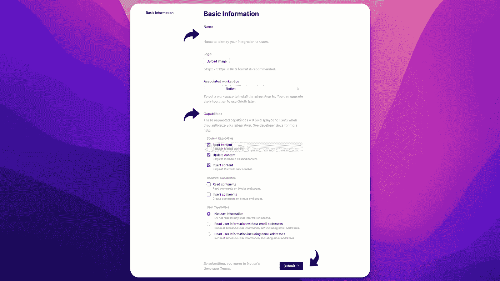

保存集成后，向下滚动到**集成类型**并点击**公共集成**:

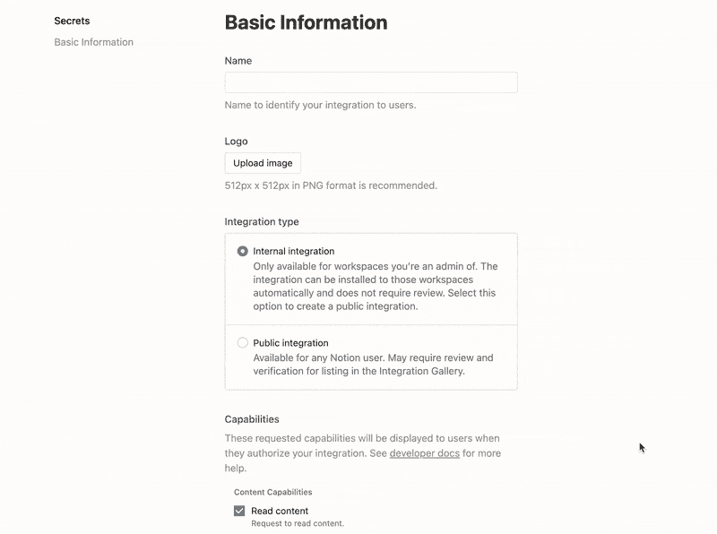

这将添加一个新的部分， **OAuth 域& URIs** ，要求您提供更多关于您的公共集成的数据。

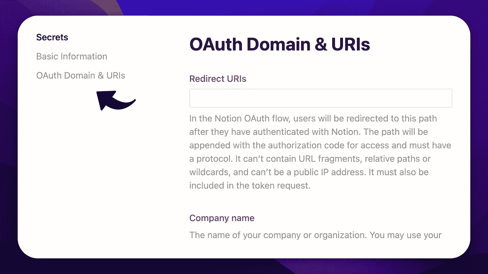

让我们继续添加所有需要的数据，从**重定向 URIs** 开始。正如它在《观念》中所说:

> *在 OAuth 流程中，用户通过 idea 认证后，将被重定向到该路径。该路径将附加用于访问的授权码，并且必须具有协议。它不能包含 URL 片段、相对路径或通配符，也不能是公共 IP 地址。它也必须包含在令牌请求中。*


为了便于学习，本教程将直接从浏览器 URL 复制授权代码。但是对于您的生产应用程序，您需要提供一个重定向 URL，在那里您可以从您的用户提取授权代码。

继续添加您的**公司名称**和您的**网站或主页** —该网站/主页将用于您的整合页面，如 idea 所述:

> *用于在您的集成页面和认证屏幕中链接到您的集成网站或主页。*

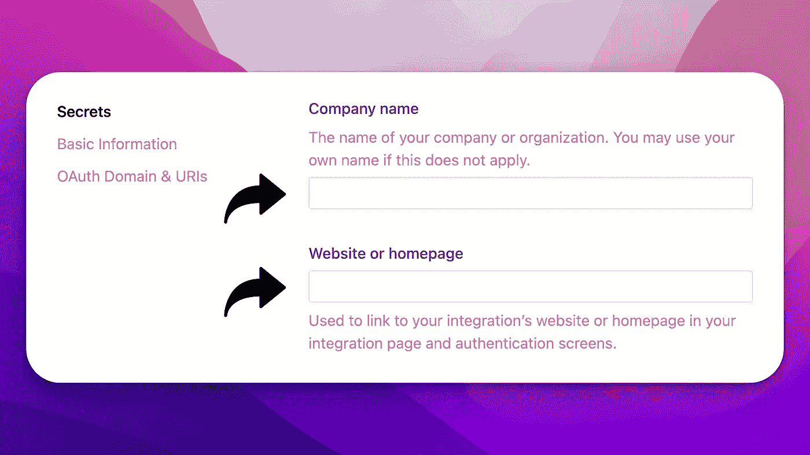

此外，填写一个**标语**并继续添加链接到一个**隐私政策**、**使用条款**，最后是一个**支持电子邮件**。所有这些字段都是必需的，因为您将创建一个对所有 idea 用户都可用的公共集成。

填写完所有字段后，点击**提交**:

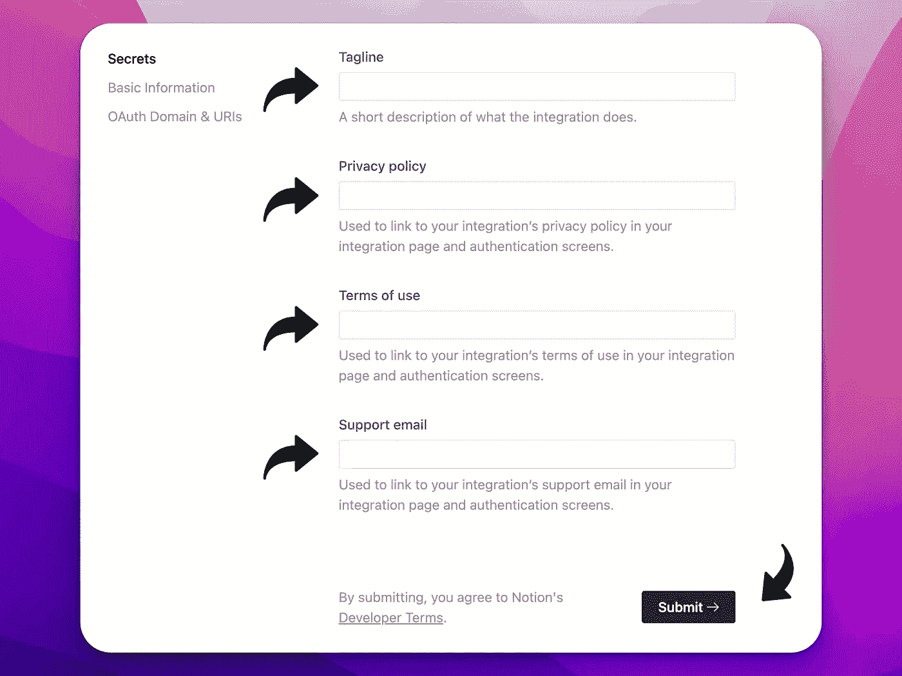

确保保存好 **OAuth 客户端 ID** 、 **OAuth 客户端机密**和**授权 URL** ，以备后续步骤使用。请记住，您只能泄露 **OAuth 客户端秘密**一次，因此请确保将其保存在某个地方以供下一步使用。

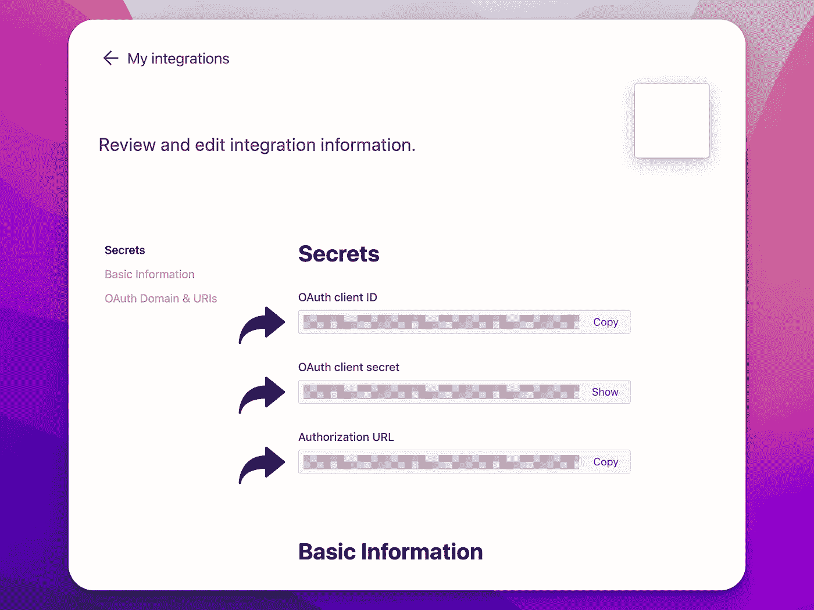

这是第一步。让我们继续创建一个新的数据库，稍后与我们的集成共享。

# 2.创建要共享的表

这一步是创建一个新的数据库，我们将授权我们的公共集成访问它。

让我们创建一个有两列的表，**句柄**和 **tweet** :

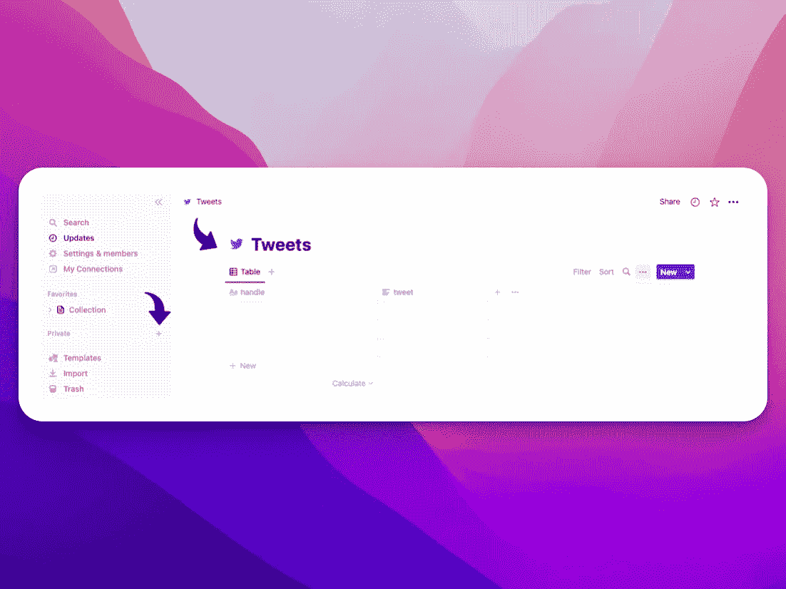

选择**文本**作为**推文**栏的类型。正如你可能猜到的，这是一个我们稍后将使用 tweets 填充的表，作为一个用例示例。

这就是我们对这个数据库的所有需求。让我们进入下一部分，在这里我们将为用户创建概念 2.0 授权流。

# 3.创建概念授权 2.0 授权流

在这一节中，我们将编写生成

1.  **授予您对所选数据库/页面和**的公共集成访问权限的 URL
2.  **我们将在授权重定向中收到的代码中的访问令牌**

首先导入所有的库，并为我们在**步骤 1** 中收到的 API 键创建变量:


```
import base64
import json
import os
import requests
import urllib.parseoauth_client_id = "YOUR_OAUTH_CLIENT_ID"
oauth_client_secret = "YOUR_OAUTH_CLIENT_SECRET"
redirect_uri = "YOUR_REDIRECT_URL"
```

解析您的重定向 URL:

```
parsed_redirect_uri = urllib.parse.quote_plus(redirect_uri)
```

下一步是创建授权 URL，授权您对用户页面/数据库的公共集成访问:

```
auth_url = f"https://api.notion.com/v1/oauth/authorize?owner=user&client_id={oauth_client_id}&redirect_uri={parsed_redirect_uri}&response_type=code"print(auth_url)
```

此链接将提示用户授权您的公共集成，并允许您访问他们选择的概念页面和数据库。

点击链接，然后**选择页面**。以下是您和用户在访问您的 URL 时看到的内容:

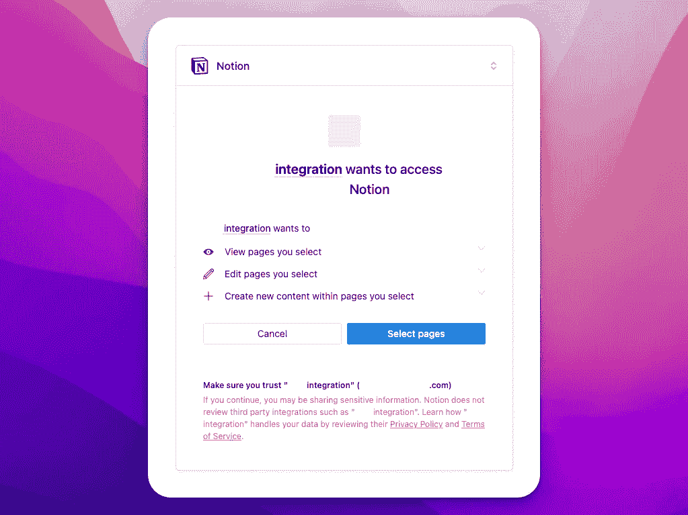

如果用户授予访问权限，将向他们显示一个页面，他们可以在该页面中搜索并选择希望与您的集成共享的页面和数据库。

现在选择我们之前创建的概念数据库，它应该被称为 **Twitter** ，这是您应该看到的内容:

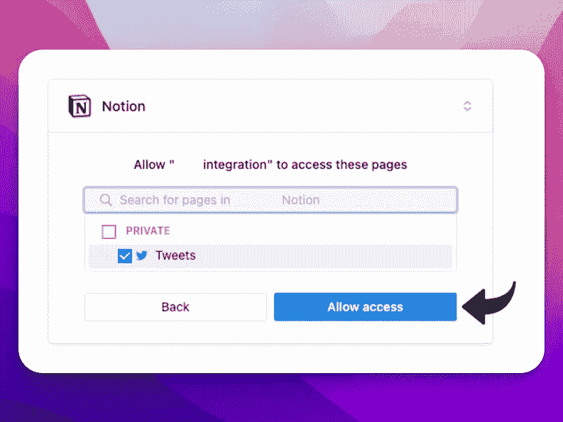

点击**允许访问**，您将被重定向至您的`redirect_uri`。

如果用户允许访问，他们也会通过临时授权`code`被重定向到您的`redirect_uri`。它看起来会像这样:

```
https://YOUR_REDIRECT_URL/?code=9ac813er-34ad-4ba9-a5a0-52u6&state= 
|--- Your redirect URL --| |--- temp authorization code ---|
```

在允许授权后，保存您刚刚重定向到的整个 URL:

```
redirect_url_response = "THE_URL_YOU_GOT_REDIRECTED_TO_AFTER_AUTHORIZATION"
```

然后提取并保存您在重定向 URL 中收到的代码:

```
auth_code = redirect_url_response.split('code=')[-1].split('&state=')[0]auth_code
```

在用户授予访问权后，我们需要通过发送一个`HTTP POST request`到观念的令牌`URL` `[https://api.notion.com/v1/oauth/token](https://api.notion.com/v1/oauth/token.)` [来交换访问令牌的授权码。](https://api.notion.com/v1/oauth/token.)

该请求由 **HTTP 基本认证**授权，因此您需要首先对您的集成凭证进行 base64 编码:

```
key_secret = '{}:{}'.format(oauth_client_id, oauth_client_secret).encode('ascii')
b64_encoded_key = base64.b64encode(key_secret)
b64_encoded_key = b64_encoded_key.decode('ascii')
```

这个授权流程的最后一步是将`temporary code`换成`access token`:

概念将用一个访问令牌和一些附加信息来响应请求。

下面是回应的样子:

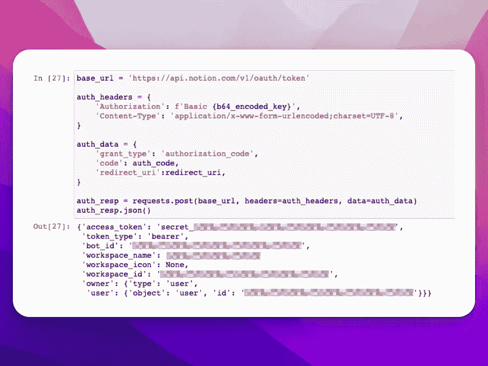

使用访问令牌存储您的集成接收的所有信息。现在，您可以使用这个访问令牌来访问用户授权访问的所有页面和数据库。

首先搜索用户有权访问的数据库:

```
url = "https://api.notion.com/v1/search"

payload = {"page_size": 100}
headers = {
    "accept": "application/json",
    "Notion-Version": "2022-06-28",
    "content-type": "application/json",
    "authorization": f"Bearer {access_token}"
}

response = requests.post(url, json=payload, headers=headers)
```

下面是回应的样子:

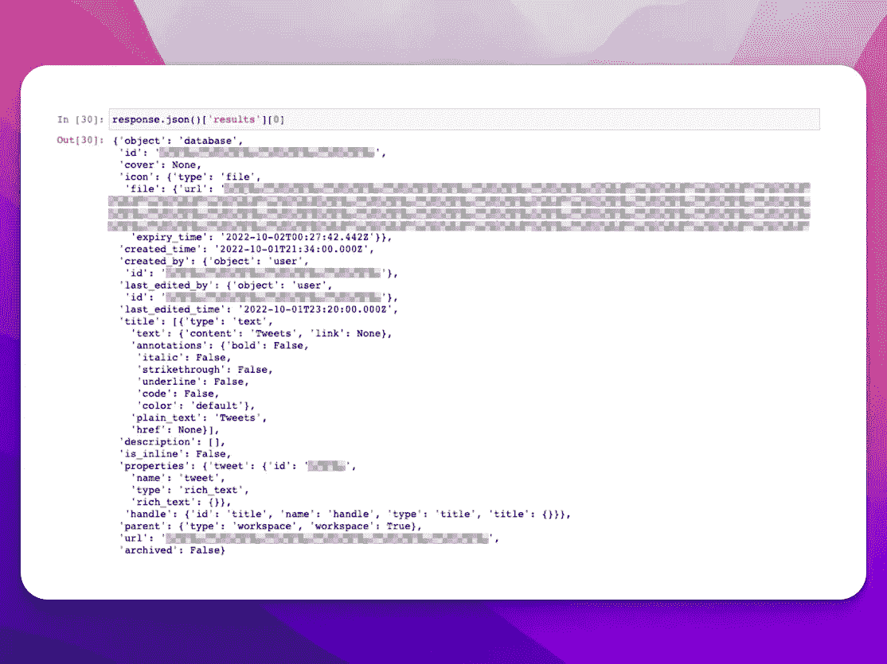

保存数据库 id，以便在下一步中添加数据时使用:

```
database_data = response.json()['results']
notion_database_id = database_data[0]['id']
```

太好了，现在我们有了所有的逻辑来请求用户授予对他们的页面和数据库的访问权。最后一步是向用户允许您访问的表中添加数据。

# 4.向授权表中添加数据

首先创建一些示例/虚拟数据:

```
example_data = {
    "handle": "@SomeHandle",
    "tweet": "Here is a tweet"
}
```

然后将数据添加到授权概念数据库:

如果我们回到我们在**步骤 2** 中创建的概念数据库，您会看到我们刚刚添加到数据库中的输入:

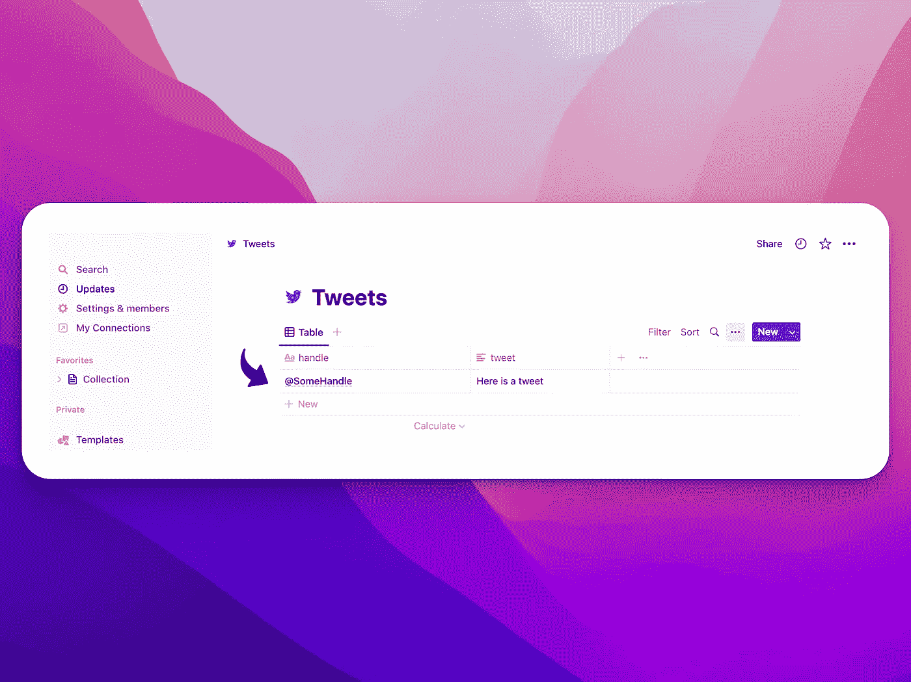

# 摘要

*   **创建公共概念集成** —我们从创建公共概念集成开始，并保存了所有 OAuth 凭证
*   **创建一个共享表** —继续创建一个我们将授予访问权限的表。
*   **创建 Auth 2.0 授权流** —最后，我们为用户创建了 OAuth 流，允许用户访问他们的页面和数据库。
*   **向授权表添加数据** —最后，我们使用当用户授予我们对其页面和数据库的集成访问权时收到的访问令牌添加数据。

这里有一个 Jupyter 笔记本的 [repo](https://github.com/norahsakal/create-public-notion-integration) 和所有的源代码，如果你想自己实现的话。

*原载于*[*https://norahsakal . com/blog/create-public-idea-integration*](https://norahsakal.com/blog/create-public-notion-integration)