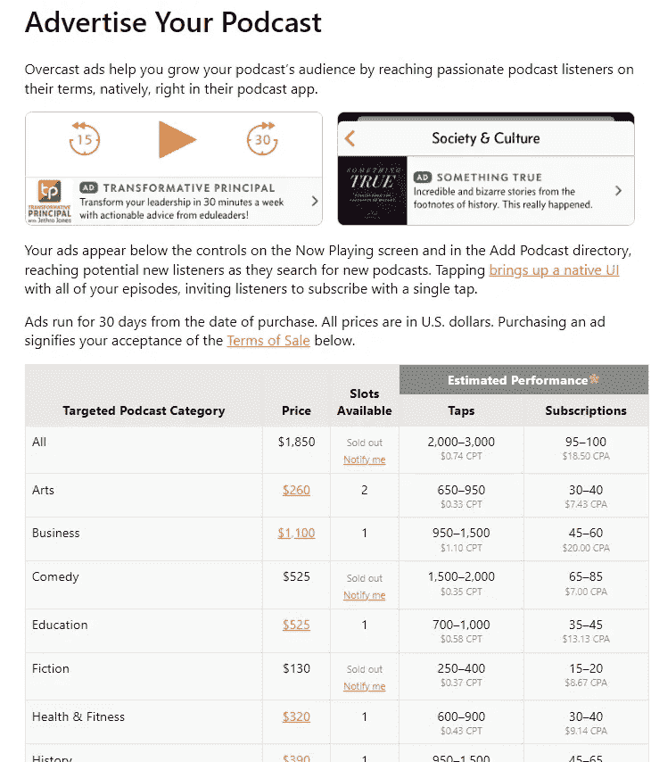
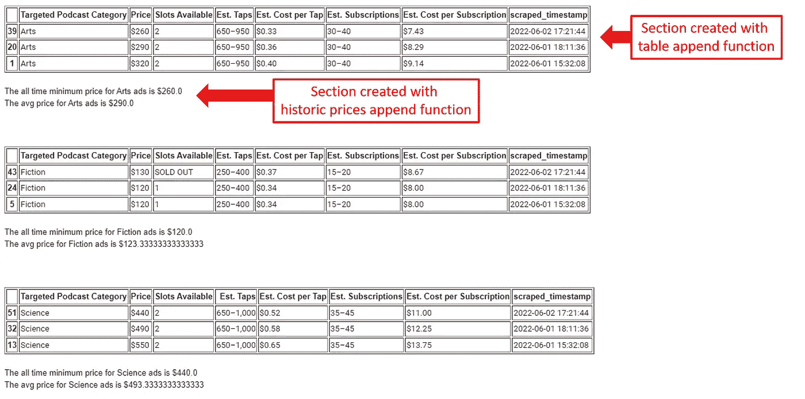
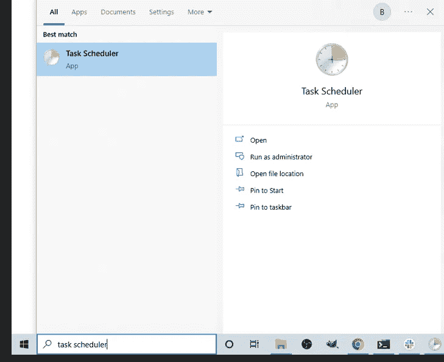
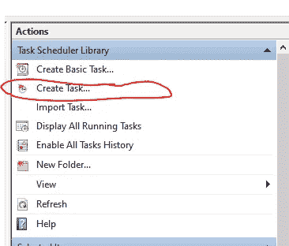
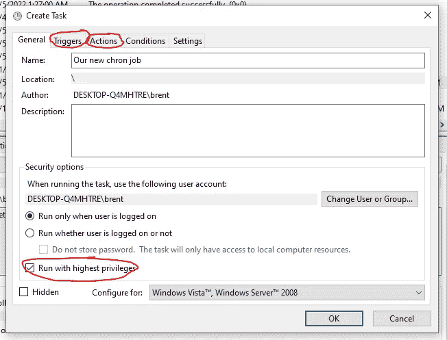
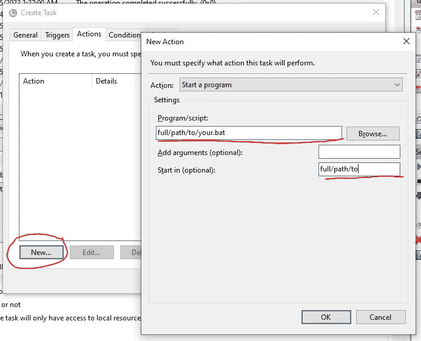

# 如何创建一个 Python 脚本来自动监控在线价格

> 原文：<https://betterprogramming.pub/how-to-create-a-python-script-to-automatically-monitor-prices-online-e7addd12548>

## 一个建立你自己的网页抓取器的指南，创建一个历史价格的数据库，和一个电子邮件通知系统——并设置它自动运行。


在 [Unsplash](https://unsplash.com/?utm_source=medium&utm_medium=referral) 上 [Engina Kyurt](https://unsplash.com/@enginakyurt) 拍摄的照片

现代世界充满了定价算法，这些算法无时无刻不在改变着商品的价格。通过建立一个工具来监控这些价格，你可以领先一步，并对做出明智的大采购决策充满信心。此外，我们将在这里创建的片段也可以适用于所有其他类型的项目。让我们开始吧。

就我而言，我想关注一下来自 covery 的播客广告的[价格(一个为其他播客出售横幅广告以帮助增加受众的播客应用)。这是页面顶部的样子:](https://overcast.fm/ads)



阴的广告页

重要的是，他们每天在格林威治时间午夜根据广告购买量和未售出量来更新价格。我不知道我是否会为我的播客购买广告，与科幻作家交谈和评论书籍( [The Hugonauts](https://podcasts.apple.com/us/podcast/hugonauts-the-best-sci-fi-books-of-all-time/id1590777335) )，但如果我买了，我肯定想低价购买！

所以，让我们来看看好东西——代码。我们将首先查看构建程序所需的所有代码，然后在最后，如何自动运行所有代码。

# 导入我们的库:

如果您没有这些库，请确保在继续之前安装它们。

# 抓取网站:

一般来说，下面的代码块做三件事:

1.  使用请求从我们的目标网站抓取 HTML
2.  使用漂亮的 Soup 从表格中提取列标题和数据行
3.  将标题和数据行合并到一个 python 字典中(并添加一个时间戳，表示我们抓取数据的时间)

上面的代码将是这个程序中最不可概括的部分，因为每个网站的 HTML 都是不同的(除非你也想收集阴暗的数据)。然而，所有使用的工具和方法都可以在任何网站上使用——如果你感兴趣的网站上也有表格，不需要太多的改动。

# 将我们的数据保存到本地 SQL 数据库:

我使用我在我的机器上设置的 Microsoft SQL 本地数据库，但是你可以使用任何其他数据库、SQLite，或者甚至继续附加到本地 csv，并使用它作为各种数据库([参见这里的前一篇文章中使用的 CSV 方法](https://medium.com/@brentgaisford/how-to-use-python-and-the-reddit-api-to-build-a-local-database-of-reddit-posts-and-comments-ca9f3843bfc2))。

sqlalchemy 的引擎参数需要更新以匹配您的 SQL server 设置。Google 您的特定 SQL server 类型和“sqlalchemy engine ”,为您的特定服务器找到好的示例。

# 总结我们的数据，并将其组织到电子邮件的正文中，让我们自己看到当前价格和历史价格

拥有所有这些定价数据固然很好，但如果我们不使用这些数据，它并不能真正帮助我们做出更好的决策。因此，我们还会每天自动给自己发送一封电子邮件，向我们展示三个潜在类别(艺术、小说和科学)中我们可能想要购买广告的三样东西:

1.  今天的价格，以及最近 9 天的价格
2.  空前的低价
3.  平均价格

下面是实现这一点的代码。因为我们对三个不同的类别做同样的事情，我们将首先定义函数，然后对三个类别中的每一个使用它们来组装我们的电子邮件。我们正在使用`email.MIME`库来构建我们的电子邮件正文。

以下是我们的电子邮件到达收件箱时的内容(仅显示三天的数据，因为在撰写本文时，脚本仅运行了三天):



我们构建的自动化电子邮件的正文

# 使用 SMTP 连接到我们的电子邮件服务器并发送邮件

请注意，谷歌从`5/30/2022`开始禁止 SMTP 通过 Gmail 发送电子邮件。为了弥补这一点，我设置了一个 Hotmail 帐户作为“发件人”电子邮件，它非常适合这些目的。

如果您使用 Hotmail 或 outlook 电子邮件地址，在添加您的电子邮件用户名和密码后，下面的代码将立即为您工作。如果您想使用不同的电子邮件提供商，请查找您的电子邮件提供商的 SMTP 设置，以找到您在下面的第一行代码`smtplib`中需要的 url 和端口。

注意 except 分支末尾的 input 行(“Enter any key to quit”)。这将保持我们的程序窗口打开，并等待我们的回应，如果电子邮件发送失败，一旦你设置了你的自动化，所以你可以看到任何错误信息产生。

# 我们有工作代码了！让我们把它打包，这样我们的计算机就可以自己运行它了。

我使用的是 Windows，所以下面的步骤是特定于 Windows 的。Mac 用户，你的流量会略有不同——在你得到你的。py 文件，您将使用 Crontab 来设置您的任务调度。以下是我们在 Windows 上的三个步骤:

1.  将您的代码保存在一个`.py`文件中
2.  创建一个. bat 文件，该文件指导您的计算机打开 python 环境并执行。py 脚本
3.  使用计算机的任务计划程序运行。bat 文件在您选择的时间表上

好吧…

## 步骤 1 —制作`.py`文件。

要制作`.py`，只需将您的工作代码(例如，上面的所有代码块)粘贴到文本编辑器文件中。然后将文件另存为`yourfilename.py`。

记下您保存文件的位置。您可以测试您的。py 文件，方法是导航到保存它的目录并运行下面的代码。

如果它能工作并执行你的脚本，那么到目前为止一切顺利！

```
python your_file_name.py
```

## 步骤 2——的。蝙蝠文件

你会在网上看到很多文章告诉你跳过这一步，直接将任务调度器指向`.py`文件和`python.exe`。不要这样做！

对于绝大多数 Python 用户来说，您的代码不会运行，因为您的代码不是使用基本的 Python 安装编写的——它是在 Conda(或 Anaconda)之上编写的，或者您已经 pip 了一堆新的库，或者您正在运行一个虚拟环境来处理您的库——如果没有指令，您的计算机将无法正确处理所有这些。这就是我们的。bat 文件是给。

如果 Windows 任务计划程序没有运行您的。py 文件，下面是你需要做的。打开文本编辑器，打开一个干净的新文件，放入以下代码:

```
[@echo](http://twitter.com/echo) off
call C:\Users\brent\miniconda3\condabin\activate.bat
cd “D:\Brents_Files\Documents\Python\Monitoring_Overcast_ad_pricing”
python overcast_price_monitor.py
```

呼叫线路告诉您的计算机使用什么环境来打开文件。在我的例子中，我使用的是 Conda，而不是虚拟环境，所以我指向。激活 Conda 的 bat 文件。

`cd`行应该指向您保存的目录。py 文件，调用 python 的最后一行也需要用您选择的文件名进行更新。

用. bat 结尾保存这个文本文件，就差不多完成了！要测试您的文件，双击`.bat`文件，它应该会一直运行下去！

如果失败，您需要在继续下一步之前进行调试。注意，如果双击它在文本编辑器中打开它，这并不意味着你的文件不起作用——这只是意味着你已经告诉你的计算机在文本编辑器中打开`.bat`文件，而不是运行它们。您可以从您的终端执行您的`.bat`文件来测试它。

# 设置任务自动化来循环运行我们的脚本

我在 Windows 上，所以我将使用任务计划程序。对于 Mac 用户，您将改用 Crontab。

单击开始按钮并搜索“任务计划程序”:



如何打开 Windows 任务计划程序

现在，在右边的窗格中，点击“创建任务…”



Windows 任务计划程序创建任务

给你的任务命名，为你自己写一个描述——最重要的是选中“以最高权限运行”框！完成这些步骤后，转到触发器选项卡。



Windows 任务计划程序屏幕截图和说明

在“触发器”选项卡上，点击“新建”并设置您希望任务运行的时间和频率。

没有触发器页面的截图，因为它是不言自明的。接下来，点击“操作”选项卡。



Windows 任务计划程序操作选项卡说明

在“操作”选项卡上，单击“新建”。在出现的弹出窗口中，输入。bat 文件，或者点击浏览并导航到。蝙蝠文件和点击确定。

然后，在“起始位置(可选)”字段中，输入包含。bat 文件驻留。我知道这看起来有些重复，但 Windows 似乎两者都需要。

就是这样！永远不要再为网上购物付太多钱。

祝你们编码愉快。