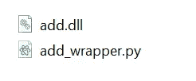
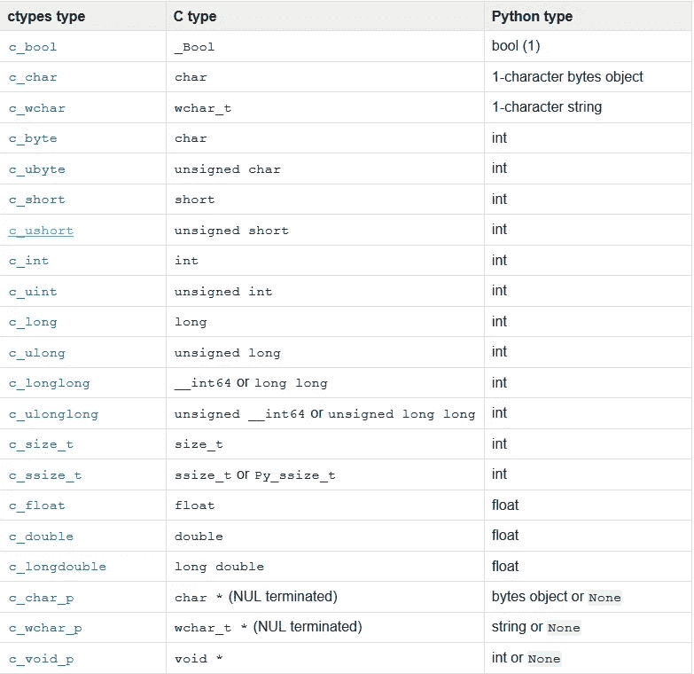

# 如何为 C/C++共享库创建 Python 包装器

> 原文：<https://betterprogramming.pub/how-to-create-a-python-wrapper-for-c-c-shared-libraries-35ffefcfc10b>

## 利用 ctypes 模块调用 Python 中的 C/C++函数


照片由[克里斯里德](https://unsplash.com/@cdr6934?utm_source=unsplash&utm_medium=referral&utm_content=creditCopyText)在 [Unsplash](https://unsplash.com/s/photos/programming?utm_source=unsplash&utm_medium=referral&utm_content=creditCopyText) 拍摄

通过阅读本文，您将学习创建和实现一个包装器类，以便直接用 Python 调用 C/C++函数。我们将使用一个名为`ctypes`的内置模块。根据官方[文档](https://docs.python.org/3.8/library/ctypes.html)，ctypes 是

> “Python 的外来函数库。它提供 C 兼容的数据类型，并允许调用 dll 或共享库中的函数。可以用纯 Python 来包装这些库。”

本教程分为三个部分:

1.  设置
2.  履行
3.  结论

让我们继续下一节，设置本教程所需的材料。

# 1.设置

在本教程中，我将使用 Python 3.7.4。只要能调用内置模块`ctypes`，可以随意使用其他版本的 Python。强烈建议为此项目创建一个虚拟环境。

确保您有一个`dll`，可以被我们的 Python 文件使用。您只需要`dll`文件来创建包装器。如果您可以访问并知道可用的函数和参数，头文件是可选的。如果您使用第三方库，请确保在编写 Python 包装器时获得相应的头文件以供参考。

如果你打算编译你自己的 DLL，请查看我的关于如何在 Windows 中创建 C/C++动态链接库的教程。

在与`dll`文件相同的目录下创建一个新的 Python 文件。我就把它命名为`add_wrapper.py`。请根据您自己的喜好随意命名该文件。



作者图片

让我们继续下一节，开始写一些 Python 代码。

# 2.履行

## 导入

在文件顶部导入以下模块:

```
from ctypes import *
from sys import platform
```

*   `ctypes` —这是加载共享库并调用其中函数的基本模块。
*   `sys` —我们将使用此模块来确定操作系统并加载适当的库。

## 加载库

假设您有两个用于 Windows 和 Linux 操作系统的共享库，添加以下代码来加载适用于您的操作系统的库。

上面给出的代码将对库的引用存储在一个名为`add_lib`的变量中。稍后我们将使用它来调用可用的函数。

运行 Python 文件时，您应该会看到以下输出:

```
<CDLL './add.dll', handle ... at ...>
```

## 页眉

让我们来看看这个`dll`的头文件。

它是用 C++编写的，有三个可用的函数。所有的函数都接受两个整型参数并返回一个整型变量。在真实的用例中，它要复杂得多，有复杂的数据类型和指针。

## 数据类型

在我们继续之前，让我们看看`ctypes`提供的可用数据类型，它代表了 C 编程中的相同数据类型。



图片来自 [Python](https://docs.python.org/3.8/library/ctypes.html)

您可以按如下方式初始化数据类型:

```
a = c_int()
```

当你把它打印出来的时候，你会得到下面的输出，表明它是一个值为 0 的`long`。

```
c_long(0)
```

如果输出不是一个`int`，不要感到惊讶。根据官方文件，

> “在`sizeof(long) == sizeof(int)`的平台上，它是`c_long`的别名。所以，如果你期待`c_int`，你不应该对`c_long`被打印感到困惑——它们实际上是同一类型的。”

您可以传入一个参数作为初始值。

```
a = c_int(25)
```

要获得实际值，必须使用`value`属性。

```
print(a.value)
```

你应该得到`25`作为输出。

对于特殊的数据类型，比如带有空终止符的`char`(在 Python 中表示字符串)，您必须使用下面的代码。这种语法将在后面的`Array`小节中进一步讨论。

```
serialNumber = c_char * 13
```

## 功能

我们将利用之前定义的`add_lib`变量来调用适当的函数。记住，根据头文件，我们只有三个可用的函数:

*   `add`
*   `sub`
*   `mul`

```
add_lib.add(2, 5)
```

函数的名称和输入函数的数据类型应该与头文件完全相同。如果您尝试调用一个不可用的函数，您会看到以下错误消息:

```
AttributeError: function 'test' not found
```

使用错误的数据类型将导致以下错误:

```
ctypes.ArgumentError: argument 1 : <class: TypeError>
```

有些数据类型，比如`int`，可以直接使用，不需要声明为`ctypes` 数据类型，但是强烈建议这样做。

```
a = c_int(25)
b = c_int(10)
add_lib.sub(a, b)
```

你应该得到`15`作为输出。

## 返回类型

默认情况下，`int`作为数据类型返回。您必须使用`restype`属性手工定义返回类型。

```
result = add_lib.mul
result.restype = c_int
result(a, b)
```

请注意，使用错误的类型会影响其中的值。您必须遵循与头文件中相同的数据类型。如果您打算从中获取其他数据类型，只需在获得结果后对其进行强制转换。

## 指针

您可以使用以下代码创建一个新指针:

```
temperature = c_int(25)
temperature_p = pointer(temperature)
```

您必须使用`contents`属性来访问指针内部的内容。

```
temperature_p.contents
```

你应该得到`c_long(25)`作为输出值。您可以将它与`value`属性结合起来访问所需的值。

```
temperature_p.contents.value
```

如果你实际上并不需要指针，只是想用它来输入参数，`ctypes`为我们提供了`byref`函数，用来通过引用传递参数。以下代码仅供参考，不能与`add_lib` `dll`一起运行。

```
temperature = c_int(25)
result = example_lib.calc_temp(byref(temperature))
```

## 结构和联合

当处理 struct 时，你必须使用下面的代码。确保相应的数据类型与头文件中定义的原始数据类型相匹配。

```
class lib_sdk_info(Structure):
    _fields_ = [("sdk_version_major", c_uint8),
    ("sdk_version_minor", c_uint8),
    ("sdk_build_major", c_uint8),
    ("sdk_build_minor", c_uint8)]
```

您可以使用下列程式码建立新的结构:

```
info = lib_sdk_info()
```

按如下方式访问其中的字段:

```
info.sdk_build_minor
```

如果需要打印结构中的所有信息，建议您通过下面的`for loop`来完成:

```
for field_name, field_type in info._fields_:
    print(field_name, getattr(info, field_name))
```

## 排列

创建数组的最佳方式是将数据类型乘以一个整数。您可以根据您的用例创建一个结构数组。

```
phoneArray = c_int * 10
```

然后，您可以创建数组的新实例，并像使用列表一样使用它。

```
phone_list = phoneArray()phone_list[0] = 32for i in phone_list:
    print(i)
```

# 3.结论

让我们回顾一下今天所学的内容。

我们从对`ctypes`的简单解释开始，并设置了我们教程中需要使用的`dll`。

接下来，我们加载了基于操作系统的共享库，并深入研究了模块提供的可用数据类型。之后，我们根据头文件的引用调用了`dll`中可用的函数。

我们还测试了指针的创建，并通过`byref`函数将它发送给一个函数。此外，我们创建了相应的`Structure`和`Array`对象，它们可以在我们的 Python 文件中正常使用。

感谢阅读这篇文章。希望在下一篇文章中再见到你！

# 参考

*   [ctype 文档](https://docs.python.org/3.8/library/ctypes.html)
*   [从 Python 调用 C 函数—微软教程](https://docs.microsoft.com/en-us/archive/blogs/yizhang/calling-c-functions-from-python-part-1-using-ctypes)
*   [如何在 Windows 中创建 C/C++动态链接库](https://medium.com/@ngwaifoong92/how-to-create-c-c-dynamic-link-libraries-in-windows-28abefc988c9)