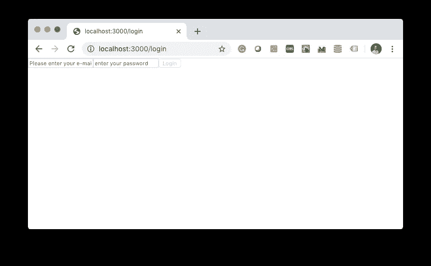
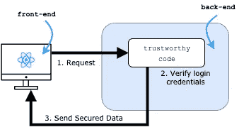
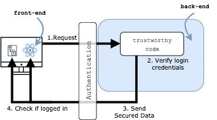
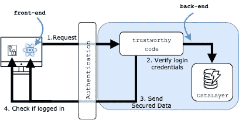
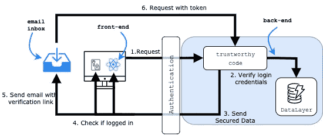
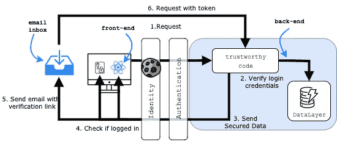
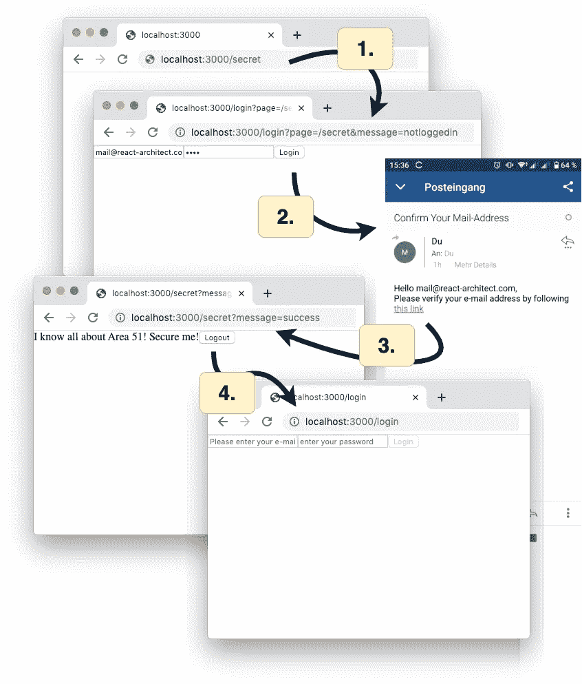

# 如何创建带有电子邮件身份验证的 React 应用程序

> 原文：<https://betterprogramming.pub/how-to-create-a-react-app-with-email-authentication-372a67a6d27b>

## 电子邮件是比任意用户名更好的登录凭证

照片由[蒂姆·埃文斯](https://unsplash.com/@tjevans?utm_source=unsplash&utm_medium=referral&utm_content=creditCopyText)在 [Unsplash](https://unsplash.com/s/photos/bank-safe?utm_source=unsplash&utm_medium=referral&utm_content=creditCopyText) 拍摄

电子邮件是很好的登录凭证——比任意的用户名好得多。

用户会忘记凭据，但他们很少会忘记自己的电子邮件地址。每当用户忘记密码时，您可以向他们发送新密码。

因为你可以验证电子邮件地址。向输入的电子邮件地址发送确认请求，以确保您网站的用户可以访问电子邮件收件箱。

# 如何将电子邮件认证添加到 React 应用程序中

假设你有一个真正的秘密——比如这个 React 页面:

我们只授予登录用户访问权限！我们要求用户输入他们的电子邮件地址和密码。

我们的登录页面有两个输入框和一个按钮。一个用于电子邮件地址，一个用于密码。我们用一个[反应状态钩子](https://reactjs.org/docs/hooks-state.html)来控制这两个字段的值。

当用户点击按钮时，我们检查输入的电子邮件和密码是否正确。我们使用正则表达式来验证电子邮件的格式。如果没有通过验证，我们禁用按钮(意思是，我知道)。

一旦电子邮件有效，我们就检查密码是否与我们的秘密字符串`let-me-in`匹配。如果是的话，我们会把用户转到我们的秘密页面！

我们将这两个页面添加到 React 应用程序中:

## ***“你开玩笑吧！”***

显然，这不是很安全。任何电子邮件地址都可以。甚至*foo@fake.com*。用户可以查看我们的 React 应用程序的代码。他们可以很容易地找到他们需要输入的字符串。

[大部分 React apps 不需要后端](https://www.react-architect.com/page?ref=medium_auth&dest=https://codeburst.io/why-would-you-implement-a-backend-for-your-react-app-365bb8a8431d)。但是身份验证是实现身份验证的一个很好的理由——您必须能够信任验证登录凭证的代码。

我们的流程如下所示:

*   前端在请求中向后端发送登录凭据。
*   后端的可信代码验证凭证。
*   如果凭证正确，后端将安全数据发送到前端。

我们使用[基础设施组件](https://www.react-architect.com/page?ref=medium_auth&dest=/www.infrastructure-components.com)创建这个软件架构。这些类似 React 的组件[为我们做技术配置](https://www.react-architect.com/page?ref=medium_auth&dest=https://medium.com/dailyjs/do-you-like-react-then-why-dont-you-configure-your-infrastructure-with-it-e8cb36e742a2)，让我们轻松地创建一个带有后端的 React 应用。

 [## 为什么不在 React 应用中使用服务器端渲染？

### 如果复杂是原因，那么这是给你的！

codeburst.io](https://codeburst.io/why-dont-you-use-server-side-rendering-in-your-react-app-acd51359c4b4) 

我们创建一个同构的应用程序。这是一个具有服务器端和客户端渲染的 React web 应用程序。

在我们的`<LoginPage/>`按钮中，我们用`authCallback`函数替换了硬编码的密码验证。我们提供了`email`、`password`，以及到我们秘密页面的路径(`/secret`)。我们希望这个函数在后端进行验证。

## ***“介绍一个神奇功能的好称呼！但是我们的秘密页面仍然不安全。知道'/secret '路径还是可以打开的！”***

当然，我们需要限制对安全路线的访问。姑且称之为`<SecuredRoute path="/secret" ... />`。它告诉我们的应用程序，这条路线必须得到保护，而`<Route path="/login" ... />`仍然可以访问。

我们添加了一个`<Authentication/>`组件来确保用户只有在登录后才能访问`<SecuredRoute/>`。否则，它会将它们重定向到`<LoginPage/>`。

在代码中，我们将`<Authentication/>`包裹在整个`<WebApp/>`的周围:

## ***“太好了！更神奇！但是服务器怎么知道一封邮件和一个密码是否匹配呢？”***

我们的应用需要一个持久的数据层。某个可以存储凭证的地方。我们为什么不在我们的应用程序中添加一个`<DataLayer/>`？

在代码中，它是我们的`<WebApp/>`的另一个包装组件。我们指定`loginUrl`让它知道将未授权的用户重定向到哪里。

## ***“我都不敢问！但是我们如何让用户进入数据层呢？”***

我很高兴你问了。我们的`<Authentication/>`验证用户是否在数据中。如果没有，`<Authentication/>`会向用户输入的地址发送一封电子邮件。如果她可以访问收件箱，她可以通过单击链接来验证电子邮件地址。

`<Authentication/>`可以将电子邮件地址作为`pending`存储在数据层中，旁边还有一个令牌，它也会将其放入验证链接中。当`tustworthy code`收到带有令牌的请求时，它会验证令牌是否匹配并激活帐户。从那里开始，用户可以登录。

再来看看我们的增强型`<Authentication/>`。我们指定发送电子邮件所需的所有数据。`callbackUrl`是当用户点击邮件中的链接时，我们后端接收确认请求的路径。我们通过回调函数来指定邮件主题和文本。`getHtmlText`提供`recipient`的电子邮件地址和准备好的确认`url`。

## ***“用户离开后重新打开页面会发生什么？他们必须再次输入凭据吗？”***

这不会带来很好的用户体验，不是吗？

好的认证保持用户会话。但是 React 不这样做。如果您重新加载一个页面(F5)或在浏览器中输入一个新的 URL，您将获得一个“新的”实例。所有本地存储的数据都将丢失。

网络提供了一个解决方案——cookies！cookie 是用户计算机上的一个小文件，其大小足以保存用户身份和验证令牌。它跨浏览器会话保存数据。更重要的是，浏览器会自动将 cookie 发送到服务器。每当用户键入应用程序的 URL 时，浏览器都会发送它。当然，我们需要将 cookie 数据存储在数据层中。`trustworthy code`需要验证一下。

## ***“当用户自动发送 cookie 时，如果用户离开电脑怎么办？任何人都可以接触到它。”***

我们需要实现一个删除 cookie 的`userLogout`函数。让我们给`<SecretPage/>`添加一个按钮来调用它:

是的，很多。但是我们的 React 应用并不复杂。我们在应用程序中增加了另一层。`<Identity/>` 将特定于浏览器和特定于用户的数据存储在 cookie 中。在我们的代码中，我们将其添加为`<Authentication/>`组件的父组件。

让我们来看看我们的应用程序。我们尝试打开我们的秘密页面(步骤 1)。该应用程序识别出我们没有登录，并将我们重定向到登录页面。我们输入凭据(步骤 2)。由于我们尚未注册，该应用程序会向我们发送一封带有验证链接的确认电子邮件。

当我们打开链接时(步骤 3)，应用程序验证令牌，并将我们重定向到我们的秘密页面。当我们点击注销按钮(第 4 步)时，应用程序删除 cookie，我们返回到我们的登录页面。从现在开始，我们可以直接使用凭据登录。

## “看起来这么简单只是因为你到处都用了快捷方式！”

我不得不承认，我们在这里使用的组件和功能都已经存在。我说这些反应——就像[基础设施——组件](https://www.react-architect.com/page?ref=medium_auth&dest=http://www.infrastructure-components.com)为我们做所有的技术配置，他们确实做了。

如果你还没有使用过基础设施组件，这两篇文章会对你有所帮助:

*   [如何设置一个同构的 React app](https://www.react-architect.com/page?ref=medium_auth&dest=https://codeburst.io/why-dont-you-use-server-side-rendering-in-your-react-app-acd51359c4b4) (就像我们这里用的这个)。这篇文章详细介绍了这种应用程序。它还介绍了如何将您的应用程序部署到 AWS。
*   [如何在全栈 React app 中发送邮件](https://www.react-architect.com/page?ref=medium_auth&dest=https://medium.com/dailyjs/how-to-send-automated-e-mails-in-a-full-stack-react-app-4e1527acae43)。发送电子邮件需要您首先验证您(发件人)的电子邮件帐户。这篇文章告诉你如何去做。

看一下完整的源代码——它甚至不到一百行代码。你可以在 GitHub 库中找到它。