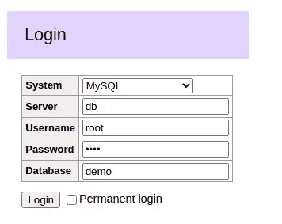
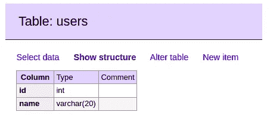
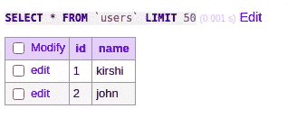
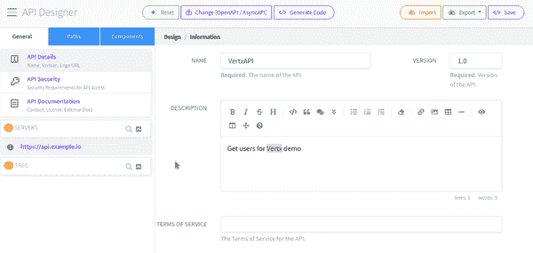
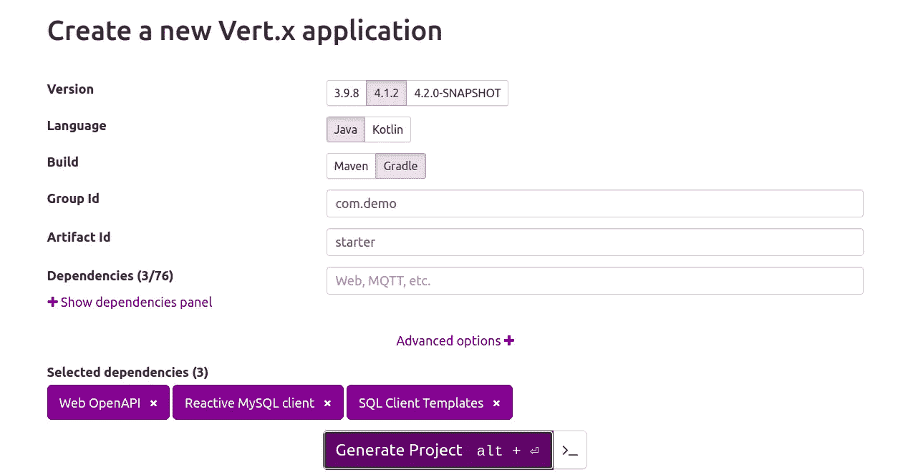
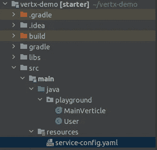

# 如何使用 Vert.x 创建一个反应式应用程序

> 原文：<https://betterprogramming.pub/how-to-create-a-reactive-app-using-vert-x-438a946129af>

## Eclipse Vert.x 简介以及与 OpenAPI 集成以创建 REST 服务


奥斯卡·伊尔迪兹在 [Unsplash](https://unsplash.com?utm_source=medium&utm_medium=referral) 拍摄的照片

由于反应式编程的高响应性、可伸缩性和错误处理能力，它已经成为一种流行的开发方法。它被设计用来处理异步数据流。例如，想象异步调用 REST API 或数据库。您当前的线程不会被阻止。

[Eclipse Vert.x](https://vertx.io/) 是一个工具包，它提供了一种在 [JVM](https://en.wikipedia.org/wiki/Java_virtual_machine) 上实现反应式应用程序的便捷方式。

您将从本教程中获得什么:

*   Vert.x 主要特性概述
*   关于 [OpenAPI](https://swagger.io/specification/) 及其优势的知识
*   使用 Vert.x 实现 OpenAPI 规范的简单示例

我们开始吧！

# 垂直 x 概述

Vert.x 是一个开源的、由 Eclipse 开发人员创建的反应式工具包。它为构建不会阻塞资源的反应式应用程序提供了一个很好的方法。它支持 JVM 和非 JVM 语言，例如 Groovy。

## 优势

*   反应模型的大型生态系统—反应数据库驱动程序、消息传递、事件流、指标、跟踪等。
*   支持回调、承诺/未来以实现异步操作
*   支持 Kotlin 协同程序
*   防止停机的断路器
*   云原生应用支持

# OpenAPI 概述

OpenAPI 规范是一种标准格式，它定义了 REST APIs 的结构和语法。它的主要好处是人类和机器都可以在不访问源代码的情况下解释这种语言。

开发人员经常用它来设计原型、测试对 API 端点的响应、生成文档等。例如，考虑接收一个服务配置`yaml`文件。非工程师可以阅读并确认业务预期，前端和后端团队可以开始独立工作。这样，团队协作更容易。

# 演示项目

现在你已经知道 Vert.x 和 OpenAPI 的用途了。让我们将它们整合起来，展示它们的威力。

我们将遵循以下步骤:

*   使用 MySQL 客户端创建一个带有`users`表的数据库
*   使用 Swagger 生成一个`yaml`规范来定义我们的 REST 服务
*   在 Vert.x 中实施规范
*   发送 HTTP 请求以检索用户

## 准备数据库

最简单的开始方式是使用 MySQL Docker 映像。

1.  创建一个`docker-compose.yaml`文件并粘贴以下配置:

2.在同一个目录中，通过执行以下命令启动 docker 容器:

```
$ docker-compose up
```

3.在 [http://localhost:8080/](http://localhost:8080/) 上打开浏览器，使用`docker-compose.yaml`文件中的凭证登录:



Mysql 管理员登录

4.接下来，创建一个名为`users`的新表。我将用一个非常简单的例子来演示:



用户表

5.创建几个测试用户:



虚拟用户

数据库部分到此为止！

## 准备 OpenAPI 规范

我使用了 [Apibldr 的](https://www.apibldr.com/) OpenAPI 在线编辑器来生成规范`yaml`。它是免费的，易于使用，而且非常强大。

以下是其用户界面的简要概述:



Apibldr.com 用户界面演示

请随意创建您的配置。但是现在，只要复制我的来继续这个教程:

*   我们为我们的端点定义了两条路径— `getUsers`和`getUser{id}`。第一个不接受任何参数，第二个接收一个名为`id`的参数。
*   `operationId`非常重要，因为我们将在 Vert.x 代码中使用它来调用端点。请记住，没有操作 id 的操作将被 Vert.x 的 [RouterBuilder](https://vertx.io/docs/apidocs/io/vertx/ext/web/openapi/RouterBuilder.html) 忽略。

## 准备垂直 x 代码

1.  遵循 Vert.x 项目[助手](https://start.vertx.io/)创建应用程序:



Vert.x 应用入门助手

按“生成项目”按钮。它将为您创建整个项目。可以立即下载。

酷！现在，你只需要在你最喜欢的 IDE 中打开它。

2.取出`service-config.yaml`文件并将其放在`resources`文件夹下。

3.打开`MainVerticle.java`文件并用我们的自定义代码替换其内容:

*   一个[vertical](https://vertx.io/docs/vertx-core/java/#_verticles)是由 Vert.x 引擎执行的一段代码。在同一个实例中，我们可以有多个垂直市场。他们将使用[事件总线](https://vertx.io/docs/vertx-core/java/#event_bus)相互通信。在我们的例子中，我们有一个单一的垂直。
*   我们通过使用来自我们的`docker-compose.yaml`配置的细节来启动数据库连接。
*   我们使用一个`RouterBuilder`从本地资源`src/main/resources/service-config.yaml`加载 OpenAPI 规范。它将加载我们的规范。基于此，我们有两条路线——`buildGetUserByIdRoute`和`buildGetUsersRoute`。当我们从 HTTP 服务器发送请求时，它们将检索第一个匹配的路由。请注意，我们可以定义任意多的路由。
*   `buildGetUserByIdRoute`方法创建了到`getUser`操作的路径。`onSuccess()`是一个异步调用，它根据`id`参数返回一个用户。`buildGetUsersRoute`与此类似，但它不带任何参数。
*   `getUserById()`方法通过`id`参数返回一个用户。类似地，`getUsers()`方法返回所有用户。这段代码演示了期货的使用，例如`onSuccess()`、`onFailure()`。
*   我们使用 Vert.x `SqlTemplate`来生成和执行 SQL 查询。
*   在`main`方法中的`deployVerticle()`调用之后，调用`start ()`方法。
*   类似地，当我们停止垂直时，调用`stop()`方法。

4.创建`User.java`类:

*   `MAP_USER`和`MAP_USERS`方法将 SQL 查询的结果行转换成一个`User`对象。

5.我们需要对`build.gradle.kts`文件做一个小小的改动。将该行添加到`plugins`块:

```
id("io.freefair.lombok") *version* "6.0.0-m2"
```

Lombok 库消除了生成样板代码的需要，比如 Getters 和 Setters。

最后，您的项目结构应该如下所示:



但是，如果您遗漏了什么，请不要担心——这个项目的完整源代码可以在本文末尾的参考资料部分找到。

# 运行项目

最后，我们完成了这个项目的所有编码。现在让我们来测试一下。

使用 IDE 或 Gradle 命令运行 `MainVerticle.java`文件。

*   打开浏览器，检索 id 为`1` : [的用户 http://localhost:8880/getUser/1](http://localhost:8880/getUser/1)

结果:

```
{"id":"1","name":"kirshi"}
```

太好了！它正在返回正确的记录。

*   检索所有用户—[http://localhost:8880/get users](http://localhost:8880/getUsers)

结果:

```
[{"id":"1","name":"kirshi"},{"id":"2","name":"john"}]
```

我们的应用程序运行正常。

# 结论

您已经完成了本教程的学习！现在你知道了 Vert.x 的优点以及如何使用它来创建异步应用程序。您还了解了使用 OpenAPI 的优势以及如何在 Vert.x 中实现规范。

这个项目的源代码链接如下。

我希望你从本教程中获得了新的技能。感谢您的阅读，祝您编码愉快！

# 参考

*   [https://github.com/kirshiyin89/vertx-openapi-demo](https://github.com/kirshiyin89/vertx-openapi-demo)
*   [https://vertx.io/docs/vertx-web-openapi/java/](https://vertx.io/docs/vertx-web-openapi/java/)