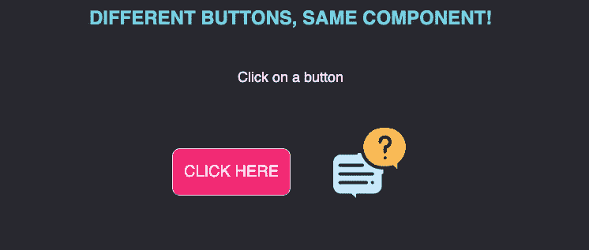

# 如何在 Angular 中创建一个可重用的按钮组件

> 原文：<https://betterprogramming.pub/how-to-create-a-reusable-button-component-in-angular-42893f521834>

## 避免代码重复，构建高效的应用程序

詹姆斯·庞德在 [Unsplash](https://unsplash.com?utm_source=medium&utm_medium=referral) 上拍摄的照片

一个优秀的 web 开发人员首先关注的问题之一是编写干净的代码并避免重复。当开发大型、可伸缩的应用程序时，这种策略变得必不可少，这些应用程序将来可以通过新特性进行扩展。

可重用组件可以决定一个成功的项目和一个高技术债务的项目。

在本文中，我们将一起构建一个可重用的、可定制的按钮组件，它将能够根据所提供的配置显示文本按钮或图像按钮。

# 第一步。基础结构

首先，当考虑一个可重用组件的结构时，我们需要考虑到我们想利用它的所有用途。

在可重用按钮的情况下，我们希望创建一个表示性的(或哑的)组件，该组件将从其父组件接收正确的配置。

ButtonComponent 中的输入配置

对象`buttonConfig` 将包含关于我们想要呈现哪种按钮的样式和附加信息:如果我们想要一个文本按钮，`buttonConfig` 将包含一个`text` 属性；否则，如果我们想要呈现一个图像按钮，配置将指定一个图像源。

HTML 代码将包含两个不同的模板，一个用于文本按钮，一个用于图像按钮。

使用`ngTemplateOutlet` 模式，我们可以指定何时渲染每一个。

在这种情况下，如果配置包含`text` 属性，则`#text`模板将被渲染；如果没有`text`属性，渲染后的模板将是`#image`。

ngTemplateOutlet 语法

# 第二步。按钮标记

现在模板已经准备好了，我们可以用按钮的代码填充它们。

如您所见，文本按钮将通过插值显示属性`buttonConfig.text`。图像按钮只是一个可点击的图像，它将属性`buttonConfig.src` 作为其图像源。

# 第三步。配置

当按钮组件准备好接收其配置作为输入时，我们可以在父组件中定义我们的自定义样式。

在这种情况下，我选择创建一个`textBtnConfig` 对象和一个`imgBtnConfig`来展示我将如何使用按钮组件来同时呈现两个不同配置的不同实例。

重要的是要注意，因为我们在 TypeScript 对象中声明了`CSS`样式，所以在命名属性时，我们需要使用 camelCase 格式！于是`‘background-color’` 就变成了`‘backgroundColor’` *、*等。

# 第四步。翻译

最后，我们可以使用按钮组件在父组件中实例化两个按钮:

一旦应用程序被提供，结果将与此类似:

# 结论

我们已经看到了如何构建一个可以在许多不同情况下使用的可重用组件。显然，这是一个简化的案例，但是它展示了开发人员应该很好地应对这种挑战的方法。

想想如果没有一个可重用的组件，我们会写多少代码！

此外，可重用组件允许以最少的代码更改为组件的每个实例实现新功能。如果我们想添加一个新方法，它将适用于每个按钮，不管是文本按钮还是图像按钮。

你可以在这个 [GitHub Repo](https://github.com/alessiaAmitrano/ngReusableBtn) 中找到我实现的完整例子。

来自[www.flaticon.com](http://www.flaticon.com)的[自由派](https://www.flaticon.com/authors/freepik)制作的图标