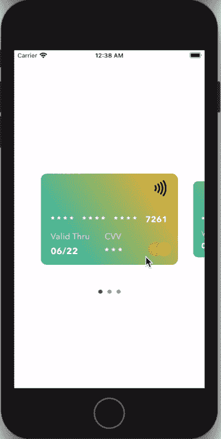
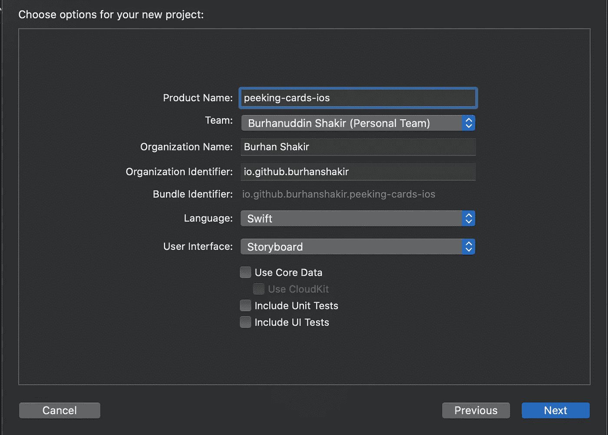
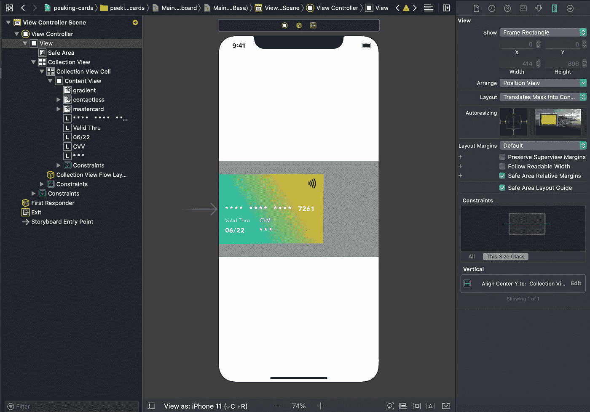

# 如何在 iOS 上创建一个 Revolut 风格的卡片收藏视图

> 原文：<https://betterprogramming.pub/how-to-create-a-revolut-esque-cards-collection-view-on-ios-c42e649f17a9>

## 学习制作滚动和捕捉集合视图单元格，并在滚动时缩放它们


Arnel Hasanovic 在 [Unsplash](https://unsplash.com?utm_source=medium&utm_medium=referral) 上拍摄的照片。

这篇文章将帮助你理解如何通过子类化一个`UICollectionViewFlowLayout`来定制一个`UICollectionView`布局。

我们将讨论插入和行间距来定制单元格周围的间距，并使用`UIScrollView` 协议在用户滚动时为每个单元格添加对齐行为。当用户在单元格上滑动时，我们还将在单元格中添加一个缩放动画，给它一种有弹性的感觉。

我们将创建一个*应用内钱包*，类似于 Revolut 所拥有的(即用户可以刷卡的信用卡集合，将所选的卡置于中心，并显示其他卡的一小部分):



这就是你在这篇文章结束时要达到的目标。

让我们把这个问题分成三部分:

*   增加卡片之间的间距，以便上一张和下一张卡片的一部分可见(居中分页)。
*   添加一个 snap-on-scroll 行为，以便只有一张卡片位于屏幕中央。
*   当用户开始滚动时缩小选定的卡片，并在滚动结束时放大新的卡片。

所以让我们开始吧。🥳

# 1.设置集合视图

建立项目非常简单。确保选择故事板作为用户界面，我们就可以开始了:



UI 在这里也不需要太多准备。你只需要做到以下几点:

*   给`ViewController`场景添加一个`UICollectionView`，并添加约束。
*   将收藏视图的滚动方向设置为`horizontal` ，取消选择任何滚动指示器。
*   添加子视图(卡号、背景、CVV 等。)添加到集合视图单元格中，并添加约束。
*   填写单元格可重用标识符。



您可以从[项目存储库](https://github.com/burhanshakir/peeking-cards-ios)中获得资产和确切的维度。

# 2.在卡片之间创建间距(居中分页)

控制集合视图单元格如何在屏幕上定位和排列的一个好方法是子类化`UICollectionViewFlowLayout`。我们将创建一个自定义类来为我们处理居中分页:

然后将其设置为集合视图，最好是在`ViewController`类中，如下所示:

```
collectionView.collectionViewLayout = CardsCollectionFlowLayout()
```

# 3.添加滚动捕捉行为

`scrollViewWillEndDragging(_:withVelocity:target:ContentOffset:)`实例方法可用于确定用户何时完成滚动，以及集合视图需要滚动到哪个单元格:

# 4.缩放卷轴上卡片的大小

在用户完成滚动并且集合视图已经滚动到所选择的卡片之后，我们可以更新`previousSelectedCell`和`currentSelectedCell`的大小。

我们将创建两个扩展方法来处理这个问题:

在`collectionView`滚动后，我们可以在`scrollViewWillEnd`方法中调用这些方法:

```
previousSelectedCell?.transformToStandard()
nextSelectedCell?.transformToLarge()
```

# 结论

就是这样！完整的项目可以在 GitHub 上获得[。如果你遇到什么问题，请随时查看。](https://github.com/burhanshakir/peeking-cards-ios)

希望这能帮你节省一些时间。如果你有任何问题，请随时回复。感谢阅读和快乐编码！