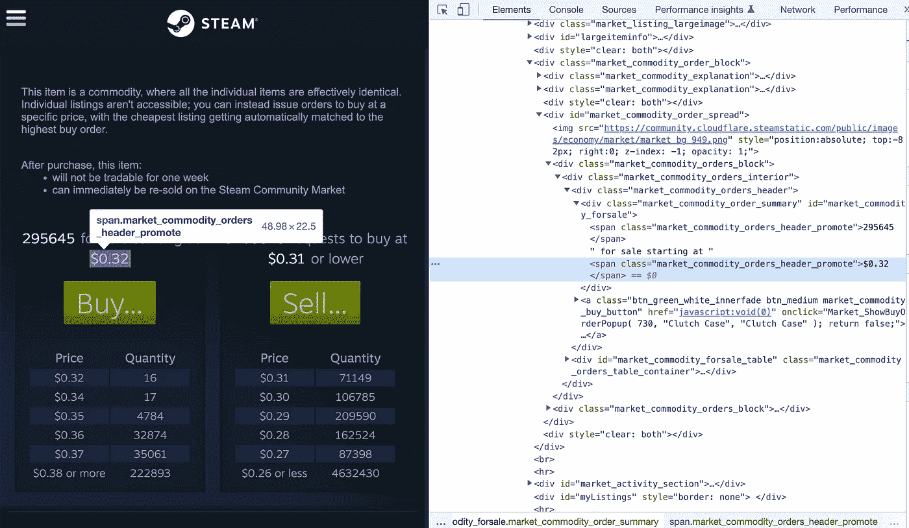
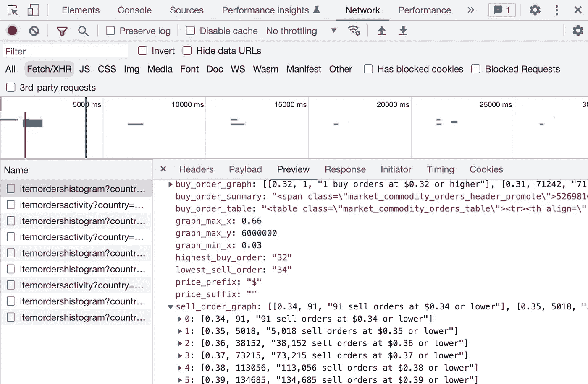
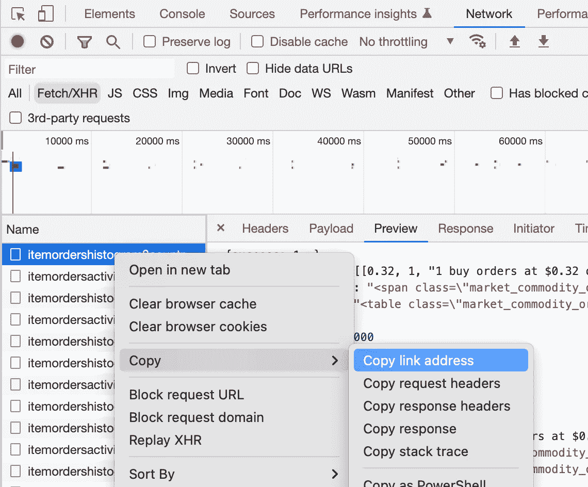
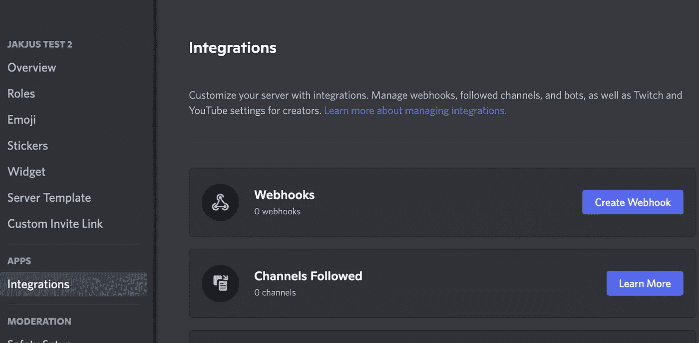
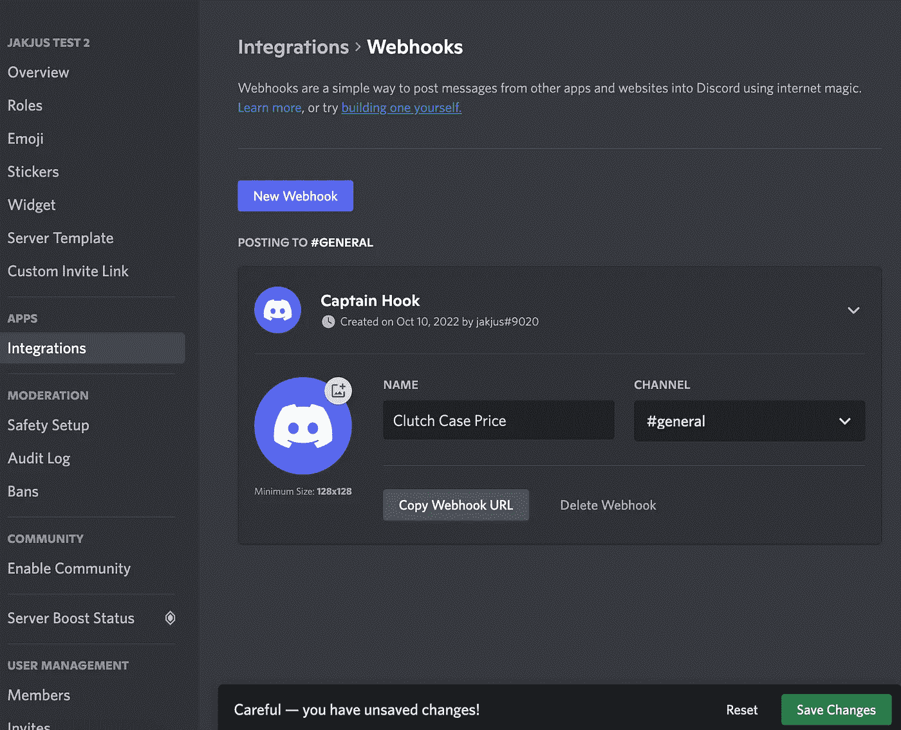
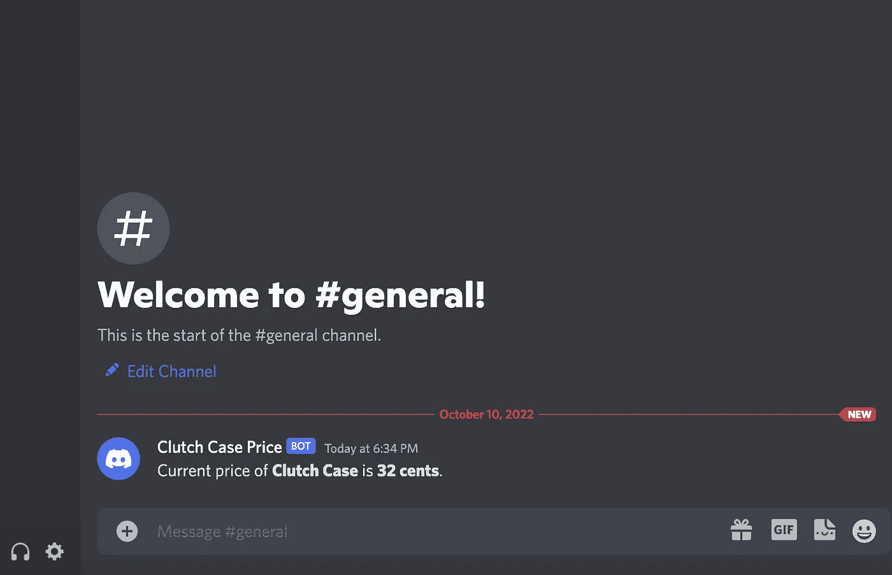
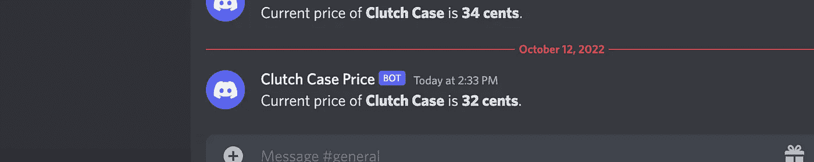
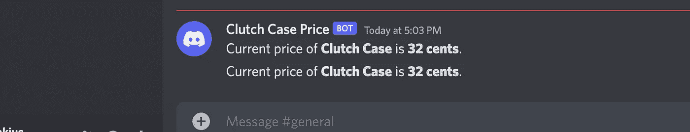

# 如何用 Discord Webhook 集成创建一个无服务器的 Web Scraper

> 原文：<https://betterprogramming.pub/how-to-create-a-serverless-web-scraper-with-discord-webhook-integration-70c1ef251147>

## 使用 Terraform 和 AWS Lambda 在 web 抓取中利用云


照片由 [Riza Gabriela](https://unsplash.com/@rshimjeong?utm_source=medium&utm_medium=referral) 在 [Unsplash](https://unsplash.com?utm_source=medium&utm_medium=referral) 上拍摄

Web 抓取是一个众所周知的编程领域，它以编程方式从网站读取数据。无服务器架构允许我们将 scraper 完全托管在云中，直接与云提供商的数据库引擎集成(如果我们想要存储数据)，并且只为执行时间付费。

在 AWS 中使用按使用付费服务对于一些 web 抓取器来说绝对是一个很好的解决方案。通常，刮擦需要很短的时间，并且在时间间隔内发生。因此，如果执行需要 15 秒，并且每十分钟执行一次，那么这就是一个合适的用例。

在本文中，我们将讨论这个场景——当任务持续时间很短，而执行间隔很大时。

以下是一些无服务器优化应用的示例:

*   每 10 分钟提前一小时查看天气，如果下雨就发出警报
*   每 15 分钟获取一次加密货币价格，以创建过去 24 小时的波动图
*   每 30 分钟统计一次游戏玩家的数量，并以图表的形式呈现出来

下面是一些非无服务器优化的应用程序的例子(需要持续的抓取，不应该在无服务器环境中进行):

*   每秒钟都在查询音乐会门票的可得性
*   交易机器人，每两秒钟扫描一次卖家报价，当价格低于设定的阈值时就买入

让我们不要太深入到刮擦部分(虽然它非常有趣和黑客一样，对一些网站进行逆向工程)。我们的案例很简单，适合无服务器架构——在 [Steam Market](https://steamcommunity.com/market/listings/730/Clutch%20Case) 降低一个虚拟物品——“离合器箱”的价格。

# 卷筒纸刮刀

## 获取路径

首先，我们必须找到一个到元素的路径，以便抓取它。最简单的方法是进入[网站](https://steamcommunity.com/market/listings/730/Clutch%20Case)，右键单击该元素，然后选择“Inspect”



使用 Chrome 开发者控制台查找元素。

通过查看价格，我们可以看到它每隔几秒钟就更新一次。您可以通过查看代码浏览器来注意到它——值在闪烁，表明 DOM 正在被更改。

它泄露了正在进行的 API 调用通过获取/XHR 来解析数据，并且我们不能直接从初始的 HTML 加载中读取。放轻松——这确实是很好的信息！通常，完整的 HTML 页面是一个大文件。如果有 API 调用只是检索我们需要的数据，那么数据下载量会小得多(在我们的例子中，要小 50 倍以上！).

在开发者控制台的网络标签中找到 API 调用(提醒:可以用 Mac 上的`Command + Option + J`或者 Windows/Linux 上的`Control + Shift + J`打开控制台)。

转到获取/XHR 子选项卡，为简洁起见清除现有呼叫，并在新条目中搜索信息(“预览”)。



开发人员通过 API 响应进行控制。

我能在这里看到一些金子。使用您的鹰眼从这个 API 响应中获得我们正在寻找的值。

找到了吗？干得好！正是`lowest_sell_order`。

除了复制该数据的链接地址之外，没有其他事情要做。



开发者控制台链接副本。

```
// copied url[https://steamcommunity.com/market/itemordershistogram?country=KR&language=english&currency=1&item_nameid=175966708&two_factor=0](https://steamcommunity.com/market/itemordershistogram?country=KR&language=english&currency=1&item_nameid=175966708&two_factor=0)
```

# 密码

现在，我们将使用 Python 的请求库以编程方式获取数据。

使用以下命令安装它:

```
pip install requests
```

编写铲运机代码，并进行试运行。

在我们把这个功能放到云中之前，我们应该确保它在本地运行良好。调试实时 Lambda 函数很麻烦！

```
35  # printed value may be different
```

# 不和谐网钩

我在标题中提到过使用“不和谐网络钩子”。Discord 与 webhooks 的整合非常顺利。它在定义的信道中创建具有所需内容的消息。因此，你可以将 Discord Webhooks 用于私人用途(在私人服务器/频道上)以及公共用途。它是非常通用的。也许你的一个朋友也需要知道这个箱子的价格？

创建你自己的 Discord 服务器(如果你还没有的话)。然后，转到服务器设置→集成→ Webhooks →创建 Webhook。



你在 discord.com 的服务器设置

命名你的网页挂钩，并选择一个渠道。复制 Webhook URL 并保存更改。



在 discord.com 创建新的 webhook

很简单，对吧？

# 返回代码

不要在`stdout`中打印价格，让我们使用刚刚复制的 Webhook URL。它应该打印在不和谐的渠道。

运行脚本，看看神奇的事情发生了！



bot 在#通用频道发送的消息。

难以置信的成功。

# 我们终于可以做一些地形了吗？

冷静下来，我不得不一步一步地经历它。

一般来说，现在你可以将`scrape.py`手动放入 AWS Lambda 中，并创建(通过 GUI 点击)一个运行它的调度程序。

但我们不是那样的人。我们需要它干净。我们希望它能让你用最终代码启动[我的 GitHub 库。否则，就没有代码供您启动。](https://github.com/jakjus/serverless-scraper-tf-aws)

我们将在这里迈出一大步。将 Lambda 函数迁移到 Terraform 包括创建许多资源。好的一面是，您可以轻松地修改它们并在以后重用它们。

# 创建地形代码

克隆存储库:

```
git clone [git@github.com](mailto:git@github.com):jakjus/serverless-scraper-tf-aws.git
```

为了从我们的`scrape.py`文件转移到这个状态，我已经:

1.  在*中添加了 Terraform 代码。tf 文件
2.  将`scrape.py`移至`jakjus-scrape-case`
3.  使用`pip install — target ./jakjus-scrape-case requests`在目标文件夹中安装了所需的包—它需要在 AWS Lambda 环境中运行

Terraform 代码取自`aws`供应商文件。有很多组件需要协同工作，而且你真的不需要记住它们。

或多或少，知道我们需要以下东西是件好事:

*   lambda 函数的对象存储设置
*   将 lambda 函数压缩并发送到对象存储中
*   lambda 功能设置
*   记录 Lambda 函数的权限
*   Lambda 函数的对象存储访问权限
*   从 cloudwatch 事件运行 lambda 的权限(eventbridge)

简单看一下。tf 文件知道怎么回事！

# 部署到云

1.  [为您的 AWS 帐户提供凭证](https://registry.terraform.io/providers/hashicorp/aws/latest/docs#authentication-and-configuration)(如果您尚未配置)
2.  下载 Terraform
3.  如果您想在`eu-central-1`之外的另一个区域部署，请更改`main.tf`中的`region`(在本指南中，为了简单起见，我们没有对地形代码进行参数化)
4.  更改`jakjus_scrape_case/scrape.py`中的`webhook_url`

运行以下命令:

```
terraform init
terraform apply
```

您的 AWS 帐户中应该有所有必要的成分。不要担心账单—所有这些资源都在一个免费层中，对于我们的场景，它应该永远免费。

# 测试功能

首先，让我们测试一下 S3 桶中是否有压缩的 Lambda 代码:

```
$ aws s3 ls $(terraform output -raw lambda_bucket_name)
2022-10-10 19:21:57     471233 jakjus-scrape-case.zip
```

然后，测试 Lambda 是否执行抓取并在被调用时发送不一致消息:

```
$ aws lambda invoke --region=YOUR_REGION_HERE --function-name=$(terraform output -raw function_name) response.json
$ cat response.json
{"message": "OK"}
```



调用 Lambda 后不和谐公会中的新消息。

您可以看到后续呼叫自动完成。这是它们的样子:



`cron.tf`中定义的 Cron 每分钟运行一次刮刀。

如果您可以看到后续的刮刀运行，那么…

恭喜你！你成功了！

# 清除

可以使用以下命令进行清理:

```
terraform destroy
```

# 摘要

这是一个漫长的旅程，但构建端到端的云原生应用需要一些时间。

在本文中，您探索了以下内容:

*   学习基本的网页抓取技术
*   了解 cron 操作环境中无服务器和有服务器服务的用例
*   学会了如何使用不和谐的网页挂钩
*   使用最先进的 IaaC 工具实现了一个完全可用的应用程序

现在是时候改变应用程序以获取您关心的数据了。

祝你好运！

```
**Want to Connect?***You can find the full source code on* [*github.com/jakjus*](https://github.com/jakjus/serverless-scraper-tf-aws) *and connect with me on* [*LinkedIn*](http://linkedin.com/in/jakubjuszko).
```