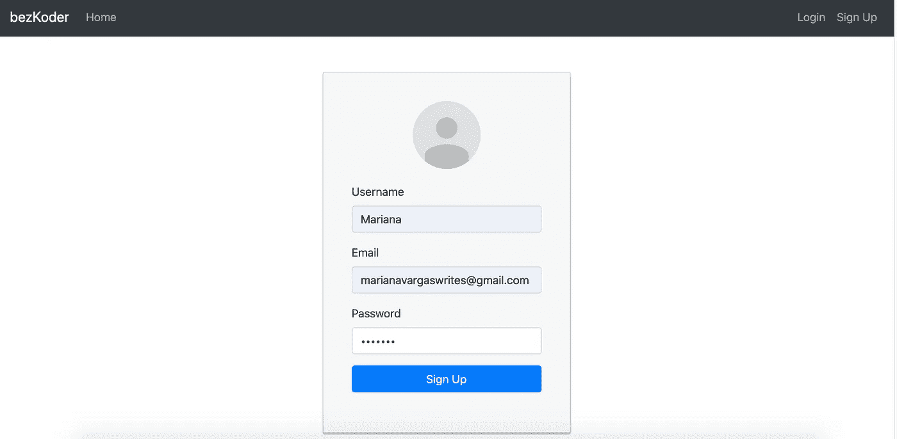
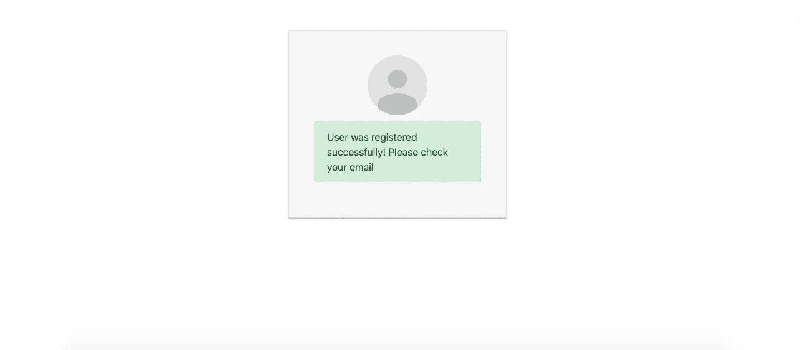
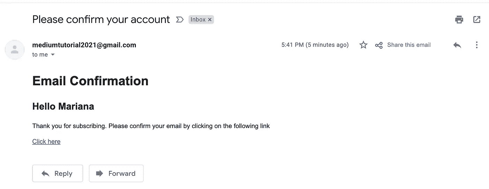
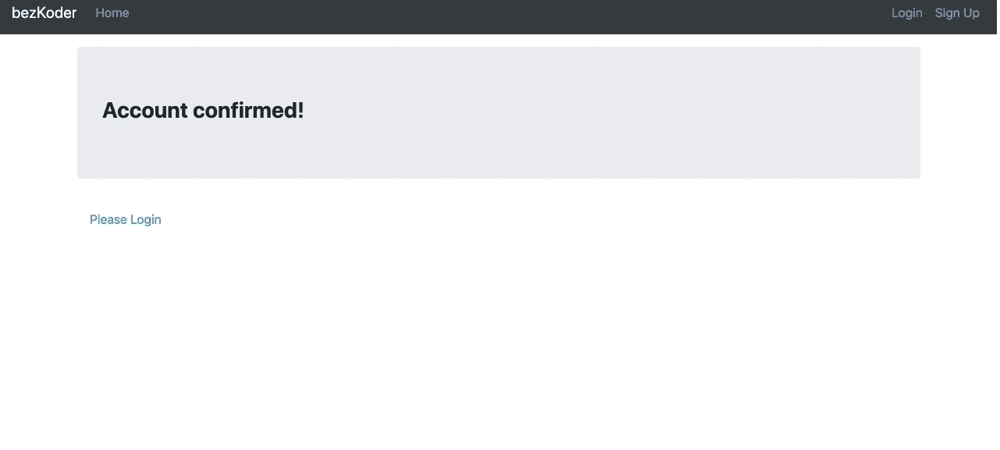
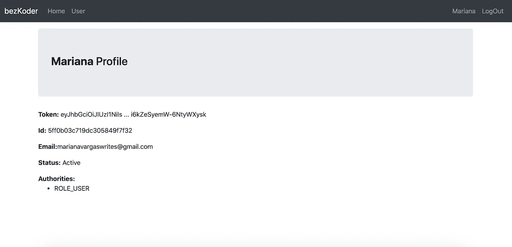

# 如何用 Node.js 创建注册确认邮件

> 原文：<https://betterprogramming.pub/how-to-create-a-signup-confirmation-email-with-node-js-c2fea602872a>

## 避免假冒用户使用确认链接来激活账户


图片由 [vectorjuice](https://br.freepik.com/vetores-gratis/email-marketing-chat-na-internet-suporte-24-horas-entre-em-contato-inicie-contato-fale-conosco-feedback-formulario-online-fale-com-o-conceito-de-clientes_10780041.htm#page=1&query=mail%20vectorjuice&position=0) 在 [Freepik](http://freepik.com) 上提供

用户注册的确认邮件是一个重要的步骤，无论是出于营销还是安全目的。

在营销方面，确认电子邮件建立了与客户的第一次沟通，确保在完成注册过程之前发送重要信息，符合 [GDPR 法规](https://www.mailigen.com/blog/gdpr/)，并保证后续电子邮件不会进入垃圾邮件箱。

在安全性方面，这些电子邮件确保用户不是用假邮件注册的。

在本教程中，我将指导您使用 React 和 Node.js 实现注册功能的确认电子邮件。

# 这个教程是给谁看的？

本教程的目标读者是已经具备 JavaScript 框架 web 开发基础知识的人。我将指导您将新功能集成到预先存在的身份验证过程中。

如果你想将本教程用作编码练习，我会给你所有你需要的代码。然而，如果你已经有了一个 web 应用程序，并且只想添加一个自定义的注册确认电子邮件，那么即使你使用的是不同的 JavaScript 框架，你也可以按照本指南中的每一步自己完成。

# 如何设置注册确认电子邮件

对于本教程，我使用了一个 Node.js 应用程序和一个 Mongo DB 数据库，可以在这里克隆:

[](https://github.com/bezkoder/node-js-jwt-auth-mongodb) [## bez koder/node-js-jwt-auth-MongoDB

### Node.js + MongoDB:使用 JWT 的用户认证和授权—bez koder/node-js-jwt-auth-MongoDB

github.com](https://github.com/bezkoder/node-js-jwt-auth-mongodb) 

对于前端，我使用了带有 JWT 认证的 React 注册表单，可在以下链接中找到:

[](https://github.com/bezkoder/react-hooks-jwt-auth) [## bezkoder/react-hooks-jwt-auth

### 有关更多详细信息，请访问:React Hooks: JWT 认证和授权示例该项目是自举的…

github.com](https://github.com/bezkoder/react-hooks-jwt-auth) 

# 步骤 1 —准备用户模型

如果您使用的是我在上一节提到的启动代码，您可以在`models/user.model.js`文件中找到用户模型。当前模型包括三个字段:`username`、`email`和`password`。还需要添加两个:

*   `status`:默认情况下，每个新用户都必须创建为“待定”状态。注册后，他将收到一封带有激活链接的确认电子邮件。通过点击它，他的状态将被更新为“活动”。
*   `confirmationCode`:每个用户的唯一令牌。

用户模型

# 步骤 2 —修改登录过程

只有处于“活动”状态的用户才能登录，所以我们必须在`signin`方法中包含一条错误消息，当处于“待定”状态的用户试图登录时，就会显示这条消息。这个方法可以在`controllers/auth.controller.js`中找到:

要包含在 signing()方法中的错误消息

# 步骤 3-修改注册程序

`signup`方法在`controllers/auth.controller.js`文件中。这必须被更新以生成一个`confirmationCode`并被添加到用户对象以存储在数据库中。

可以通过几种方式创建`confirmationCode`。我建议两条:

1.  借助`Math.random()`函数计算您自己的唯一令牌:

用 Math.random()函数创建的注册确认码

2.使用合适的 npm 包。你有很多选择。对于本教程，我使用了 [jwt-encode](https://www.npmjs.com/package/jwt-encode) ，它使用一个秘密和`sign()`函数创建 JSON web 令牌。

用 jwt 编码包创建的注册确认码

注意，对于`sign()`函数，我使用了一个名为`secret`的常量，它已经在`config/auth.config.js`文件中定义了。

# 第 4 步—发送确认电子邮件

`nodemailer`是实现邮件发送的完美 npm 包。如果您还没有，请安装这个软件包:

```
npm install nodemailer
```

然后，您需要在应用程序的配置文件中包含发送者的凭据，即他们的电子邮件和密码。对于本教程，我专门创建了一个电子邮件帐户，我强烈建议不要使用个人电子邮件进行本练习，除非您对安全问题有深刻的理解。

***重要提示:*** *要将 Gmail 与 nodemailer、* [*一起使用，您必须启用不太安全的应用程序的访问*](https://www.google.com/settings/security/lesssecureapps) *，否则它不会发送任何邮件。*

出于一致性的目的(请记住，我没有使用自己的代码作为本教程的起点)，我将凭证存储在`configs/auth.config.js`文件中。但是，我强烈建议您将这些信息保存在`.env`文件中，并包含在您的`.gitignore`文件中。

存储在 configs/auth.config.js 中的电子邮件身份验证凭据

在此之后，我们必须在`config`文件夹中添加一个新文件，以设置电子邮件服务。我创造了`nodemailer.config.js`。为了建立 SMTP 连接，我们必须通过调用 nodemailer 的`createTransport`函数来创建一个`transporter`对象。我们还必须传递给它发送者的凭证，以及选择的电子邮件服务。

电子邮件服务配置

下一步是创建电子邮件本身，求助于通过`transporter`调用的`sendEmail()`方法。有许多可选字段可以添加到电子邮件消息中。对于本教程，我使用:

*   `from` —发件人的电子邮件地址。
*   `to` —收件人的电子邮件地址。
*   `subject`—电子邮件的主题。
*   `html` —电子邮件消息的 HTML 版本，以便电子邮件服务可以打开它。

电子邮件必须包含带有`confirmationCode`的 URL。有必要将其与数据库中存储的用户的相应`confirmationCode`字段进行比较。

电子邮件配置

最后，为了在创建新用户后发送确认邮件，我们可以在`signup`方法中调用`sendEmail()`。

注册方法的摘录，包括 sendEmail()调用

# 步骤 5-创建确认路线

我们必须设置一个路由来将用户状态从“待定”更改为“活动”因此，我在`auth.rotes.js`文件中包含了一个新的路径，并配置了一个新的控制器来处理程序。`verifyUser`控制器使用 URL 中收到的`confirmationCode`在数据库中搜索用户，并相应地执行状态更新。

为处理用户验证过程而定义的端点

VerifyUser()方法通过给定的确认码查询用户集合，如果找到匹配，就将其状态从“待定”更新为“活动”

# 步骤 5 —创建欢迎页面

此时，如果用户点击电子邮件的确认链接，他们会发现一个空白页面，仍然无法登录。因此，我们需要在前端进行一些更改，以完成注册过程。

我们必须在`src/components/services/auth.service.js`中添加一个新方法来调用上一步中定义的端点。

将 verifyUser()方法添加到 auth.service.js，以建立与后端的连接

在此之后，我们必须创建一个新的组件，以便在单击确认 URL 时进行呈现。不要忘记在`App`文件中包含各自的路线！

欢迎组件

单击确认链接时展示欢迎组件的前端路由

# 第 5 步—让我们测试一下！

让我们把它们放在一起，看看我们的应用程序是否有效。

## 1.创建新的用户帐户



这是您可能会看到的消息:



如果您尝试登录，您会发现以下错误:


## 2.检查你的邮箱

你可能收到了一封和我一样的邮件:



点击链接，确认这是您重定向到的网页:



现在，如果您尝试再次登录，您将被自动重定向到您的个人资料页面。



既然您已经完成了本教程，那么您已经学会了如何使用 Node.js 创建注册确认电子邮件，并且现在能够构建一个健壮的注册功能。恭喜你！

你可以在这个 [GitHub 库](https://github.com/marianamv112/signup-confirmation-email)中找到本教程开发的完整解决方案。编码快乐！