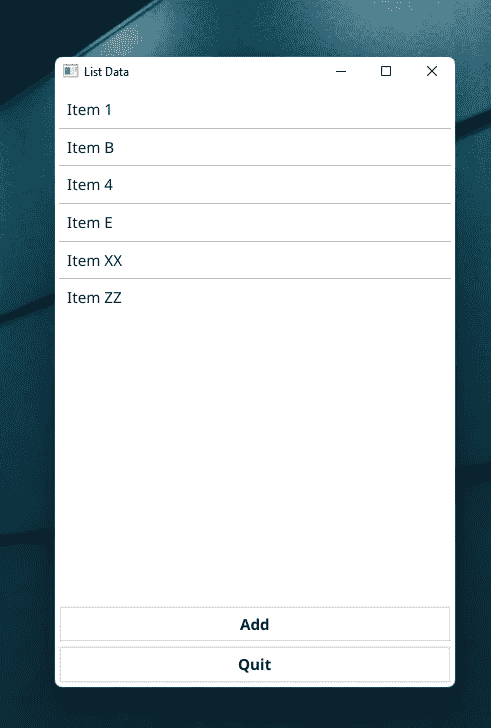
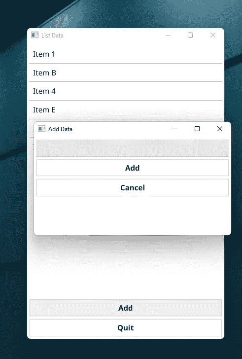
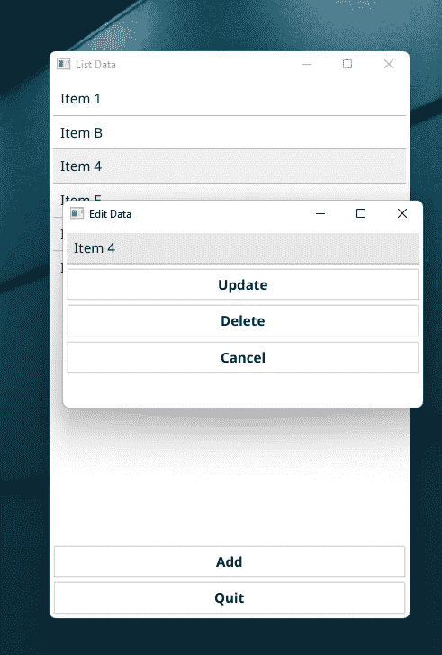

# 如何用 Golang 和 Fyne 创建一个简单的数据输入桌面应用程序

> 原文：<https://betterprogramming.pub/how-to-create-a-simple-data-entry-desktop-app-with-golang-and-fyne-7c9e543d71e>

## 我们将创建一个 Golang 桌面应用程序，使用 Fyne GUI 工具包添加、更新、删除和查看列表中的文本项

在这篇文章中，我将回顾我做的一个小项目，探索 Fyne GUI 工具包的一些可能性。这个软件包集合实现了 Golang 在多个平台上的桌面 GUI 功能。

我选择为这个项目创建一个数据输入应用程序，因为这对许多人来说似乎非常有用。目前，它非常简单，但你可以很容易地扩展它。

首先，我将讨论为什么我选择 Fyne 工具包来创建桌面应用程序。之后，我将添加一个关于安装过程的快速注释。

然后，我将讨论我为数据输入编写的程序代码的各个部分。在这里你可以找到一些我在创建项目的过程中发现的有用的东西。

最后，我将向您展示如何运行该程序以及它的外观，并讨论我们如何改进它。

# 为什么要使用 Fyne 桌面 GUI 工具包？

我使用 Fyne 的原因是相当平庸的。这些年来，我尝试过各种编程语言的许多软件库/软件包。这些语言包括 C++、Python、JavaScript 等。

因此，我可以告诉你，如果在 Windows PC 上安装后，某些东西开箱后就能正常工作，那么我很高兴。Fyne 就是这种情况。我安装了它(和 GCC，稍后会详细介绍)，并运行了一些官方示例。它非常有效。

除了明显的易用性和稳定性，Fyne GUI 工具包似乎还允许在大多数流行的平台上编译，但我还没有测试过。这些平台包括 Windows、macOS X、Linux、Raspberry Pi、BSD、Android 和 iOS。这是一个非常体面的覆盖面。

最后，Fyne 包包含了你期望在桌面 GUI 工具包中找到的所有典型的小部件。

# 关于安装 Fyne 工具包的快速说明

除了安装 Fyne 工具包，您还需要安装一个 C 编译器(GCC)来编译使用它的代码。鉴于我使用 Windows PC 进行 Golang 编程，我选择安装官方文档推荐的 MSYS2。GCC 包含在 MSYS2 中。总的来说，安装过程非常简单，所以我不需要在这里解释。

不过，我想补充一件小事。您可能想要将`gcc.exe`二进制文件的位置添加到您的窗口`PATH`中。就像这样，你可以像以前一样从你的 Windows 终端运行 Golang 代码。否则，您必须从 MSYS2 终端运行 Go 编译器。后者也是可能的，但不是特别方便。

# 数据输入桌面应用程序代码

下面你可以找到数据输入桌面应用的完整代码。

在接下来的内容中，我将通过小片段来讨论代码。

## 导入所需的包

在第 3–16 行，我们导入了所有必需的库。其中包括:

*   `encoding/json`用于编码和解码 JSON 字符串。
*   `fmt`用于向终端打印消息。我还用它来调试我的应用程序。
*   `io/ioutil`用于读写文件。
*   各种 Fyne 包

## 从 JSON 文件加载数据

在第 4 行，我们用`ioutil.ReadFile()`读取名为`data.json`的文件。这个函数返回一个字节片(`[]byte`)和一个`error`。在这个例子中，我们跳过错误，只添加一个下划线。

如果文件`data.json`不存在，那么`input`就是一个空片。

在第 5 行，我们声明了一个名为`data`的字符串片段(`[]string`)，用于保存我们使用应用程序添加的每个字符串。

在第 6 行，我们解码来自`input`的 JSON 字节片，并将内容作为字符串片放入`data`。

在第 9 行中，`loadJsonData()`函数返回一个空的切片或者一个包含我们的应用程序之前保存的字符串的切片。

## 将数据保存到 JSON 文件

在第 1 行，函数`saveJsonData()`接收一个名为`data`的变量，它的类型是`binding.StringList`。这个类型是 Fyne 包中的一个特殊类型，用于保存和更新列表项。你可以在这里阅读更多关于它的信息。

在第 3 行中，我们从`data`和`StringList`中获取字符串片段。我们再次跳过错误并加上下划线。

在第 4 行，我们将字符串片段编码为 JSON 数据。

在第 5 行中，我们使用`ioutil.WriteFile()`将 JSON 数据保存到名为`data.json`的文件中。注意，`WriteFile()`的第三个参数是一个数字。这个数字对应于 Unix 文件许可代码的数字符号——在本例中是`0644`。

## 设置应用程序

上述代码出现在`main()`函数的开头。

在第 1 行，我们创建了一个新的 Fyne 应用程序。

在第 2 行，我们在 Fyne 应用程序中创建了一个新窗口。

在第 4 行，我们使用上面描述的函数将 JSON 数据加载到名为`loadedData`的变量中。

在第 6 行和第 7 行，我们创建了一个类型为`binding.StringList`的变量`data`，并将其内容设置为`loadedData`。

在第 9 行中，我们推迟保存 JSON 数据，使用前面描述的函数和`defer`关键字。通过推迟这个函数，我们确保它将在`main()`函数结束时被调用，即使在执行过程中发生了一些错误。

## 列出数据

我们将使用一个名为`ListData`的小部件来列出来自名为`data`的`StringList`的字符串。

可以使用功能`widget.NewListWithData()`创建该小部件。这个小部件的工作方式是将它绑定到名为`data`的`StringList`上。当`data`更新时，小工具中的字符串列表也会自动更新。

## 更新和删除数据

可以选择字符串列表中的项目。在我们的例子中，这归结为一次点击，因为选中的项目立即被取消选中(在第 2 行)。

在第 3 行，我们使用函数`getValue()`得到数据中项目的值。

在第 4 行中，创建了一个新窗口来存放以下小部件:

*   在第 6 行和第 7 行，一个用于文本字符串输入的小部件。小部件的文本被设置为项目的当前值。
*   在第 9–12 行，一个按钮部件，当点击它时，将更新所选择的列表项。使用`SetValue()`功能可以轻松更新列表中的项目。
*   在第 14–16 行，一个按钮部件，当点击时，将取消操作并关闭窗口。
*   在第 18–31 行，一个按钮部件，当点击它时，将从字符串列表中删除选中的项目。删除一个条目比更新它要复杂一些。这个想法是，我们将所有数据复制到`newData`中，除了被删除的条目，然后将数据设置为新的数据。

所有的小部件都被添加到第 33 行的窗口中。

在第 34–36 行，我们给窗口一个 400x200 像素的大小，并把窗口放在屏幕的中心，以避免它在左上角打开。最后，我们确保展示窗口。

## 添加数据

我们可以通过点击应用程序底部的“添加”按钮将数据项添加到列表中。添加项目是在单击按钮时调用的函数中实现的。

在第 1 行，创建了按钮小部件。

然后在第 2 行，创建了一个窗口。该窗口将依次包含三个小部件:

*   在第 4 行，一个用于文本字符串输入的小部件。
*   在第 6–9 行，一个按钮部件，当点击它时，会添加一个新的列表项。这就像将`Append()`函数应用于`data`列表一样简单。添加完项目后，窗口关闭。
*   在第 11–13 行，一个按钮部件，当点击时，将取消操作并关闭窗口。

在第 15 行，使用一个`VBoxLayout`将上述所有小部件添加到窗口中。这意味着小部件是垂直堆叠的。

在第 16–18 行，窗口大小设置为 400x200 像素，窗口在屏幕上居中，然后显示出来。

## 设置主窗口的内容

在第 6 行中，我们将`add`和`exit`按钮添加到一个垂直布局中，它又被添加到一个边框布局的底部。`list`微件被添加到中心。

在第 7 行，我们将窗口大小调整为 400x600 像素。

在第 8 行，我们将主窗口设置为“主”窗口。当我们关闭主窗口时，我们关闭了所有的窗口。

在第 9 行，窗口在屏幕上居中。

第 10 行显示窗口，用`ShowAndRun()`运行 app。该功能在程序中只能使用一次，因为我们一次只能运行一个应用程序。这就是为什么其他窗口仅使用`Show()`显示的原因。

# 运行代码

您可以使用`go run main.go`在终端中运行代码。如果您遇到一些错误，您可以运行`go mod init`并遵循您收到的任何指示。在下面的截图中，你可以看到结果。注意，当我运行代码时，我的 JSON 数据文件不是空的。

在*左侧*，可以看到运行时的 app。这是一个主窗口，列出了输入并保存在 JSON 文件中的数据项。您可以看到当您点按中间的“添加”按钮时出现的窗口。然后，在右边的*上*，你可以看到当你点击一个项目时出现的窗口(在这种情况下称为“项目 4”)。

# 进一步工作的想法

以下是一些可以探索的想法:

*   除了将一个字符串保存为一个条目，它还可以是一个更复杂的具有多个属性的结构，例如，一个用户的名和姓、电子邮件地址、个人资料图片等。
*   使用像 MongoDB 这样的数据库来保存数据，而不是 JSON 文件。
*   一些搜索功能，当列表很长时可以找到条目。
*   此外，当一个“子”窗口被打开时，它们应该保持在焦点上，直到它们的一个按钮被点击。目前，打开多个这样的窗口是可能的，这会变得凌乱并导致混乱。在这种情况下，也许“对话窗口”更合适？

# 参考

[Fyne 开发者文档](https://developer.fyne.io/started/hello)

[“演示 CRUD 应用程序— Fyne Golang GUI 教程 56”作者 TonyBB](https://blogvali.com/fyne-crud-app-fyne-golang-gui-tutorial-56/)

[《Golang 中 JSON 的完全指南(带示例)】作者 Soham Kamani](https://www.sohamkamani.com/golang/json/)