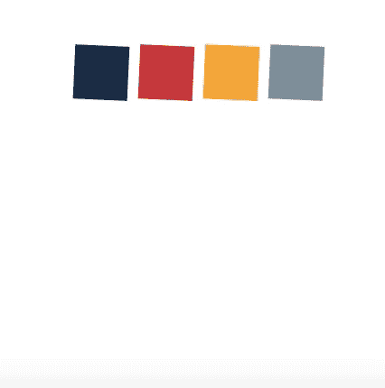

# 用 Anime.js 创建一个简单、强大的加载程序

> 原文：<https://betterprogramming.pub/how-to-create-a-simple-kickass-loader-with-anime-js-82b8b570682a>

## 用物理学构建美丽的动画


由[诺德伍德主题](https://unsplash.com/@nordwood)在 [Unsplash](https://unsplash.com/) 拍摄的超酷照片。

我是一名热爱探索前端技术的设计师。最近，一个特别的 JavaScript 动画库引起了我的注意——[anime . js](https://animejs.com/)。浏览文档让我非常兴奋地使用它。

图书馆背后的理论非常简单:这是基础物理学。然而，当某些 CSS 属性组合在一起时，您可以创建一些复杂的动画。提供一个设计师的类比，它是一个包含 Adobe After Effects 的基本功能(关键帧、缩放、变换、缓动、延迟等)的库。).然而，我们都知道后效的力量(问问安德鲁·克雷默就知道了)。

在本文中，我将实现一个简单的 loader(记住，越少越好)动画，它结合了 Anime.js 的一些基本属性。最酷的部分是每次加载页面时加载动画看起来都不一样(由于增加了随机延迟)。

动画使用四个基本属性:

*   更改每个形状的位置。
*   旋转每个形状。
*   更改每个形状的边框半径。
*   为每个形状添加随机延迟。

# 设置布局

在这里，我选择了创建正方形——这是一个显而易见的选择，因为边界半径的过渡会更加突出。对于调色板，您会被 [Coolors](https://coolors.co/) 或 [Muzli 调色板](https://muz.li/)的选择宠坏:

```
<div id="boxes">
    <div class="box one"></div>
    <div class="box two"></div>
    <div class="box three"></div>
    <div class="box four"></div>
</div>
```

每个形状都有自己的类别，因为我们希望在不同的时间对每个形状应用不同的效果。简单的东西。

向您的 CSS 和 JS 文件添加链接，并包含指向 Anime.js 文件的链接:

```
<link rel="stylesheet" href="style.css"><script src="https://cdnjs.cloudflare.com/ajax/libs/animejs/2.2.0/anime.js"></script>
<script
src="main.js">
</script>
```

# 分解它

真正的奇迹发生在您的 JavaScript 中。这是所有 Anime.js 属性所在的框架:

```
anime ({/* animation */});playPause.play();
```

## 1.更改形状的位置

Anime.js 库的格式为`property: value(s)` *。*首先，我们想要实现形状向下运动:

这里，`targets` 指定了我们要动画化哪些 div 类(它们可以是 CSS 选择器、DOM 元素、NodeList、Object 或者 Array)。`translateY`是沿着 Y 轴移动形状，因为我们想要向下运动。`value`和`duration`分别指定了该形状将被移动到的坐标(在本例中为 Y 坐标)和它停留在该点的时间(毫秒)。所以在这里，每个形状向下移动到一个点(0，200)并保持 500 毫秒，然后回到初始位置(0，0)800 毫秒。你可以摆弄这些数字来丰富你的想象力。一个小细节:将`loop`设置为`true`，这样动画可以循环播放。


## 2.旋转每个形状

旋转给人一种极度运动和变化的感觉。在这种情况下看起来也很有趣。因此，加上前面的动画，我们得到:

简单。`value`指定希望形状旋转的圈数。


## 3.更改边框半径

将正方形变形为圆形是最酷的部分。这也很简单:只需改变每个方块的边界半径:

`alternate`方向值在每次循环后改变动画方向。`easing`参数用于控制动画在激活期间的播放速率:



## 4.添加随机延迟

最后一笔，伙计们。他们说混乱有时会让人平静。也很酷(有时)。大多数加载页面/加载器都是单调的——它们遵循一种模式。这也是为什么当一个页面花太长时间加载时会变得超级烦人的部分原因(当然，除了明显的原因，它花太长时间加载)。现在很多网站都在尝试创新的加载页面。[看看这些](https://www.awwwards.com/awwwards/collections/loading-page/)。即使只是一会儿，它也会给用户带来愉悦的因素。

delay 属性中的`function()`返回一个特定范围内的随机整数。需要我解释为什么`loop`设置为`true`吗？弄清楚。
Anime.js 包含了一个相当不错的属性(`elasticity`)，允许你给动画添加弹性。这意味着动画完成后不会突然停止，而是振荡。这使得运动看起来非常自然。该值越高，运动的弹性越高。这给了我们最后一个精彩的动画:

# 结论

Anime.js 是一个非常轻量级的动画引擎——缩小到 14kb，只有*6kb*gzip。它支持所有现代的浏览器，并且几乎可以动画显示从 CSS 属性到任意 JavaScript 值的任何内容。

我在这里创建的东西非常简单，并没有充分发挥这个库的所有功能。所以去尝试创造一些很棒的东西吧。
干杯！

# 更酷的东西

[](https://blog.bitsrc.io/11-javascript-animation-libraries-for-2018-9d7ac93a2c59) [## 2019 年的 11 个 JavaScript 动画库

### 一些最好的 JS 和 CSS 动画库。

blog.bitsrc.io](https://blog.bitsrc.io/11-javascript-animation-libraries-for-2018-9d7ac93a2c59)