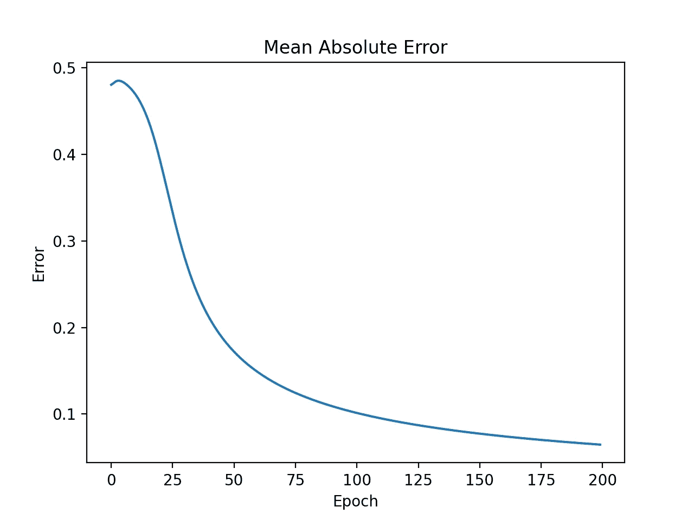
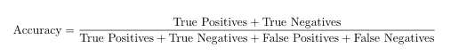

# 如何用 Python 创建一个简单的神经网络

> 原文：<https://betterprogramming.pub/how-to-create-a-simple-neural-network-in-python-dbf17f729fe6>

## 学习如何创建一个神经网络，并教它分类向量


照片由[纳斯蒂亚·杜尔希尔](https://unsplash.com/@dulgier?utm_source=medium&utm_medium=referral)在 [Unsplash](https://unsplash.com?utm_source=medium&utm_medium=referral) 拍摄

在过去的几十年里，机器学习对世界产生了巨大的影响，并且它的受欢迎程度似乎越来越高。最近，越来越多的人熟悉了机器学习子领域，如神经网络，这是由人脑启发的网络。在本文中，将介绍一个简单神经网络的 Python 代码，该网络以 10 作为第一个元素对 1×3 向量进行分类。

# 步骤 1:导入 NumPy、Scikit-learn 和 Matplotlib

```
import numpy as np
from sklearn.preprocessing import MinMaxScaler
import matplotlib.pyplot as plt
```

我们将为这个项目使用三个包。NumPy 将用于创建向量和矩阵，以及数学运算。Scikit-learn 将用于缩放数据，Matplotlib 将用于绘制神经网络训练期间的误差发展。

# 步骤 2:创建训练和测试数据集

神经网络非常擅长学习大数据集和小数据集的趋势。然而，数据科学家必须意识到过度拟合的危险，这在使用小数据集的项目中更加明显。过度拟合是指对算法进行训练和建模，使其过于拟合一组数据点，从而不能很好地推广到新的数据点。

通常，过度拟合的机器学习模型在它们被训练的数据集上具有非常高的准确性，但作为数据科学家，目标通常是尽可能精确地预测新的数据点。为了确保根据预测新数据点的效果来评估模型，而不是根据当前数据点的建模效果来评估模型，通常将数据集分成一个定型集和一个测试集(有时还有一个验证集)。

```
input_train = np.array([[0, 1, 0], [0, 1, 1], [0, 0, 0], 
                        [10, 0, 0], [10, 1, 1], [10, 0, 1]])
output_train = np.array([[0], [0], [0], [1], [1], [1]])
input_pred = np.array([1, 1, 0])

input_test = np.array([[1, 1, 1], [10, 0, 1], [0, 1, 10], 
                       [10, 1, 10], [0, 0, 0], [0, 1, 1]])
output_test = np.array([[0], [1], [0], [1], [0], [0]])
```

在这个简单的神经网络中，我们将以 10 作为第一个元素对 1×3 向量进行分类。输入输出训练和测试集是使用 NumPy 的`array`函数创建的，而`input_pred`是为了测试稍后将定义的`prediction`函数而创建的。训练和测试数据都由六个样本组成，每个样本有三个特征，由于输出是给定的，我们知道这是监督学习的一个例子。

# 步骤 3:缩放数据

许多机器学习模型不能够理解例如单位之间的差异，并且自然地将更多权重应用于高量值的特征。这可能会破坏算法预测新数据点的能力。此外，训练具有大量特征的机器学习模型将比必要的要慢，至少如果使用梯度下降的话。这是因为当输入值在大致相同的范围内时，梯度下降收敛得更快。

```
scaler = MinMaxScaler()
input_train_scaled = scaler.fit_transform(input_train)
output_train_scaled = scaler.fit_transform(output_train)
input_test_scaled = scaler.fit_transform(input_test)
output_test_scaled = scaler.fit_transform(output_test)
```

在我们的训练和测试数据集中，这些值在一个相对较小的范围内，因此可能没有必要进行特征缩放。然而，它被包含在这里，这样人们可以使用他们自己的数字，而不需要改变太多的代码。由于 Scikit-learn 包和它的 MinMaxScaler 类，在 Python 中进行特征缩放非常容易。只需创建一个 MinMaxScaler 对象，使用`fit_transform`函数将未缩放的数据作为输入，该函数将返回缩放后的相同数据。Scikit-learn 包中还有其他缩放函数，我鼓励您尝试一下。

# 步骤 4:创建神经网络类

熟悉神经网络所有元素的最简单方法之一是创建一个神经网络类。这样的类应该包括神经网络正常工作所需的所有变量和函数。

# 步骤 4.1:创建一个初始化函数

当我们在 Python 中创建一个类时，会调用`__init__`函数，以便正确初始化变量。


图片由作者提供。


按作者分列的数字

在本例中，我选择了一个具有三个输入节点、三个隐藏层节点和一个输出节点的神经网络。上面的`__init__`函数初始化描述神经网络大小的变量。`inputSize`是输入节点数，应该等于我们输入数据中的特征数。`outputSize`等于输出节点数，`hiddenSize`描述隐藏层的节点数。此外，我们的网络中不同节点之间的权重将在训练期间进行调整。

除了描述神经网络大小及其权重的变量之外，我还创建了几个变量，这些变量在创建用于评估目的的`NeuralNetwork`对象时被初始化。`error_list`将包含每个历元的平均绝对误差(MAE ),并且极限将描述何时向量应该被分类为以元素 10 作为第一元素的向量以及不作为第一元素的向量的边界。然后，有一些变量将用于存储真阳性、假阳性、真阴性和假阴性的数量。

# 步骤 4.2:创建正向传播函数

正向传递函数的目的是通过神经网络的不同层向前迭代，以预测特定时期的输出。然后，查看预测输出和实际输出之间的差异，权重将在反向传播期间更新。

```
def forward(self, X):
        self.z = np.matmul(X, self.W1)
        self.z2 = self.sigmoid(self.z)
        self.z3 = np.matmul(self.z2, self.W2)
        o = self.sigmoid(self.z3)
        return o
```

为了计算每层中每个节点处的值，在应用非线性[激活函数](https://medium.com/writers-blokke/what-is-an-activation-function-in-a-neural-network-ae0eb2bd2f82)来拓宽最终输出函数的可能性之前，前一层中节点处的值将与适用的权重进行矩阵相乘。在这个例子中，我们选择了 Sigmoid 作为激活函数，但是也有许多其他的选择。

# 步骤 4.3:创建反向传播函数

反向传播是更新神经网络中不同节点的权重并因此决定它们的重要性的过程。

```
def backward(self, X, y, o):
        self.o_error = y - o
        self.o_delta = self.o_error * self.sigmoidPrime(o)
        self.z2_error = np.matmul(self.o_delta,
                                  np.matrix.transpose(self.W2))
        self.z2_delta = self.z2_error * self.sigmoidPrime(self.z2)
        self.W1 += np.matmul(np.matrix.transpose(X), self.z2_delta)
        self.W2 += np.matmul(np.matrix.transpose(self.z2),
                             self.o_delta)
```

在上面的代码片段中，输出层的输出错误被计算为转发传播的预测输出与实际输出之间的差异。然后，将该误差乘以 Sigmoid 质数，以运行梯度下降，然后重复整个过程，直到到达输入层。最后，更新不同层之间的权重。

# 步骤 4.4:创建一个培训函数

在训练期间，该算法将向前和向后运行，从而在有历元时更新权重。为了获得最精确的重量，这是必要的。

```
def train(self, X, y, epochs):
        for epoch in range(epochs):
            o = self.forward(X)
            self.backward(X, y, o)
            self.error_list.append(np.abs(self.o_error).mean())
```

除了运行向前和向后传递之外，我们还将平均绝对误差(MAE)保存到一个误差列表中，以便我们稍后可以观察平均绝对误差在训练过程中是如何发展的。

## 步骤 4.5:创建预测函数

在训练期间对权重进行微调之后，算法就可以预测新数据点的输出了。这是通过转发过程的单次迭代来完成的。预测的输出将是一个非常接近实际输出的数字。

```
def predict(self, x_predicted):
        return self.forward(x_predicted).item()
```

# 步骤 4.6:绘制平均绝对误差发展曲线

有许多方法可以评估机器学习算法的质量。常用的度量之一是平均绝对误差，它应该随着历元数的增加而减小。

```
def view_error_development(self):
        plt.plot(range(len(self.error_list)), self.error_list)
        plt.title(**'Mean Sum Squared Loss'**)
        plt.xlabel(**'Epoch'**)
        plt.ylabel(**'Loss'**)
```



图 1:训练期间平均绝对误差的发展

# 步骤 4.7:计算精确度及其组成部分

真阳性、假阳性、真阴性和假阴性的数量描述了机器学习分类算法的质量。在训练神经网络之后，应该更新权重，以便算法能够准确地预测新的数据点。在二元分类任务中，这些新数据点只能是 1 或 0。根据预测值是高于还是低于定义的限制，算法会将新条目分类为 1 或 0。

当运行 test_evaluation 函数时，我们得到以下结果:

真阳性:2
真阴性:4
假阳性:0
假阴性:0

精度由以下公式给出:



等式 1:精确度

由此我们可以推断，我们的精度是 1。

# 步骤 5:运行训练和评估神经网络模型的脚本

```
NN = NeuralNetwork()
NN.train(input_train_scaled, output_train_scaled, 200)
NN.predict(input_pred)
NN.view_error_development()
NN.test_evaluation(input_test_scaled, output_test_scaled)
```

为了测试我们刚刚构建的神经网络类，我们将从初始化一个类型为`NeuralNetwork`的对象开始。然后，在测试向量上测试新训练的模型之前，根据训练数据训练神经网络，以在 200 个时期内微调算法的权重。然后，在使用测试数据集评估模型之前，绘制误差发展图。

在 [GitHub](https://github.com/cverdence/simplennet) 上看到整个项目和代码。

# 第六步:改进剧本，并发挥它

提出的代码可以很容易地修改，以处理其他类似的情况。我们鼓励读者尝试一下，改变变量，使用他们自己的数据等等。改进或改变的潜在想法包括:

1.  将代码一般化，使其适用于任何输入和输出大小的数据
2.  使用除平均绝对误差之外的另一种度量来监控误差发展
3.  使用另一个缩放函数

艾丹·威尔逊。*[*Python 中的简单神经网络(2019 年 10 月)*](https://towardsdatascience.com/inroduction-to-neural-networks-in-python-7e0b422e6c24) *。**