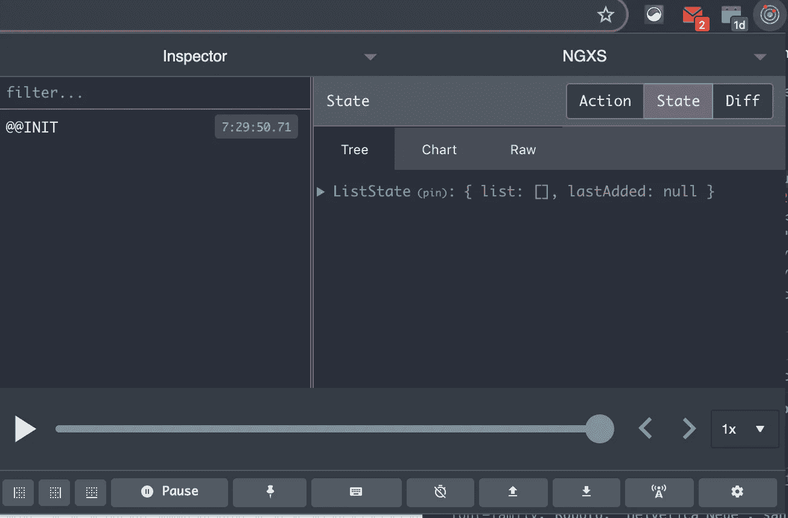
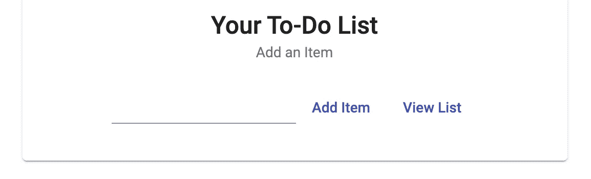
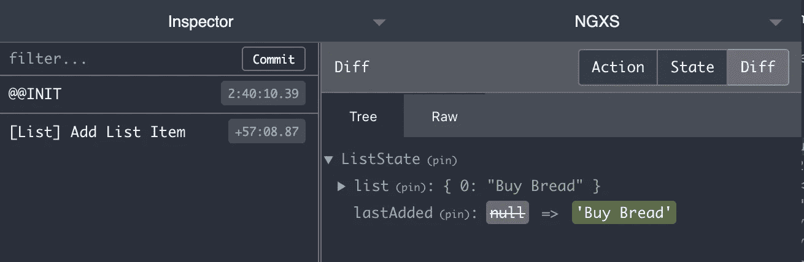
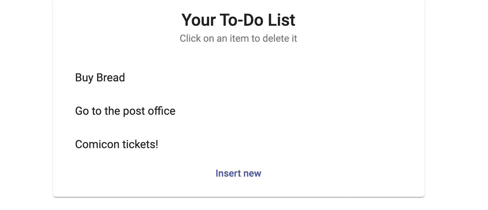

# 如何在 Angular 中创建一个简单的商店

> 原文：<https://betterprogramming.pub/how-to-create-a-simple-store-in-angular-577a8f21a3d6>

## 用单一的事实来源增强你的应用

大卫·巴图斯在 pexels.com 拍摄的照片

创建应用程序时，我必须面对的最大挑战之一是确保它不会在互联网中断的情况下崩溃。

这主要可以通过某种本地应用存储将 API 调用减少到最小来实现。在这些情况下，重要的是要有一个保存所有主要设置和数据的地方。

应用程序的这一部分被称为*商店*，作为单一的事实来源，允许我们独立于 API 调用，并在组件之间有更好的数据流。

在本文中，我们将使用我最喜欢的 Angular 状态管理库 [NGXS](https://www.ngxs.io/) 构建一个简单的存储。我将在文章末尾链接到示例的完整代码。

# 第一步。安装软件包

为了拥有创建商店所需的所有模块，我们需要安装软件包:

安装 NGXS 软件包的 npm 脚本

要安装的第一个包是基本的 NGXS 商店库，但我认为第二个包是开发的基础。

正如我们将在后面看到的，*[dev tools-plugin](https://www.npmjs.com/package/@ngxs/devtools-plugin)，连同 [Redux DevTools 扩展](http://extension.remotedev.io/)，将允许我们从浏览器实时调试商店。*

*然后，我们可以将下载的 NGXS 模块包含在我们的应用程序模块中，指定我们将它们作为单例注入应用程序根:*

*在 app.module 中注入 NGXS 模块*

# *第二步。创建列表状态*

*我们将要创建的状态将存储一个简单的待办事项列表。我们将能够添加新元素以及删除旧元素。*

*我们将开始为我们的`ListState` *，*定义一个模型，其中我们将声明状态必须有两个属性:一个表示我们的待办事项列表的项目数组和一个存储我们添加到列表中的最后一个元素的变量。*

*此外，我们将定义一组缺省值，用这些值来初始化状态。在这种情况下，我们将为列表使用一个空数组，并将`null`作为最后添加的项的值:*

*ListStateModel 和默认值。*

*我们现在可以通过将新创建的状态添加到`app.module`的导入中的`NgXsModule.forRoot`方法来激活它:*

*状态注入*

*如果我们为应用程序提供服务，然后打开 Redux DevTools 扩展，我们应该能够看到应用程序的初始状态已经设置为默认值。*

*此外，左侧的列将在每次向存储分派操作时记录一条消息，也就是说，每次我们请求存储更新它包含的值时记录一条消息。*

*在这种情况下，消息`@@INIT`告诉我们状态已经成功初始化。*

**

*Chrome 中的 Redux DevTools 扩展*

# *第三步。添加更新状态的操作*

*在这一点上，我们需要工作的方法将允许我们通过改变我们的状态来编辑我们的待办事项列表。*

*我们可以从创建一个`list.actions.ts`文件开始，在这个文件中，我们将定义当一个特定的动作被分派时我们将看到的消息，以及它将采用的有效负载的类型。动作的有效负载就是我们想要用来编辑状态的数据。*

*列表状态的操作*

*在这种情况下，动作`AddListItem`将拥有一个包含要添加到列表中的新项目的字符串作为有效负载。同样，`DeleteListItem`将拥有一个包含要删除的项目的字符串作为有效负载。*

*下一步是声明链接到`list.tate.ts`中的动作的方法。方法`addListItem`将获取当前状态，然后将有效载荷添加到`list`数组中。*

*方法`removeListItem` 将获取当前状态，并过滤`list` 以创建一个新数组，其中不包含要删除的项。*

*下面声明的操作方法*

*我们还声明了一个名为`SelectAllItems` *，*的方法，它是一个状态选择器，允许我们在应用*的任何地方订阅`list` 。**

# *第四步。调度操作*

*此时，一切都处于准备使用状态。在我的例子中，我在登录页面上设置了一个输入字段来输入我的新待办事项。我也有一个“添加项目”按钮和一个“查看列表”按钮，将路由到列表视图。*

**

*登录页面上的输入字段*

*在`list-input.component`中，要使用状态，我们需要在构造函数中初始化它。然后，我们可以调用商店的方法`dispatch`来调度一个动作:*

*从 list-input.component 调度操作*

*我们还可以使用 Redux DevTools 查看商店更新。事实上，如果我们在输入框中输入*购买面包*并点击*添加项目*，我们将会看到当`[List] Add List Item` 动作被分派时，该项目被添加到我们的商店待办事项列表中。*

**

*Redux DevTools 中的调度操作*

# *第五步。从状态中读取值*

*NGXS 还使得从应用程序的任何组件中读取存储值变得很容易。*

*让我们假设我们已经在我们的列表中添加了三四个待办事项，我们希望最终在另一条路线中可视化它。我们可以实例化状态，并使用一个`Select` 语句来获得我们的列表的可观察值。*

*不订阅可观察对象，我们可以简单地通过 HTML 中的`async` 管道读取它的值。*

*从商店中选择列表作为可观察对象*

*呈现后，我们将能够看到从商店中抓取的列表并与之交互:*

**

*异步管道魔法！*

# ***结论***

*在本文中，我们看到了如何从头开始创建一个简单的 NGXS 商店。*

*这是一个用状态管理库可以实现的小例子。很明显，你可以用 NGXS 做更多的事情来改进你的应用程序，我建议你看看官方的[文档](https://www.ngxs.io/)来获得一些惊人的提示和技巧！*

*此外，检查我在 GitHub 上的 [NGXS 演示](https://github.com/alessiaAmitrano/ngxsDemo) repo，让这段代码在你的 PC 上运行！*

*希望有用！*

* [## 我是如何在 Angular 中消除状态可观测量的

### 我不会回去的

medium.com](https://medium.com/better-programming/how-i-got-rid-of-state-observables-in-angular-2c69cbbbbd0e)  [## 一种利用 Ngxs 为 Angular 调度动作的新方法

### 用这个新的库整理你的代码

medium.com](https://medium.com/better-programming/a-new-way-of-dispatching-actions-with-ngxs-for-angular-7541f0adb812)*